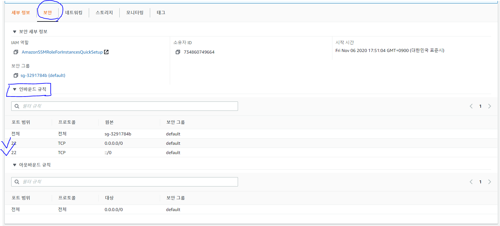
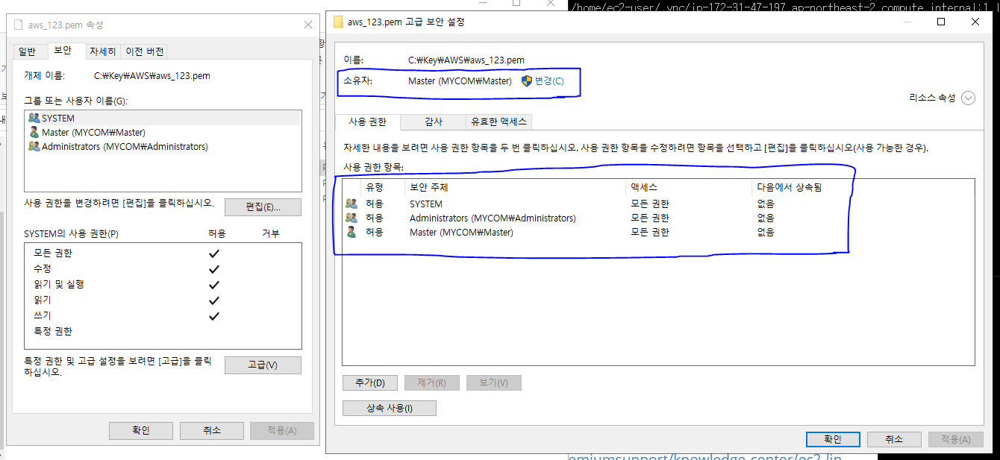
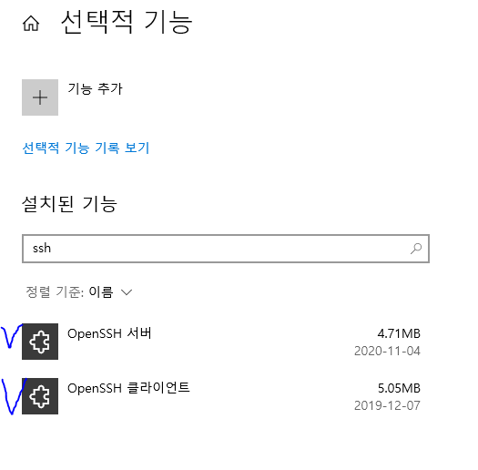
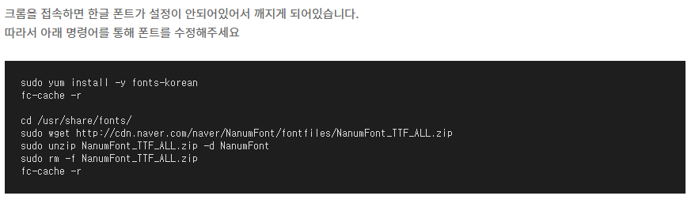
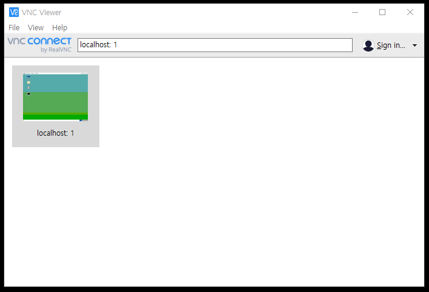
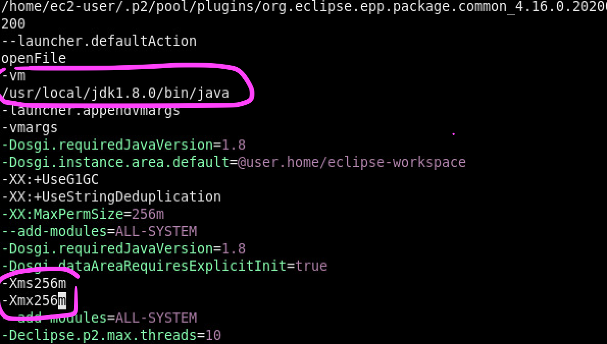

# AWS EC2 Linux 사용하기

1. AWS 계정 생성 및 콘솔 로그인

[https://aws.amazon.com/ko/free/](https://aws.amazon.com/ko/free/?all-free-tier.sort-by=item.additionalFields.SortRank&all-free-tier.sort-order=asc)


2. 지역 서울로 변경


3. EC2 인스턴스 생성 & Linux 2 설치

https://docs.aws.amazon.com/ko_kr/AWSEC2/latest/UserGuide/EC2_GetStarted.html

EC2 Linux 인스턴스 시작하기


- 보안의 인바운드 규칙 - 보안그룹 - SSH/TCP/22/모든곳  설정할것! 



- 키의 권한설정 확인하기!




4. GUI 설치 및 접속 (+웹브라우저 설치)

https://aws.amazon.com/ko/premiumsupport/knowledge-center/ec2-linux-2-install-gui/

- Windows Server 2019 및 Windows 10의 최신 버전 - OpenSSH는 설치 가능한 구성 요소로 포함되어 있습니다. 자세한 내용은 [Windows의 OpenSSH](https://docs.microsoft.com/en-us/windows-server/administration/openssh/openssh_overview)를 참조하십시오.

  - 윈도우 - 앱 및 기능 - 선택적 기능 - OpenSSH 확인!

  

- key 위치로 이동 : cd C:\Key\AWS

- GUI VNC Server 실행 : ssh -L 5901:localhost:5901 -i aws_123.pem ec2-user@15.165.195.250

- 서버시작 : vncserver :1

- 포트확인 : netstat -tlnp

- 리눅스에서 톰캣 콘솔 로그보기 : tail -F 10 /home/ec2-user/apache-tomcat-9.0.39/logs/catalina.out


- 세미프로젝트 tcpip서버 실행

  : cd /home/ec2-user/Downloads/tcpipServer/src/com/tcpip
    java -cp . com/tcpip/Server

- 크롬 한글 설정



```bash
sudo yum install -y fonts-korean
fc-cache -r

cd /usr/share/fonts/
sudo wget http://cdn.naver.com/naver/NanumFont/fontfiles/NanumFont_TTF_ALL.zip
sudo unzip NanumFont_TTF_ALL.zip -d NanumFont
sudo rm -f NanumFont_TTF_ALL.zip
fc-cache -r
```


5. vncviewer 설치



- 접속 : localhost: 1

---

이후 과정은 VMware 환경의 처음 설정 과정과 같음


5. JDK 1.8 설치

https://cafe.naver.com/multiiot2020/565

접근 권한 부족할 경우 **sudo** 사용하여 진행

sudo cp -r jdk1.8.0 /usr/local    // "sudo" 붙여서 진행


6. Eclipse 2020-06 설치

https://www.eclipse.org/downloads/download.php?file=/oomph/epp/2020-06/R/eclipse-inst-linux64.tar.gz


7. eclipse.ini 수정 (필)

이클립스 설치 경로에 있는 eclipse.ini 파일 수정

vi /home/ec2-user/eclipse/java-2020-06/eclipse/eclipse.ini

-vm (jdk 경로) . . . -Xms256m -Xmx256m



---

## AWS 로컬 Oracle DB를 AWS RDS로 옮기기

https://velog.io/@dsunni/%EB%A1%9C%EC%BB%AC-Oracle-DB%EB%A5%BC-AWS-RDS%EB%A1%9C-%EC%98%AE%EA%B8%B0%EA%B8%B0

---


## AWS 비용 이슈 대처법

### 결제알람설정

### 테스트 후 리소스 정리


### 프리티어 계정이 만료된 경우

