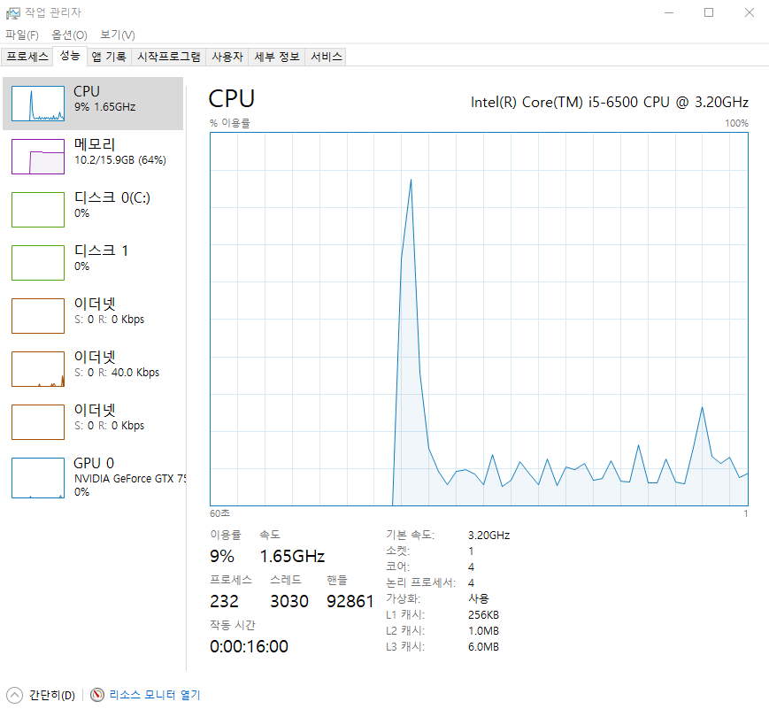

# Docker

## 설치와 가상화 오류 해결법

Windows에서 도커를 설치하는 방법에 대해서 알아볼게요.

최대한 깊은 설명은 제외하고 실습 위주로만 작성하였으니 쉽게 따라하실 수 있을거에요.

#### **1. 시스템 요구조건 확인**

공식 홈페이지에 접속합니다.

설치하기 전에 시스템 사양을 확인해주시고, 사용할 수 있다면 다운로드 받아주세요.

Download from Docker Hub로 접속하고 가입하고, 이메일 인증하고, 다운로드 받으시면 됩니다. (2019-10-24 기준)

이 부분에 대한 자세한 설명은 생략할게요.

https://docs.docker.com/docker-for-windows/install/#download-docker-for-windows

[ Install Docker Desktop on WindowsDocker Desktop for Windows is the Community version of Docker for Microsoft Windows. You can download Docker Desktop for Windows from Docker Hub. Download from Docker Hub What to know...docs.docker.com](https://docs.docker.com/docker-for-windows/install/)





#### **2. 가상화 지원여부 확인**

작업 관리자 - 성능 탭에서 가상화를 사용 중인지 확인해주세요.

 


#### **3. 가상화 사용 설정**

가상화가 사용 안함 상태라면,

**컴퓨터를 재시작**한 후 **BIOS**로 가서 **Virtualization Technology**를 **Yes**로 변경해주세요.

이건 제조사 별로 UI가 다르기 때문에 알아서 잘 찾아주셔야 합니다.

아마 Advanced 탭의 Processor Configuration에 대부분 있지 않을까 생각됩니다.

#### **4. Hyper-V 기능 켜기**

Windows PowerShell을 관리자 권한으로 실행 한 후에 아래 명령어를 입력해주세요.

```
Enable-WindowsOptionalFeature -Online -FeatureName Microsoft-Hyper-V -All
```


 

그리고 **Windows 기능 켜기/끄기**에서 **Hyper-V 기능을 모두 체크**하고 **컴퓨터를 재시작**해줍니다.

이제 도커를 사용할 준비가 되었습니다.

 


#### **5. 도커 설치**

1번에서 다운로드한 설치 파일을 실행시켜주세요.

딱히 세부 설정할 것은 없으니 게임 설치하듯이 다음 누르시면서 설치해주시면 됩니다.

#### **6. 도커 실행**


 

#### **오류 케이스**

```
Hardware assisted virtualization and data execution protection must be enabled in the BIOS.
```

 

이런 오류가 발생한 분들은 가상화 설정부터, Hyper-V 설정까지 다시 한 번 확인해주세요.

그래도 안된다면, 오류 메시지를 구글에 검색해서 해결방안을 찾아봐야할 것 같네요.

+ 그래도 안될 시
  cmd관리자 권한으로 실행 -> 아래 명령 후 실행 -> 컴퓨터 재부팅
  bcdedit /set hypervisorlaunchtype auto


## 기초

- 버전 확인 : `docker --version`

- `docker run -it node` : node 이미지는 리눅스에 Node.js가 설치된 상태를 캡쳐하여 클라우드에 올려논 것, 이것을 내 컴퓨터에 컨테이너로 만들고 그 환경 안에서 CLI를 사용한다.

- https://hub.docker.com : 개발할 때 필요한 모든 환경들을 '이미지' 형태로 찾을 수 있다.

- `docker images`

- `docker ps` : 작업중인 컨테이너 확인

- `docker ps -a` : 모든 컨테이너 확인

- `docker exec -it (컨테이너명) bash` : 컨테이너 내에서 bash shell 실행

- ```
  docker stop $(docker ps -aq)
  docker system prune -a
  //도커의 컨테이너와 이미지 모두 삭제
  ```

- Dockerfile : 나만의 이미지를 만들기 위한 설계도

- 볼륨은 컨테이너와 특정 폴더를 공유하는 것


## 리눅스에서 도커 사용하기

> **1. 공통 스크립트**

도커는 다양한 리눅스 배포판에 대해 배포판 종류를 자동으로 인식해서 도커 패키지를 설치해 주는 스크립트를 제공한다. 아래 스크립트를 배포판 종류에 상관 없이 실행하면 도커 설치가 진행된다.

```
sudo wget -qO- http://get.docker.com/ | sh
docker version
```

- 도커 명령어
  - docker images
  - docker ps
  - docker system prune -a


## 도커 허브 사용하기 (pull, push)

push

- docker tag 기존이미지이름:tag 바꿀이미지이름:tag (바꿀이미지이름 -> 사용자/레파지토리이름 으로 바꿔야 함!)

pull

- docker login
- docker pull hyundevv/android-login-server:1.0
- docker images
- docker run --name server -d -p 3000:3000 hyundevv/android-login-server:1.0
- docker ps

