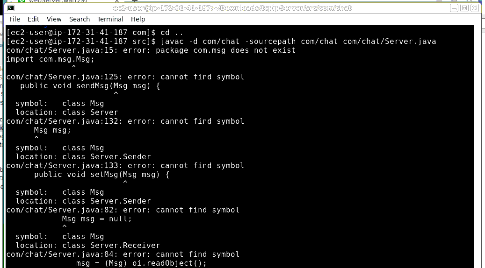
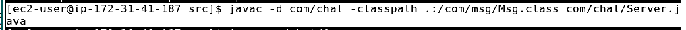
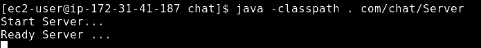

# 리눅스

## 리눅스에서 자바프로젝트 컴파일시 클래스패스(classpath)관련 에러

- 문제



- 해결



+ 한글 깨짐 해결 : javac -encoding utf-8 test.java

- 실행




+참고 사이트:https://marlboroyw.tistory.com/225


## 하둡 설치 시 hadoop namenode -format 했을 때 name폴더 생성 안되는 오류

```bash
[ec2-user@ip-172-31-41-187 conf]$ hadoop namenode -format
20/11/16 13:29:32 INFO namenode.NameNode: STARTUP_MSG: 
/************************************************************
STARTUP_MSG: Starting NameNode
STARTUP_MSG:   host = ip-172-31-41-187.ap-northeast-2.compute.internal/172.31.41.187
STARTUP_MSG:   args = [-format]
STARTUP_MSG:   version = 1.2.1
STARTUP_MSG:   build = https://svn.apache.org/repos/asf/hadoop/common/branches/branch-1.2 -r 1503152; compiled by 'mattf' on Mon Jul 22 15:23:09 PDT 2013
STARTUP_MSG:   java = 1.8.0_261
************************************************************/
20/11/16 13:29:32 INFO util.GSet: Computing capacity for map BlocksMap
20/11/16 13:29:32 INFO util.GSet: VM type       = 64-bit
20/11/16 13:29:32 INFO util.GSet: 2.0% max memory = 1013645312
20/11/16 13:29:32 INFO util.GSet: capacity      = 2^21 = 2097152 entries
20/11/16 13:29:32 INFO util.GSet: recommended=2097152, actual=2097152
20/11/16 13:29:32 INFO namenode.FSNamesystem: fsOwner=ec2-user
20/11/16 13:29:32 INFO namenode.FSNamesystem: supergroup=supergroup
20/11/16 13:29:32 INFO namenode.FSNamesystem: isPermissionEnabled=true
20/11/16 13:29:32 INFO namenode.FSNamesystem: dfs.block.invalidate.limit=100
20/11/16 13:29:32 INFO namenode.FSNamesystem: isAccessTokenEnabled=false accessKeyUpdateInterval=0 min(s), accessTokenLifetime=0 min(s)
20/11/16 13:29:32 INFO namenode.FSEditLog: dfs.namenode.edits.toleration.length = 0
20/11/16 13:29:32 INFO namenode.NameNode: Caching file names occuring more than 10 times 
20/11/16 13:29:33 ERROR namenode.NameNode: java.io.IOException: Cannot create directory /usr/local/hadoop-1.2.1/name/current
	at org.apache.hadoop.hdfs.server.common.Storage$StorageDirectory.clearDirectory(Storage.java:294)
	at org.apache.hadoop.hdfs.server.namenode.FSImage.format(FSImage.java:1337)
	at org.apache.hadoop.hdfs.server.namenode.FSImage.format(FSImage.java:1356)
	at org.apache.hadoop.hdfs.server.namenode.NameNode.format(NameNode.java:1261)
	at org.apache.hadoop.hdfs.server.namenode.NameNode.createNameNode(NameNode.java:1467)
	at org.apache.hadoop.hdfs.server.namenode.NameNode.main(NameNode.java:1488)

20/11/16 13:29:33 INFO namenode.NameNode: SHUTDOWN_MSG: 
/************************************************************
SHUTDOWN_MSG: Shutting down NameNode at ip-172-31-41-187.ap-northeast-2.compute.internal/172.31.41.187
************************************************************/

```

- 이렇게 나오면 hadoop폴더의 권한을 777로 준다음 실행하자!

```bash
[ec2-user@ip-172-31-41-187 local]$ shdo chmod 777 hadoop-1.2.1
```

