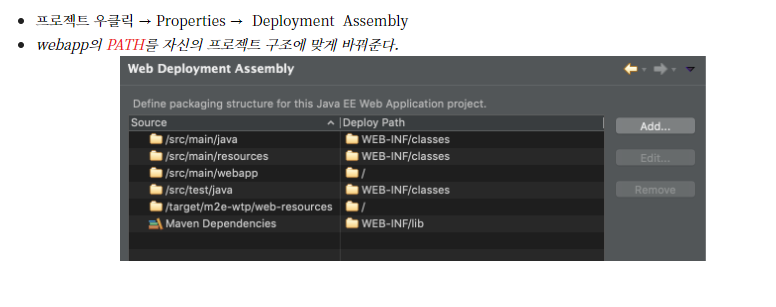
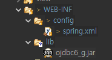

# 자바스프링

## 톰캣 실행 후에도 404가 뜨는 오류

: 깃에서 프로젝트를 클론한후 스프링을 실행했는데 계속 404가 나서 확인해보니 위에 Source부분에 /web을 추가하니 해결됨!!

## at java.net.URLClassLoder.findClass(Unknown Source) 오류

- 통신하는 클래스의 폴더명을 맞춘다!

## nested exception is java.lang.IllegalStateException: Could not load JDBC driver class [oracle.jdbc.driver.OracleDriver] 오류

- lib에 ojdbc.jar추가!!