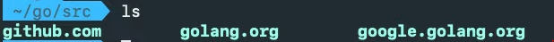

# go

- multi-core processing을 사용한다.

- 프로젝트를 다른 디렉토리에 만들 수 없다 -> 무조건 Go PATH 디렉토리에 저장!

- Window -  c:\Go

- Mac - /(local)user/go/ 

- 원하는 곳 어디에서든 코드를 다운받아 사용할 수 있다

  - 코드를 다운로드 받아온 도메인으로 분류해 저장해두면 분류가 쉽다
    

  ---

- 컴파일이 필요하면 main.go로 만든다 - 컴파일러는 패키지 이름이 main인 것 부터 찾는다
- func main(){}은 Go 프로그램의 시작점이 

```go
  package main
  
  func main(){
      
  }
```

- 함수를 대문자로 시작하면 export가 된다

- 헬로월드 출력하기

  ```go
  package main
  
  import (
  	"fmt"
  )
  
  func main() {
  	fmt.Println("Hello world!")
  }
  ```

  

---

## 변수와 상수

- go는 type language 이다
- 상수 : const
- 변수  : var

```go
package main

func main(){
    const name string = "nico"
    name := "nico" // 축약형사용! - 윗줄이랑 동일, func안에서만 동작, 변수만가능
}
```


## 함수

```go
package main

import "fmt"

func multiply1(a int, b int) int {
	return a * b
}

func multiply2(a, b int) int {
	return a * b
}

func main() {
	fmt.Println(multiply1(2, 2))
	fmt.Println(multiply2(2, 2))
}
```

```go
vpackage main

import (
	"fmt"
	"strings"
)

func lenAndUpper(name string) (int, string) {
	return len(name), strings.ToUpper(name)
}

/* 위 힘수와 동일 (naked return)
func lenAndUpper(name string) (length int, uppercase string) {
    lenght = len(name)
    uppercase = string.ToUpper(name)
    return
}
*/

func main() {
	totalLenght, upperName := lenAndUpper("nico")
	fmt.Println(totalLenght, upperName)
}

/* 위 함수와 동일
func main() {
	totalLenght, _ := lenAndUpper("nico") // _는 ignore value이다!!
	fmt.Println(totalLenght)
}
*/
```

```go
// 다중 인자 받기
package main

import (
	"fmt"
)

func repeatMe(words ...string) {
	fmt.Println(words)
}

func main() {
	repeatMe("nico", "lynn", "dal", "marl")
}
```

```go
// defer : 함수를 끝내고 실행한다
func lenAndUpper(name string) (int, string) {
    defer fmt.Println("I'm done")
    return len(name), strings.ToUpper(name)
}
```


## for, range, args

```go
package main

import (
	"fmt"
)

func superAdd(numbers ...int) int {
	for index, number := range numbers {
		fmt.Println(index, number)
	}
	return 1
}

func superAdd1(numbers ...int) int {
	for i := 0; i < len(numbers); i++ {
		fmt.Println(numbers[i])
	}
	return 1
}

func superAdd2(numbers ...int) int {
	total := 0
	for _, number := range numbers {
		total += number
	}
	return total
}

func main() {
	superAdd(1, 2, 3, 4, 5, 6)
	superAdd1(1, 2, 3, 4, 5, 6)
	result := superAdd2(1, 2, 3, 4, 5, 6)
	fmt.Println(result)
}
```


## IF

``` go
// if의 사용과 variable expression
package main

import "fmt"

func canIDrink(age int) bool {
	if koreanAge := age + 2; koreanAge < 18 {
		return false
	}
	return true
}

func main() {
	fmt.Println(canIDrink(16))
}
```


## SWITCH

```go
package main

import "fmt"

func canIDrink(age int) bool {
    switch koreanAge := age + 2; koreanAge {
	case 10:
		return false
	case 18:
		return true
	}
	return false
}

/*
func canIDrink(age int) bool {
	switch {
	case age < 10:
		return false
	case age == 18:
		return true
	case age > 50:
		return false
	}
	return false
}
*/

func main() {
	fmt.Println(canIDrink(18))
}
```


## Pointers

```go
package main

import "fmt"

func main() {
	a := 2
	b := &a         // &a는 a의 메모리주소이다
	fmt.Println(*b) // 2   *b는 a의 메모리주소의 값이다
	*b = 3
	fmt.Println(a) // 3
}
```


### Arrays and Slices

```go
// Arrays - 길이가 정해져 있다
package main

import "fmt"

func main() {
	names := [5]string{"nico", "lynn", "dal"}
	names[3] = "alala"
	names[4] = "alala"
	// names[5] = "alala" // 범위 밖 에러
	fmt.Println(names)
}
```

```go
// Slices - 길이가 정해져 있지 않다
package main

import "fmt"

func main() {
	names := []string{"nico", "lynn", "dal"}
	names = append(names, "flynn") // append(slice, 추가할 항목)   /  names를 바꾸지 않는다  /  추가된 slice를 return한다
	fmt.Println(names)
}
```


## MAP

```go
package main

import "fmt"

func main() {
	nico := map[string]string{"name": "nico", "age": "12"}
	for key, value := range nico {
		fmt.Println(key, value)
	}
}
```


## STRUCT

```go
package main

import "fmt"

type person struct {
	name    string
	age     int
	favFood []string
}

func main() {
	favFood := []string{"kimchi", "ramen"}
	nico := person{name: "nico", age: 18, favFood: favFood}
	fmt.Println(nico)
}
```

