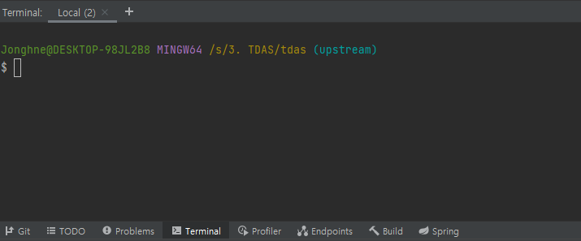
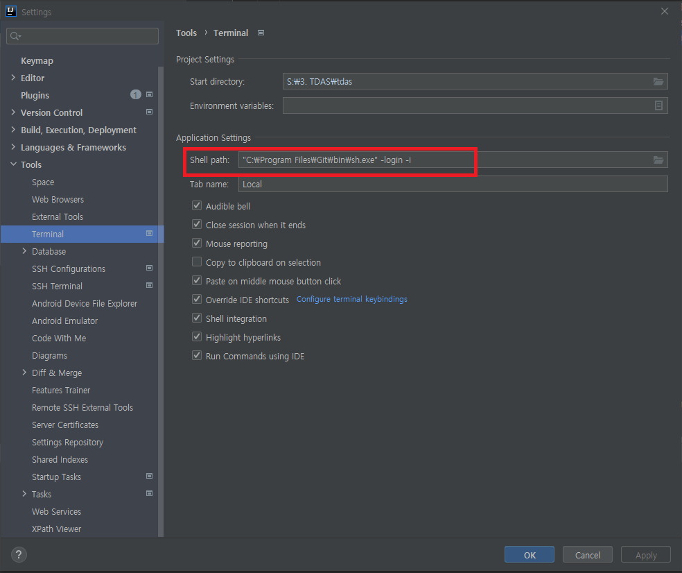

# IntelliJ

## 단축키

- 프로젝트 창 포커스 : alt+1
- 프로젝트 창 미리보기 : space
- 에디터 창 키우기 : ctrl + shift + F12
- 에디터 창 이동 : crtl + tab
- 새 파일 생성
  - 에디터에서 : ctrl + alt + insert
  - 프로젝트 창에서 : alt + insert
- 커서 이동
  - 단어별 이동 : ctrl + 방향키
- 선택 확장 축소 : ctrl + W, ctrl + shift + W
- 자동 인덴트(줄 맞추기) : 전체선택 후 ctrl + alt + I
- 사용처 찾기 : alt + F7    빠른 찾기 : ctrl + B
- 찾기 : ctrl  + F    찾은결과 이동 : F3
- 전체 검색 : shift 두번
- 최근 파일 열기 : ctrl + E
- psvm, sout
- 퀵픽스 : alt + enter
- 코드 이슈 별로 이동 : F2
- import 최적화 : ctrl + alt +O
- 코드 생성 : alt + insert
- 오버라이드 자동완성 : ctrl + o
- 터미널 창 : alt + F12
- 구문 자동 완성 : shift + ctrl + enter
- 대체하기 : ctrl + R
- 에디터 실행 : ctrl + shift + F10    실행 : shift + F10    종료 : ctrl + F2
- 라인 복사 : ctrl + D
- 라인 삭제 : ctrl + y
- 파라미터 정보 : ctrl + p

---

## 터미널 git bash로 바꾸기

### 1. Settings 창 열기

- File -> Settings 또는 Ctrl+Alt+S 단축키 사용
  

### 2. 왼쪽 메뉴 중 Tools 선택

### 3. 하위 메뉴 중 터미널 선택

### 4. Shell path 변경

Applications Settings -> Shell Path -> 아래와 같이 입력

- "<Git Shell 경로>" -login -i
- 예시) "C:\Program Files\Git\bin\sh.exe" -login -i
  

###  5. Terminal 열어서 변경 확인

