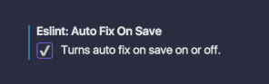
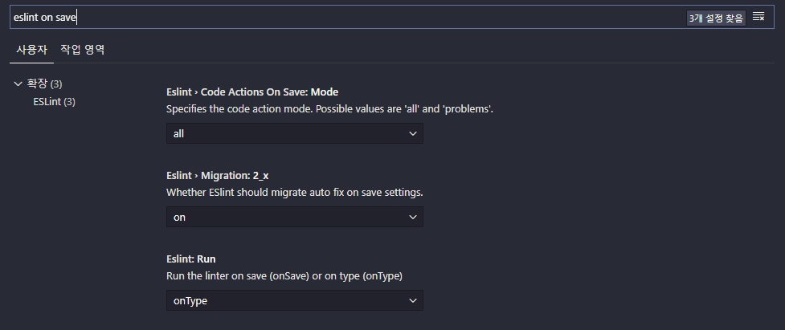
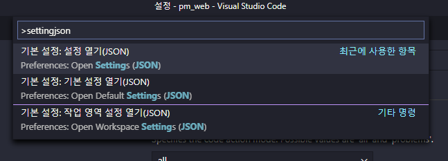
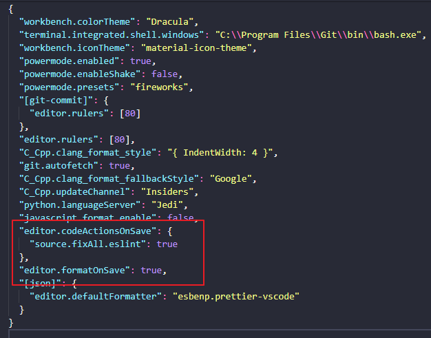

# VSCode

- File - Open Folder : 프로젝트 폴더를 지정
- open in browser 설치 : vscode에서 바로 브라우져로 띄울 수 있게 한다
- 등등 설치..
  


## 단축키

+ ctrl + shift + k : 한 줄 지우기
+ 커서를 두고 ctrl + x : 한 줄 잘라내기
+ 커서를 두고 ctrl + c : 한 줄 잘라내기
+ alt + Up, Down : 행 위,아래로 이동
+ ALT + SHIFT + UP / DOWN : 위 아래로 복사
+ ctrl + enter  / ctrl + shift + enter : 아래열, 윗열 새 줄 만들기
+ ctrl + alt + Up, Down : 열 한꺼번에 선택
+ 단어를 선택한 채로 ctrl + d : 선택 단어 다중 선택
+ 단어를 선택한 채로 ctrl + shift + l : 선택 단어 전부 선택
+ ctrl + [,] : 라인 내어쓰기, 들여쓰기
+ ctrl + / : 주석 처리
+ shift + alt + a : 다중 라인 주석 처리
+ ctrl + a   ->   ctrl + k + f : 코드 자동정렬

- CTRL + D : 같은 단어 선택
- ALT + CLICK : 커서 생성
- ALT + SHIFT + I : 선택영역에 커서 만들기
- ALT + SHIFT + DRAG : 드래그로 커서생성
- CTRL + HOME / END
- CTRL + B : 사이드바 숨기기
- ALT + 좌 / 우 : 이전 커서로, 앞 커서로


## vscode 동기화

https://okayoon.tistory.com/entry/%ED%9A%8C%EC%82%AC%EC%97%90%EC%84%9C-%EC%93%B0%EB%8D%98-%ED%99%98%EA%B2%BD-%EA%B7%B8%EB%8C%80%EB%A1%9C-VSCode-%EB%8F%99%EA%B8%B0%ED%99%94%ED%95%98%EA%B8%B0gistsettings-sync-%EC%84%A4%EC%A0%95-%EB%8F%99%EA%B8%B0%ED%99%94

token : 3d10a01ff2651c5c6cb9b0feb5d53ef1dc70d989

Sync: 업로드 완료. GIST ID: 3733c7b4da5dedb5905f065c329f9dac. 다른 기기에서도 설정을 다운받으려면 이 ID를 복사해서 사용하세요.


---

## Screencast Mode

`ctrl + shift + p`  ->  `screencast mode`

키보드 치는 것이 보이고 클릭을 강조한다

설명할 때 좋아보인다!

---

## 설정

- zoom
- word wrap
- ctrl + = / - : 화면 키우기, 줄이기


---

## Extensions

필수

- Korean Language Pack : 한국어 설정
- Material Theme : 테마설정
- Material icon theme
- indent-rainbow
- Prettier : 포메터
  - c+s+p -> settings (UI) -> save 검색 -> format on save 확인
- bracket pair colorizer : 괄호색상
- auto rename tag
- css peek
- html css support
- HTML to CSS autocompletion
- live server
- markdown preview (vscode 내장설치)
- autoprefixer : 구버전 css 자동 입력
- gitlens


---

추가

- visual studio live share

---

## ESLint 저장시 자동 fix

### **문제 사항**





위와 같이 VS Code에는

저장 시 자동으로 ES Lint 설정에 따라

JavaScript 문법 검사 후 Fix 하는 기능이 있다.




아니 근데 개발환경 다시 세팅하고 ES Lint 깔았더니 없다;;

------

### **해결 방법**




명령 팔레트 > setting json 입력 > 기본 설정: 설정 열기(JSON) 선택

 





위와 같이 입력

```xml
  "editor.codeActionsOnSave": {
    "source.fixAll.eslint": true    ## ES Lint 저장 시 자동 fix 설정
  },
  "editor.formatOnSave": true,      ## document formatting 자동 fix 설정
```

 

