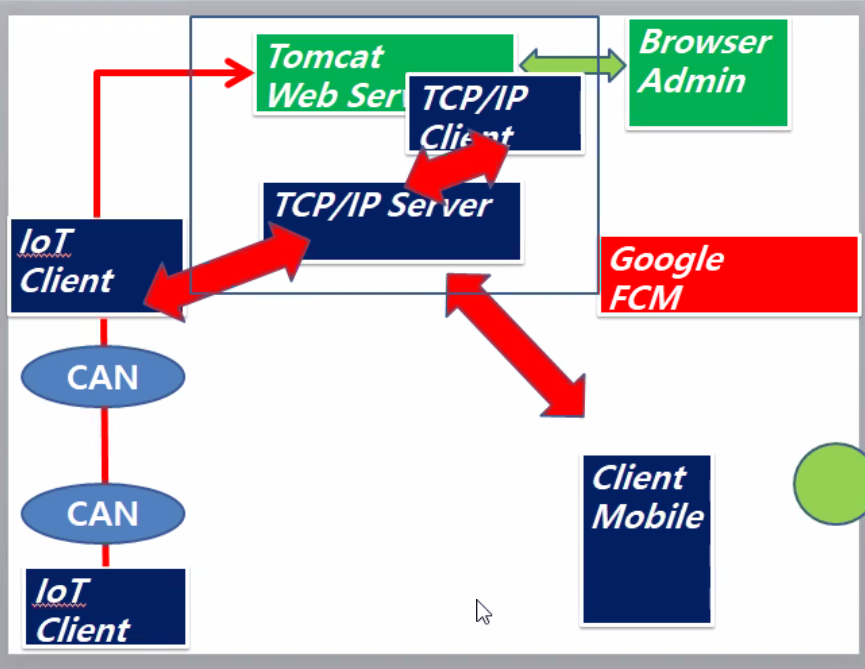

# IoT와 CAN장비

- Serial Port로 연결 된다!

## java와 cam 연동하기

RXTXcomm.jar 와 dll파일 다운받기

Copy RXTXcomm.jar ---> java/jre.../lib
Copy rxtxSerial.dll ---> java/jre.../bin
Copy rxtxParallel.dll ---> java/jre.../bin