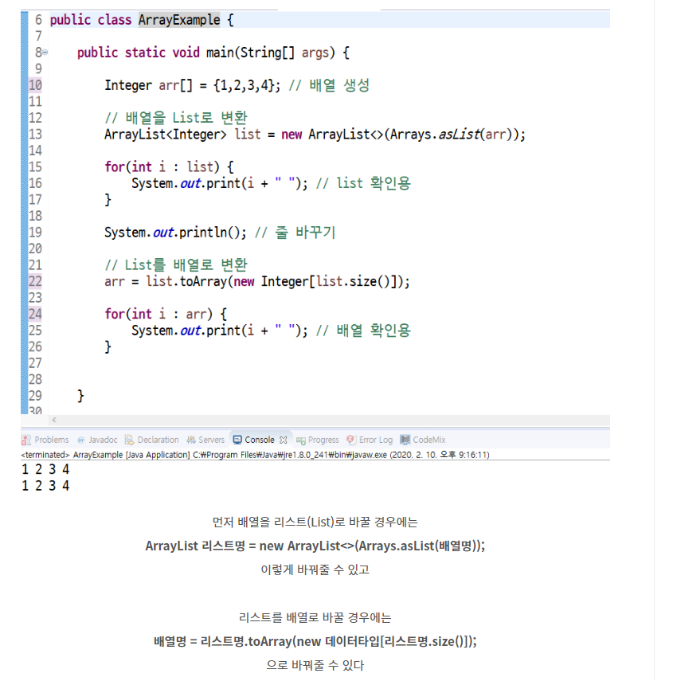

# JAVA for 코딩 테스트

## 배열->리스트, 리스트->배열




## 진수변환

```java
int i = 127;
 
String binaryString = Integer.toBinaryString(i); //2진수
String octalString = Integer.toOctalString(i);   //8진수
String hexString = Integer.toHexString(i);       //16진수
 
System.out.println(binaryString); //1111111
System.out.println(octalString);  //177
System.out.println(hexString);    //7f
 
 
int binaryToDecimal = Integer.parseInt(binaryString, 2);
int binaryToOctal = Integer.parseInt(octalString, 8);
int binaryToHex = Integer.parseInt(hexString, 16);
 
System.out.println(binaryToDecimal); //127
System.out.println(binaryToOctal);   //127
System.out.println(binaryToHex);     //127
```


## String.toCharArray()

는 문자열을 한 글자씩 쪼개서
이를 char타입의 배열에 집어넣어주는 친절한 메소드이다.

- **String(문자열)**을 **char형 배열**로 바꾼다.

```java
  //how to use method
  String s1 = "Hello World";
  char[] charArr = s1.toCharArray();
```

- 추가로, **char형 배열**을 합쳐서 하나의 **String(문자열)**로 만들 수 있다.

```java
  //how to use method
  String s2 = new String(charArr);
```


## 대,소문자로 변경(문자열)

```java
String target = "abcdefg"; //대상 문자열
target = target.toUpperCase(); //대문자로 치환
```

```java
String target = "ABCDEFG"; //대상 문자열
target = target.toLowerCase(); //소문자로 치환
```

## 대,소문자로 변경(문자)

```java
Character.toUpperCase(c);
```


##  **문자 -> 숫자** 

### **String to Int**

가장 많이 사용한다고 생각됩니다.

자바 Integer클래스의 parseInt함수와 valueOf 함수로 변환 시켜줄 수 있습니다.

```java
//Integer.paseInt(String값)
//Integer.valueOf(String값)

String s_num = "10";
int i_num = Integer.parseInt(s_num); //String -> Int 1번방식
int i_num2 = Integer.valueOf(s_num); //String -> Int 2번방식
```


##  **숫자 -> 문자** 

### **Int to String**

자바 String클래스의 valueOf, toString 함수로 변환 시켜줄 수 있습니다.

```java
//String.valueOf(Int값)
//Integer.toString(Int값)

int i_num = 10;
String s_num;
		
s_num = String.valueOf(i_num); //문자 -> 숫자 1번방식
s_num = Integer.toString(i_num); //문자 -> 숫자 2번방식
s_num = ""+i_num; //문자 -> 숫자 3번방식
```


## 거듭 제곱 구하기 Math.pow()

```java
public class Pow {
    public static void main(String[] args)  {

        double result = Math.pow(5, 2); //5의제곱
        System.out.println("5의 제곱은 : "+result);
    }
}
```


## **printf()**

System.out.printf("출력 서식",출력할 내용);

- 출력 후 줄바꿈을 하지 않는다. 줄바꿈을 하려면 지시자 '%n'을 넣어줘야 한다.
- 출력하려는 값의 수만큼 지시자도 사용해야 한다.
- 출력될 값과 지시자의 순서는 일치해야 한다.
- 지시자를 제외한 문자는 입력한 그대로 출력된다.

**출력 서식**

%[-][0][n][.m]지시자

- 출력 서식의 지시자를 제외한 나머지는 생략 가능하다. 예) %d 식으로 사용 가능.
- n : 출력할 전체 자리수 지정(오른쪽 정렬). 예) %3d, 전체자리수가 3인 정수
- 0 : 전체 자리수가 지정된 경우 왼쪽의 남는 자리에 0을 출력. 예) %03d
- \- : 전체 자리수가 지정된 경우 왼쪽 정렬하고 빈칸에 공백 출력.
- .m : 소수점 아래 자리수 지정. 잘리는 소수점 자리수는 반올림 시켜서 표시. 예)3.2f

| 지시자     | 설명                        |
| ---------- | --------------------------- |
| %b         | **boolean** 형식으로 출력   |
| %d         | 정수 형식으로 출력          |
| %o         | 8진수 정수의 형식으로 출력  |
| %x 또는 %X | 16진수 정수의 형식으로 출력 |
| %f         | 소수점 형식으로 출력        |
| %c         | 문자형식으로 출력           |
| %s         | 문자열 형식으로 출력        |
| %n         | 줄바꿈 기능                 |
| %e 또는 %E | 지수 표현식의 형식으로 출력 |