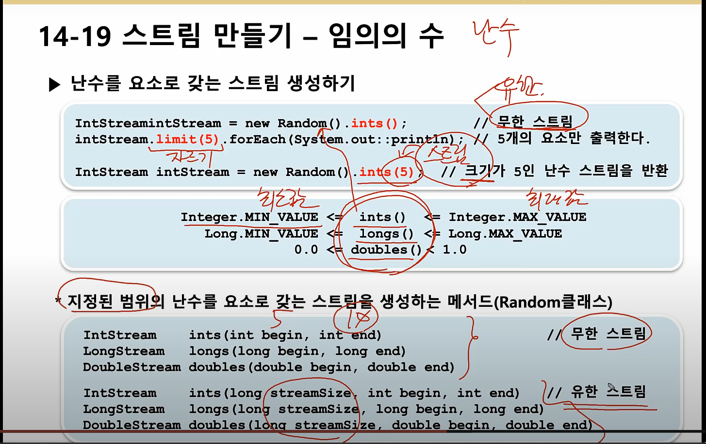
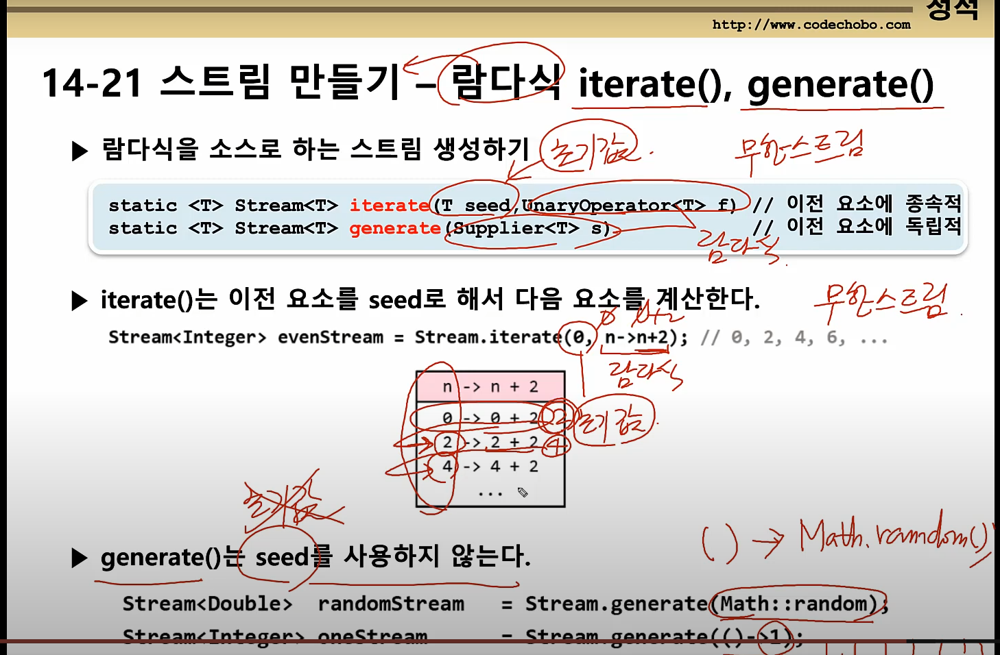

# 스트림(Stream)

- 다양한 데이터 소스를 표준화된 방법으로 다루기 위한 것
- 데이터의 연속적인 흐름

```java
Stream<T> Collection.stream()
```

1. 스트림 만들기
2. 중간 연산 (n번)
3. 최종 연산 (1번)

```java
stream.distinct().limit(5).sorted().forEach(System.out::println)
```


## 스트림의 특징

1. 스트림은 데이터 소스로부터 데이터를 읽기만할 뿐 변경하지 않는다.

2. 스트림은 Iterator처럼 일회용이다. (필요하면 다시 스트림을 생성해야 함)

3. 최종 연산 전까지 중간연산이 수행되지 않는다. - 지연된 연산

   ```java
   IntStream intStream = new Random().ints(1,46); // 1~45 범위의 무한 스트림
   intStream.distinct().limit(6).sorted()      // 중간 연산
       .forEach(i->System.out.print(i+","));   // 최종 연산
   ```

4. 스트림은 작업을 내부 반복으로 처리한다.

   ```java
   for(String str : strList)
       System.out.println(str);
   
   /////////////////////////////////////
   
   stream.forEach(System.out::println);
   ```

5. 스트림의 작업을 병렬로 처리 - 병렬스트림 - 멀티쓰레드

   ```java
   parallel()  <->  sequential()
   ```

6. 기본형 스트림 제공 - IntStream, LongStream, DoubleStream ...

   - 오토박싱&언박싱의 비효율이 제거됨 (Stream<Integer> 대신 IntStream을 사용함으로써)
   - 숫자와 관련되 유용한 메서드를 Stream<T>보다 더 많이 제공 

   

## 난수 스트림 만들기




## 스트림 만들기 - 람다식 iterate(), generate()




## 스트림의 중간연산

- skip() - 건너뛰기
- limit() - 자르기
- filter() - 조건식
- distinct() - 중복제거
- sorted() - 정렬
- map() - 변환
- peek() - forEach()의 중간연산 버전
- flatmap() - 변환


## Optional<T>

- 간접적으로 null을 다룬다
- 다음이유로 Optional을 사용한다.
  1. 간접적으로 null을 다루는 것은 위험하다
  2. null체크, if문 필요, zhemrk 지저분해진다