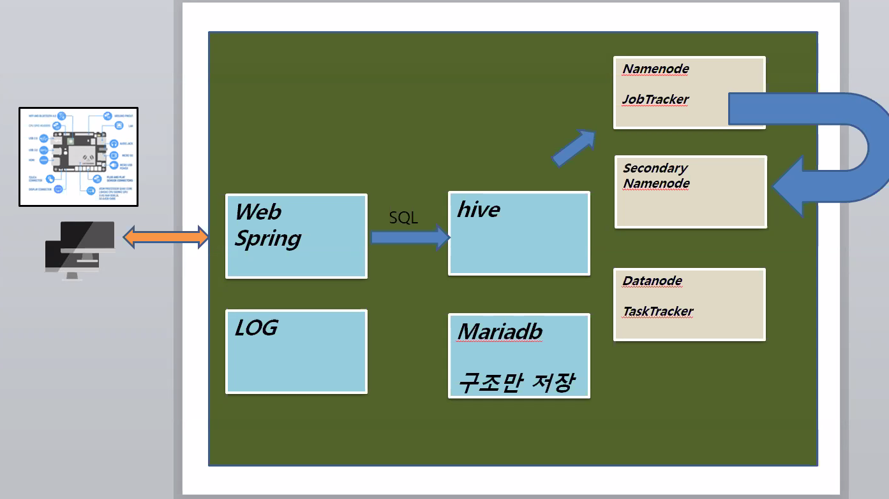

# Spring Log4j 설정 및 사용




1. pom.xml 변경

line 128


<dependency>

<groupId>log4j</groupId>

<artifactId>log4j</artifactId>

<version>1.2.17</version>

</dependency> 


후에  프로젝트의 pom.xml에서 우클릭

maven > update project

C:\Users\Master\.m2\repository\log4j\log4j에 설치됨


(maven jar 문제 있으면 위에가서 삭제)


2. web.xml 변경

<listener>      
<listener-class>org.springframework.web.util.Log4jConfigListener
</listener-class>
</listener>

<context-param>
      <param-name>log4jConfigLocation</param-name>
      <param-value>/WEB-INF/config/log4j.properties</param-value></context-param>


3. Log4j properties 파일 작성

\- 첨부 파일 다운 받아 아래 디렉토리에 복사

/WEB-INF/config/log4j.properties


4. Spring AOP를 적용한 Logger.java 작성


package co[m.log;](http://m.log%3B/)


import org.apache.log4j.Logger;

import org.aspectj.lang.JoinPoint;

import org.aspectj.lang.ProceedingJoinPoint;

import org.aspectj.lang.annotation.AfterReturning;

import org.aspectj.lang.annotation.Around;

import org.aspectj.lang.annotation.Aspect;

import org.aspectj.lang.annotation.Before;

import org.springframework.stereotype.Service;

@Service

@Aspect

public class Loggers {


private Logger work_log = 

Logger.getLogger("work"); 

private Logger user_log = 

Logger.getLogger("user"); 

private Logger data_log = 

Logger.getLogger("data"); 


// before

@Before("execution(* co[m.hive.*Controller.*(..))")](http://m.hive.*controller.*(..))")/)

public void logging(JoinPoint jp) {

work_log.debug(jp.getSignature().getName());

user_log.debug(jp.getSignature().getName());

data_log.debug(jp.getSignature().getName());

}

}


5. Log4j properties에 작성한 형식으로 특정 경로에 로그 파일 생성

c:\logs\ 파일 생성


---

- IoT장비에서 랜덤데이터를 발생시켜 로그에 저장

hiveapp에서 app.java

```java
package hiveapp;


import java.io.FileNotFoundException;
import java.net.HttpURLConnection;
import java.net.MalformedURLException;
import java.net.URL;
import java.util.Random;


public class App {

String url;

public App() {

}


public void getData() {

for(int i=1;i<=60;i++) {

Random r = new Random();
double speed = r.nextInt(200);
CarStatus cstatus = new CarStatus("car01", speed, 24, 90, 1500);

try {
sendData(cstatus);
System.out.println("Send Data ...."+speed);
} catch (Exception e1) {
e1.printStackTrace();
}

try {
Thread.sleep(1000);
} catch (InterruptedException e) {
e.printStackTrace();
}
}

}


public void sendData(CarStatus cs) throws Exception {

url = "http://127.0.0.1/hive/carstatus.mc";
url += "?id="+cs.getId()+"&speed="+cs.getSpeed()+"&temp="+cs.getTemp()+
"&oiltemp="+cs.getOiltemp()+"&rpm="+cs.getRpm();
URL curl = new URL(url);
HttpURLConnection con = 
(HttpURLConnection)curl.openConnection();

try {
con.getInputStream();
con.setReadTimeout(5000);
con.setRequestMethod("POST");
}catch(Exception e) {
//throw e;
}finally {
con.disconnect();
}

}


public static void main(String[] args) {
App app = new App();
app.getData();
}

}
```

---

hive에서 테이블 생성

CREATE TABLE shopclick(

date STRING,

fn STRING,

id STRING,

item STRING,

price INT,

age INT,

gender STRING

)

PARTITIONED BY (logdate STRING)

ROW FORMAT DELIMITED

FIELDS TERMINATED BY ','

LINES TERMINATED BY '\n'

STORED AS TEXTFILE;


---

hive.sh 설정

cd

vi hive.sh

chmod 777 hive.sh

```bash
#!/bin/sh

date=`date`
echo $date
partitionName="${date:0:4}-${date:6:2}-${date:10:2}"
echo $partitionName
fileName="data.log.$partitionName"
echo $fileName

echo "Load the Data ?"
read yn
if [ $yn == "y" ]
then
echo "Start Load the Data ..."
if [ -f /root/logs/$fileName ]
then
hive << EOF
LOAD DATA LOCAL INPATH '/root/logs/$fileName' OVERWRITE INTO TABLE shopclick PARTITION (logdate="$partitionName");
EOF
echo "OK"
echo "OK"
else
echo "File Not Found"
echo "Exit Now..."
fi
else
echo "Exit Now..."
fi
exit 0
```


