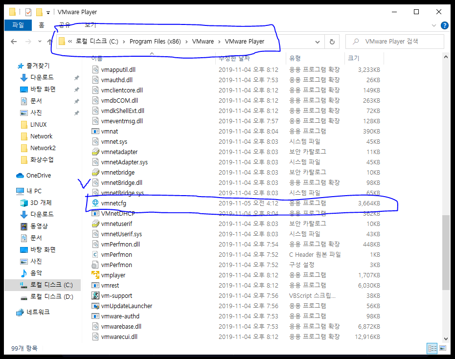
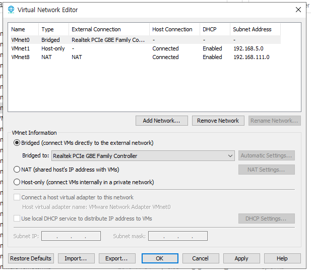
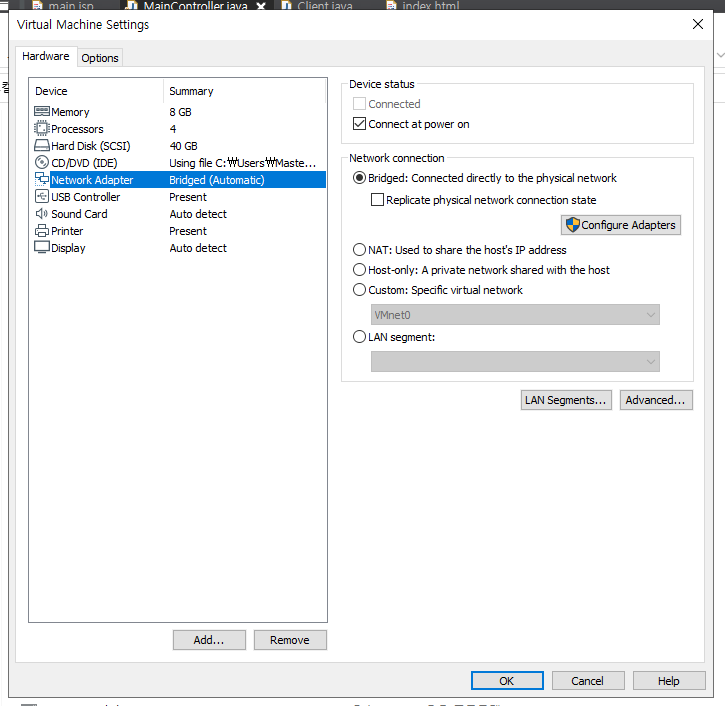
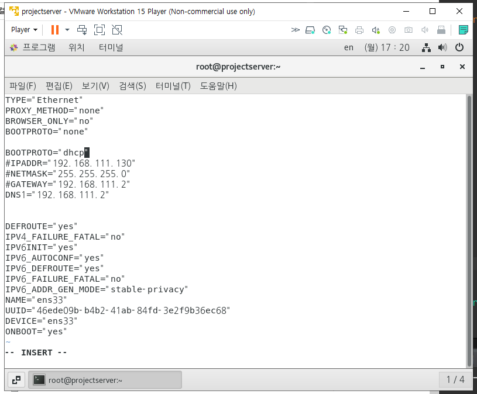
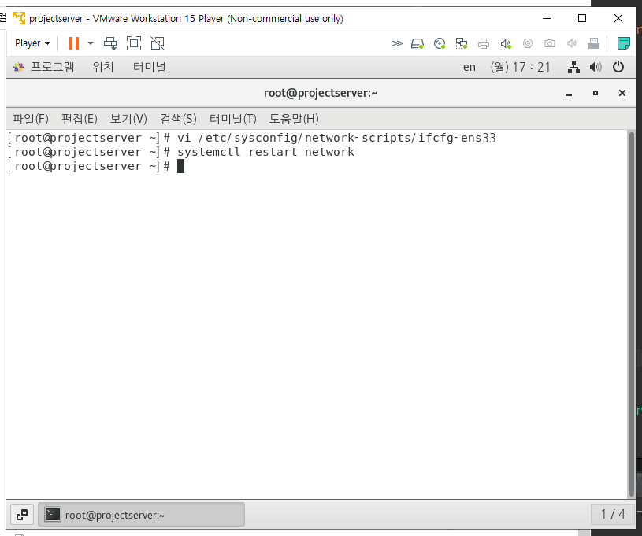

# Linux 설치

1. VMWare 설치 (https://www.filehorse.com/download-vmware-player/44878/)

\- [P51] Network Setting(vmnetcfg 파일을 VMWare 설치 디렉토리에 복사)

\- Network Setting은 고정 IP 환경을 만들기 위해

2. Linux Download - CENTOS 7(2003) x86_64

\- https://www.centos.org/centos-linux/

\- CentOS-7-x86_64-DVD-2003.iso

3. [P20] VMWare 실행 후 가상 PC 설치

\- 가상의 환경에 컴퓨터 설치, 여러대 설치 가능

4. [P72] Linux 설치

\- Down 받은 iso 파일을 이용하여 VMWare안에 있는 가상의 컴퓨터에 설치

5. [P88] Linux 설치 후 Setting

\- update를 안하도록 문서 편집

cd /etc/yu[m.repos.d/](http://m.repos.d/)

gedit CentOS-Base.repo 

[update] 부분 이하 삭제

\- Network IP Static 하게 설정

cd /etc/sysconfig/network-scripts/

gedit ifcfg-ens33

BOOTPROTO="none"

IPADDR="192.168.111.101"

NETMASK="255.255.255.0"

GATEWAY="192.168.111.2"

DNS1="192.168.111.2"

systemctl restart network

ifconfig

\- 보안 설정 해제

cd /etc/sysconfig/

gedit selinux

SELINUX=disable

로 수정

6. 기타 환경 Setting

7. Linux 복재

\- Linux가 설치된 Dir을 복사 한다.

\- Dir 이름을 변경한다.

\- CentOS 7 64-bit.VMX 파일을 열어 

displayName = "CentOS2" 을 변경 한다.

\- wmware에서 "Open Virtual Machine" 후 CentOS 7 64-bit.VMX 선택

\- 반드시 "moved it" 선택 

\- Edit Virtual Machine setting 에 들어간다.

\- Network Adapter 에 advanced 선택

\- MAC Address에서 새롭게 Generate 실행

\- "Play Virtual Machine" 실행 

\- 반드시 IP 변경

---

##  브릿지로 실제 IP할당받기

1. 

2. 
3. 

4. 

5. 

6. 

7. 

   