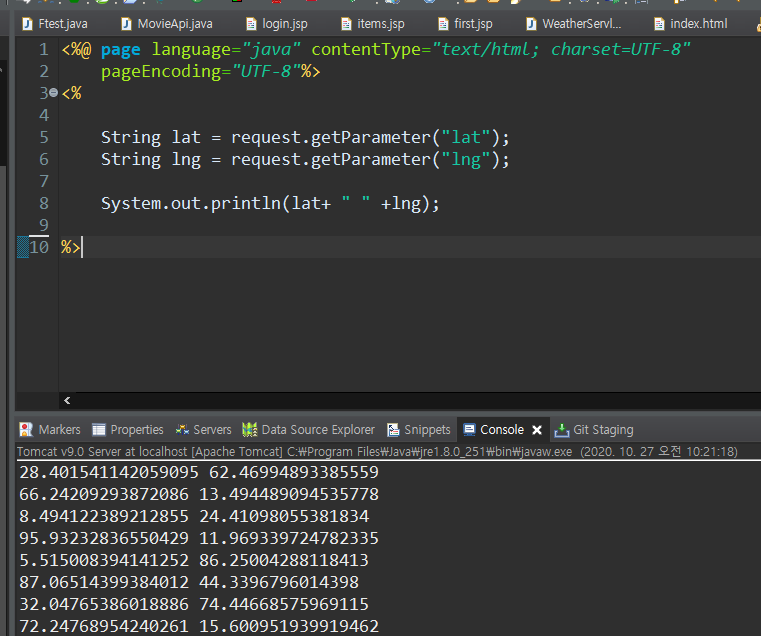

# Network

- http protocol
- TCP/IP protocol

## thread

- 프로세스 : 프로그램을 수행하는 데 필요한 **데이터와 메모리 등의 자원 그리고 쓰레드로 구성** (최소 하나 이상의 쓰레드가 존재하며, 둘 이상의 쓰레드를 가진 프로세스를 '멀티쓰레드 프로세스' 라고 한다)

  - **멀티쓰레드 프로세스**는 여러 쓰레드가 같은 프로세스 내에서 자원을 공유하면서 작업을 하기 때문에 발생할 수 있는 **동기화, 교착상태와 같은 문제**들을 고려해 신중히 프로그래밍해야 한다.

- 쓰레드 : 프로세스의 자원을 이용해서 실제로 작업을 수행하는 것 

  

### 쓰레드 구현 (extends Thread 방법)

```java
package com.thread;

// java는 thread 사용!
class T extends Thread{

	String name;
	
	public T() {}
	public T(String name) {
		this.name = name;
	}
	
	// run 함수를 사용한다
	@Override
	public void run() {
		for(int i=0;i<=100;i++) {
			System.out.println(name+":"+i);
			try {
				Thread.sleep(200);
			} catch (InterruptedException e) {
				e.printStackTrace();
			}
		}
	}
	
}


// 메인
public class Test {

	public static void main(String[] args) {
		// 동시에 동작된다!!!!!
		T t1 = new T("T1");
		t1.start();        // T1의 run함수가 실행된다!
		T t2 = new T("T2");
		t2.start();     
	}

}
```

### 쓰레드 구현 (implements Runnable 방법)

```java
package com.thread;

// java는 thread 사용! Runnable에서 implements
class Th implements Runnable{

	String name;
	
	public Th() {}
	public Th(String name) {
		this.name = name;
	}
	
	// run 함수를 사용한다
	@Override
	public void run() {
		for(int i=0;i<=100;i++) {
			System.out.println(name+":"+i);
			try {
				Thread.sleep(100);
			} catch (InterruptedException e) {
				e.printStackTrace();
			}
		}
	}
	
}


// 메인
public class Test2 {

	public static void main(String[] args) {
		// 동시에 동작된다!!!!!
		//Runnable일때 쓰레드 만드는 방법 주의!! Thread를 만들고 그 안에 넣는다!
		Thread t1 = new Thread(new Th("T1"));
		t1.start();        // T1의 run함수가 실행된다!
		Thread t2 = new Thread(new Th("T2"));
		t2.start();     
	}

}
```


### 쓰레드의 우선순위

> 우선순위 범위는 1~10이며 숫자가 높을 수록 우선순위가 높다.
>
> 하지만, 멀티코어에서 실행하면 차이가 없다

```java
public class Test {

	public static void main(String[] args) {
		// 동시에 동작된다!!!!!
		T t1 = new T("T1");
		t1.start();        // T1의 run함수가 실행된다!
		t1.setPriority(10); // 높을수록 많은 프로세스를 점유한다
		T t2 = new T("T2");
		t2.start();
		t2.setPriority(1);
	}

}
```


### 데몬 쓰레드

> 일반 쓰레드가 모두 종료되면 데몬 쓰레드는 강제적으로 자동 종료된다.

```java
package com.thread;

class TT extends Thread{

	@Override
	public void run() {
		while(true) {
			System.out.println("Thread ....");
			try {
				Thread.sleep(500);
			} catch (InterruptedException e) {
				e.printStackTrace();
			}
		}
	}
	
}


public class Test4 {

	public static void main(String[] args) throws InterruptedException {
		TT tt = new TT();
		tt.setDaemon(true); // 메인 Application(프로세스)이 죽으면 같이 죽는다
		tt.start();
		tt.interrupt();
		Thread.sleep(10000);
		System.out.println("End Application....");
	}

}
```


### join()과 yield()

- join() - 다른 쓰레드의 작업을 기다린다
- yield() - 다른 쓰레드에게 양보한다

```java
th1.join(); //th1이 끝날때 까지 아래 구문 실행을 멈춘다
// th1의run()이 다 끝난 후 아래 실행
System.out.println(th1.getSum()+" "+th2.getSum());
```


### 쓰레드의 동기화(synchronization)

> 같은 정보를 공유할 때 한 쓰레드가 진행중인 작업을 다른 쓰레드가 간섭하지 못하게 막는것


### 쓰레드 제어 예제

```java
package com.sus;

import java.util.Scanner;

class Th extends Thread{

	boolean stop = false;
	boolean sus = false;
	public void setStop(boolean stop) {
		this.stop = stop;
	}
	public void setSus(boolean sus) {
		this.sus = sus;
	}
	
	@Override
	public void run() {
		while(true) {
			if(stop == true) {
				System.out.println("Stop Thread ...");
				break;
			}
			try {
				Thread.sleep(1000);
			} catch (InterruptedException e) {
				e.printStackTrace();
			}
			if(sus != true) {
				System.out.println("Downloading ...");
			}
		}
		System.out.println("End Thread ...");
	}
	
}


public class Test {
	
	public static void main(String[] args) {
	
		Th th = new Th();
		Scanner sc = new Scanner(System.in);
		while(true) {
			System.out.println("Input cmd");
			String cmd = sc.nextLine();
			if(cmd.equals("start")) {
				th.start();
			}else if(cmd.equals("stop")){
				th.setStop(true);
			}else if(cmd.equals("sus")){
				th.setSus(true);
			}else if(cmd.equals("res")){
				th.setSus(false);
			}else if(cmd.equals("q")){
				th.setSus(true);
				break;
			}
		}
		

	}

}

```


## 입출력

- I/O란 Input과 Output의 약자로 입력과 출력, 입출력이라고 한다
- 입출력은 컴퓨터 내부 또는 외부의 장치와 프로그램간의 데이터를 주고받는 것을 말한다.


- 스트림이란 데이터를 운반하는데 사용되는 연결통로이다.
- 스트림은 단방향통신만 가능하기 때문에 입력스트림과 출력스트림 2개가 필요하다.


- BufferedInput/OutputStream - 빠른 처리


### 바이트기반 스트림

```java
package com.io;

import java.io.BufferedInputStream;
import java.io.BufferedOutputStream;
import java.io.FileInputStream;
import java.io.FileNotFoundException;
import java.io.FileOutputStream;
import java.io.IOException;
import java.io.InputStream;

//바이트기반 스트림인 InputStream와 OutputStream를 사용해보자! (입출력 단위가 1바이트)
public class Test1 {
	
	public static void main(String[] args) {
		String file = "c:\\network\\d01\\src\\text.txt";
		FileInputStream fis = null;
		BufferedInputStream bis = null;
		FileOutputStream fos = null;
		BufferedOutputStream bos = null;
		try {
			fis = new FileInputStream(file);
			bis = new BufferedInputStream(fis); // fis를 넣어서 기능확장, 속도증가
			fos = new FileOutputStream("text2.txt");
			bos = new BufferedOutputStream(fos); // fos를 넣어서 기능확장, 속도증가
			int data = 0;
			// 끝 자리가 아닐때까지
			while((data=fis.read()) != -1) {
				bos.write(data); // 읽어드린걸 저장한다
				System.out.println((char)data);  // 바이트단위로 읽었다
			}
			System.out.println(fis.available());
		} catch (Exception e) {
			e.printStackTrace();
		} finally {
			// fis도 같이 close됨!
			if(bis != null) {
				try {
					bis.close();   // ** 꼭 close를 해주어야 한다!!! **
				} catch (IOException e) {
					e.printStackTrace();
				}
			}
			// bos도 같이 close됨!
			if(bos != null) {
				try {
					bos.close();   // ** 꼭 close를 해주어야 한다!!! **
				} catch (IOException e) {
					e.printStackTrace();
				}
			}	
		}
	}
	
}
```


### 문자기반 스트림

```java
package com.io;

import java.io.BufferedInputStream;
import java.io.BufferedOutputStream;
import java.io.BufferedReader;
import java.io.BufferedWriter;
import java.io.FileInputStream;
import java.io.FileOutputStream;
import java.io.FileReader;
import java.io.FileWriter;
import java.io.IOException;

//문자기반 스트림인 Reader와 Writer를 사용해보자!
public class Test2 {
	
	public static void main(String[] args) {
		String file = "c:\\network\\d01\\src\\text.txt";
		FileReader fis = null;
		BufferedReader bis = null;
		FileWriter fos = null;
		BufferedWriter bos = null;
		try {
			fis = new FileReader(file);
			bis = new BufferedReader(fis); // fis를 넣어서 기능확장, 속도증가
			fos = new FileWriter("text2.txt");
			bos = new BufferedWriter(fos); // fos를 넣어서 기능확장, 속도증가
			String data = "";
			// 끝 자리가 아닐때까지, readLine()은 BufferedReader에만 있다
			while((data=bis.readLine()) != null) {
				bos.write(data); // 읽어드린걸 저장한다
				System.out.println(data);  // 바이트단위로 읽었다
			}
			//System.out.println(fis.available());
		} catch (Exception e) {
			e.printStackTrace();
		} finally {
			// fis도 같이 close됨!
			if(bis != null) {
				try {
					bis.close();   // ** 꼭 close를 해주어야 한다!!! **
				} catch (IOException e) {
					e.printStackTrace();
				}
			}
			// bos도 같이 close됨!
			if(bos != null) {
				try {
					bos.close();   // ** 꼭 close를 해주어야 한다!!! **
				} catch (IOException e) {
					e.printStackTrace();
				}
			}	
		}
	
		
	}
}
```


### 객체 입출력 예제

```java
package com.io;

import java.io.BufferedInputStream;
import java.io.BufferedOutputStream;
import java.io.FileInputStream;
import java.io.FileNotFoundException;
import java.io.FileOutputStream;
import java.io.IOException;
import java.io.ObjectInputStream;
import java.io.ObjectOutputStream;

// 객체를 I/O한다
public class Test3 {

	public static void main(String[] args) {
		User user = new User("id01", "이말숙");
		
		FileOutputStream fos = null;
		BufferedOutputStream bos = null;
		ObjectOutputStream oos = null;
		
		try {
			fos = new FileOutputStream("user.serial");
			bos = new BufferedOutputStream(fos);
			oos = new ObjectOutputStream(bos);
			oos.writeObject(user);
			System.out.println("Write Complete ...");
		} catch (Exception e) {
			// TODO Auto-generated catch block
			e.printStackTrace();
		} // 확장자명은 상관없다 
		 finally {
			 if(oos != null) {
				 try {
					oos.close();
				} catch (IOException e) {
					e.printStackTrace();
				}
			 }
		 }
		
		FileInputStream fis = null;
		BufferedInputStream bis = null;
		ObjectInputStream ois = null;
		
		try {
			fis = new FileInputStream("user.serial");
			bis = new BufferedInputStream(fis);
			ois = new ObjectInputStream(bis);
			User readUser =null;
			readUser = (User)ois.readObject();
			System.out.println(readUser);
		} catch (Exception e) {
			e.printStackTrace();
		} finally {
			if(ois != null) {
				try {
					ois.close();
				} catch (IOException e) {
					e.printStackTrace();
				}
			}
		}
		
		
	} // end main 
	
}
```


## 네트워킹

- 네트워킹 : 두 대 이상의 컴퓨터를 케이블로 연결하여 네트워크를 구성하는 것
- 자바에서는 java.net 패키지를 사용하면 네트워크 어플리케이션의 데이터 통신 부분을 쉽게 작성할 수 있다

- 네트워크를 구성할 때 전용서버를 두는 것을 서버기반모델이라 하고 별도의 전용서버없이 각 클라이언트가 서버역할을 동시에 수행하는 것을 P2P모델이라 한다.


- URL (Uniform Resource Location)


### 서버에 있는 데이터 가져오기

```java
package com.http;

import java.io.BufferedReader;
import java.io.IOException;
import java.io.InputStream;
import java.io.InputStreamReader;
import java.net.URL;
import java.net.URLConnection;

public class Test1 {

	public static void main(String[] args) {
		String urlstr = "http://192.168.0.103/network/users.jsp";
		URL url = null;
		URLConnection con = null;
		// 여기까지 물리적인 연결이 된 것이다
		
		// 데이터를 주고 받으려면 I/O를 열어야 한다
		InputStream is = null;
		InputStreamReader isr = null;
		BufferedReader br = null;
		
		
		try {
			url = new URL(urlstr);
			con = url.openConnection();
			System.out.println(con.getContentEncoding());
			
			is = con.getInputStream();
			isr = new InputStreamReader(is,"UTF-8");
			br = new BufferedReader(isr);
			
			String str = "";
			while((str = br.readLine()) != null) {
				System.out.println(str);
			}
			
		} catch (Exception e) {
			e.printStackTrace();
		} finally {
			if(br != null){
				try {
					br.close();
				} catch (IOException e) {
					e.printStackTrace();
				}
			}
		
		}
	}

}
```


### 서버에 있는 파일 가져오기

```java
package com.http;

import java.io.BufferedInputStream;
import java.io.BufferedOutputStream;
import java.io.FileOutputStream;
import java.io.IOException;
import java.io.InputStream;
import java.net.URL;
import java.net.URLConnection;

// 파일을 받아보자
public class Test2 {

	public static void main(String[] args) {
		String urlstr = "http://192.168.0.103/network/mp.mp3";
		URL url = null;
		URLConnection con = null;
		// 여기까지 물리적인 연결이 된 것이다
		
		InputStream is = null;
		BufferedInputStream bis = null;
		
		// 내 컴퓨터로 내보낼 준비
		FileOutputStream fos = null;
		BufferedOutputStream bos = null;
		
		try {
			url = new URL(urlstr);
			con = url.openConnection();
			is = con.getInputStream();
			bis = new BufferedInputStream(is,100000000);
			
			// 주소를 바꾸고 싶다면 절대경로를 입력해주면 된다
			fos = new FileOutputStream("newmp.mp3");
			bos = new BufferedOutputStream(fos);
			
			//바이트 단위로 오기 때문에 int로 받는다
			int data = 0;
			//파일의 끝까지..
			while((data = bis.read()) != -1) {
				//System.out.println(data);
				bos.write(data);
			}
			
			
		} catch (Exception e) {
			e.printStackTrace();
		} finally {
			if(bis != null){
				try {
					bis.close();
				} catch (IOException e) {
					e.printStackTrace();
				}
			}
			if(bos != null){
				try {
					bos.close();
				} catch (IOException e) {
					e.printStackTrace();
				}
			}
		
		
		}
	}

}
```


### HttpURLConnection을 사용한 서버로 데이터 전달

```java
package com.http;

import java.net.HttpURLConnection;
import java.net.URL;
import java.util.Random;

public class Test3 {

	public static void main(String[] args) throws InterruptedException {
		String urlstr = "http://192.168.0.103/network/car.jsp";
		URL url = null;
		// HttpURLConnection 사용!
		HttpURLConnection con = null;
		
		// 5초에 한 번씩 랜덤 좌표를 전달하는 작업
		while(true) {
			//이 안에 전체가 있어야 한다!
			try {
				Random rd = new Random();
				double lat = rd.nextDouble()*100;
				double lng = rd.nextDouble()*100;
				url = new URL(urlstr+"?lat="+lat+"&lng="+lng);
				con = (HttpURLConnection) url.openConnection();
				con.setReadTimeout(5000); // 5초동안 응답이 없으면 타임아웃
				con.setRequestMethod("POST"); // 어떤 방식으로 보낼지
				con.getInputStream();
			} catch (Exception e) {
				e.printStackTrace();
			} finally {
				con.disconnect();
			}
			Thread.sleep(5000);

		}


		
	}

}
```

- server




### TCP/IP


