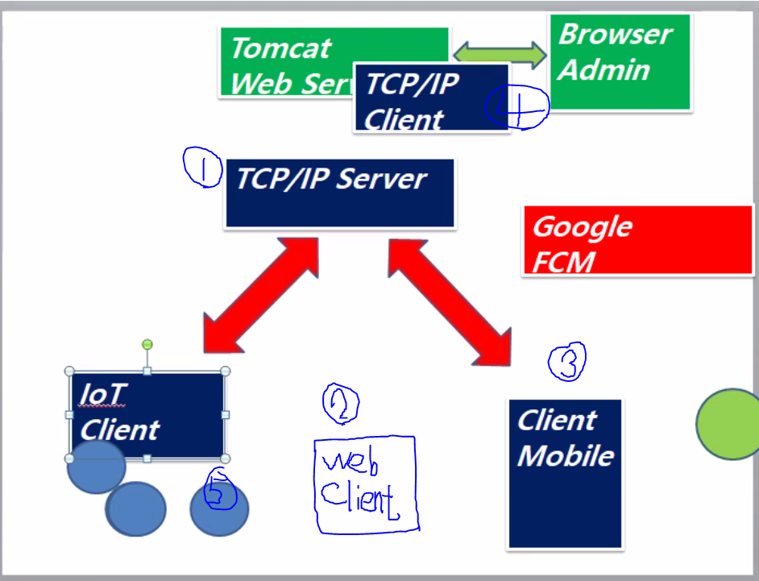

# Network

- http protocol
- TCP/IP protocol

## thread

- 프로세스 : 프로그램을 수행하는 데 필요한 **데이터와 메모리 등의 자원 그리고 쓰레드로 구성** (최소 하나 이상의 쓰레드가 존재하며, 둘 이상의 쓰레드를 가진 프로세스를 '멀티쓰레드 프로세스' 라고 한다)

  - **멀티쓰레드 프로세스**는 여러 쓰레드가 같은 프로세스 내에서 자원을 공유하면서 작업을 하기 때문에 발생할 수 있는 **동기화, 교착상태와 같은 문제**들을 고려해 신중히 프로그래밍해야 한다.

- 쓰레드 : 프로세스의 자원을 이용해서 실제로 작업을 수행하는 것 

  

### 쓰레드 구현 (extends Thread 방법)

```java
package com.thread;

// java는 thread 사용!
class T extends Thread{

	String name;
	
	public T() {}
	public T(String name) {
		this.name = name;
	}
	
	// run 함수를 사용한다
	@Override
	public void run() {
		for(int i=0;i<=100;i++) {
			System.out.println(name+":"+i);
			try {
				Thread.sleep(200);
			} catch (InterruptedException e) {
				e.printStackTrace();
			}
		}
	}
	
}


// 메인
public class Test {

	public static void main(String[] args) {
		// 동시에 동작된다!!!!!
		T t1 = new T("T1");
		t1.start();        // T1의 run함수가 실행된다!
		T t2 = new T("T2");
		t2.start();     
	}

}
```

### 쓰레드 구현 (implements Runnable 방법)

```java
package com.thread;

// java는 thread 사용! Runnable에서 implements
class Th implements Runnable{

	String name;
	
	public Th() {}
	public Th(String name) {
		this.name = name;
	}
	
	// run 함수를 사용한다
	@Override
	public void run() {
		for(int i=0;i<=100;i++) {
			System.out.println(name+":"+i);
			try {
				Thread.sleep(100);
			} catch (InterruptedException e) {
				e.printStackTrace();
			}
		}
	}
	
}


// 메인
public class Test2 {

	public static void main(String[] args) {
		// 동시에 동작된다!!!!!
		//Runnable일때 쓰레드 만드는 방법 주의!! Thread를 만들고 그 안에 넣는다!
		Thread t1 = new Thread(new Th("T1"));
		t1.start();        // T1의 run함수가 실행된다!
		Thread t2 = new Thread(new Th("T2"));
		t2.start();     
	}

}
```


### 쓰레드의 우선순위

> 우선순위 범위는 1~10이며 숫자가 높을 수록 우선순위가 높다.
>
> 하지만, 멀티코어에서 실행하면 차이가 없다

```java
public class Test {

	public static void main(String[] args) {
		// 동시에 동작된다!!!!!
		T t1 = new T("T1");
		t1.start();        // T1의 run함수가 실행된다!
		t1.setPriority(10); // 높을수록 많은 프로세스를 점유한다
		T t2 = new T("T2");
		t2.start();
		t2.setPriority(1);
	}

}
```


### 데몬 쓰레드

> 일반 쓰레드가 모두 종료되면 데몬 쓰레드는 강제적으로 자동 종료된다.

```java
package com.thread;

class TT extends Thread{

	@Override
	public void run() {
		while(true) {
			System.out.println("Thread ....");
			try {
				Thread.sleep(500);
			} catch (InterruptedException e) {
				e.printStackTrace();
			}
		}
	}
	
}


public class Test4 {

	public static void main(String[] args) throws InterruptedException {
		TT tt = new TT();
		tt.setDaemon(true); // 메인 Application(프로세스)이 죽으면 같이 죽는다
		tt.start();
		tt.interrupt();
		Thread.sleep(10000);
		System.out.println("End Application....");
	}

}
```


### join()과 yield()

- join() - 다른 쓰레드의 작업을 기다린다
- yield() - 다른 쓰레드에게 양보한다

```java
th1.join(); //th1이 끝날때 까지 아래 구문 실행을 멈춘다
// th1의run()이 다 끝난 후 아래 실행
System.out.println(th1.getSum()+" "+th2.getSum());
```


### 쓰레드의 동기화(synchronization)

> 같은 정보를 공유할 때 한 쓰레드가 진행중인 작업을 다른 쓰레드가 간섭하지 못하게 막는것


### 쓰레드 제어 예제

```java
package com.sus;

import java.util.Scanner;

class Th extends Thread{

	boolean stop = false;
	boolean sus = false;
	public void setStop(boolean stop) {
		this.stop = stop;
	}
	public void setSus(boolean sus) {
		this.sus = sus;
	}
	
	@Override
	public void run() {
		while(true) {
			if(stop == true) {
				System.out.println("Stop Thread ...");
				break;
			}
			try {
				Thread.sleep(1000);
			} catch (InterruptedException e) {
				e.printStackTrace();
			}
			if(sus != true) {
				System.out.println("Downloading ...");
			}
		}
		System.out.println("End Thread ...");
	}
	
}


public class Test {
	
	public static void main(String[] args) {
	
		Th th = new Th();
		Scanner sc = new Scanner(System.in);
		while(true) {
			System.out.println("Input cmd");
			String cmd = sc.nextLine();
			if(cmd.equals("start")) {
				th.start();
			}else if(cmd.equals("stop")){
				th.setStop(true);
			}else if(cmd.equals("sus")){
				th.setSus(true);
			}else if(cmd.equals("res")){
				th.setSus(false);
			}else if(cmd.equals("q")){
				th.setSus(true);
				break;
			}
		}
		

	}

}

```


## 입출력

- I/O란 Input과 Output의 약자로 입력과 출력, 입출력이라고 한다
- 입출력은 컴퓨터 내부 또는 외부의 장치와 프로그램간의 데이터를 주고받는 것을 말한다.


- 스트림이란 데이터를 운반하는데 사용되는 연결통로이다.
- 스트림은 단방향통신만 가능하기 때문에 입력스트림과 출력스트림 2개가 필요하다.


- BufferedInput/OutputStream - 빠른 처리


### 바이트기반 스트림

```java
package com.io;

import java.io.BufferedInputStream;
import java.io.BufferedOutputStream;
import java.io.FileInputStream;
import java.io.FileNotFoundException;
import java.io.FileOutputStream;
import java.io.IOException;
import java.io.InputStream;

//바이트기반 스트림인 InputStream와 OutputStream를 사용해보자! (입출력 단위가 1바이트)
public class Test1 {
	
	public static void main(String[] args) {
		String file = "c:\\network\\d01\\src\\text.txt";
		FileInputStream fis = null;
		BufferedInputStream bis = null;
		FileOutputStream fos = null;
		BufferedOutputStream bos = null;
		try {
			fis = new FileInputStream(file);
			bis = new BufferedInputStream(fis); // fis를 넣어서 기능확장, 속도증가
			fos = new FileOutputStream("text2.txt");
			bos = new BufferedOutputStream(fos); // fos를 넣어서 기능확장, 속도증가
			int data = 0;
			// 끝 자리가 아닐때까지
			while((data=fis.read()) != -1) {
				bos.write(data); // 읽어드린걸 저장한다
				System.out.println((char)data);  // 바이트단위로 읽었다
			}
			System.out.println(fis.available());
		} catch (Exception e) {
			e.printStackTrace();
		} finally {
			// fis도 같이 close됨!
			if(bis != null) {
				try {
					bis.close();   // ** 꼭 close를 해주어야 한다!!! **
				} catch (IOException e) {
					e.printStackTrace();
				}
			}
			// bos도 같이 close됨!
			if(bos != null) {
				try {
					bos.close();   // ** 꼭 close를 해주어야 한다!!! **
				} catch (IOException e) {
					e.printStackTrace();
				}
			}	
		}
	}
	
}
```


### 문자기반 스트림

```java
package com.io;

import java.io.BufferedInputStream;
import java.io.BufferedOutputStream;
import java.io.BufferedReader;
import java.io.BufferedWriter;
import java.io.FileInputStream;
import java.io.FileOutputStream;
import java.io.FileReader;
import java.io.FileWriter;
import java.io.IOException;

//문자기반 스트림인 Reader와 Writer를 사용해보자!
public class Test2 {
	
	public static void main(String[] args) {
		String file = "c:\\network\\d01\\src\\text.txt";
		FileReader fis = null;
		BufferedReader bis = null;
		FileWriter fos = null;
		BufferedWriter bos = null;
		try {
			fis = new FileReader(file);
			bis = new BufferedReader(fis); // fis를 넣어서 기능확장, 속도증가
			fos = new FileWriter("text2.txt");
			bos = new BufferedWriter(fos); // fos를 넣어서 기능확장, 속도증가
			String data = "";
			// 끝 자리가 아닐때까지, readLine()은 BufferedReader에만 있다
			while((data=bis.readLine()) != null) {
				bos.write(data); // 읽어드린걸 저장한다
				System.out.println(data);  // 바이트단위로 읽었다
			}
			//System.out.println(fis.available());
		} catch (Exception e) {
			e.printStackTrace();
		} finally {
			// fis도 같이 close됨!
			if(bis != null) {
				try {
					bis.close();   // ** 꼭 close를 해주어야 한다!!! **
				} catch (IOException e) {
					e.printStackTrace();
				}
			}
			// bos도 같이 close됨!
			if(bos != null) {
				try {
					bos.close();   // ** 꼭 close를 해주어야 한다!!! **
				} catch (IOException e) {
					e.printStackTrace();
				}
			}	
		}
	
		
	}
}
```


### 객체 입출력 예제

```java
package com.io;

import java.io.BufferedInputStream;
import java.io.BufferedOutputStream;
import java.io.FileInputStream;
import java.io.FileNotFoundException;
import java.io.FileOutputStream;
import java.io.IOException;
import java.io.ObjectInputStream;
import java.io.ObjectOutputStream;

// 객체를 I/O한다
public class Test3 {

	public static void main(String[] args) {
		User user = new User("id01", "이말숙");
		
		FileOutputStream fos = null;
		BufferedOutputStream bos = null;
		ObjectOutputStream oos = null;
		
		try {
			fos = new FileOutputStream("user.serial");
			bos = new BufferedOutputStream(fos);
			oos = new ObjectOutputStream(bos);
			oos.writeObject(user);
			System.out.println("Write Complete ...");
		} catch (Exception e) {
			// TODO Auto-generated catch block
			e.printStackTrace();
		} // 확장자명은 상관없다 
		 finally {
			 if(oos != null) {
				 try {
					oos.close();
				} catch (IOException e) {
					e.printStackTrace();
				}
			 }
		 }
		
		FileInputStream fis = null;
		BufferedInputStream bis = null;
		ObjectInputStream ois = null;
		
		try {
			fis = new FileInputStream("user.serial");
			bis = new BufferedInputStream(fis);
			ois = new ObjectInputStream(bis);
			User readUser =null;
			readUser = (User)ois.readObject();
			System.out.println(readUser);
		} catch (Exception e) {
			e.printStackTrace();
		} finally {
			if(ois != null) {
				try {
					ois.close();
				} catch (IOException e) {
					e.printStackTrace();
				}
			}
		}
		
		
	} // end main 
	
}
```


## 네트워킹

- 네트워킹 : 두 대 이상의 컴퓨터를 케이블로 연결하여 네트워크를 구성하는 것
- 자바에서는 java.net 패키지를 사용하면 네트워크 어플리케이션의 데이터 통신 부분을 쉽게 작성할 수 있다

- 네트워크를 구성할 때 전용서버를 두는 것을 서버기반모델이라 하고 별도의 전용서버없이 각 클라이언트가 서버역할을 동시에 수행하는 것을 P2P모델이라 한다.


- URL (Uniform Resource Location)


### 서버에 있는 데이터 가져오기

```java
package com.http;

import java.io.BufferedReader;
import java.io.IOException;
import java.io.InputStream;
import java.io.InputStreamReader;
import java.net.URL;
import java.net.URLConnection;

public class Test1 {

	public static void main(String[] args) {
		String urlstr = "http://192.168.0.103/network/users.jsp";
		URL url = null;
		URLConnection con = null;
		// 여기까지 물리적인 연결이 된 것이다
		
		// 데이터를 주고 받으려면 I/O를 열어야 한다
		InputStream is = null;
		InputStreamReader isr = null;
		BufferedReader br = null;
		
		
		try {
			url = new URL(urlstr);
			con = url.openConnection();
			System.out.println(con.getContentEncoding());
			
			is = con.getInputStream();
			isr = new InputStreamReader(is,"UTF-8");
			br = new BufferedReader(isr);
			
			String str = "";
			while((str = br.readLine()) != null) {
				System.out.println(str);
			}
			
		} catch (Exception e) {
			e.printStackTrace();
		} finally {
			if(br != null){
				try {
					br.close();
				} catch (IOException e) {
					e.printStackTrace();
				}
			}
		
		}
	}

}
```


### 서버에 있는 파일 가져오기

```java
package com.http;

import java.io.BufferedInputStream;
import java.io.BufferedOutputStream;
import java.io.FileOutputStream;
import java.io.IOException;
import java.io.InputStream;
import java.net.URL;
import java.net.URLConnection;

// 파일을 받아보자
public class Test2 {

	public static void main(String[] args) {
		String urlstr = "http://192.168.0.103/network/mp.mp3";
		URL url = null;
		URLConnection con = null;
		// 여기까지 물리적인 연결이 된 것이다
		
		InputStream is = null;
		BufferedInputStream bis = null;
		
		// 내 컴퓨터로 내보낼 준비
		FileOutputStream fos = null;
		BufferedOutputStream bos = null;
		
		try {
			url = new URL(urlstr);
			con = url.openConnection();
			is = con.getInputStream();
			bis = new BufferedInputStream(is,100000000);
			
			// 주소를 바꾸고 싶다면 절대경로를 입력해주면 된다
			fos = new FileOutputStream("newmp.mp3");
			bos = new BufferedOutputStream(fos);
			
			//바이트 단위로 오기 때문에 int로 받는다
			int data = 0;
			//파일의 끝까지..
			while((data = bis.read()) != -1) {
				//System.out.println(data);
				bos.write(data);
			}
			
			
		} catch (Exception e) {
			e.printStackTrace();
		} finally {
			if(bis != null){
				try {
					bis.close();
				} catch (IOException e) {
					e.printStackTrace();
				}
			}
			if(bos != null){
				try {
					bos.close();
				} catch (IOException e) {
					e.printStackTrace();
				}
			}
		
		
		}
	}

}
```


### HttpURLConnection을 사용한 서버로 데이터 전달

```java
package com.http;

import java.net.HttpURLConnection;
import java.net.URL;
import java.util.Random;

public class Test3 {

	public static void main(String[] args) throws InterruptedException {
		String urlstr = "http://192.168.0.103/network/car.jsp";
		URL url = null;
		// HttpURLConnection 사용!
		HttpURLConnection con = null;
		
		// 5초에 한 번씩 랜덤 좌표를 전달하는 작업
		while(true) {
			//이 안에 전체가 있어야 한다!
			try {
				Random rd = new Random();
				double lat = rd.nextDouble()*100;
				double lng = rd.nextDouble()*100;
				url = new URL(urlstr+"?lat="+lat+"&lng="+lng);
				con = (HttpURLConnection) url.openConnection();
				con.setReadTimeout(5000); // 5초동안 응답이 없으면 타임아웃
				con.setRequestMethod("POST"); // 어떤 방식으로 보낼지
				con.getInputStream();
			} catch (Exception e) {
				e.printStackTrace();
			} finally {
				con.disconnect();
			}
			Thread.sleep(5000);

		}


		
	}

}
```

- server


### TCP/IP

- 아래 그림처럼 구현해보자!!



1. TCP/IP server

```java
package com.chat;

import java.io.IOException;
import java.io.ObjectInputStream;
import java.io.ObjectOutputStream;
import java.net.ServerSocket;
import java.net.Socket;
import java.util.ArrayList;
import java.util.Collection;
import java.util.HashMap;
import java.util.Iterator;
import java.util.Set;

import com.msg.Msg;

public class Server {

	int port;
	HashMap<String, ObjectOutputStream> maps;
	
	ServerSocket serverSocket;
	
	
	public Server() {}
	public Server(int port) {
		this.port = port;
		maps = new HashMap<>();
	}
	
	// 서버소캣을 통해 각각 클라이언트가 접속할 떄 소켓을 만들고 리시버를 작동시킨다
	public void startServer() throws IOException {
		serverSocket = new ServerSocket(port);
		System.out.println("Start Server ...");
		
		Runnable r = new Runnable() {
			
			@Override
			public void run() {
				while(true) {
					try {
						Socket socket = null;
						System.out.println("Ready Server ...");
						socket = serverSocket.accept();
						// 접속한 클라의 IPAddress
						System.out.println(socket.getInetAddress());
						makeOut(socket);
						new Receiver(socket).start();
					}catch(Exception e) {
						e.printStackTrace();
					}

				} // end while
			}
		};
		
		new Thread(r).start();
		
	}
	
	// 각각의 클라가 접속 했을 때 아웃풋 스트림을 만들어서 해쉬맵에 데이터를 집어 넣는 역할
	public void makeOut(Socket socket) throws IOException {
		ObjectOutputStream oo;
		oo = new ObjectOutputStream(socket.getOutputStream());
		maps.put(socket.getInetAddress().toString(), oo);
		System.out.println("접속자 수:" + maps.size());
	}
	
	// 스트림을 통해 받은 object를 확인하고 sendmsg에 data를 전달한다
	class Receiver extends Thread{
		Socket socket;
		ObjectInputStream oi;
		
		public Receiver(Socket socket) throws IOException {
			this.socket = socket;
			oi = new ObjectInputStream(socket.getInputStream());
		}

		@Override
		public void run() {
			while(oi != null) {
				Msg msg = null;
				try {
					msg = (Msg) oi.readObject();
					if(msg.getMsg().equals("q")) {
						throw new Exception();
					}else if(msg.getMsg().equals("1")) {
						String ip =
						socket.getInetAddress().toString();
						ArrayList<String> ips =
								new ArrayList<>();
						ips.add(ip);
						msg.setIps(ips);
						Set<String> keys = maps.keySet();
						HashMap<String, Msg> hm = 
								new HashMap<>();
						for(String k:keys) {
							hm.put(k,null);
						}
						// 1을 보낸 client
						// 서버의 접속자 ip들
						msg.setMaps(hm);
					}
					System.out.println(msg.getId()+msg.getMsg());
					sendMsg(msg);
				} catch (Exception e) {
					maps.remove(socket.getInetAddress().toString());
					System.out.println(socket.getInetAddress()+".. Exited");
					System.out.println("접속자수:"+maps.size());
					break;
				}
			} // end while
			
			try {
				if(oi != null) {
					oi.close();
				}
				if(socket != null) {
					socket.close();
				}
			}catch(Exception e){
				
			}
			
		}
		
	}
	
	// Receiver에서 받은 msg를 Sender를 호출하여 모든 클라에게 전송한다.
	public void sendMsg(Msg msg) {
		Sender sender = new Sender();
		sender.setMsg(msg);
		sender.start();
	}
	
	// Hashmap의 사용자 정보를 통해 메시지를 전달한다
	class Sender extends Thread{
		Msg msg;
		public void setMsg(Msg msg) {
			this.msg = msg;
		}
		@Override
		public void run() {
			Collection<ObjectOutputStream> cols = 
					maps.values();
			Iterator<ObjectOutputStream> it =
					cols.iterator();
			while(it.hasNext()) {
				try {
					// null 체크한다, 여러명에게 보내기
					if(msg.getIps() != null) {
						System.out.println("test!!!!!!!!!"+msg.getIps());
						for(String ip:msg.getIps()) {
							maps.get(ip).writeObject(msg);
						}
						break;
					}
					// broadcast
					it.next().writeObject(msg);
				} catch (IOException e) {
					e.printStackTrace();
				}
			}
		}
		
	}
	
	
	public static void main(String[] args) {
		Server server = new Server(5555);
		try {
			server.startServer();
		} catch (IOException e) {
			e.printStackTrace();
		}
	}


}

```


2. TCP/IP client

```java
package com.chat;

import java.io.IOException;
import java.io.ObjectInputStream;
import java.io.ObjectOutputStream;
import java.net.Socket;
import java.util.ArrayList;
import java.util.HashMap;
import java.util.Scanner;
import java.util.Set;

import com.msg.Msg;

public class Client {

	int port;
	String address;
	String id;
	Socket socket;
	Sender sender;
	
	public Client() {}
	public Client(String address, int port, String id) {
		this.address = address;
		this.port = port;
		this.id = id;
	}
	
	public void connect() throws IOException {
		// 소켓이 만들어지는 구간
		try {
			socket = new Socket(address,port);
		} catch (Exception e) {
			while(true) {
				try {
					Thread.sleep(2000);
					socket = new Socket(address,port);
					break;
				} catch (Exception e1) {
					System.out.println("Retry...");
				}
			}
		}
	
		System.out.println("Connected Server:"+address);
		
		sender = new Sender(socket);
		new Receiver(socket).start();
		
		sendMsg();
	
	}
	
	public void sendMsg() throws IOException {
		Scanner sc = new Scanner(System.in);
		while(true) {
			System.out.println("Input msg");
			String ms = sc.nextLine();
			Msg msg = null;
			// 1을 보내면 서버에서는 사용자 리스트를 보낸다.
			if(ms.equals("1")){
				msg = new Msg(id,ms);
			}else {
				ArrayList<String> ips = new ArrayList<>();
				ips.add("/192.168.0.61");
				ips.add("/192.168.0.9");
				ips.add("/192.168.0.72");
//그룹 보내기		msg = new Msg(ips,id,ms);   
				msg = new Msg(null,id,ms);  // 전체 보내기
			}

			
			sender.setMsg(msg);
			new Thread(sender).start();
			
			if(ms.equals("q")){
				break;
			}
		}
		//sc.close();
		if(socket != null) {
			try {
				socket.close();
			} catch (IOException e) {
				e.printStackTrace();
			}
		}
		System.out.println("Bye....");
	}
	
	class Sender implements Runnable{
		Socket socket;
		ObjectOutputStream oo;
		Msg msg;
		
		public Sender(Socket socket) throws IOException {
			this.socket = socket;
			oo = new ObjectOutputStream(socket.getOutputStream());
		}
		
		public void setMsg(Msg msg) {
			this.msg = msg;
		}

		@Override
		public void run() {
			if(oo != null) {
				try {
					oo.writeObject(msg);
				} catch (IOException e) {
					//e.printStackTrace();
					try {
						if(socket != null) {
							socket.close();	
						}
					}catch(Exception e1) {
						e1.printStackTrace();

					}
					// 서버가 끊기면 connect를 한다!
					try {
						Thread.sleep(2000);
						connect();
						//sendMsg();
						System.out.println("test1");
					} catch (Exception e1) {
						e1.printStackTrace();
					}
					
				}
			}
		}
		
	}
	
	class Receiver extends Thread{
		ObjectInputStream oi;
		public Receiver(Socket socket) throws IOException {
			oi = new ObjectInputStream(socket.getInputStream());
		}
		@Override
		public void run() {
			while(oi != null) {
				Msg msg = null;
				try {
					msg = (Msg) oi.readObject();
					if(msg.getMaps() != null) {
						HashMap<String,Msg> hm = msg.getMaps();
						Set<String> keys = hm.keySet();
						for(String k : keys) {
							System.out.println(k);
						}
						continue;
					}
					System.out.println(msg.getId()+msg.getMsg());
				} catch (Exception e) {
					e.printStackTrace();
					break;
				}

			} // end while
			try {
				if(oi != null) {
					oi.close();
				}
				if(socket != null) {
					socket.close();
				}
			}catch(Exception e){
			
			}
			// 서버가 끊기면 connect를 한다!
			try {
				Thread.sleep(2000);
				System.out.println("test2");
				connect();
				sendMsg();
			} catch (Exception e1) {
				e1.printStackTrace();
			}
		
		}
		
	}
	
	
	
	public static void main(String[] args) {
		Client client = new Client("192.168.0.28",5555,"[재현]");
		
		try {
			client.connect();
			//client.sendMsg();
		} catch (IOException e) {
			e.printStackTrace();
		}
		
		
	}

}

```


3. 안드로이드 Mobile Client (MainActivity.java)

```java
package com.example.tcpip;

import androidx.annotation.NonNull;
import androidx.appcompat.app.AppCompatActivity;
import androidx.core.app.NotificationCompat;
import androidx.localbroadcastmanager.content.LocalBroadcastManager;

import android.app.Notification;
import android.app.NotificationChannel;
import android.app.NotificationManager;
import android.app.PendingIntent;
import android.content.BroadcastReceiver;
import android.content.Context;
import android.content.Intent;
import android.content.IntentFilter;
import android.os.Build;
import android.os.Bundle;
import android.util.Log;
import android.view.View;
import android.widget.EditText;
import android.widget.TextView;
import android.widget.Toast;

import com.google.android.gms.tasks.OnCompleteListener;
import com.google.android.gms.tasks.Task;
import com.google.firebase.messaging.FirebaseMessaging;
import com.msg.Msg;

import java.io.IOException;
import java.io.ObjectInputStream;
import java.io.ObjectOutputStream;
import java.net.Socket;
import java.util.ArrayList;
import java.util.HashMap;
import java.util.Set;

public class MainActivity extends AppCompatActivity {
    TextView tx_list, tx_msg;
    EditText et_ip, et_msg;

    int port;
    String address;
    String id;
    Socket socket;

    Sender sender;

    NotificationManager manager;

    @Override
    protected void onCreate(Bundle savedInstanceState) {
        super.onCreate(savedInstanceState);
        setContentView(R.layout.activity_main);
        tx_list = findViewById(R.id.tx_list);
        tx_msg = findViewById(R.id.tx_msg);
        et_ip = findViewById(R.id.et_ip);
        et_msg = findViewById(R.id.et_msg);
        port = 5555;
        address = "192.168.0.103";
        id="[JaeHyun]";

        new Thread(con).start();

        // FCM사용 (앱이 중단되어 있을 때 기본적으로 title,body값으로 푸시!!)
        FirebaseMessaging.getInstance().subscribeToTopic("car").
                addOnCompleteListener(new OnCompleteListener<Void>() {
                    @Override
                    public void onComplete(@NonNull Task<Void> task) {
                        String msg = "FCM Complete...";
                        if (!task.isSuccessful()) {
                            msg = "FCM Fail";
                        }
                        Log.d("[TAG]", msg);

                    }
                });


        // 여기서 부터는 앱 실행상태에서 상태바 설정!!
        LocalBroadcastManager lbm = LocalBroadcastManager.getInstance(this); // 브로드캐스트를 받을 준비
        lbm.registerReceiver(receiver, new IntentFilter("notification")); // notification이라는 이름의 정보를 받겠다

    } // end OnCreate

    // MyFService.java의 intent 정보를 BroadcastReceiver를 통해 받는다
    public BroadcastReceiver receiver = new BroadcastReceiver() {
        @Override
        public void onReceive(Context context, Intent intent) {
            if (intent != null) {
                String title = intent.getStringExtra("title");
                String control = intent.getStringExtra("control");
                String data = intent.getStringExtra("data");
                Toast.makeText(MainActivity.this, title + " " + control + " " + data, Toast.LENGTH_SHORT).show();


                // 상단알람 사용
                manager = (NotificationManager) getSystemService(NOTIFICATION_SERVICE);
                NotificationCompat.Builder builder = null;
                if (Build.VERSION.SDK_INT >= 26) {
                    if (manager.getNotificationChannel("ch2") == null) {
                        manager.createNotificationChannel(
                                new NotificationChannel("ch2", "chname", NotificationManager.IMPORTANCE_DEFAULT));
                    }
                    builder = new NotificationCompat.Builder(context, "ch2");
                } else {
                    builder = new NotificationCompat.Builder(context);
                }

                Intent intent1 = new Intent(context, MainActivity.class);
                PendingIntent pendingIntent = PendingIntent.getActivity(
                        context, 101, intent1, PendingIntent.FLAG_UPDATE_CURRENT);

                builder.setAutoCancel(true);
                builder.setContentIntent(pendingIntent);
                //상단바 타이틀 설정
                builder.setContentTitle(title);
                //상단바 내용 설정
                builder.setContentText(control + " " + data);
                builder.setSmallIcon(R.drawable.a1);
                Notification noti = builder.build();
                manager.notify(1, noti);
            }

        }

    };


    @Override
    public void onBackPressed() {
        super.onBackPressed();
        try{
            Msg msg = new Msg(null,id,"q");
            sender.setMsg(msg);
            new Thread(sender).start();
            if(socket != null) {
                socket.close();
            }
            finish();
            onDestroy();

        }catch(Exception e){

        }
    }

    Runnable con = new Runnable() {
        @Override
        public void run() {
            try {
                connect();
            } catch (IOException e) {
                e.printStackTrace();
            }
        }
    };


    private void connect() throws IOException {
        // 소켓이 만들어지는 구간
        try {
            socket = new Socket(address,port);
        } catch (Exception e) {
            while(true) {
                try {
                    Thread.sleep(2000);
                    socket = new Socket(address,port);
                    break;
                } catch (Exception e1) {
                    System.out.println("Retry...");
                }
            }
        }

        System.out.println("Connected Server:"+address);

        sender = new Sender(socket);
        new Receiver(socket).start();

        getList();

        //sendMsg();
    }

    private void getList() {
        Msg msg = new Msg(null,"[JaeHyun]","1");
        sender.setMsg(msg);
        new Thread(sender).start();
    }


   //
    public void clickBt(View v){
        ArrayList<String> ips = new ArrayList<>();
        String ip = et_ip.getText().toString();
        String ms = et_msg.getText().toString();
        Msg msg = null;
        if(ip.equals("") || ip == null){
            msg = new Msg(id,ms);
        }else{
            ips.add(ip);
            msg = new Msg(ips,id,ms);
        }

        Log.d("[TAG]",ips.toString());
        sender.setMsg(msg);
        new Thread(sender).start();

        et_msg.setText("");
        //getList();
    }

    class Receiver extends Thread{
        ObjectInputStream oi;
        public Receiver(Socket socket) throws IOException {
            oi = new ObjectInputStream(socket.getInputStream());
        }
        @Override
        public void run() {
            while(oi != null) {
                Msg msg = null;
                try {
                    msg = (Msg) oi.readObject();
                    // 접속되어 있는 IP주소 찍는다
                    if(msg.getMaps() != null) {
                        HashMap<String,Msg> hm = msg.getMaps();
                        Set<String> keys = hm.keySet();
                        for(final String k : keys) {
                            runOnUiThread(new Runnable() {
                                @Override
                                public void run() {
                                    String tx = tx_list.getText().toString();
                                    tx_list.setText(tx+k+"\n");
                                }
                            });
//                            System.out.println(k);
                        }
                        continue;
                    }
                    final Msg finalMsg = msg;
                    Log.d("------------------",finalMsg.getMsg());
                    runOnUiThread(new Runnable() {
                        @Override
                        public void run() {
                            String tx = tx_msg.getText().toString();
                            tx_msg.setText(finalMsg.getId()+finalMsg.getMsg()+"\n"+tx);
                        }
                    });
                    System.out.println(msg.getId()+msg.getMsg());
                } catch (Exception e) {
                    e.printStackTrace();
                    break;
                }

            } // end while
            try {
                if(oi != null) {
                    oi.close();
                }
                if(socket != null) {
                    socket.close();
                }
            }catch(Exception e){

            }
            // 서버가 끊기면 connect를 한다!
            try {
                Thread.sleep(2000);
                System.out.println("test2");
                connect();
                //sendMsg();
            } catch (Exception e1) {
                e1.printStackTrace();
            }

        }

    }


    class Sender implements Runnable{
        Socket socket;
        ObjectOutputStream oo;
        Msg msg;

        public Sender(Socket socket) throws IOException {
            this.socket = socket;
            oo = new ObjectOutputStream(socket.getOutputStream());
        }

        public void setMsg(Msg msg) {
            this.msg = msg;
        }

        @Override
        public void run() {
            if(oo != null) {
                try {
                    oo.writeObject(msg);
                } catch (IOException e) {
                    //e.printStackTrace();
                    try {
                        if(socket != null) {
                            socket.close();
                        }
                    }catch(Exception e1) {
                        e1.printStackTrace();

                    }
                    // 서버가 끊기면 connect를 한다!
                    try {
                        Thread.sleep(2000);
                        connect();
                        //sendMsg();
                        System.out.println("test1");
                    } catch (Exception e1) {
                        e1.printStackTrace();
                    }

                }
            }
        }

    }


}
```


4. Admin Browser에서 Client를 호출하기 위한 TCP/IP Client (Spring Web Application)

- main.jsp

```java
<%@ page language="java" contentType="text/html; charset=UTF-8"
    pageEncoding="UTF-8"%>
<%@ taglib prefix="c" uri="http://java.sun.com/jsp/jstl/core" %>

<!DOCTYPE html>
<html>
<head>
<meta charset="UTF-8">
<title>Insert title here</title>
<script src="http://ajax.googleapis.com/ajax/libs/jquery/1.7.2/jquery.min.js"></script>
<script>
$(document).ready(function(){
	
   $('#iot').click(function(){
	   var ip = $('#ip').val();
	   $.ajax({
         url:"iot.mc?ip="+ip,
         success:function(data){
            console.log('Send Complete...');
         }
      });
   });
   
   $('#phone').click(function(){
      $.ajax({
         url:"phone.mc",
         success:function(data){
            //alert('Send Complete...');
         }
      });
   });
   
});
</script>
</head>
<body>
<h1>Main Page</h1>
<form action="iot.mc" method="post">
	<input type="text" id="ip" maxlength="50"></input>
</form>
<h2><a id="iot" href="#">Send IoT(TCP/IP)</a></h2>
<h2><a id ="phone" href="#">Send Phone(FCM)</a></h2>
</body>
</html>
```

- MainController.java

```java
package com.tcpip;

import java.io.IOException;
import java.io.OutputStreamWriter;
import java.io.PrintWriter;
import java.net.HttpURLConnection;
import java.net.MalformedURLException;
import java.net.URL;

import javax.servlet.ServletException;
import javax.servlet.http.HttpServletRequest;
import javax.servlet.http.HttpServletResponse;

import org.json.simple.JSONObject;
import org.springframework.stereotype.Controller;
import org.springframework.web.bind.annotation.RequestMapping;
import org.springframework.web.servlet.ModelAndView;

import com.chat.Client;

@Controller
public class MainController {
   
   Client client;
   
   public MainController() {
      client = new Client("192.168.0.103", 5555, "[WEB]");
      try {
         client.connect();
      } catch (Exception e) {
         // TODO Auto-generated catch block
         e.printStackTrace();
      }
   }

   @RequestMapping("/main.mc")
   public ModelAndView main() {
      ModelAndView mv = new ModelAndView();
      mv.setViewName("main");
      return mv;
   }
   

   @RequestMapping("/iot.mc")
   public void iot(HttpServletResponse res,HttpServletRequest request) throws IOException {
      client.sendTarget("/192.168.0.103", "100");
      String ip = request.getParameter("ip");
      if(ip != null && !ip.equals("")) {
    	  System.out.println(ip);
    	  client.sendTarget(ip, "100");
    	  System.out.println("IoT Send Start:"+ip);
      }else {
    	  System.out.println("IoT Send Start ..");
      }
      
      PrintWriter out = res.getWriter();
      out.print("ok");
      out.close();
   }

   @RequestMapping("/phone.mc")
   protected void service(HttpServletRequest request, HttpServletResponse response) throws ServletException, IOException {
		URL url = null;
		try {
			url = new URL("https://fcm.googleapis.com/fcm/send");
		} catch (MalformedURLException e) {
			System.out.println("Error while creating Firebase URL | MalformedURLException");
			e.printStackTrace();
		}
		HttpURLConnection conn = null;
		try {
			conn = (HttpURLConnection) url.openConnection();
		} catch (IOException e) {
			System.out.println("Error while createing connection with Firebase URL | IOException");
			e.printStackTrace();
		}
		conn.setUseCaches(false);
		conn.setDoInput(true);
		conn.setDoOutput(true);
		conn.setRequestProperty("Content-Type", "application/json");

		// set my firebase server key
		conn.setRequestProperty("Authorization", "key="
				+ "AAAAK89FyMY:APA91bGxNwkQC6S_QQAKbn3COepWgndhyyjynT8ZvIEarTaGpEfMA1SPFo-ReN8b9uO21R1OfSOpNhfYbQaeohKP_sKzsgVTxu7K5tmzcjEfHzlgXRFrB1r0uqhfxLp4p836lbKw_iaN");

		// create notification message into JSON format
		
		JSONObject message = new JSONObject();
		message.put("to", "/topics/car");
		message.put("priority", "high");
		
		JSONObject notification = new JSONObject();
		notification.put("title", "title1");
		notification.put("body", "body1");
		message.put("notification", notification);
		
		JSONObject data = new JSONObject();
		data.put("control", "control1");
		data.put("data", 100);
		message.put("data", data);


		try {
			OutputStreamWriter out = new OutputStreamWriter(conn.getOutputStream(), "UTF-8");
			out.write(message.toString());
			out.flush();
			conn.getInputStream();
			System.out.println("OK...............");

		} catch (IOException e) {
			System.out.println("Error while writing outputstream to firebase sending to ManageApp | IOException");
			e.printStackTrace();
		}
      
      
   }
}
```

- Client.java

```java
package com.chat;

import java.io.IOException;
import java.io.ObjectInputStream;
import java.io.ObjectOutputStream;
import java.net.Socket;
import java.util.ArrayList;
import java.util.Scanner;

import com.msg.Msg;

public class Client {
   int port;
   String address;
   String id;
   Socket socket;
   Sender sender;
   
   public Client() {
   }
   public Client(String address, int port, String id) {
      this.address = address;
      this.port = port;
      this.id = id;
   }
   
   public void connect() throws Exception {
      try {
         socket = new Socket(address, port);
      } catch (Exception e) {
         System.out.println("Retry ...");
         while (true) {
            try {
               Thread.sleep(2000);
               socket = new Socket(address, port);
               break;
            } catch (Exception e1) {
               System.out.println("Retry ...");
            }
         }
      }
      
      System.out.println("Connected Server: " + address);
      sender = new Sender(socket);
      //new Receiver(socket).start();
   }
   
   // 이 부분 추가
   public void sendTarget(String ip, String cmd) {
      ArrayList<String> ips = new ArrayList<String>();
      ips.add(ip);
      Msg msg = new Msg(ips, id, cmd);
      sender.setMsg(msg);
      new Thread(sender).start();
	   }
   
   public void sendMsg() {
      Scanner sc = new Scanner(System.in);
      while(true) {
         // 메세지 입력
         System.out.println("Input msg");
         String ms = sc.nextLine();
         Msg msg = null;
         ArrayList<String> ips = new ArrayList<>();
         if(ms.equals("w")) {
            // 귓속말
            while(true) {
               System.out.println("Input other Ip");
               String other = sc.nextLine();
               if(other.equals("end")) {
                  break;
               }
               ips.add(other);
            }
            System.out.println("Input msg");
            String newms = sc.nextLine();
            msg = new Msg(ips, id, newms);
         }else {
            msg = new Msg(id, ms);
         }
         
         // 메세지 전송
         sender.setMsg(msg);
         new Thread(sender).start();
         
         if(ms.equals("q")) {
            break;
         }
      }
      
      sc.close();
      if(socket != null) {
         try {
            socket.close();
         } catch (IOException e) {
            e.printStackTrace();
         }
      }
      System.out.println("Exit ..");
   }
   
   class Sender implements Runnable{
      Socket socket;
      ObjectOutputStream oo;
      Msg msg;
      
      public Sender(Socket socket) throws Exception {
         this.socket = socket;
         oo = new ObjectOutputStream(socket.getOutputStream());
      }
      
      public void setMsg(Msg msg) {
         this.msg = msg;
      }

      @Override
      public void run() {
         if(oo != null) {
            try {
               oo.writeObject(msg);
            } catch (IOException e) {
               //e.printStackTrace();
               try {
                  if(socket != null) {
                     socket.close();
                  }
               } catch (Exception e2) {
                  e2.printStackTrace();
               }
               
               try {
                  Thread.sleep(2000);
                  connect();
               } catch (Exception e1) {
                  e1.printStackTrace();
               }
            }
         }
      }
   }
   
   class Receiver extends Thread{
      ObjectInputStream oi;
      public Receiver(Socket socket) throws IOException {
         oi = new ObjectInputStream(socket.getInputStream());
      }
      
      @Override
      public void run() {
         while (oi != null) {
            Msg msg = null;
            try {
               msg = (Msg) oi.readObject();
               System.out.println(msg.getId() + msg.getMsg());
            } catch (Exception e) {
               e.printStackTrace();
            }
         } //end while
         
         try {
            if(oi != null) {
               oi.close();
            }
            if(socket != null) {
               socket.close();
            }
         } catch (Exception e) {
            // TODO: handle exception
         }
      }
      
   }

   public static void main(String[] args) {
      Client client = new Client("192.168.0.103", 5555, "[JaeHyun]");
      try {
         client.connect();
         client.sendMsg();
      } catch (Exception e) {
         // TODO Auto-generated catch block
         e.printStackTrace();
      }
   }

}
```

