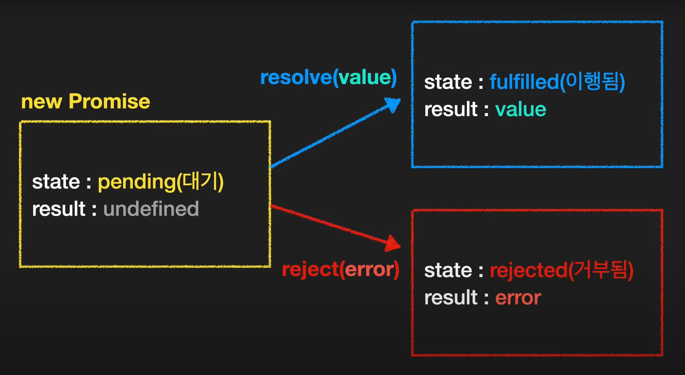
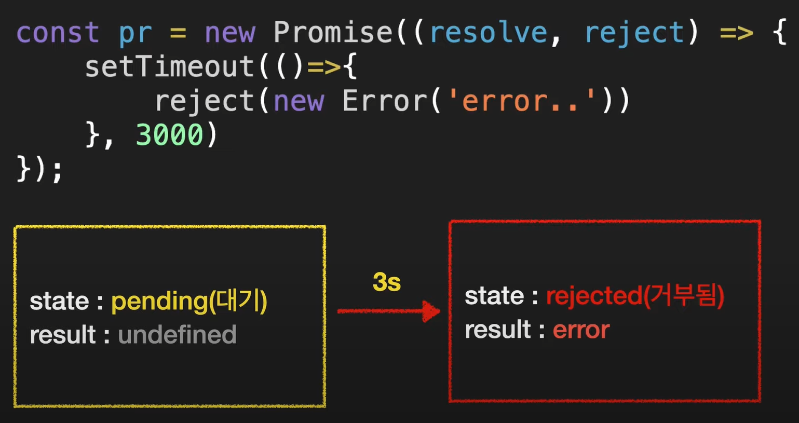
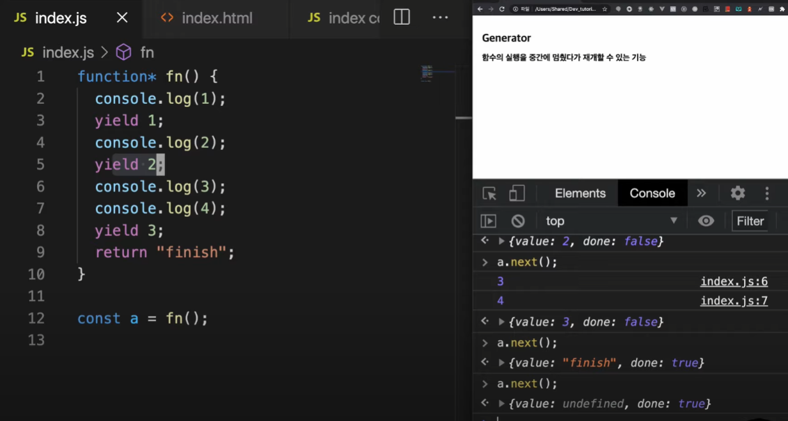
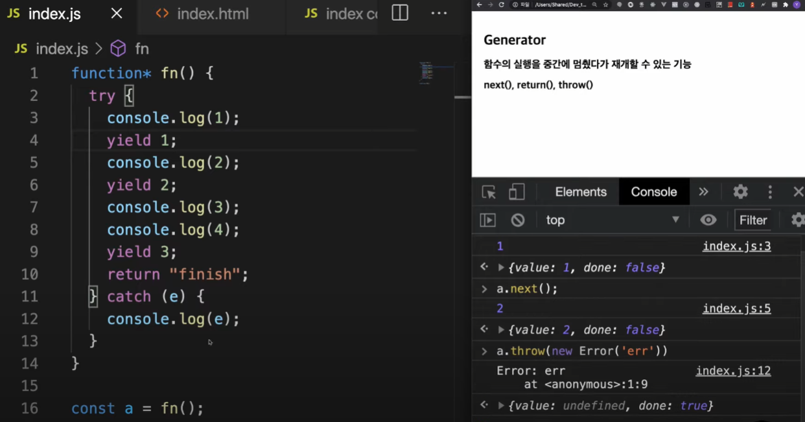
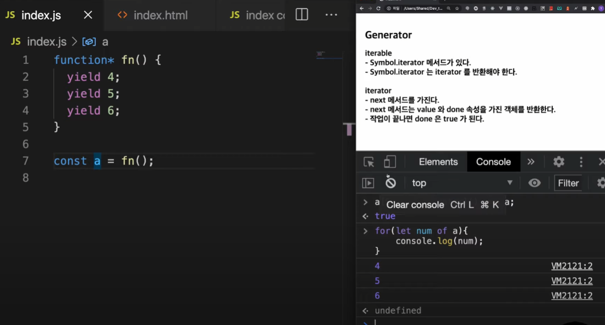
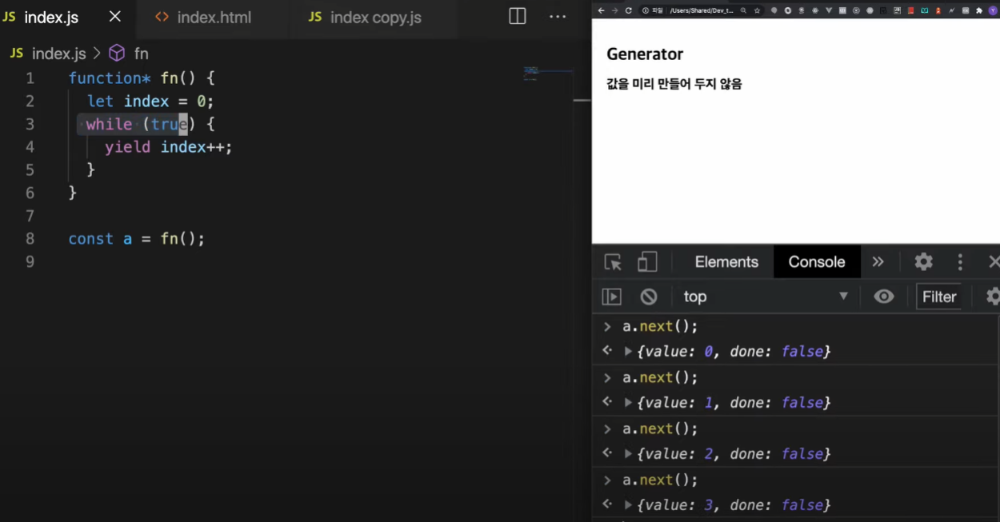
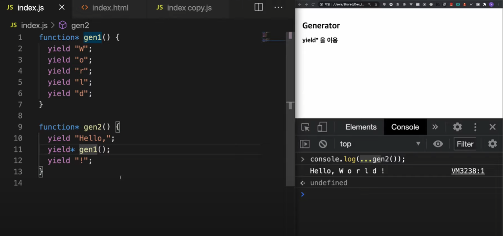
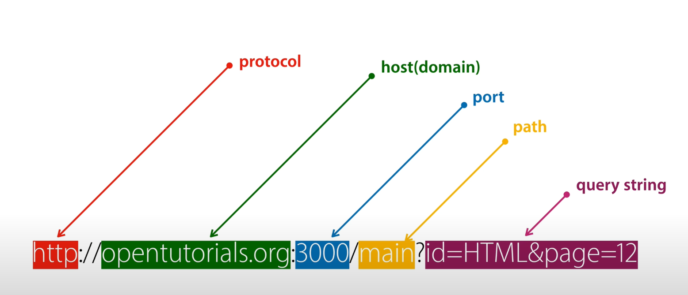

# TypeScript와 Node.js

---

작성 중 (21.09.12)

---

## JavaScript (ES6) 기초

### Data Type

- Number
- String
  - 글자 수 세기 : string.length
- Boolean
- Array
- Object
- ...

### Variable

- 변수 특징
- 변수는 문자와 숫자, $와 _만 사용
  - 첫글자는 숫자가 될 수 없다
  - 예약어는 사용불가
  - 가급적 상수는 대문자
- 변수의 생성과정
  1. 선언단계
  2. 초기화단계
  3. 할당단계

- 호이스팅 이란? : 스코프 내부 어디서든 변수 선언은 최상위에 선언된 것 처럼 행동

- 변수 선언 방식

  - var

    ```javascript
        var name = 'bathingape'
        console.log(name) // bathingape
    
        var name = 'javascript'
        console.log(name) // javascript
    ```

    - var는 선언하기 전에 사용할 수 있다 (선언과 초기화가 같이 됨)

      ```javascript
      console.log(name); // undifined
      var name = 'Mike';
      -------------------아래 처럼 동작!!---------------------------
      var name; // 선언만 호이스팅 된다.
      console.log(name); // undifined
      name = 'Mike';
      ```

  

  

  - let과 const는 TDZ(Temporal Dead Zone)의 영향을 받는다
  - TDZ영역에 있는 변수들은 사용할 수 없다
  - 할당을 하기 전에는 사용할 수 없다

  

  

  - let

    ```javascript
        let name = 'bathingape'
        console.log(name) // bathingape
    
        let name = 'javascript'
        console.log(name) 
        // Uncaught SyntaxError: Identifier 'name' has already been declared
    
        name = 'react'
        console.log(name) //react
    ```

    ```javascript
    console.log(name); // ReferenceError
    let name = 'Mike';
    ```

    - let은 선언과 초기화 단계가 다름 (코드 도달시 초기화 됨)

    ```javascript
    // TDZ와 호이스팅 이해
    let age = 30;
    
    function showAge(){
        console.log(age); // TDZ
        let age = 20; // 호이스팅 됨
    }
    showAge(); // Error
    ```

    

  

  - const

    ```javascript
        const name = 'bathingape'
        console.log(name) // bathingape
    
        const name = 'javascript'
        console.log(name) 
        // Uncaught SyntaxError: Identifier 'name' has already been declared
    
        name = 'react'
        console.log(name) 
        //Uncaught TypeError: Assignment to constant variable.
    ```
    
    - 선언, 초기화, 할당이 같이됨


- 스코프
  - var : 함수 스코프 ex) if문 안에서 상성 후 밖에서도 사용 가능
  - let, const : 블록 스코프 ex) if문 안에서 상성 후 밖에서는 사용 불가능


- 호이스팅
  
  - var 선언문이나 function 선언문 등을 해당 스코프의 선두로 옮긴 것처럼 동작하는 특성
  
    - `var` 로 선언된 변수와는 달리 `let` 로 선언된 변수를 선언문 이전에 참조하면 참조 에러(ReferenceError)가 발생한다.
  
      ```js
      	console.log(foo); // undefined
      	var foo;
      
    	console.log(bar); // Error: Uncaught ReferenceError: bar is not defined
      	let bar;
      ```
    ```
    
    이는 `let` 로 선언된 변수는 스코프의 시작에서 변수의 선언까지 일시적 사각지대(Temporal Dead Zone; TDZ)에 빠지기 때문이다.
    
    참고로, 변수는 `선언 단계` > `초기화 단계` > `할당 단계` 에 걸쳐 생성되는데
    
      `var` 으로 선언된 변수는 선언 단계와 초기화 단계가 한번에 이루어진다. 하지만,
    
      ```js
      // 스코프의 선두에서 선언 단계와 초기화 단계가 실행된다.
      // 따라서 변수 선언문 이전에 변수를 참조할 수 있다.
      
      console.log(foo); // undefined
      
      var foo;
      console.log(foo); // undefined
      
    foo = 1; // 할당문에서 할당 단계가 실행된다.
      console.log(foo); // 1
    ```
  
      `let` 로 선언된 변수는 선언 단계와 초기화 단계가 분리되어 진행된다.
  
      ```js
      // 스코프의 선두에서 선언 단계가 실행된다.
      // 아직 변수가 초기화(메모리 공간 확보와 undefined로 초기화)되지 않았다.
      // 따라서 변수 선언문 이전에 변수를 참조할 수 없다.
      
      console.log(foo); // ReferenceError: foo is not defined
      
      let foo; // 변수 선언문에서 초기화 단계가 실행된다.
      console.log(foo); // undefined
      
    foo = 1; // 할당문에서 할당 단계가 실행된다.
      console.log(foo); // 1
      ```
  
  
  
  
  - 정리
  
    - 재할당이 필요한 경우에 한정해 `let` 을 사용한다. 이때, 변수의 스코프는 최대한 좁게 만든다.
    - 재할당이 필요 없는 상수와 객체에는 `const` 를 사용한다.


### Template Literal

```javascript
var name = 'egoing';
var letter = `Dear ${name}

Lorem ipsum dolor sit amet, ...
${name}`

console.log{letter};
```

### 형변환

- 명시적 형변환
  - String()                              // ex) String(3)
  - Number()                          // ex) Number("1234")
    - Number(null)             // 0
    - Number(undifined)   // NaN
  - Boolean()
    - false인 경우
      - 숫자 0
      - 빈 문자열 ''
      - null
      - undefined
      - NaN
    - ture인 경우
      - false를 제외 한 모든 것
- 자동 형변환

### 논리연산자

- || (OR)
- && (AND)
- ! (NOT)
- 논리 연산자를 사용 할때는 복잡한 조건을 앞에 배치하여 효율성을 높힌다

### 조건문

```javascript
if(){
   
}else if(){
         
}else{
    
}
```

### 반복문

- for

```javascript
for (let i = 0; i < 10; i++){
    // 반복할 코드
}
```

- while

```javascript
let i = 0;
while (i<10){
     // 코드
    i++;
}
```

- switch

```javascript
switch(fruit){
    case apple:
        // 사과일때 코드
    case banana:
    case melon:
        // 바나나나 멜론일때 코드
    ....
    default:
        // 아무것도 아닐 때
}
```


### 다양한 함수와 연산자

- typeof : 자료형 확인

  ```javascript
  console.log(typeof 3); // "number"
  console.log(typeof null); // "object"
  ```

- alert()

- const name = prompt("이름을 입력하세요. ");

  

- confirm() : 확인과 취소가 같이있다. (true/ flase)

### 함수

- ```javascript
  // default value
  
  function sayHello(name = 'friend'){
      let msg = `Hello, ${name}`
      console.log(msg)
  }
  
  sayHello();
  sayHello('Jane');
  ```

- 함수는 한번에 한작업에 집중


- 선언된 모든 함수는 시작 시 초기화 된다 (호이스팅)

- 함수 선언문 : 어디서든 호출 가능

  ```javascript
  function sayHello(){
  	console.log('Hello');
  }
  
  sayHello();
  ```

- 함수 표현식 : 코드에 도달하면 생성

  ```javascript
  let sayHello = function(){  // 생성
      console.log('Hello');   // 사용가능
  }
  
  sayHello();
  ```


- 화살표 함수

  - `let add = (num1, num2) => num1 + num2; `
  - `let sayHello = name => 'Hello, ${name}';`

  

- 함수로 객체 만들기

  ```javascript
  function makeObject(name, age){
      return {
          name : name,
          age : age,
          hobby : 'football'
      }
  }
  
  const Mike = makeObject('Mike', 30);
  console.log(Mike);
  ```

  

### 생성자 함수

```javascript
function User(name, age){  //User 첫글자는 대문자로!
    this.name = name;
    this.age = age;
    this.sayName = function(){
        console.log(this.name);
    }
}

let user1 = new User('Mike', 30);
let user2 = new User('Jane', 22);
user1.sayName(); // 'Mike'
```


### Object

```javascript
const superman = {
    name : 'clark',
    age : 33,
}

// 접근
superman.name
// 추가
superman.gender = 'male';
// 삭제
delete superman.hairColor;
```

```javascript
// Object - 단축 프로퍼티
const name = 'clark';
const age = 33;

const superman = {
    name, // name : name
    age, // age : age
    gender : 'male',
}
```

``` javascript
// Object - 프로퍼티 존재 여부 확인
const superman = {
    name : 'clark',
    age : 33,
}

superman.birthDay; // undefined
'birthDay' in superman; // false
'age' in superman; // true

```

``` javascript
// 객체의 메서드
const user = {
    name : 'Mike',
    sayHello : function(){
        console.log(`Hello, I'm ${this.name}`);
    }
}

user.sayHello();
```

``` javascript
// 화살표 함수에서의 this
let boy = {
    name : 'Mike',
    sayHello : () => {
        console.log(this); // 전역객체 {브라우저 환경 : window, Node js : global} 
    }
}

boy.sayHello(); // this != boy
```


- for ... in 반복문 (객체 순회)

``` javascript
for(let key in superman){
    console.log(key)
    console.log(superman[key])
}
```


- Methods

  - Object.assign() : 객체 복제

    ```javascript
    const newUser = Object.assign({}, user);
    
    {} + { name : 'Mike', age : 30} = 
    
        {
        	name : 'Mike',
        	age : 30,
    	}
    ```

    ```javascript
    const user = {
        name : 'Mike'
    }
    const info1 = {
        age : 30
    }
    const info2 = {
        gender : 'male'
    }
    
    Object.assign(user, info1, info2)
    ```

  - Object.keys()

    ```javascript
    const user = {
        name : 'Mike',
        age : 30,
        gender : 'male',
    }
    
    Object.keys(user); // ["name", "age", "gender"]
    ```

  - Object.values()

    ```javascript
    const user = {
        name : 'Mike',
        age : 30,
        gender : 'male',
    }
    
    Object.values(user); // ["Mike", 30, "male"]
    ```

  - Object.entries() : 객체를 배열로

    ```javascript
    const user = {
        name : 'Mike',
        age : 30,
        gender : 'male',
    }
    
    Object.entries(user); // [ ["name","Mike"], ["age", 30], ["gender", "male"] ]
    ```

  - Object.fromEntries() : 배열을 객체로

    ```javascript
    const arr =
    [ 
        ["name","Mike"], ["age", 30], ["gender", "male"] 
    ];
    
    Object.fromEntries(arr);
    
    /*
    	{
    		name : 'Mike',
    		age : 30,
    		gender : 'male'
    	}
    */
    ```


### 배열 (Array)

- 순서가 있는 리스트

- 특징

  - 문자, 숫자, 객체, 함수 등도 포함 가능

- array.length : 배열의 길이

- push('추가요소') : 배열 끝에 추가

- pop() : 배열 끝 요소 제거

- array.unshift(0,1) : 배열 앞에 추가

- array.shift() : 배열 앞에 제거

- 배열 반복문 기본

  ```javascript
  let days = ['월', '화', '수'];
  
  for(let index = 0; index < days.length; index++){
      console.log(days[index]);
  }
  ```

- 배열 반복문 : for ... of

  ``` javascript
  let days = ['월', '화', '수'];
  
  for(let day of days){
      console.log(day)
  }
  ```


### Computed property

```javascript
let a = 'age';

const user = {
    name : 'Mike',
    [a] : 30, // 변수 a에 할당된 age가 들어간다
}
```

```javascript
const user = {
    [1 + 4] : 5,
    ["안녕"+"하세요"] : "Hello"
}

> user // {5: 5, 안녕하세요: "Hello"}
```


### Symbol : 유일한 프로퍼티

- 필드를 객체 내부에 숨기기 위해 사용
- 암묵적 형변환 불가

- porperty key : 문자형

  ```javascript
  const obj = {
      1: '1입니다.',
      false : '거짓'
  }
  
  Object.keys(obj); // ["1", "false"]
  
  obj['1']
  obj['false']
  ```

- Symbol

  ```javascript
  // 유일한 식별자를 만들 때 사용
  const a = Symbol(); // new를 붙이지 않습니다!
  const b = Symbol();
  
  const id = Symbol('id'); // 'id'이렇게 설명을 붙이면 디버깅 시 유용
  ```

- property key : 심볼형

  ```javascript
  const id = Symbol('id');
  const user = {
      name : 'Mike',
      age : 30,
      [id] : 'myid'
  }
  
  > user // {name: "Mike", age: 30, Symbol(id): "myid"}
  > user[id] // "myid"
  
  id.description; // "id"
  ```

- Symbol은 Object 함수로 보이지 않는다 ex) Object.keys..

- 숨겨진 Symbol key 보는법 : Object.getOwnPropertySymbols(user);

- 심볼을 포함한 객체의 모든 키 : Reflect.ownKeys(user); 


- Symbol.for() : 전역 심볼

  - 하나의 심볼만 보장받을 수 있음
  - 없으면 만들고, 있으면 가져오기 때문
  - Symbol 함수는 매번 다른 Symbol 값을 생성하지만,
  - Symbol.for 메소드는 하나를 생성한 뒤 키를 통해 같은 Symbol을 공유

  ```javascript
  const id1 = Symbol.for('id');
  const id2 = Symbol.for('id');
  
  id1 === id2; // true
  
  Symbol.keyFor(id1) // "id" - 이름을 얻고 싶을 때
  ```

  

### 숫자, 수학 method (Numberm Math)

```javascript
// 형변환

let num = 10;

num.toString(); // "10"
num.toString(2); // "1010"

let margin = '10px';

parseInt(margin); // 10 - 문자 혼용 되어있어도 바꿔준다! but 숫자로 시작해야함
Number(margin); // NaN

let redColor = 'f3';
parseInt(redColor); // NaN
parseInt(redColor, 16); // 243 - 뒤의 인수의 진수를 10진수로 바꿔라
parseInt('11', 2 ) // 3

let padding = '18.5%';
parseInt(padding); // 18
parseFloat(padding); // 18.5

--------------------------------------------------------------

Math.PI; // 3.141592...

Math.ceil() // 올림
Math.floor() // 내림
Math.round() // 반올림


let userRate = 30.1234;

userRate.toFixed(2); // "30.12"
userRate.toFixed(0); // "30"
userRate.toFixed(6); // "30.1200"
Number(userRate.toFixed(2)); // 30.12

----------------------------------------------------------------

// NaN 판단

let x = Number('x'); // NaN

/*
	x == NaN // false
	x === NaN // false
	NaN == NaN // false
*/

isNaN(x) // true
isNaN(3) // false

---------------------------------------------------------------

// 랜덤 숫자
Math.random() // 0~1 사이 무작위 숫자 생성
Math.floor(Math.random() * 100) + 1 // 1~100 랜덤

----------------------------------------------------------------
Math.max(1, 4, -1, 5, 10, 9, 5.54); // 10
Math.min(1, 4, -1, 5, 10, 9, 5.54); // -1

Math.abs(-1) // 1
Math.pow(2, 10); // 1024
Math.sqrt(16); // 4
```


### String

``` javascript
let html = '<div class="box_title">제목 영역</div>'; // 중간에 ""이 들어갈 수 있느니 html은 ''로 감싼다

let desc = "It's 3 o'clock." // 영어문장은 ""로 감싼다.
```

```javascript
let list = {
"01. 들어가며",
"02. JS의 역사",
"03. 자료형",
"04. 함수",
"05. 배열",
};

let newList = [];

for(let i=0; i<list.length; i++){
    newList.push(
    	list[i].slice(4);
    );
}
```

- str.indexOf("찾을내용") : 찾을내용이 str의 몇번째 인덱스에 있는지 숫자로 반환
- str.includes("찾을내용") : str에 찾을내용이 있으면 true 없으면 false


### Array

```javascript
// arr.splice(n, m): 특정 요소 지움
// 인덱스 n부터 m개를 지움
let arr = [1,2,3,4,5];
arr.splice(1,2);

console.log(arr); // [1,4,5]


// arr.splice(n, m, x, y) : 특정 요소를 지우고 추가
// 인덱스 n부터 m개를 지우고 그 뒤에 x와 y를 추가한다.


// arr.splice()는 산제된 요소를 반환한다.
let arr = [1,2,3,4,5];
let result = arr.splice(1,2);

console.log(arr); // [1,4,5]
console.log(result); // [2,3]


// arr.slice(n, m) : 인덱스 n부터 m-1까지 반환
let arr = [1,2,3,4,5];
arr.slice(1,4); // [2,3,4]


// arr.concat(arr2, arr3) : 합쳐서 새배열 반환
let arr = [1,2];
arr.concat([3,4]); // [1,2,3,4]


// arr.forEach(fn) : 배열 반복
let users = ['Mike', 'Tom', 'Jane'];
//            원소  인덱스 users 
users.forEach((item, index, arr) =>{
   // .. 
});


// arr.indexOf / arr.lastIndexOf
let arr = [1,2,3,4,5,1,2,3,];
arr.indexOf(3); // 2
arr.indexOf(3,3) // 7   2번째 인수는 시작위치를 의미함.
arr.lastIndexOf(3); // 7   뒤에서 부터 스캔하여 그 인덱스를 반환한다.


// arr.includes() : 포함하는지 확인
let arr = [1,2,3];
arr.includes(2); // true
arr.includes(8); // false


// arr.find(fn) / arr.findIndex(fn)
// 첫번째 true 값만 반환하고 끝 만약 없으면 undefined를 반환
let arr = [1,2,3,4,5];
const result = arr.find((item) => {
   return item % 2 === 0; 
});

console.log(result);


// arr.filter(fn) : 조건에 만족하는(true인) 모든 요소를 배열로 반환
// find는 하나만 반환, filter는 모두 반환


// arr.reverse() : 역순으로 재정렬
let arr = [1,2,3,4,5];
arr.reverse(); // [5,4,3,2,1]


// arr.map(fn) : 함수를 받아 특정 기능을 시행하고 새로운 배열을 반환
let userList = [
    { name: "Mike", age: 30},
    { name: "Jane", age: 27},
    { name: "Mike", age: 10},
];

let newUserList = userList.map((user, index) => {
	return Object.assign({}, user, {
        isAdult: user.age > 19,
    });    
});


// join, split
let arr = ["안녕", "나는", "철수야"];
let result = arr.join("-"); // 안녕-나는-철수야

const users = "Mike,Jane,Tom,Tony";
const result = users.split(",");


// Array.isArray() : 배열인지 확인


// arr.sort() : 배열 재정렬 / 배열 자체가 변경됨
// sort()는 문자열 정렬이다.
let arr = [27, 8, 5, 13];
arr.sort();
console.log(arr); // [13, 27, 5, 8] 생각했던 숫자 순서대로 정렬이 되지 않는다!!!!

// 숫자 순으로 하려면 아래와 같이 한다
let arr = [27, 8, 5, 13];
arr.sort((a, b) => {
    return a - b;
});
console.log(arr); // [5, 8, 13, 27]

// === Lodash를 이용하면 쉽게 정렬이 가능하다 === 


// arr.reduce()
// 인수로 함수를 받음
// (누적 계산값, 현재값) => { return 계산값 };
let arr = [1, 2, 3, 4, 5];
const result = arr.reduce((prev, cur) => {
   return prev + cur; 
}, 0); // 15  이 줄의 0은 초기값임


```


### 구조 분해 할당

- 배열이나 객체의 속성을 분해해서 그 값을 변수에 담을 수 있게 하는 표현식 

```javascript
let [x, y] = [1, 2];

console.log(x); // 1
console.log(y); // 2


let users = ['M', 'T', 'J'];
let [user1, user2, user3] = users;
/*
let user1 = users[0];
let user2 = users[1];
let user3 = users[2];
*/


let [a,b,c] = [1,2]; // a=1, b=2, c=undefined
let [a=3, b=4, c=5] = [1,2];
let [user1, , user2] = ['M', 'T', 'J', 'To'];
// 바꿔치기
[a, b] = [b, a]

// 객체 구조 분해
let user = {name: 'M', age: 30};
let {name, age} = user; // let {age, name} = user;도 동일하다
console.log(name); // 'M'
console.log(age); // 30

let {name: userName, age: userAge} = user;
console.log(userName); // 'M'
console.log(userAge); // 30
```


### 나머지 매개변수, 전개 구문

```javascript
function showName(name){
    console.log(name);
}

showName('Mike'); // 'Mike'
showName('Mike', 'Tom'); // 오류안남, 함수 인수 갯수 제한이 없다
```

- arguments

  - 함수로 넘어 온 모든 인수에 접근
  - 함수내에서 이용 가능한 지역 변수
  - length / index
  - Array 형태의 객체
  - 배열의 내장 메서드 없음 (forEach, map)

  ```javascript
  function showName(name){
      console.log(arguments.lengh);
      console.log(arguments.[0]);
      console.log(arguments.[1]);
  }
  
  showName('Mike', 'Tom');
  // 2
  // 'Mike'
  // 'Tom'
  ```


- 나머지 매개변수(Rest parameters)

  - 정해지지 않은 갯수의 인수를 예약어로 나타낼 수 있다
  - ...배열이름

  ```javascript
  function showName(...names){
      console.log(names);
  }
  
  showName(); // []
  showName('Mike'); // ['Mike']
  showName('Mike', 'Tom'); // ['Mike', 'Tom']
  ```

  ```javascript
  // 전달 받은 모든 수를 더한다
  function add(...numbers){
      let result = 0;
      numbers.forEach((num) => (result += num));
      console.log(result);
  }
  add(1,2,3);
  add(1,2,3,4,5,6,7);
  ```

  ```javascript
  // user 객체를 만들어 주는 생성자 함수를 만든다.
  function User(name, age, ...skills){    // ...은 마지막에 위치
      this.name = name;
      this.age = age;
      this.skills = skills;
  }
  const user1 = new User("Mike", 30, "html", "css");
  const user2 = new User("Tom", 20, "JS");
  ```

  

- 전개구문

  ```javascript
  let arr1 = [1,2,3];
  let arr2 = [4,5,6];
  
  let result = [...arr1, ...arr2];
  
  console.log(result); // [1, 2, 3, 4, 5, 6]
  ```


### 클로저 (Closure)

- 함수와 렉시컬 환경의 조합
- 함수가 생성될 당시의 외부 변수를 기억
- 생성 이후에도 계속 접근 가능


### setTimeout / setInterval

```javascript
function fn(){
    console.log(3)
}
setTimeout(fn, 3000);
==========================================
setTimeout(function(){
    console.log(3)
}, 3000);


function showName(name){
    console.log(name);
}
const tId = setTimeout(showName, 3000, 'Mike');

clearTimeout(tId);
```

```javascript
function showName(name){
    console.log(name);
}
const tId = setInterval(showName, 3000, 'Mike');

clearInterval(tId);
```

```javascript
// delay = 0?
setTimeout(function(){
    console.log(2)
}, 0);

console.log(1);  // 이 함수가 먼저 찍힘      4ms..
```


### call, apply, bind

- 함수 호출 방식과 관계없이 this를 지정할 수 있음

```javascript
const mike = {
    name: "Mike"
};

function showThisName(){
    console.log(this.name);
}

showThisName(); //
showThisName.call(mike); // Mike

function update(birthYear, occupation){
    this.birthYear = birthYear;
    this.occupation = occupation;
}

update.call(mike, 1999, "singer");
======================================
update.apply(mike, [1999, "singer"]);
    
```

```javascript
const nums = [3, 10, 1, 6, 4];
const minNum = Math.min.apply(null, nums);
===========================================
const minNum = Math.min(...nums);
```

```javascript
// bind : 함수의 this 값을 영구히 바꿀 수 있습니다.
const mike = {
    name: "Mike",
};

function update(birthYear, occupation){
    this.birthYear = birthYear;
    this.occupation = occupation;
}

const updateMike = update.bind(mike);

updateMike(1980, "police");
console.log(mike);
```


### 상속, prototype

```javascript
const car = {
    wheels: 4,
    drive(){
        console.log("drive..");
    },
};

const bmw = {
    color : "red",
    navigation : 1,
}

const benz = {
    color: "black",
};

bmw.__proto__ = car;
benz.__proto__ = car;
```

```javascript
const Bmw = function(color){
    this.color = color;
};

Bmw.prototype.wheels = 4;
Bmw.prototype.drive = function(){
    console.log("drive..");
}

/* 하단처럼 하면 z4.constructor === Bmw는 false가 된다 so 위 방법선호
Bmw.prototype = {
	wheels: 4,
	drive(){
		console.log("drive..");
	},
}
*/

/* 아니면 이렇게 한다
Bmw.prototype = {
	constructor: Bmw,
	wheels: 4,
	drive(){
		console.log("drive..");
	},
}
*/

const x5 = new Bmw("red");
const z4 = new Bmw("blue");
```

```javascript
// 아무나 자동차의 색을 바꾸면 안된다 -> 클로저를 사용!
const Bmw = function(color){
    const c = color;
    this.getColor = function(){
        console.log(c);
    };
};

const x5 = new Bmw("red");  // x5.getColor();  > red
```


### Class

```javascript
const User = funhction(name, age){
    this.name = name;
    this.age = age;
    this.showName = function(){
        console.log(this.name);
    };
};

const mike = new User("Mike", 30);


class User2{
    constructor(name, age){
        this.name = name;
        this.age = age;
    }
    showName(){                      //__proto__에 저장
        console.log(this.name);
    }
}

const tom = new User2("Tom", 19);
```

```javascript
// extends

class Car{
    constructor(color){
        this.color = color;
        this.wheels = 4;
    }
    drive(){
        console.log("drive..");
    }
    stop(){
        console.log("STOP!");
    }
}

class Bmw extends Car{
    constructor(color){
        super(color); 부모클래스의 construcor 실행!
        this.navigation = 1;
    }
    park(){
        console.log("PARK");
    }
    stop(){
        super.stop(); // Car의 stop()
        console.log("OFF"); // 메소드 오버라이딩
    }
}

const z4 = new Bwm("bule");
```


### 프로미스

```javascript
const pr = new Promise((resolve, reject) => {
    // code
})
```






```javascript
const pr = new Promise((resolve, reject) => {
    setTimeout(()=>{
        resolve('OK')
    }, 3000)
});

pr.then(
	function(result){},
    function(err){}
);
========================
pr.then(
	function(result){}
).catch(
	function(err){}
).finally(
	function(){
        console.log('--- 주문 끝 ---');
    }
);
```

```javascript
const f1 = () => {
    return new Promise((res, rej) => {
        setTimeour(() => {
            res("1번 주문 완료");
        }, 1000);
    });
};

const f2 = (message) => {
    console.log(message);
    return new Promise((res, rej) => {
        setTimeour(() => {
            res("2번 주문 완료");
        }, 2000);
    });
};

const f3 = () => {
    console.log(message);
    return new Promise((res, rej) => {
        setTimeour(() => {
            res("3번 주문 완료");
        }, 1000);
    });
};

console.log("시작");
// 프로미스 체이닝
f1()
	.then((res) => f2(res))
	.then((res) => f3(res))
	.then((res) => console.log(res))
	.catch(console.log)
	.finally(() => {
    	console.log("끝");
});
=================아래를 더 선호=====================
// async, await 사용
async function order(){
    try{
        const result1 = await f1();
    	const result2 = await f2(result1);
    	const result3 = await f3(result2);
    	console.log(result3);
    }catch(e){
        console.log(e);
    }
    console.log("끝");
}
order();


// Promise.all
console.time("x");
Promise.all([f1(), f2(), f3()]).then((res) => {
    console.log(res);
    console.timeEnd("x");
})
=================아래를 더 선호=====================
// async, await 사용
async function orderAll(){
    try{
        const result= await Promise.all([f1(), f2(), f3()]);
    	console.log(result);
    }catch(e){
        console.log(e);
    }
    console.log("끝");
}
order();
    
    

// Promise.race
console.time("x");
Promise.race([f1(), f2(), f3()]).then((res) => {
    console.log(res);
    console.timeEnd("x");
})
```


### async, await

```javascript
async function getName(){
    return "Mike";
}

console.log(getName()); // Promise {<fulfilled>: "Mike"}

getName().then((name) => {
    console.log(name);  // Mike
})
```

```javascript
async function getName(){
    throw new Error("err..");
}

getName().catch((err) => {
    console.log(err);
});
```

```javascript
// await : async함수 안에서만 사용가능
function getName(name){
    return new Promise((resolve, reject) => {
        setTimeout(() => {
            resolve(name);
        }, 1000);
    });
}

async function showName(){
    const result = await getName("Mike");
    console.log(result);
}

console.log("시작");
showName();
```


### Generator

- 함수의 실행을 중간에 멈췄다가 재개할 수 있는 기능
- 다른 작업을 하다가 다시 돌아와서 next() 해주면 진행이 멈췄던 부분 부터 이어서 실행 ex) Redux Saga



```javascript
> a.return('END');
{value: "END", done: true}
```











---


## TypeScript

- 변수 값에 데이터 타입 지정
- 객체지향적
- 컴파일 타임 오류
- 타입스크립트를 자바스크립트로 컴파일

```typescript
// typescript
function add (a: number, b: number) {
    return a + b;
}

console.log(add('3', '5')) // error
```

- tsc --init
- tsc -w


### Type Inference (타입추론)

```typescript
let a = 5;
// a = 'x'; 오류
a = 8; // 변수 a 타입이 숫자(Number)로 타입추론이 되었다
```


### 타입 명시

```typescript
let studentID: number = 10;
let studentName: string = 'JaeHyun Kim';

function getStudentDetails(studentID: number):{
    studentID: number;
    studentName: string;
}{
    return null;
}
```


다음강의 : https://www.youtube.com/watch?v=jlzvXcDGZUU&list=PLJf6aFJoJtbUXW6T4lPUk7C66yEneX7MN&index=5

---

## NodeJS

### URL



```javascript
var http = require('http');
var fs = require('fs');
var url = require('url');

var app = http.createServer(function(request,response){
    var _url = request.url;
    var queryData = url.parse(_url, true).query;
	console.log(queryData.id);
    if(_url == '/'){
       _url = 'index.html';
       }
    if(_url == '/favicon.ico'){
        return response.writeHead(404);
    }
    response.writeHead(200);
    response.end(queryData.id); 
});
app.listen(3000);
```


### 파일 읽기

```javascript
var fs = require('fs');
fs.readFile('sample.txt', 'utf8', function (err, data) {
  console.log(data);
});
```


---

### NodeJS 자동 재시작 supervisor

설치 : `npm install supervisor -g`

사용 : `supervisor main.js`

---

## 출처 

- JavaScript 기초 : https://www.youtube.com/watch?v=KF6t61yuPCY
- Node.js : https://www.youtube.com/playlist?list=PLuHgQVnccGMA9QQX5wqj6ThK7t2tsGxjm

