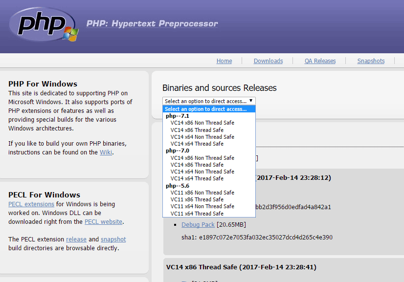
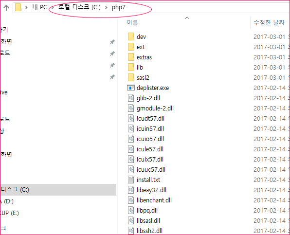
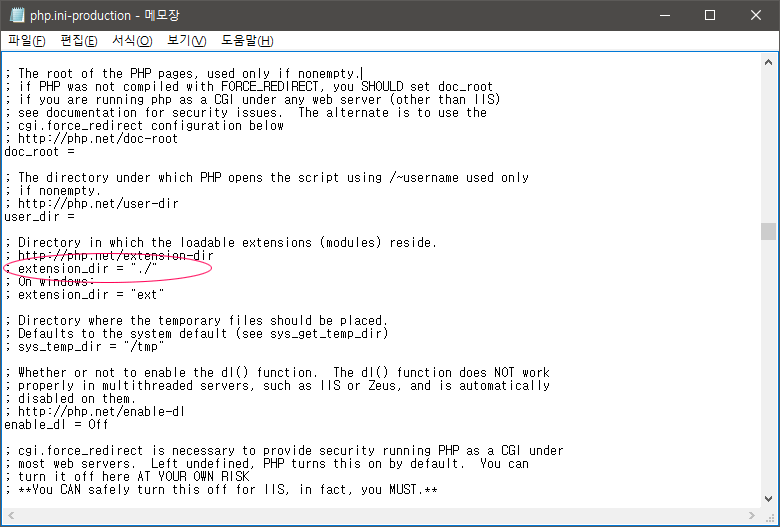
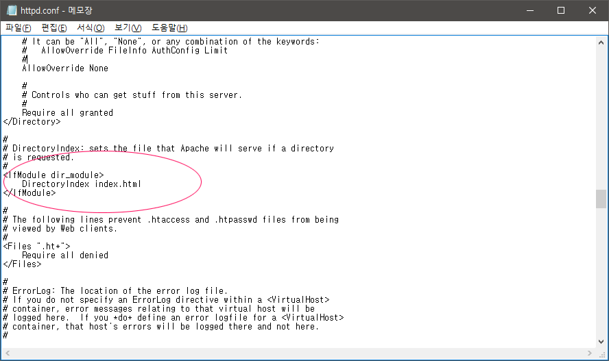
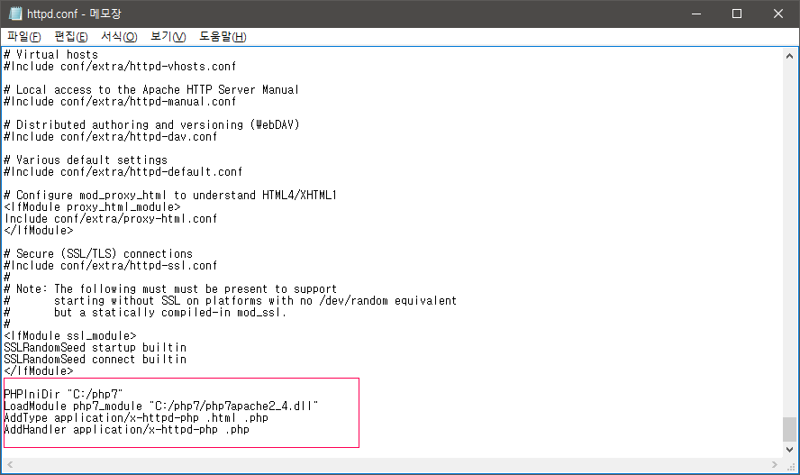
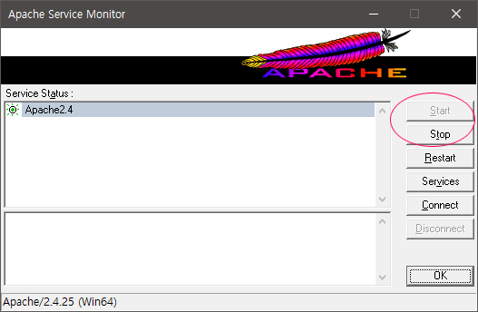
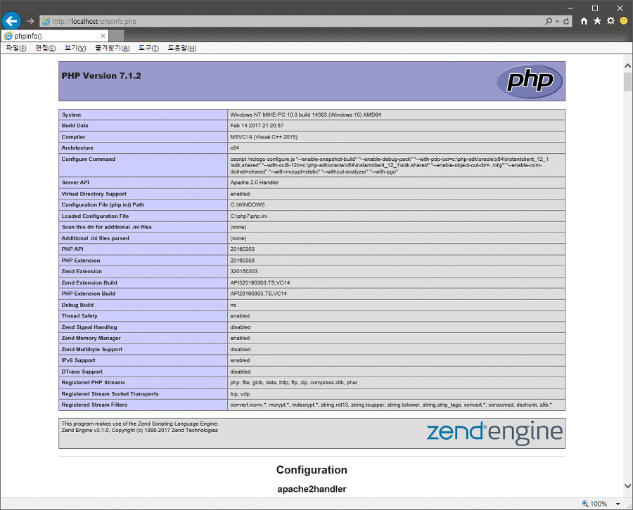
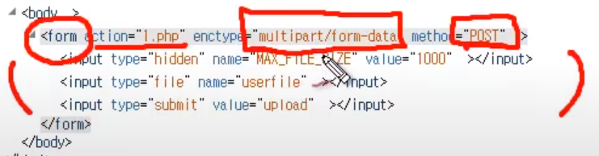

# PHP

---

## PHP설치 (다른 페이지도 참고하자!)

출처 : https://kiwinote.tistory.com/76


**윈도우10 64bit 환경 PHP-7.1.2 설치하기**

윈도우10에 PHP를 설치하기 전에 아파치(Apache) 웹 서버 설치과정은 아래 포스팅을 참조하세요.

**http://kiwinote.tistory.com/75**


**1. PHP 설치파일 다운로드**


http://windows.php.net/download/ 에 접속하여 PHP설치파일을 다운로드합니다.





php--7.1에는 4가지 선택항목이 있습니다.

**VC14 x86 Non Thread Safe** : 32bit IIS 서버

**VC14 x86 Thread Safe** :  32bit 아파치(Apache) 서버

**VC14 x64 Non Thread Safe** :  64bit IIS 서버

**VC14 x64 Thread Safe** : 64bit 아파치(Apache) 서버


본인 PC에 맞게 선택하여 Zip파일을 다운로드합니다. 본 글에서는 64bit 아파치 서버이기 때문에 **VC14 x64 Thread Safe** 을(를) 다운받습니다.


**2. 압축파일 풀기**


다운받은 PHP 압축파일을 C:\ 경로에 압축을 풀어서 이동합니다.

본 PC는 C:\PHP7 폴더를 생성하여 압축을 풀어서 옮겼습니다.





**3. PHP.ini 파일 수정**


C:\PHP7 폴더 안에 php.ini-production  파일을 메모장에서 열어서 필요한 설정을 수정합니다.

; extension_dir = "./" 라인을 찾아 앞에 ; 표시를 제거합니다.

"./" 부분에는 PHP설치경로/ext 형태로 수정합니다. (디렉토리 경로 지정은 '/'표시로 사용하세요.)

**extension_dir = "C:/php7/ext"**





수정 후 파일명을 php.ini로 변경하여 저장합니다.


- mairadb 설정

**php.ini** 에서 **extension=mysqli** 의 주석이 해제되어 있어야 하며 , **extension_dir** 에 설정되어 있는 폴더에 **php_mysqli.dll** 이 존재하여야 합니다. 이것이 첫 번째 해결 방법입니다.


**4. 아파치(Apache) 2.4와 PHP 연동 설정**


아파치가 설치된 경로에서 httpd.conf 파일을 메모장으로 열어줍니다.

**C:\Apache24/conf/httpd.conf**


아래 부분을 찾아서 DirectoryIndex에 index.php 를 추가합니다.

**<IfModule dir_module>**

  **DirectoryIndex index.php index.html**

**</IfModule>**





마지막 부분에 아래 구문을 추가한 후 저장합니다.

**PHPIniDir "C:/php7"**

**LoadModule php7_module "C:/php7/php7apache2_4.dll"**

**AddType application/x-httpd-php .html .php**

**AddHandler application/x-httpd-php .php**





**5. 아파치 서버를 재시작합니다.**


Stop -> Start 또는 Restart





**6. phpinfo 확인**


텍스트 편집기 또는 메모장에서 아래 php파일을 만들어 **C:\Apache24\htdocs** 폴더에 **phpinfo.php** 파일명으로 저장합니다.

**<?php**

**phpinfo();**

**?>**


웹브라우저에 접속하여 확인합니다.

**http://localhost/phpinfo.php**





지금까지 윈도우10 64bit 환경에서 PHP-7.1.2 설치과정을 살펴봤습니다. ^^

---

## PHP 설정 (출처 생코)

PHP.ini에서 

- display_error = On 으로 설정 (실제로 서비스 할때는 꺼야함!!)
- opcache.enable = 0 으로 설정 (1이 성능을 높히긴 하지만 개발 시 바로 적용되게 하려면 0으로 하면 좋음)

---

## PHP 함수 및 변수

- echo "blabla"
- print()
- echo "Hello"."world"       // Hello world
- strlen("Hello world")     : 몇글자인지
- nl2br : 텍스트 내의 줄바꿈을 인식하여 적용시켜주는 함수이다
- var_dump(1)      //  int(11) : 데이터타입을 알려준다 
- scandir($directory) : 폴더에 들어있는 파일 이름이 배열로 제공
- 리다이렉션 : header('Location: /index.php?id='.$_POST['title']);
- file_get_contents("경로");
- file_put_contents('data/'.$\_POST['title'], $_POST['description']);     :     어디에 뭐로 저장
- <?php echo $_GET['id']; ?> == <?=$_GET['id']?>
- rename("old.txt", "new.txt");
- unlink('test.html');
- require('lib/print.php');
- require_once('lib/print.php');
- fopen : 파일을 열어 작업한다 (읽기,쓰기 가능)
- getcwd() : 현재 실행되고 있는 파일의 폴더명을 알려준다
- chdir('../') : 주어진 경로로 폴더를 바꾼다
- scandir('주소') : 해당 주소의 디렉토리를 검색한다
- mkdir("디렉토리이름", 권한, 경로설정);
- $_FILES

- 변수는 $로 시작한다.
- Url parameter :
  $_GET['name'] , $\_GET['address']   :  url.php**?**name=blabla**&**address=서울
- 파일 업로드
  
- move_uploaded_file(파일의 경로, 이동 경로) : 임시디렉토리에서 파일디렉토리로 이동

- exit; : 더 이상 php문을 실행하지 않고 종료시킨다.

## PHP 제어문

### 조건문

if(){

}else{

}

- isset() :값이 있냐 true,false
- unset($a) : a의 값을 없엔다 


### 반복문

while(){

}

---


## 배열

array(

​	key => value,

​	key2 => value2

)


$nums = array('0', '1', '2', '3');


- count($nums) : 항목 갯수
- array_push($nums, '4', '5') : 항목 추가
- 배열함수 : https://pikabu.tistory.com/83
- print_r : 변수에 대해 사람이 읽을 수 있는 정보를 출력


## 함수

function basic(){

}

basic();


function sum($left, $right){

​	return %left+$right;

}

sum(1,2);


## form

form.html

```html
<!doctype html>
<html>
    <body>
        <form action="form.php">
            <p><input type="text" name="title" placeholder="Title"></p>
            <p><textarea name="description"></textarea></p>
            <p><input type="submit"></p>
        </form>
    </body>
</html>
```


form.php

```php
<?php
file_put_contents('data/'.$_POST['title'], $_POST['description']);
echo "<p>title : ".$_POST['title']."</p>";
echo "<p>description : ".$_POST['description']."</p>";
?>
```


## 보안 XSS

htmlspecialchars()

strip 태그 : 특정 태그만 사용할 수 있도록 혀용한다.

## 보안 파일 경로 보호

basename() : 파일 경로에서 파일 이름만 추출해주는 함수 / 주소가 아닌 파일명만 입력 할 수 있게 한다.


