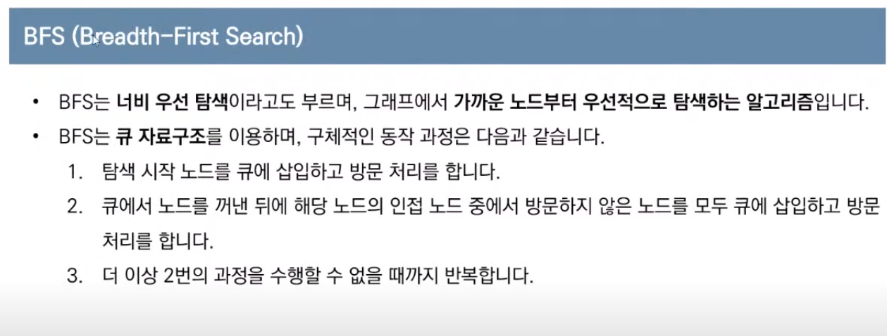

# Python for 코딩 테스트

- 코딩 테스트 문제에서 시간제한은 통상 1 ~ 5초가량이다


## 자료형

- 정수형

  ```python
  a = 1000
  print(a)
  ```

- 실수형

  ```python
  a = 1000.
  a = -7.5
  print(a)
  ```
    - 지수 표현 방식

        1e9 = 10^9
      ```python
      INF = int(1e9)   # 보통 무한을 표기할 때 쓰인다
      print(INF) 
      ```
      
  - round() 함수

       ```python
       a = 0.3 + 0.6         # 0.89999999999
       print(round(a, 2))    # 0.9 (소수 셋째 자리에서 반올림)
       ```

  - 파이썬에서 나누기 연산자(/)는 나눠진 결과를 실수형으로 반환한다

       ```python
       print(7/3)       # 2.333333333335
       ```

  -  거듭제곱

       ```python
       print(5 ** 3)     # 125
       ```

- 복소수형

- 문자열

  - 문자열 안에 큰따옴표나 작은따옴표가 포함되어야 하는 경우

    ```python
    data = "Don't you know \"Python\"?"  # 백슬래쉬 사용
    # Don't you know "Python"?
    ```

    

- 리스트

  - 리스트의 원소에 접근할 때는 인덱스 값을 괄호에 넣습니다

    (인덱스틑 0부터 시작합니다)

  - 리스트의 인덱싱과 슬라이싱

  ```python
  a = [1,2,3,4,5,6,7,8,9]
  #    0 1 2 3 4 5 6 7 8
  #   -9-8-7-6-5-4-3-2-1
  print(a[2])        # 3
  print(a[-2])       # 7
  print(a[1:5])      # [2,3,4,5]    a[1]~a[4] 까지 출력됨!!
  
  n = 10
  a = [0] * n        # [0,0,0,0,0,0,0,0,0,0]
  print(a)
  ```

  - 리스트 컴프리헨션
  ```python
  array = [i for i in range(10)]
  print(array)       # [0,1,2,3,4,5,6,7,8,9]    
  
  # 0부터 19까지의 수 중에서 홀수만 포함하는 리스트
  array = [i for i in range(20) if i % 2 == 1]
  
  # 1부터 9까지의 수들의 제곱 값을 포함하는 리스트
  array = [i * i for i in range(1,10)]
  ```

  ```python
  # N*M 크기의 2차원 리스트 초기화!!!
  n = 4
  m = 3
  array = [[0] * m for _ in range(n)] # _는 i처럼 참조할 일이 없을 때 언더바로 사용!
  print(array)  # [[0,0,0],[0,0,0],[0,0,0],[0,0,0]]
  ```

  

  - 리스트에서 특정 값의 원소를 모두 제거하기

    ```python
    a = [1,2,3,4,5,5,5]
    remove_set = {3,5}
    result = [i for i in a if i not in remove_set]
    # [1,2,4]
    ```


2차원 배열 정렬


- 튜플

  - 튜플은 한 번 선언된 값을 변경할 수 없습니다
  - 소괄호를 이용합니다

- 사전(딕셔너리)

  - 키와 값의 쌍을 데이터로 가지는 자료형

    ```python
    data = dict()
    data['사과'] = 'Apple'
    data['바나나'] = 'Banana'
    data['코코넛'] = 'Coconut'
    print(data)
    #{'사과': 'Apple','바나나': 'Banana','코코넛': 'Coconut'}
    ```

    ### 딕셔너리 쌍 추가하기

    ```
    >>> a = {1: 'a'}
    >>> a[2] = 'b'
    >>> a
    {1: 'a', 2: 'b'}
    ```

    ### 딕셔너리 요소 삭제하기

    ```
    >>> del a[1]
    >>> a
    {2: 'b', 'name': 'pey', 3: [1, 2, 3]}
    ```

  - keys()

  - values()

    ## 딕셔너리 관련 함수들

    딕셔너리를 자유자재로 사용하기 위해 딕셔너리가 자체적으로 가지고 있는 관련 함수를 사용해 보자.

    ### Key 리스트 만들기(keys)

    ```
    >>> a = {'name': 'pey', 'phone': '0119993323', 'birth': '1118'}
    >>> a.keys()
    dict_keys(['name', 'phone', 'birth'])
    ```

    a.keys()는 딕셔너리 a의 Key만을 모아서 dict_keys 객체를 돌려준다.

    

    

    **[파이썬 3.0 이후 버전의 keys 함수, 어떻게 달라졌나?]**

    파이썬 2.7 버전까지는 a.keys() 함수를 호출할 때 반환 값으로 dict_keys가 아닌 리스트를 돌려준다. 리스트를 돌려주기 위해서는 메모리 낭비가 발생하는데 파이썬 3.0 이후 버전에서는 이러한 메모리 낭비를 줄이기 위해 dict_keys 객체를 돌려준다. 다음에 소개할 dict_values, dict_items 역시 파이썬 3.0 이후 버전에서 추가된 것들이다. 만약 3.0 이후 버전에서 반환 값으로 리스트가 필요한 경우에는 `list(a.keys())`를 사용하면 된다. dict_keys, dict_values, dict_items 등은 리스트로 변환하지 않더라도 기본적인 반복(iterate) 구문(예: for문)을 실행할 수 있다.

    

    

    dict_keys 객체는 다음과 같이 사용할 수 있다. 리스트를 사용하는 것과 차이가 없지만, 리스트 고유의 append, insert, pop, remove, sort 함수는 수행할 수 없다.

    ```
    >>> for k in a.keys():
    ...    print(k)
    ...
    name
    phone
    birth
    ```

    > ※ print(k)를 입력할 때 들여쓰기를 하지 않으면 오류가 발생하니 주의하자. for문 등 반복 구문에 대해서는 03장에서 자세히 살펴본다.

    dict_keys 객체를 리스트로 변환하려면 다음과 같이 하면 된다.

    ```
    >>> list(a.keys())
    ['name', 'phone', 'birth']
    ```

    ### Value 리스트 만들기(values)

    ```
    >>> a.values()
    dict_values(['pey', '0119993323', '1118'])
    ```

    Key를 얻는 것과 마찬가지 방법으로 Value만 얻고 싶다면 values 함수를 사용하면 된다. values 함수를 호출하면 dict_values 객체를 돌려준다.

    ### Key, Value 쌍 얻기(items)

    ```
    >>> a.items()
    dict_items([('name', 'pey'), ('phone', '0119993323'), ('birth', '1118')])
    ```

    items 함수는 Key와 Value의 쌍을 튜플로 묶은 값을 dict_items 객체로 돌려준다. dict_values 객체와 dict_items 객체 역시 dict_keys 객체와 마찬가지로 리스트를 사용하는 것과 동일하게 사용할 수 있다.

    ### Key: Value 쌍 모두 지우기(clear)

    ```
    >>> a.clear()
    >>> a
    {}
    ```

    clear 함수는 딕셔너리 안의 모든 요소를 삭제한다. 빈 리스트를 [ ], 빈 튜플을 ( )로 표현하는 것과 마찬가지로 빈 딕셔너리도 { }로 표현한다.

    ### Key로 Value얻기(get)

    ```
    >>> a = {'name':'pey', 'phone':'0119993323', 'birth': '1118'}
    >>> a.get('name')
    'pey'
    >>> a.get('phone')
    '0119993323'
    ```

    get(x) 함수는 x라는 Key에 대응되는 Value를 돌려준다. 앞에서 살펴보았듯이 a.get('name')은 a['name']을 사용했을 때와 동일한 결괏값을 돌려받는다.

    다만 다음 예제에서 볼 수 있듯이 a['nokey']처럼 존재하지 않는 키(nokey)로 값을 가져오려고 할 경우 a['nokey']는 Key 오류를 발생시키고 a.get('nokey')는 None을 돌려준다는 차이가 있다. 어떤것을 사용할지는 여러분의 선택이다.

    > ※ 여기에서 None은 "거짓"이라는 뜻이라고만 알아두자.

    ```
    >>> a = {'name':'pey', 'phone':'0119993323', 'birth': '1118'}
    >>> print(a.get('nokey'))
    None
    >>> print(a['nokey'])
    Traceback (most recent call last):
      File "<stdin>", line 1, in <module>
    KeyError: 'nokey'
    ```

    딕셔너리 안에 찾으려는 Key 값이 없을 경우 미리 정해 둔 디폴트 값을 대신 가져오게 하고 싶을 때에는 get(x, '디폴트 값')을 사용하면 편리하다.

    ```
    >>> a.get('foo', 'bar')
    'bar'
    ```

    a 딕셔너리에는 'foo'에 해당하는 값이 없다. 따라서 디폴트 값인 'bar'를 돌려준다.

    ### 해당 Key가 딕셔너리 안에 있는지 조사하기(in)

    ```
    >>> a = {'name':'pey', 'phone':'0119993323', 'birth': '1118'}
    >>> 'name' in a
    True
    >>> 'email' in a
    False
    ```

    'name' 문자열은 a 딕셔너리의 Key 중 하나이다. 따라서 'name' in a를 호출하면 참(True)을 돌려준다. 반대로 'email'은 a 딕셔너리 안에 존재하지 않는 Key이므로 거짓(False)을 돌려준다.
    

- 집합 자료형

  - 중복허용x, 순서가 없다
  - 리스트 혹은 문자열을 이용해서 초기화 할 수 있다
    - set()함수 사용
    - 중괄호 안에 각 원소를 콤마를 기준으로 구분하여 삽입
  - 합집합 `a | b`
  - 교집합 `a & b`
  - 차집합 `a - b`
  - 원소추가 `add()`
  - 여러개 원소추가 `update( , )`
  - 특정 값을 가즌 원소 삭제 `remove()`
  
  
  
  ### 힙
  
  ### 
  
  


## 입출력

- input() : 한 줄의 문자열을 입력 받는 함수

- Map() :  리스트의 모든 원소에 각각특정한 함수를 적용할 때 사용

  - 공백을 기준으로 구분된 데이터를 입력 받을 때

    ```python
    # input().split()을 하면 문자열로 받는다!!
    
    list(map(int, input().split())) # 많이 입력 받을 때
    list(map(int, input().split()))[::-1] # 뒤에서 부터 읽어들임!
    a,b,c =  map(int, input().split()) # 몇 개만 입력 받을 때
    ```
  
  
  
-  2차원 배열을 입력 받을 때
  
    ```python
    '''
    3
    4
    0 0 0 0
    0 0 0 0
    0 0 0 0
    '''
    
    n = int(input())
    m = int(input())
    
    arr = []
    for i in range(n):
        arr.append(list(map(int, input().split())))
  ```
  
- 빠르게 입력 받기 (입력값이 매우 큰 경우)
  
    ```python
    import sys
    
    data = sys.stdin.readline().rstrip()
    print(data)
  ```
  
- print는 자동으로 줄 바꿈이 된다
  
  - print( 8, end=' ' )를 하면 줄 바꿈 대신 공백 하나를 하고 붙인다
  
    ```python
    print("정답은" + 7)   #오류
    print("정답은" + str(7))
    ```
  ```
  
  ```

### 형식에 맞추어 출력

**데이터를 형식에 맞추어 출력할 수 있습니다.**
이것은 print함수의 설명이라기보다 문자열의 형식을 지정하는 방법입니다. 형식화된 문자열로 만든 다음 문자열을 출력하는것 입니다. 문자열에 대해서는 자료형을 설명할 때 자세하게 설명하겠습니다.

- 이전 방식 : "출력형식"%(데이터....)

  > - 출력형식에 형식화된 문자열을 넣어 출력의 모양을 변경하는것입니다.
  > - "%형식문자"로 지정하면 % 뒤의 출력 대상들이 1:1로 대응되어 출력됩니다.
  > - %s : 문자열, %d : 정수, %f : 실수 등이 있습니다.
  > - 좀더 자세한 설명은 문자열 설명에서 하도록 하겠습니다.
  > - 예 1) %03d : 정수를 3칸에 맞추어 출력하는데 앞의 빈칸은 0으로 채워라 입니다.
  > - 예 2) %6.2f : 실수를 전체 6칸 소수이하 2칸에 맞추어 출력하라 입니다.

- 파이썬(Python) 3 포맷팅 방식 : "출력형식".format(데이터...)

  > - 출력형식에 형식화된 문자열을 넣어 출력의 모양을 변경하는것입니다.
  > - "{}" 지정하면 format에 기술한 출력 대상들이 대응되어 출력됩니다.
  > - "{n}"안에 숫자를 지정하여 출력 대상의 위치를 지정할 수 있습니다.
  > - 함수의 인자처럼 키워드를 사용해서 나타낼 수 있습니다.
  > - 동일한 데이터를 여러번 출력할 수 있습니다.

> Ex05_print5.py

```
# 형식에 맞추어 출력하기

# 이전 방식
print('나의 이름은 %s입니다'%('한사람'))
print('나의 이름은 "%s"입니다. 나이는 %d세이고 성별은 %s입니다.'%('한사람',33,'남성'))
print('나이는 %d세이고 성별은 %s입니다. 나의 이름은 "%s"입니다. '%(33,'남성','한사람'))
print('나이는 %03d세이고 신장은 %6.2f입니다. 나의 이름은 "%s"입니다. '%(33,56.789,'한사람'))
print('-' * 40)

# 파이썬(Python) 3 포맷팅 방식
print('나의 이름은 {}입니다'.format('한사람'))
print('나의 이름은 "{0}"입니다. 나이는 {1}세이고 성별은 {2}입니다.'.format('한사람',33,'남성'))
print('나이는 {1}세이고 성별은 {2}입니다. 나의 이름은 "{0}"입니다. '.format('한사람',33,'남성'))
print('나이는 {age}세이고 성별은 {gender}입니다. 나의 이름은 "{name}"입니다. '
         .format(name='한사람',age=33,gender='남성'))
print('만세삼창 :  {0}!!! {0}!!! {0}!!! '.format('만세'))
print('삼삼칠 박수 :  {0}!!! {0}!!! {1}!!! '.format('짝'*3,'짝'*7))
print('-' * 40)
```

> 실행 결과

```
나의 이름은 한사람입니다
나의 이름은 "한사람"입니다. 나이는 33세이고 성별은 남성입니다.
나이는 33세이고 성별은 남성입니다. 나의 이름은 "한사람"입니다. 
나이는 033세이고 신장은  56.79입니다. 나의 이름은 "한사람"입니다. 
----------------------------------------
나의 이름은 한사람입니다
나의 이름은 "한사람"입니다. 나이는 33세이고 성별은 남성입니다.
나이는 33세이고 성별은 남성입니다. 나의 이름은 "한사람"입니다. 
나이는 33세이고 성별은 남성입니다. 나의 이름은 "한사람"입니다. 
만세삼창 :  만세!!! 만세!!! 만세!!! 
삼삼칠 박수 :  짝짝짝!!! 짝짝짝!!! 짝짝짝짝짝짝짝!!! 
----------------------------------------
```

##  조건문

- 파이썬에서는 **코드의 블록을 들여쓰기로 지정**

```python
a = 10

if a < 7:
    print("a")
elif a < 15:
    print("b")
else:
    print("c")
    print("d")       # 같이 실행!!..
    
   
print("끝")
```


- 비교연산자

- 논리연산자

  - X and Y
  - X or Y
  - not X

- 여러 개의 데이터를 담는 자료형을 위해 `in` 연산자와 `not in` 연산자가 제공된다

  - 리스트, 튜플, 문자열, 딕셔너리 모두 사용 가능

- pass

  ```python
  a = 10
  
  if a > 5:
      pass    # 나중에 작성할 코드 혹은 비워둘때
  else:
      print("else")
  ```

  

## 반복문

- while

  ```python
  i = 1
  result = 0
  
  # i가 9보다 작거나 같은 때 아래 코드를 반복적으로 실행
  while i <= 9:
      result += i
      i += 1
      
  print(result)
  ```

- for

  - range()의 인자를 하나만 넣으면 자동으로 시작 값은 0이 된다

  ```python
  result = 0
  
  # i는 1부터 9까지의 모든 값을 순회
  for i in range(1, 10):
      result += i
      
  print(result)
  ```

  ```python
  for i in range (1, 100, 3):   #3칸씩 띄면서 반복
      print(i)                  #1,4,7,10,...
  ```

  ```python
  scores = [90, 85, 77, 65, 97]
  cheating_student_list = {2,4}
  
  for i in range(5):
      if i + 1 in cheatng_student_list:
          continue
      if scores[i] >= 80:
          print(i + 1,"번 학생은 합격입니다.")
  ```

  

## 함수

```python
def add(a ,b):
	return a + b
	
print(add(3, 7))
```

```python
def add(a ,b):
	return a + b
	
print(add(b = 3,a = 7))
```

```python
a = 8

def func():
	global a     # a가져올 떄 사용 / 리스트는 global 필요없다
    a += 7
    
func()
print(a)
```


- 파이썬에서 함수는 여러 개의 반환 값을 가질 수 있다

```python
def operator(a, b):
    return a+b, a-b, a*b, a/b

a, b, c, d = operator(3, 7)
```

## 람다

> 함수를 매우 간단하게 작성할 수 있다

```python
print((lambda a, b: a + b)(3, 5))
```

```python
list1 = [1,2,3,4,5]
list2 = [6,7,8,9,10]

result = list(map(lambda a, b: a + b, list1, list2)) 
print(result)               # [7,9,11,13,15]
```


 


## 구현

### 2차원 공간의 방향벡터


---

## DFS / BFS

- 스택 - 리스트의 `.append` `.pop` 사용


- 큐 - `.append` `.popleft` 사용


- 재귀함수


- DFS


- BFS




 


## 다양한 함수

- 알파벳 확인 함수 :`.isalpha()`

-  제곱근 함수:

  **SQRT () 메서드는 숫자 x의 제곱근을 반환합니다.**

  ```
import math
  
  ```

math.sqrt( x )
  ```
 **참고 : SQRT ()가** 직접 액세스 할 수 없습니다, 당신은 정적 객체를 통해 방법을, 수학 모듈을 가져 호출해야합니다.
  
- 리트스를 문자열로 만드는 함수 : `''.join(lsit)`  (``안의 내용으로 구분)
  ```

.title() 함수

문자열의 첫 글자를 대문자로 만들어준다


filer 함수

filter(None, lst) 사용 시 lst의 0, ' ', False를 제거한다

``` python
def compact(lst):
    return list(filter(None, lst))

compact([0,1,False,2,'',3,'a',34]) # [1,2,3,'a',34]
```


.count('x', s, e)

s ~ e 인덱스까지 x가 몇개 있는지


오른쪽에서 슬라이싱

``` py
def drop_right(a, n = 1):
	return a[:-n]

drop_right([1,2,3]) # [1, 2]
drop_right([1,2,3], 2) $ [1]
```


n의 배수마다 슬라이싱(뽑아내기)

``` py
def every_nth(lst, nth):
	return lst[nth - 1::nth]

every_nth([1,2,3,4,5,6], 2) # [2, 4, 6]
```


중복인 아이템 제거하기 / 고유한 값만 가져오기 (count > 1)

```py
from collections import Counter

def filter_non_unique(lst):
	return [item for item, count in Counter(lst).items() if count == 1]
	
filter_non_unique([1, 2, 2, 3, 4, 4, 5]) # [1, 3, 5]
```


.index 함수

리스트의 인덱스를 반환한다


가장 많이 있는 값 가져오기

``` py
def most_frequent(list):
	return max(set(list), key=list.count)

most_frequent([1,2,1,2,3,2,1,4,2]) #2
```


---

## 달팽이문제

달팽이를 만들고 타겟이 몇행 몇열인지 출력하시오

```py
dy = [1,0,-1,0]
dx = [0,1,0,-1]

n, target = map(int, input().split())
x,y,d = 0,0,0
xy = [[0] * n for _ in range(n)]
xy[0][0] = 1

for i in range(2, n * n + 1):
    print("i"+str(i))

    if x+dx[d] >= n or y+dy[d] >= n: 
        print("1")
        d += 1
        if d == 4:
            d = 0      
        x = x + dx[d]
        y = y + dy[d]
        xy[x][y] = i 

    else:
        print(xy)
        if xy[x+dx[d]][y+dy[d]] != 0:
            print("2")
            d += 1
            if d == 4:
                d = 0  

            x = x + dx[d]
            y = y + dy[d]
            xy[x][y] = i 
        else:
            x = x + dx[d]
            y = y + dy[d]
            xy[x][y] = i 
        
    print("x:"+str(x)+" y:"+str(y)+"="+str(xy[x][y])+" d="+str(d))
    
        
print(xy)

for i in range(n):
    for j in range(n):
        if xy[i][j] == target:
            print(str(x+1)+" "+str(y+1))
```

