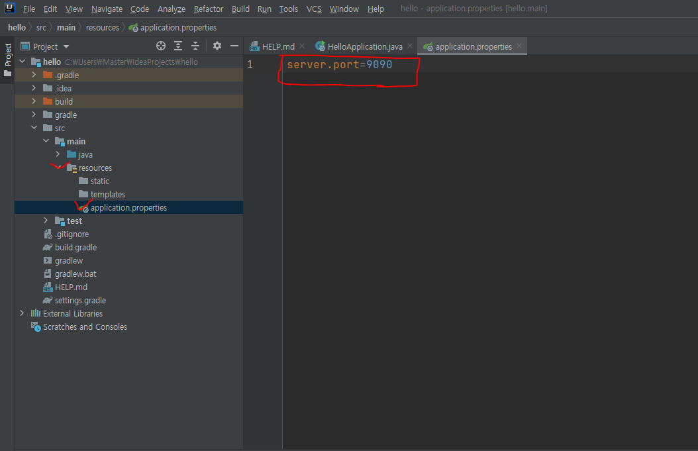

# 스프링 부트

## 서버 포트 바꾸기




---

### Spring annotation

#### meta-annotation 은 다른 annation 에서도 사용되는 annotation 의 경우를 말하며 custom-annotation 을 생성할 때 주로 사용됩니다.  

- @Target : Java compiler 가 annotation 이 어디에 적용될지 결정하기 위해 사용
  - ElementType.PACKAGE : 패키지 선언
  - ElementType.TYPE : 타입 선언
  - ElementType.ANNOTATION_TYPE : 어노테이션 타입 선언
  - ElementType.CONSTRUCTOR : 생성자 선언
  - ElementType.FIELD : 멤버 변수 선언
  - ElementType.LOCAL_VARIABLE : 지역 변수 선언
  - ElementType.METHOD : 메서드 선언
  - ElementType.PARAMETER : 전달인자 선언
  - ElementType.TYPE_PARAMETER : 전달인자 타입 선언
  - ElementType.TYPE_USE : 타입 선언  
<br/>
- @Retention :  Annotation이 실제로 적용되고 유지되는 범위
  - RetentionPolicy.RUNTIME : 컴파일 이후에도 JVM 에 의해서 계속 참조가 가능합니다. 주로 리플렉션이나 로깅에 많이 사용됩니다.
  - RetentionPolicy.CLASS : 컴파일러가 클래스를 참조할 때가지 유효합니다.
  - RetentionPolicy.SOURCE : 컴파일 전까지만 유효합니다. 즉, 컴파일 이후에는 사라지게 됩니다.  
<br/>
- @Constraint : 사용자가 원하는 Constraint와 Validation을 만들어 이를 적용할 수 있다.  
<br/>  

-  @Bean, @Configuration  
수동으로 스프링 컨테이너에 빈을 등록하는 방법
개발자가 직접 제어가 불가능한 라이브러리를 빈으로 등록할 때 불가피하게 사용
유지보수성을 높이기 위해 애플리케이션 전범위적으로 사용되는 클래스나 다형성을 활용하여 여러 구현체를 빈으로 등록 할 때 사용
1개 이상의 @Bean을 제공하는 클래스의 경우 반드시 @Configuration을 명시해 주어야 싱글톤이 보장됨
 

-  @Component  
자동으로 스프링 컨테이너에 빈을 등록하는 방법
스프링의 컴포넌트 스캔 기능이 @Component 어노테이션이 있는 클래스를 자동으로 찾아서 빈으로 등록함
대부분의 경우 @Component를 이용한 자동 등록 방식을 사용하는 것이 좋음
@Component 하위 어노테이션으로 @Configuration, @Controller, @Service, @Repository 등이 있음


- @Qualifier  
특정한 객체를 찾기위한 이름을 지정

<br/>
<br/>
보통 자바는 카멜 케이스를, JSON형식은 스테이크 케이스 방식으로 표편을 하는게 원칙입니다.
위 네모박스처럼 클라이언트와 서버단의 표현 방식이 다름에 따라 데이터의 Key가 달라지는 경우가 존재합니다.
이러한 문제를 해결할 때 @JsonProperty, @JsonNaming 어노테이션을 사용할 수 있습니다.

- @JsonProperty  
  - ()안에 postman에서 받는 body의 key라고 생각하면 쉽다.  

- @JsonNaming  
  - @JsonNaming(value = PropertyNamingStrategies.SnakeCaseStrategy.class) 와 같이 사용한다

- @ControllerAdvice, @RestControllerAdvice
  - 전역적으로 예외를 처리할 수 있는 어노테이션(aop)
  - @Rest..는 응답을 JSON으로 내려준다

- @Order
  - 컴포넌트나 빈의 로드 순서를 정의
  - Autowired 될 때 순서를 정의

- @Valid와 validation  
[(https://velog.io/@hellozin/Valid-%EC%98%88%EC%99%B8%EB%A5%BC-%EC%A0%84%EC%97%AD-%EC%BB%A8%ED%8A%B8%EB%A1%A4%EB%9F%AC%EB%A1%9C-%EA%B0%84%EB%8B%A8%ED%95%98%EA%B2%8C-%EC%B2%98%EB%A6%AC%ED%95%98%EA%B8%B0)]  
s

 - @Component  
    - 개발자가 직접 작성한 클래스를 bean 등록하고자 할 경우 사용

 - @Configuration + @Bean
    - 외부라이브러 또는 내장 클래스를 bean으로 등록하고자 할 경우 사용. 
    - 1개 이상의 @Bean을 제공하는 클래스의 경우 반드시 @Configuraton을 명시

<br/>
<br/>
<br/>
<br/>
<br/>
<br/>
<br/>
<br/>


---  
### Spring WebClient
`웹으로 API를 호출하기 위해 사용되는 Http Client 모듈 중 하나`  
Spring WebClient는 Single Thread와 Non-Blocking방식을 사용합니다.
Core 당 1개의 Thread를 이용합니다.


그림출처:&nbsp;https://luminousmen.com/post/asynchronous-programming-blocking-and-non-blocking  
<br/>
각 요청은 Event Loop내에 Job으로 등록이 됩니다.
Event Loop는 각 Job을 제공자에게 요청한 후, 결과를 기다리지 않고 다른 Job을 처리합니다.
Event Loop는 제공자로부터 callback으로 응답이 오면, 그 결과를 요청자에게 제공합니다.
WebClient는 이렇게 이벤트에 반응형으로 동작하도록 설계되었습니다.
그래서 반응성, 탄력성, 가용성, 비동기성을 보장하는 Spring React 프레임워크를 사용합니다.
또한, React Web 프레임워크인 Spring WebFlux 에서 Http Client로 사용됩니다.  

- WebClient 는 기본적으로 비동기로 작동한다. 하지만, 만약 동기로 작동하게 만들고 싶다면 block() 을 사용하면 된다.


#### Spring WebClient Error filter
https://velog.io/@ililil9482/api-server-java%EB%A1%9C-%EB%B3%80%EA%B2%BD-WebFlux-Webclient-%EC%82%AC%EC%9A%A9


---


### 스프링 리액터
1) 리액티브 스트림 이란
스프링에서는 웹요청처리, HTTP 클라이언트, NoSQL 연동 등 많은 영역에서 리액티브 프로그래밍을 지원하고 있다.
스프링 리액터는 스프링에서 리액티브 프로그래밍을 위한 핵심 모듈이다.
```
리액티브 프로그래밍은 본질적으로 함수적이면서 선언적 입니다. 즉, **순차적으로 수행되는 작업 단계를 나타낸 것이 아니라 데이터가 흘러가는 파이프라인이나 스트림을 포함합니다.** 그리고 이런 리액티브 스트림은 데이터 전체를 사용할 수 있을 때까지 가디리지 않고 사용 가능한 데이터가 있을 때마가 처리되므로 사실상 입력되는 데이터는 무한할 수 있습니다.
```
리액터를 잘 사용하려면 가장 기본이 되는 두 타입인 Flux와 Mono에 대해 알아야 한다.

서버 관점에서 리액티브를 사용하는 이유중 하나는 비동기/논블록을 이용해서 더 적은 자원으로 더 많은 트래픽을 처리 하기 위함이다.

리액티브 스트림즈(http://www.reactive-streams.org)는 비동기 스트림 처리를 위한 표준이다.
스프링 리액터는 이를 구현한 라이브러리이고, 자바9의 Flow API도 리액티브 스트림 API를 따르고 있다.

스트림을 시간이 지남에 따라 생성되는 일련의 데이터/이벤트/신호 이다.
맥락에 따라 데이터, 이벤트, 신호라는 용어를 사용한다.(여기선 주로 신호를 사용하겠다)

onNext * (onComplete | onError)? 스트림은 0개 이상의 next 신호를 발생할 수 있다.
next 신호는 데이터를 담는다.
complete 신호는 스트림이 끝났음을 의미하며, error 신호는 에러가 발생했음을 의미한다.

리액티브 스트림즈는 Publisher를 이용해서 스트림을 정의하며 Subscriber를 이용해서 발생한 신호를 처리한다.
Subscriber가 Publisher로부터 신호를 받는 것을 구독이라고 한다. 다음 코드는 스프링 리액터가 제공하는 Publisher의 한 종류인 Flux에 대해 구독하는 코드 예를 보여준다.
```
Flux<Integer> seq = Flux.just(1, 2, 3); // Integer 값을 발생하는 Flux 생성
seq.subscribe(value -> System.out.println("데이터 : " + value)); // 구독
```
리액터는 스트림이라는 용어 대신 시퀀스라는 용어를 주로 사용한다.
위 코드에서 변수 이름이 seq인 이유는 시퀀스를 의미하기 위함이다.
첫 줄은 1, 2, 3 값을 차례대로 발생하는 Flux를 생성한다.

실제 값 발생은 구독(subscription) 시점에 이뤄진다.
위 코드는 Flux#subscribe(Consumer) 메서드를 이용해서 구독한다.
이 경우 Flux가 발생한 신호를 Consumer가 받아서 처리한다.
위 코드는 수신한 데이터를 콘솔에 출력하므로 위 코드를 실행하면 다음과 같은 결과가 출력된다.
```
데이터 : 1
데이터 : 2
데이터 : 3
```
tip
리액티브 스트림즈는 스트림이라는 표현을 사용하지만 이는 자바 8의 스트림과 혼동할 수 있다. 이런 이유로 "리액티브 스트림즈" 자체를 표현할 때가 아니면 스트림 대신 시퀀스라는 용어를 사용하겠다.


<br/>
<br/>
<br/>

### Swagger
Swagger 는 OAS(Open Api Specification)를 위한 프레임워크입니다.

개발자들의 필수 과제인 API 문서화를 쉽게 할 수 있도록 도와주며, 파라미터를 넣어서 실제로 어떤 응답이 오는지 테스트도 할 수 있습니다.

또한, 협업하는 클라이언트 개발자들에게도 Swagger 만 전달해주면 API Path 와 Request, Response 값 및 제약 등을 한번에 알려줄 수 있습니다.


https://springdoc.org/v2/#features  


<br/>
<br/>

### Spring MVC Stack - WebFlux/WebClient Logging with Reactor Context + MDC

Reactor Context
Reactor Context는 스트림을 따라 전달되는 인터페이스이며, Map과 유사하게 key/value store 구조이다.

Runtime 단계에서 필요한 Context 정보에 엑세스 할 수 있도록 하는 것이다.

즉, 스트림에 Context를 제공할 수 있는 유일한 방법일 뿐만 아니라, 조립/구독 단계를 포함해 전체 런타임 동안 사용 할 수 있는 데이터를 동적으로 제공

전체 생명 주기 중에서 각 Subscriber에게 별도의 컨텍스트가 제공될 수 있는 유일한 단계는 '구독단계'이다

Reactor With MDC
**MDC 는 JAVA 로깅 프레임워크(logback, log4j 등) 에서 제공하는 로그 관련 라이브러리에서 여러 메타 정보를 넣을 수 있고 공유되는 Map으로 key, value 형식으로 저장하고 사용 가능하도록 하는 기능**이며, 가장 많이 활용하는 것은 바로 요청에 대한 식별을 통해 로그를 쉽게 추출할 수 있습니다.

그러나 대부분의 MDC 동작은 단일 Thread에서만 정상 동작하고, Thread가 바뀌는 경우 일관성 있는 데이터를 전달 할 수 없다.

그렇기 때문에, Weflux를 사용하여 Asynchronous/Nonblock 기반으로 스트림을 처리할 경우, 수십번의 Thread의 변경이 일어 날 수 있다.

 

그렇기 때문에, Context 변경이 일어날 때마다 MDC를 복사하여, 로깅 추적이 가능하도록 설정해 주면 로그를 통해 쉽게 추적 및 추출이 가능하다.

---

## JAVA

- volatile  
Main Memory에 read & write를 보장하는 키워드.  
    - 상황?
      - 하나의 Thread가 write하고 나머지 Thread가 읽는 상황인 경우.
      - 변수의 값이 최신의 값으로 읽어와야 하는 경우.
    - 주의할 점?
      - 성능에 영향이 어느 정도 영향을 줄 수 있는 Point라는 점.  


- Optional  
'null일 수도 있는 객체'를 감싸는 일종의 Wrapper 클래스입니다.

  1) Optional 객체 생성  
  Optional<User> result = userRepository.findById(userId);

  2) Optional 객체 접근  
  
```
if(result.isPresent()) {
                return result.get();
            }else{
                return result.orElse(null);
```

  - get() : Optional 내부에 담긴 객체를 반환합니다. 만약, null인 객체라면 NoSuchElementException이 발생합니다. 따라서, isPresent() 로 체크한 후에 이 get 메서드를 사용

  - orElse(): 있으면 값을 반환하고, 그렇지 않으면 다른 값을 반환


  ---

### SOLID 원칙

객체지향 설계원칙
객체지향 설계5대 원칙이라 부르는데 SRP(단일 책임 원칙), OCP(개방-폐쇄 원칙), LSP(리스코프 치환 원칙), ISP(인터페이스 분리 원칙), DIP(의존 역전 원칙)을 말하고 앞자를 따서 SOILD 원칙이라고 부른다.  

1. 단일 책임 원칙 (Single Responsiblity Principle)
모든 클래스는 각각 하나의 책임만 가져야 한다. 클래스는 그 책임을 완전히 캡슐화해야 함을 말한다.

사칙연산 함수를 가지고 있는 계산 클래스가 있다고 치자. 이 상태의 계산 클래스는 오직 사칙연산 기능만을 책임진다. 이 클래스를 수정한다고 한다면 그 이유는 사직연산 함수와 관련된 문제일 뿐이다.  

2. 개방-폐쇄 원칙 (Open Closed Principle)
확장에는 열려있고 수정에는 닫혀있는. 기존의 코드를 변경하지 않으면서( Closed), 기능을 추가할 수 있도록(Open) 설계가 되어야 한다는 원칙을 말한다.

캐릭터를 하나 생성한다고 할때, 각각의 캐릭터가 움직임이 다를 경우 움직임의 패턴 구현을 하위 클래스에 맡긴다면 캐릭터 클래스의 수정은 필요가없고(Closed) 움직임의 패턴만 재정의 하면 된다.(Open)  

3. 리스코프 치환 원칙 (Liskov Substitution Principle)
자식 클래스는 언제나 자신의 부모 클래스를 대체할 수 있다는 원칙이다. 즉 부모 클래스가 들어갈 자리에 자식 클래스를 넣어도 계획대로 잘 작동해야 한다.

자식클래스는 부모 클래스의 책임을 무시하거나 재정의하지 않고 확장만 수행하도록 해야 LSP를 만족한다.  

4. 인터페이스 분리 원칙 (Interface Segregation Principle)
한 클래스는 자신이 사용하지않는 인터페이스는 구현하지 말아야 한다. 하나의 일반적인 인터페이스보다 여러개의 구체적인 인터페이스가 낫다.

5. 의존 역전 원칙 (Dependency Inversion Principle)
의존 관계를 맺을 때 변화하기 쉬운 것 또는 자주 변화하는 것보다는 변화하기 어려운 것, 거의 변화가 없는 것에 의존하라는 것이다. 한마디로 구체적인 클래스보다 인터페이스나 추상 클래스와 관계를 맺으라는 것이다.

---

### [Spring] 의존성 주입(DI) 3가지 방법 (https://dev-coco.tistory.com/70)