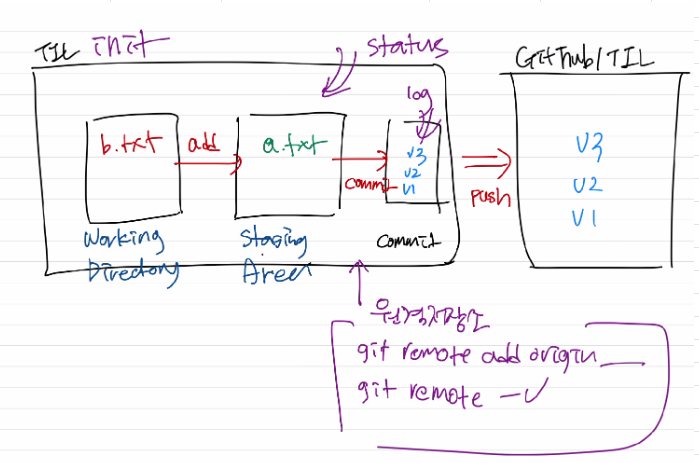
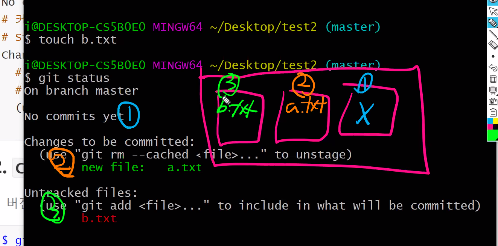
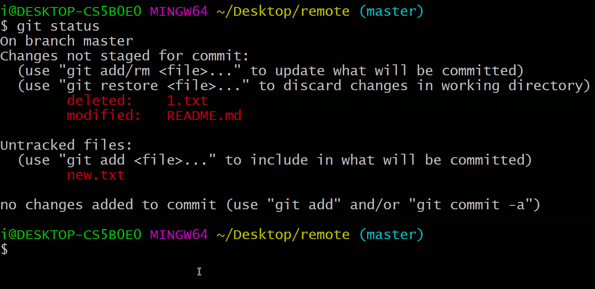
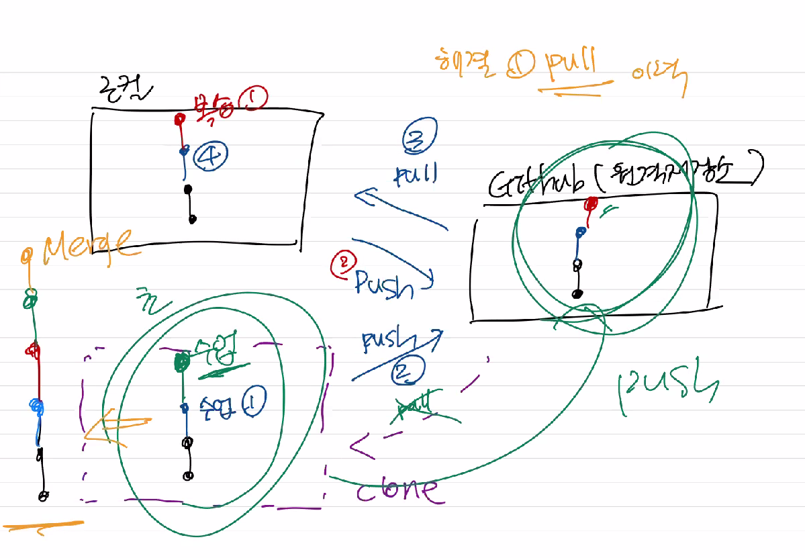
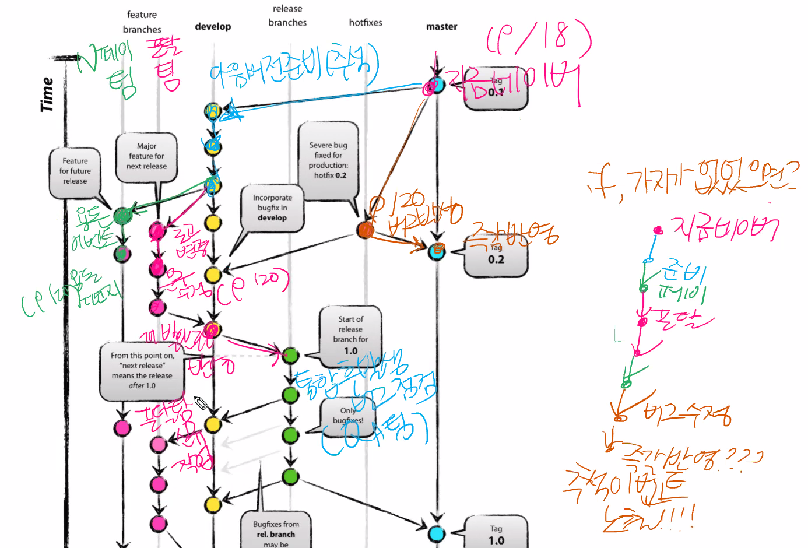

# Git

> Git은 **분산형 버전관리시스템(DVCS)** 중 하나이다.


## Git 사전 준비

 #### 1. [Github](https://github.com/) 가입

* 이메일 인증을 해야한다

#### 2. [git bash (git for windows)](https://gitforwindows.org/) 다운

#### 3.[GitHub Student Developer Pack](https://education.github.com/pack) 받기

* @edu @ac.kr 이메일이 있으면(대학교), 무료로 한단계 높은 버전 제공
* 다른 이메일 등록하신 분들도 추가로 하실 수가 있다.


---

> git을 사용하기 전에 커밋을 남기는 사람에 대한 정보를 설정(최초)    
>
> *  {여기안에는 변수를 쓴다} 

```bash
$ git config --global user.name '{username}'
$ git config --global user.email '{email}' 
```

* 추후에 commit을 하면, 작성한 사람(author)로 저장된다.

* email 정보는 github에 등록된 이메일로 설정을 하는 것을 추천 (잔디밭)

* 설정 내용을 확인하기 위해서는 아래의 아래의 명령어를 입력한다.

  ```bash
  $ git config --global -l
  user.name=KimJaeHyun52
  user.email=kjhkjh5265@smail.kongju.ac.kr
  ```


## 기초흐름

> 작업->add->commit
>
> 


### 0. 저장소 설정

```bach
$ git init
Initialized empty Git repository in C:/Users/Master/Desktop/test2/.git/
```

* git 저장소를 만들게 되면 해당 디렉토리 내에 `.git/` 폴더가 생성
* git bach에서는 `(master)` 로 현재 작업중인 브랜치가 표기 된다.

## 1. `add`

> 커밋을 위한 파일 목록(staging area)

```bash
$ git add .          # 현재 디렉토리의 모든 파일 및 폴더
$ git add a.txt      # 특정 파일
$ git add md-images/ # 특정 폴더
```

## 2. `commit`

> **버전**을 기록(스냅샷)

```bash
$ git commit -m '커밋메시지'
```

* 커밋 메시지는 현재 버전을 알 수 있도록 명확하게 작성한다.
* 커밋 이력을 남기기 확인하기 위해서는 아래의 명령어를 입력한다.

```bash
$ git log
$ git log -1 # 최근 한개의 버전
$ git log --oneline # 한줄로 간단하게 표현
$ git log -1 --oneline
```

## status - 상태 확인

> git에 대한 모든 정보는 status에서 확인할 수 있다.

```bash
$ git status
# master 브랜치에 있다
On branch master

No commits yet
  # unstage를 하기 위해서.... 명령어
  # working directory 단계
Changes to be committed:
  (use "git rm --cached <file>..." to unstage)
        new file:   a.txt
# 트래킹 x 파일들
# git으로 아직 관리를 x
# working directory 단계
Untracked files:
  (use "git add <file>..." to include in what will be committed)
        b.txt

```




## git status

- git file status는 생성 / 변경 / 삭제가 있다

  ```bash
  On branch master
  # 2) 
  Changes not staged for commit:
    (use "git add/rm <file>..." to update what will be committed)
    (use "git restore <file>..." to discard changes in working directory)
          deleted:    1.txt
          modified:   README.md
  # 1) untracked
  Untracked files:
    (use "git add <file>..." to include in what will be committed)
          new.txt
  
  no changes added to commit (use "git add" and/or "git commit -a")
  
  ```

  * working directory
    * untracked - 깃이 관리하지 않고 있는 파일
      * 파일 생성(new file) 등
    * tracked - 이전 커밋에 포함된 적 있는 파일
      * modified - modified / deleted
      * unmodified - 수정 X (status에 안 뜸)

  

---


## 원격 저장소 활용하기

> 원격 저장소를 제공하는 서비스는 github, gitlab, bitbucket 등이 있다.

### 1. 원격 저장소 사용하기

```bash
$ git remote add origin {URL}
```

* 깃아, 원격(remote)저장소로 추가해줘(add) origin이라는 이름으로 URL을

  * origin 자리에는 remote의 이름이 들어가며 관례 상 origin을 사용한다.

* 원격저장소 삭제하기 위해서는 아래의 명령어를 사용한다.

  ```bash
  $ git remote rm origin
  ```


### 2. 원격 저장소 확인하기

```bash
$ git remote -v
origin  https://github.com/KimJaeHyun52/TIL.git (fetch)
origin  https://github.com/KimJaeHyun52/TIL.git (push)
```

### 3. push

```bash
$ git push origin master
```


## 원격저장소(remote repository) 활용




### 충돌상황

- 원격 저장소의 이력과 로컬 저장소의 이력이 다르다.

```bash
$ git push origin master
To https://github.com/KimJaeHyun52/remote.git
 ! [rejected]        master -> master (fetch first)
# 에러!
error: failed to push some refs to
# rejected(거절) - 원격저장소의 작업이 로컬에 없다.
'https://github.com/KimJaeHyun52/remote.git'
hint: Updates were rejected because the remote contains work that you do
hint: not have locally. This is usually caused by another repository pushing
# 너는 원할거 같다.. 원격저장소의 변경사항을 먼저 통합(integrate) 다시 push하기 전에
hint: to the same ref. You may want to first integrate the remote changes
hint: (e.g., 'git pull ...') before pushing again.
hint: See the 'Note about fast-forwards' in 'git push --help' for details.

```

- 상황 파악 방법

  1. 원격저장소의 log를 확인한다.
  2. 로컬의 log를 확인한다.
  3.  pull을 한다.

- 해결 방법

  ```bash
  $ git pull origin master
  ```

  - 이렇게 하면, vim 창으로 커밋 메시지를 작성하도록 뜬다.
  
  - 자동으로 작성된 커밋메시지를 확인하고 , `:wq `로 저장하고 나간다.
  
  - 그 이후 log를 확인하고, push를 한다.
  
    ```bash
    $ git log --oneline
    9becb7f (HEAD -> master) Merge branch 'master' of https://github.aster
    ff12057 로컬에서 작업함
    98e57d9 (origin/master) Create remote.txt
    548230d Update
    a526519 Update
    bb71743 Add README
    ```



---


## 외부 컴퓨터에서 원격저장소 접근

```bash
# 클론 만들기 전에 config 설정!!
$ git config --global user.name 'KimJaeHyun52'
$ git config --global user.email 'kjhkjh5265@smail.kongju.ac.kr'
$ git clone https://github.com/KimJaeHyun52/remote.git
# git init은 하지 않는다.
$ cd remote
```

- 자리 옮길때 자격 증명 관리자에서 깃헙 인증 제거해라!

---


## Branch 기초 명령어

* 브랜치 생성

  ```bash
  $ git branch {브랜치이름}
  ```

* 브랜치 목록

  ```bash
  $ git branch
  * master
    test
  ```

* 브랜치 이동

  ```bash
  $ git checkout test
  Switched to branch 'test'
  (test) $
  ```

* 브랜치 생성 및 이동

  ```bash
  $ git checkout -b test2
  Switched to a new branch 'test2'
  (test2) $
  ```

* 브랜치 병합

  ```bash
  $ git merge test2
  Updating cf28034..3888136
  Fast-forward
   test2.txt | 0
   1 file changed, 0 insertions(+), 0 deletions(-)
   create mode 100644 test2.txt
  ```

* 브랜치 삭제

  ```bash
  $ git branch -d test2
  Deleted branch test2 (was 3888136).
  ```

- 브랜치 협업



## branch_scenario

### 상황 1. fast-foward

> fast-foward는 feature 브랜치 생성된 이후 master 브랜치에 변경 사항이 없는 상황

1. feature/test branch 생성 및 이동

   ```bash
   $ git checkout -b feature/test
   (feature/test)
   ```

2. 작업 완료 후 commit

   ```bash
   $ touch test.html
   $ git add .
   $ git commit -m 'Complete test'
   $ git log --oneline
   a210f36 (HEAD -> feature/test) Complete test
   3888136 (master) Complete Test2
   cf28034 Init
   ```


3. master 이동

   ```bash
   $ git checkout master
   Switched to branch 'master'
   (master) $
   ```


4. master에 병합

   ```bash
   $ git merge feature/test
   Updating 3888136..a210f36
   # Fast-foward!!!!
   Fast-forward
    test.html | 0
    1 file changed, 0 insertions(+), 0 deletions(-)
    create mode 100644 test.html
   ```


5. 결과 -> fast-foward (단순히 HEAD를 이동)

   ```bash
   $ git log --oneline
   a210f36 (HEAD -> master, feature/test) Complete test
   3888136 Complete Test2
   cf28034 Init
   ```

6. branch 삭제

   ```bash
   $ git branch -d feature/test
   Deleted branch feature/test (was a210f36).
   ```

---

### 상황 2. merge commit

> 서로 다른 이력(commit)을 병합(merge)하는 과정에서 다른 파일이 수정되어 있는 상황
>
> git이 auto merging을 진행하고, commit이 발생된다.

1. feature/signout branch 생성 및 이동

   ```bash
   $ git checkout -b feature/signout
   ```

2. 작업 완료 후 commit

   ```bash
   $ touch signout.html
   $ git add .
   $ git commit -m 'Complete signout'
   $ git log --oneline
   $ git log --oneline
   f700edb (HEAD -> feature/signout) Complete signout
   a210f36 (master) Complete test
   3888136 Complete Test2
   cf28034 Init
   ```

3. master 이동

   ```bash
   $ git checkout master
   $ git log --oneline
   a210f36 (HEAD -> master) Complete test
   3888136 Complete Test2
   cf28034 Init
   ```

4. *master에 추가 commit 이 발생시키기!!*

   * **다른 파일을 수정 혹은 생성하세요!**

     ```bash
     $ touch hotfix.html
     $ git add .
     $ git commit -m 'Hotfix'
     $ git log --oneline
     801facc (HEAD -> master) Hotfix
     a210f36 Complete test
     3888136 Complete Test2
     cf28034 Init
     ```

5. master에 병합

   ```bash
   $ git merge feature/signout
   
   Merge made by the 'recursive' strategy.
    signout.html | 0
    1 file changed, 0 insertions(+), 0 deletions(-)
    create mode 100644 signout.html
   ```

6. 결과 -> 자동으로 *merge commit 발생*

   * vim 편집기 화면이 나타납니다.
   
   * 자동으로 작성된 커밋 메시지를 확인하고, `esc`를 누른 후 `:wq`를 입력하여 저장 및 종료를 합니다.
      * `w` : write
      * `q` : quit
      
   * 커밋이  확인 해봅시다.
   
7. 그래프 확인하기

   ```bash
   $ git log --oneline --graph
   *   e84912e (HEAD -> master) Merge branch 'feature/signout' into master
   |\
   | * f700edb (feature/signout) Complete signout
   * | 801facc Hotfix
   |/
   * a210f36 Complete test
   * 3888136 Complete Test2
   * cf28034 Init
   ```

8. branch 삭제

   ```bash
   $ git branch -d feature/signout
   Deleted branch feature/signout (was f700edb).
   ```

---

### 상황 3. merge commit 충돌

> 서로 다른 이력(commit)을 병합(merge)하는 과정에서 동일 파일이 수정되어 있는 상황
>
> git이 auto merging을 하지 못하고, 해당 파일의 위치에 라벨링을 해준다.
>
> 원하는 형태의 코드로 직접 수정을 하고 merge commit을 발생 시켜야 한다.

1. feature/board branch 생성 및 이동

   ```bash
   $ git checkout -b feature/board
   ```

   

2. 작업 완료 후 commit

   ```bash
   $ touch board.html
   # README.md 파일을 열어서 자유롭게 수정
   $ git status
   On branch feature/board
   Changes not staged for commit:
     (use "git add <file>..." to update what will be committed)
     (use "git restore <file>..." to discard changes in working directory)
     # 1) 동일파일 수정
           modified:   README.md
   
   Untracked files:
     (use "git add <file>..." to include in what will be committed)
     # 2) 신규 작업
           board.html
   
   no changes added to commit (use "git add" and/or "git commit -a")
   $ git add .
   $ git commit -m 'board & README'
   $ git log --oneline
   dc27342 (HEAD -> feature/board) board & README
   e84912e (master) Merge branch 'feature/signout' into master
   801facc Hotfix
   f700edb Complete signout
   a210f36 Complete test
   3888136 Complete Test2
   cf28034 Init
   ```


3. master 이동

   ```bash
   $ git checkout master
   ```


4. *master에 추가 commit 이 발생시키기!!*

   * **동일 파일을 수정 혹은 생성하세요!**

   ```bash
   # README를 수정하고
   $ git add .
   $ git commit -m 'Update README'
   $ git log --oneline
   e9af78e (HEAD -> master) Update README
   e84912e Merge branch 'feature/signout' into master
   801facc Hotfix
   f700edb Complete signout
   a210f36 Complete test
   3888136 Complete Test2
   cf28034 Init
   ```

5. master에 병합

   ```bash
   $ git merge feature/board
   # 자동 병합을 하고 있는데..
   Auto-merging README.md
   # 충돌!
   CONFLICT (content): Merge conflict in README.md
   Automatic merge failed; 
   # 충돌을 고치고, 결과를 커밋하세요.
   fix conflicts and then commit the result.
   (master|MERGING) $
   ```


6. 결과 -> *merge conflict발생*

   ```bash
   $ git status
   On branch master
   # 병합되지 않은 파일들이 있습니다.
   You have unmerged paths.
   # 충돌을 고치고, commit 하세요.
     (fix conflicts and run "git commit")
   # 병합을 취소하려면 
     (use "git merge --abort" to abort the merge)
   # staging area 
   # -> 충돌나지 않은 파일
   Changes to be committed:
           new file:   board.html
   # 유사 Working directory...
   # -> 충돌난 파일
   Unmerged paths:
     # 해결하고 add하세요!!!
     (use "git add <file>..." to mark resolution)
           both modified:   README.md
   ```


7. 충돌 확인 및 해결

   ```bash
   # 충돌 해결하고
   $ git add .
   ```


8. merge commit 진행

    ```bash
    $ git commit
    ```

   * vim 편집기 화면이 나타납니다.
   
   * 자동으로 작성된 커밋 메시지를 확인하고, `esc`를 누른 후 `:wq`를 입력하여 저장 및 종료를 합니다.
      * `w` : write
      * `q` : quit
      
   * 커밋이  확인 해봅시다.
   
9. 그래프 확인하기

    ```bash
   $ git log --oneline --graph
   *   63580b1 (HEAD -> master) Merge branch 'feature/board' into master
   |\
   | * dc27342 (feature/board) board & README
   * | e9af78e Update README
   |/
   *   e84912e Merge branch 'feature/signout' into master
   |\
   | * f700edb Complete signout
   * | 801facc Hotfix
   |/
   * a210f36 Complete test
   * 3888136 Complete Test2
   * cf28034 Init
   ```


10. branch 삭제

    ```bash
    $ git branch -d feature/board
    Deleted branch feature/board (was dc27342).
    ```


## Git 명령어 취소

1. `add` 취소

   ```bash
   $ git restore --staged <파일명> # 최신
   $ git reset HEAD <파일명>       # 구버전(작년)
   ```

   ```bash
   $ git status
   On branch master
   Changes to be committed:
    # unstage.. add를 취소하려면
    # git restore --staged
     (use "git restore --staged <file>..." to unstage)
           new file:   a.txt
           new file:   b.txt
   ```

   ```bash
   $ git restore --staged b.txt
   $ git status
   On branch master
   Changes to be committed:
     (use "git restore --staged <file>..." to unstage)
           new file:   a.txt
   
   Untracked files:
     (use "git add <file>..." to include in what will be committed)
           b.txt
   ```

2. `commit` 메시지 변경

   > 주의! 커밋 메시지를 변경하면, hash 값이 변경된다.
   >
   > 즉, 공개된 저장소에 `push`를 한 이후에는 하지 않는다.

   ```bash
   $ git commit --amend
   ```

   * vim 편집기 창에서 직접 메시지를 수정하고 저장

     ```bash
     $ git log --oneline
     03ca0cb (HEAD -> master) c.txt 추가
     538d35d Add b.txt
     3867506 Add a.txt
     76b305f README
     
     $ git commit --amend
     [master 30ca836] Add c.txt
      Date: Fri Sep 18 16:12:38 2020 +0900
      1 file changed, 0 insertions(+), 0 deletions(-)
      create mode 100644 c.txt
     
     $ git log --oneline
     30ca836 (HEAD -> master) Add c.txt
     538d35d Add b.txt
     3867506 Add a.txt
     76b305f README
     ```

3. 커밋 변경

   > 주의! 커밋 메시지를 변경하면, hash 값이 변경된다.
   >
   > 즉, 공개된 저장소에 `push`를 한 이후에는 하지 않는다.
   >
   > 2번과 동일한 명령어

   * 예) 내가 어떠한 파일을 빠뜨리고 커밋 했을 때

       ```bash
   $ touch d.txt
       $ touch omit.txt
       $ git add d.txt
       $ git commit -m 'Add d&omit'
       $ git status
       On branch master
       Untracked files:
         (use "git add <file>..." to include in what will be committed)
               omit.txt
       
       nothing added to commit but untracked files present (use "git add" to track)
       ```

   * 해결 방법

     ```bash
     $ git add omit.txt
     $ git status
     On branch master
     Changes to be committed:
       (use "git restore --staged <file>..." to unstage)
             new file:   omit.txt
     $ git commit --amend
     [master 7844532] Add d & omit
      Date: Fri Sep 18 16:20:18 2020 +0900
      2 files changed, 0 insertions(+), 0 deletions(-)
      create mode 100644 d.txt
      # 들어가있죠!
      create mode 100644 omit.txt
     $ git status
     On branch master
     nothing to commit, working tree clean
     ```

     

4. `working directory` 변경사항 삭제

   > 주의! 아래의 명령어를 입력하면 절대 과거로 돌아갈 수는 없다.
   > 커밋한 내용만 복구 가능!

   ```bash
   $ git restore <파일명>
   ```

   ```bash
   $ git status
   On branch master
   Changes not staged for commit:
     (use "git add/rm <file>..." to update what will be committed)
     # WD 있는 변경사항들을(changes) 버리기 위해서는...
     # git restore <파일>
     (use "git restore <file>..." to discard changes in working directory)
           deleted:    README.md
           deleted:    a.txt
           deleted:    b.txt
           deleted:    c.txt
           deleted:    d.txt
           deleted:    omit.txt
   
   no changes added to commit (use "git add" and/or "git commit -a")
   ```

   ```bash
   $ git restore .
   $ git status
   On branch master
   nothing to commit, working tree clean
   ```

   

## 이력 되돌리기 (reset vs revert)

* 두 명령어는 특정 시점의 상태로 커밋을 되돌리는 작업을 한다.

* `reset` : 이력을 삭제

  * `--mixed` : (default) 해당 커밋 이후 변경사항을 보관
  * `--hard` : 해당 커밋 이후 변경사항을 모두 삭제 (주의!)
  * `--soft` : 해당 커밋 이후 변경사항 및 WD 내용까지 보관

  ```bash
  $ git log --oneline
  da0ae77 (HEAD -> master) Update README
  7844532 Add d & omit
  30ca836 Add c.txt
  $ git reset 7844532
  $ git log --oneline
  7844532 (HEAD -> master) Add d & omit
  30ca836 Add c.txt
  ```

* `revert` : 되돌렸다는 이력을 남긴다.

  ```bash
  $ git revert 7844532
  Removing omit.txt
  Removing d.txt
  [master f050b8e] Revert "Add d & omit"
   2 files changed, 0 insertions(+), 0 deletions(-)
   delete mode 100644 d.txt
   delete mode 100644 omit.txt
  $ git log --oneline
  f050b8e (HEAD -> master) Revert "Add d & omit"
  7844532 Add d & omit
  30ca836 Add c.txt
  ```

## Stash

> 지금까지 작업했던 내용을 임시적으로 저장하는 공간

### 기본 명령어

* stash 보관

  ```bash
  $ git stash
  ```

* stash 반영

  ```bash
  $ git stash pop # 반영 + 삭제
  # $ git stash apply - 반영
  # $ git stash drop - 삭제
  ```

* stash 목록

  ```bash
  $ git stash list
  # 0974aba 커밋에서 마스터 브랜치에서 작업중인 내용을 보관 중
  stash@{0}: WIP on master: 0974aba Merge pull request #1 from edutak/feature/chatting
  ```

  

### 상황

```bash
$ git pull origin master
remote: Enumerating objects: 8, done.
remote: Counting objects: 100% (7/7), done.
remote: Compressing objects: 100% (4/4), done.
remote: Total 4 (delta 1), reused 0 (delta 0), pack-reused 0
Unpacking objects: 100% (4/4), 1.34 KiB | 76.00 KiB/s, done.
From https://github.com/edutak/branch
 * branch            master     -> FETCH_HEAD
   0974aba..02b022d  master     -> origin/master
# 에러
# 로컬 변경사항이, 지금 덮어씌어질 수 있다.
error: Your local changes to the following files would be overwritten by merge:
        README.md
# 1) 커밋을 하거나, 
# 2) stash를 해서 merge!!!!!!!!
Please commit your changes or stash them before you merge.
Aborting
Updating 0974aba..02b022d
```

```bash
# 1. 작업 중이었는데,, 그래서 안되었는데
$ git status
On branch master
Your branch is behind 'origin/master' by 3 commits,
  (use "git pull" to update your local branch)

Changes not staged for commit:
  (use "git add <file>..." to update what will be co
  (use "git restore <file>..." to discard changes in
        modified:   README.md

no changes added to commit (use "git add" and/or "gi

# 2. 임시공간(stash)에 넣어놓고
$ git stash
Saved working directory and index state WIP on mastefrom edutak/feature/chatting

# 3. WD 깨끗해졌고,
$ git status
On branch master
Your branch is behind 'origin/master' by 3 commits,
  (use "git pull" to update your local branch)

nothing to commit, working tree clean

# 4. pull을 받는다.
$ git pull origin master
From https://github.com/edutak/branch
 * branch            master     -> FETCH_HEAD
Updating 0974aba..02b022d
Fast-forward
 README.md | 2 ++
 ff.txt    | 0
 2 files changed, 2 insertions(+)
 create mode 100644 ff.txt
 
# 5. stash에서 꺼낸다.
$ git stash pop
Auto-merging README.md
# 원격에서 받아온 거랑 작업 내용이 달라서,
CONFLICT (content): Merge conflict in README.md
The stash entry is kept in case you need it again.

# 6. 충돌난 것을 확인하고, 고친다.
# 7. 그리고 작업을 이어나간다.
```

* 예시)

  ```
  <<<<<<< Updated upstream    # pull 받은 내용
  * 친구가 수정했는데,
  * 이 내용을 포함해서 개발을 해나가야함...
  =======
  * 작성작성
  * 코드작업
  * 우와와와
  >>>>>>> Stashed changes     # 임시공간에 있던 내용
  ```


---

Git 충돌(conflict) / vscode를 병합(merge)도구로 사용하기

https://yasic-or-nunch.tistory.com/65

---


## 기존 원격저장소에서 다른 원격저장소로 프로젝트 이관하기

```
git clone --mirror {기존 원격 repo}

만들어진 폴더 들어가서
git remote set-url --push origin {이후 원격 repo}
git push --mirror
(push 에러가 난다면 gitlab의 project에서 Settings에서 Repository - Protected branches의 Allow force push를 체크한다)
```

## 다른 repository에서 프로젝트 가져오기

```
$ git remote add <병합할 저장소 이름> <병합할 저장소 주소>
$ git fetch <병합할 저장소 이름>
$ git merge --allow-unrelated-histories <병합할 저장소 이름>/<병합하고 싶은 branch 이름>
$ git remote remove <병합할 저장소 이름>
$ git commit -m "Merge : <병합할 저장소 이름> into <유지할 저장소 이름>"
```
---

## 타이포라 무료버전

https://typora.io/windows/dev_release.html

---

## [[Git\] SSL certificate problem : self signed certificate 에러](https://swjeong.tistory.com/161)

SSL 보안서버 인증서를 구매하여 사용하지 않고, Open SSL 인증서를 사용한 경우 git push시 SSL에러가 발생한다.

이를 해결하기 위해 **CA에서 인증하는 절차를 무시**하는 방법이 있다.

window 사용자는 cmd

mac 사용자는 terminal에서

| 1    | git config --global http.sslVerify false | [cs](http://colorscripter.com/info#e) |
| ---- | ---------------------------------------- | ------------------------------------- |
|      |                                          |                                       |

명령어를 사용하여 global값을 설정한다.

---

## Git bash 기본값으로 설정하기

- ctrl + shift + p에 settings 입력
- settings.json에 아래 입력 (user setting)
```
{
    "terminal.integrated.profiles.windows": {
        "GitBash": {
            "path": ["C:\\Git\\bin\\bash.exe"],
        },
    },
    "terminal.integrated.defaultProfile.windows": "GitBash",
}
```
---
## git diff
https://engineer-mole.tistory.com/130