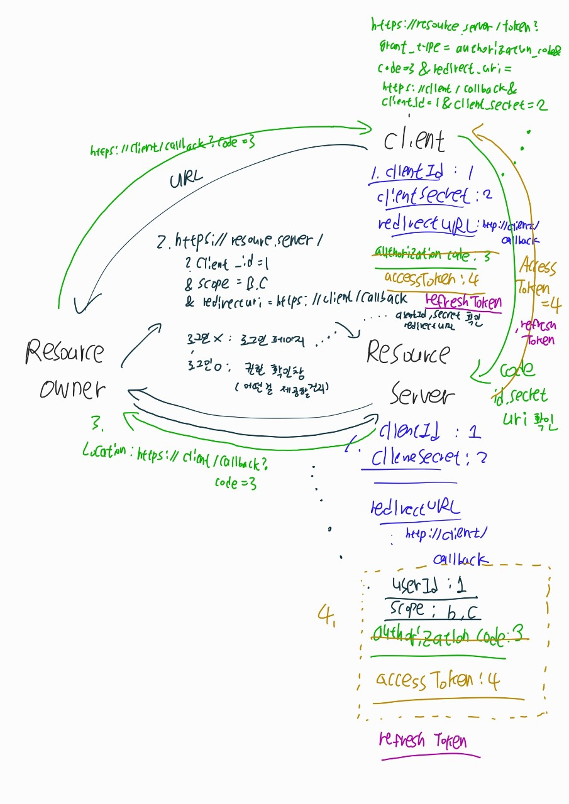

# OAuth2

---

- OAuth를 활용하여 accessToken을 얻어낼 수 있다
- OAuth를 사용하면 ID,PWD를 정보를 넘길 필요가 없다
- 필요한 권한만 사용하도록 설정할 수 있다

- Resource Server / Authoriztion Server (ex. Google, Facebook)
- Resource Owner (User)
- Client (My Service)

1. -> 2. -> 3. -> 4.

