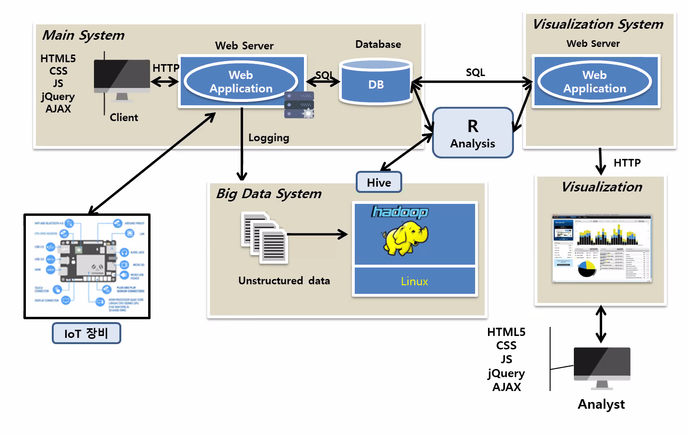
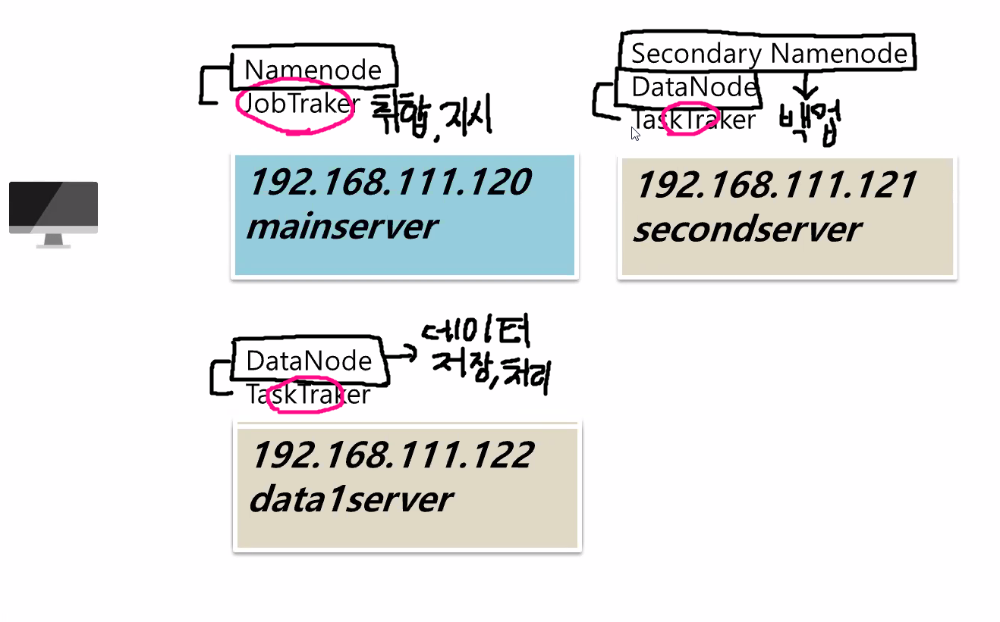

# 빅데이터 및 데이터 분석

## 빅데이터의 3대 요소 +  a

- Volume (양) : 대용량 데이터 (수십, 수만 테라바이트)
- Velocity (속도) : 여러 대의 컴퓨터에서 처리한다, SW적/기술적, 분산환경 
- Variety (다양성) : 비정형적 데이터 포함

+

- Veracity (정확성) : 정확한 분석
- Value (가치) : 어떤 문제를 해결 할 수 있는지

---

- BI(Business Intelligence) : 여러 곳에 산재된 데이터를 수집하고 체계적이고 일목요연하게 정리함으로써 사용자가 필요로 하는 정보를 적기에 정확하게 제공할 수 있는 환경
- DW(Data Warehouse) :  RDBMS의 데이터 분석을 위한 테이블을 따로 만드는 기법

## 하둡(Hadoop)

> 대용량 데이터를 분산 처리할 수 있는 자바 기반의 오픈소스 프레임워크이다.

- 웹 어플리케이션 구조

### Why Hadoop

- 실시가 데이터 처리는 RDBS를 사용하지만 웹 로그와 같은 비정형 데이터를 RDBS에 저장하기에는 데이터 크기가 너무 크다.
- 소프트웨어 라이센스 비용에 부담이 없다. 
- 값비싼 유닉스 장비를 사용하지 않고, 리눅스 서버면 얼마든 하둡을 설치해서 운영할 수 있다.
- 데이터 저장 용량이 부족할 경우, 필요한 만큼 리눅스 서버만 추가하면 된다.
- 여러 대의 서버에 데이터를 저장하고, 데이터가 저장된 각 서버에서 동시에 데이터를 처리할 수 있다.
- 저렴한 구축 비용과 비용 대비 빠른 데이터 처리, 장애를 대비한 특성
- 아마존, 이베이, 페이스북, 네이버, 다음카카오, KT, SKT에서 사용한다.

### 하둡 에코시스템

> 비즈니스에 효율적으로 적용할 수 있게 다양한 서브 프로젝트를 제공

- Hive : 하둡 기반의 데이터웨어하우징용 솔루션. 페이스북에서 개발, 오픈소스로 공개. SQL과 같은 쿼리 언어를 제공

### 하둡에 대한 오해

- RDBMS를 대체하지 않는다.
- 온라인 쇼핑몰과 같은 신속하며 데이터의 무결성을 보장해야 하는 데에는 적합하지 않다. 하둡은 배치성으로 데이터를 저장하거나 처리하는 데 적합한 시스템으로 구성되어 있기 때문이다.

### 하둡의 문제점

1. 고가용성 (HA; High Availability) 유지
2. 파일 네임스페이스 제한
3. 데이터 수정 불가
4. POSIX 명령어 미지원
5. 전문 업체 비교적 부족

### 하둡의 실행 모드

- 독립 실행(Standalone)모드

- 가상 분산(Pseudo-distributed)모드

- 완전 분산(Fully distributed)모드

  

