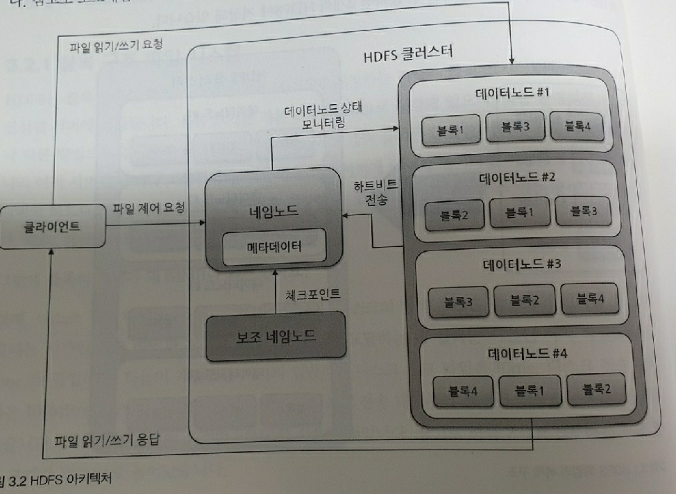
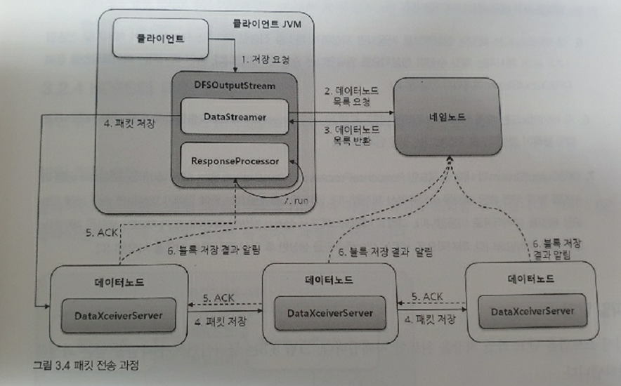

# 하둡 분산 파일 시스템(HDFS)

> HDFS는 수십 테라바이트 또는 페타바이트 이상의 대용량 파일을 분산된 서버에 저장하고, 많은 클라이언트가 저장된 데이터를 빠르게 처리할 수 있게 설계된 파일 시스템입니다.

대용량 파일 시스템 종류

- DAS - 외장하드, usb같이 붙이는 것
- NAS - 네트워크를 통해서 저장하는 하드디스크이다
- SAN - 대규모 사업장에서 사용, 컴퓨터이다, 네트워크로 여러 대의 저장소가 연결 되어있다. 서버 뒤로 NAS가 연결.

HDFS은

- 저장, 분석, 처리 가능하다

HDFS의 네 가지 목표

- 장애복구
- 스트리밍 방식의 데이터 접근
- 대용량 데이터 저장
- 데이터 무결성

## HDFS 아키텍처

- 데이터를 64MB로 잘라서 저장한다

- 보조네임노드는 네임노드의 메타정보를 관리하고 싱크를 맞춘다

- 네임노드가 죽었을 때 보조네임노드가 대체할 수는 없다

  

  

