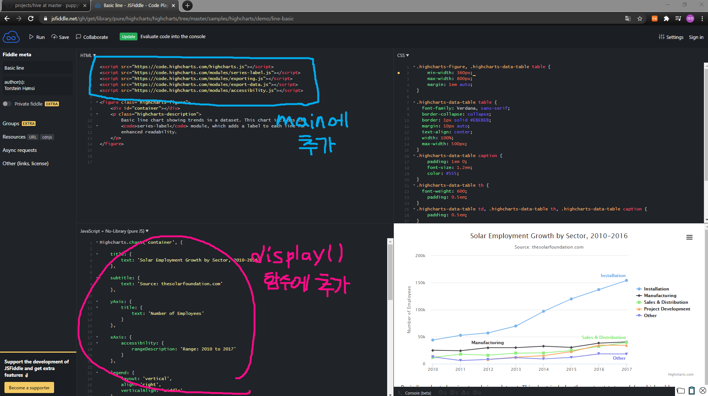
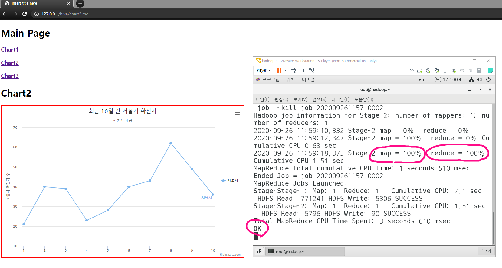

# Hive를 이용한 자바스프링 프로젝트

1. 리눅스에 hadoop, mysql, hive 설정완료 후

   start-all.sh

2. 필요한 데이터 파일을 윈도우에 다운받아 정제한 후 리눅스에서 다운받는다.

3. 하이브에 구조로 사용할 테이블을 만들고 데이터를 로드한다.

4. 하이브 서버 데몬을 구동한다.
   [root]#hive --service hiveserver2

5. 이클립스에서 프로젝트 생성

6. spring.xml 수정

7. 필요 라이브러리 추가(hive, json) 

8. index.html 추가

9. 메인페이지와 컨트롤러 추가

10. 메인 컨트롤러 추가

    1. url, id, password 세팅
    2. Class.forname 세팅 등..

11. 하이차트 데모에서 EDIT IN JSFIDDLE

    

    

12. ChartController를 만들고 쿼리를 연결 된 HIVE에 던져서 원하는 데이터를 받아 JSON형태로 변환하고 결과를 data로 넘긴다.
    

13. data를 받아 display(data)를 실행한다.

    ```javascript
    function getData(){
    	$.ajax({
    		url:'getdata1.mc',
    		success:function(data){
    			//alert(data);
    			display(data);
    		},
    		error:function(){}
    	});
    };
    ```

14. 

