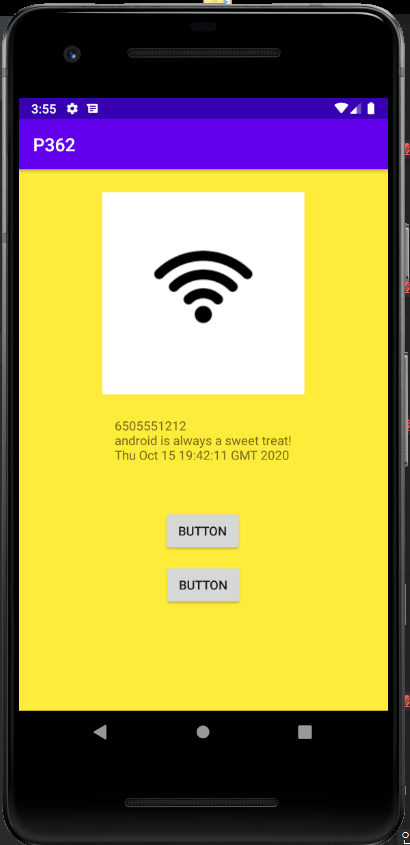
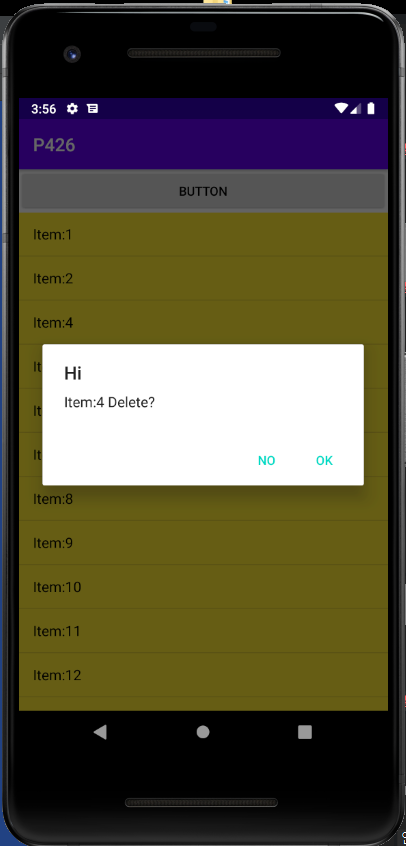
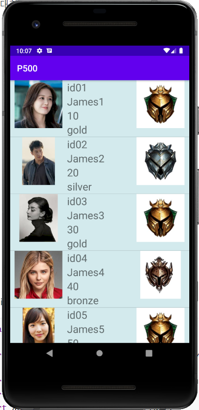
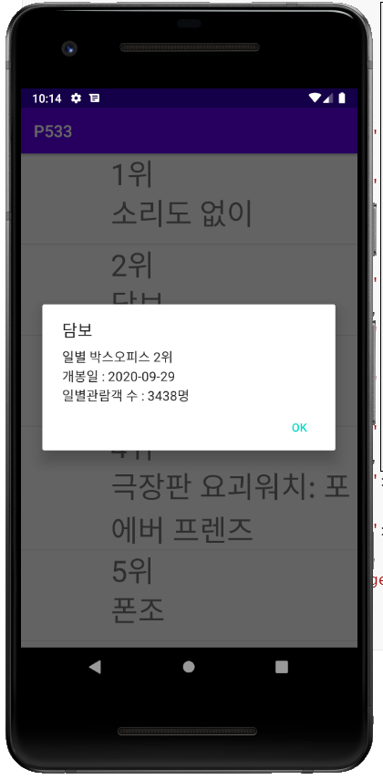
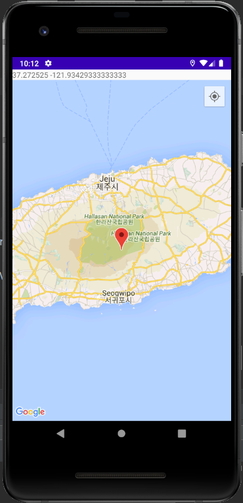
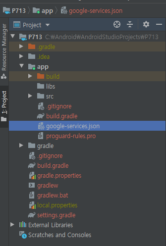
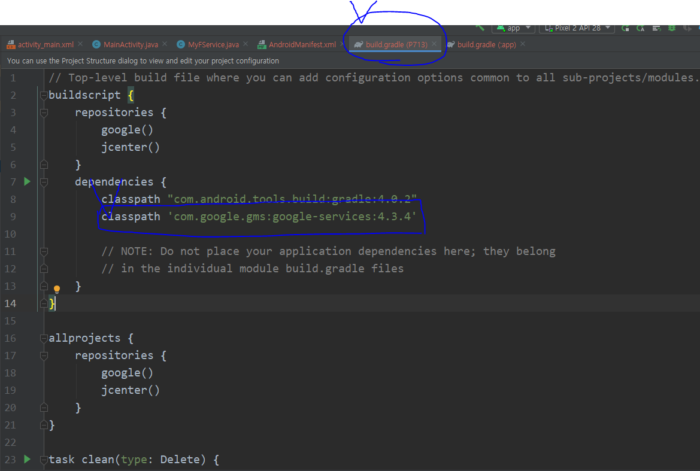
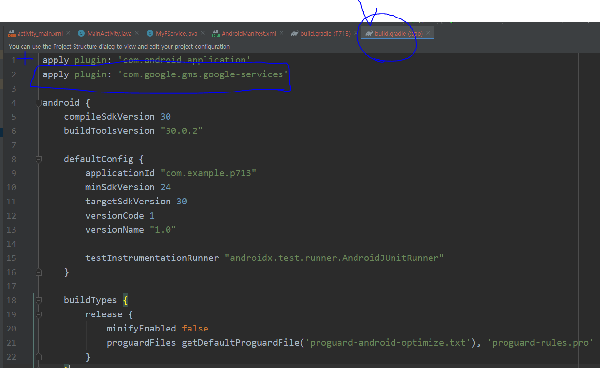
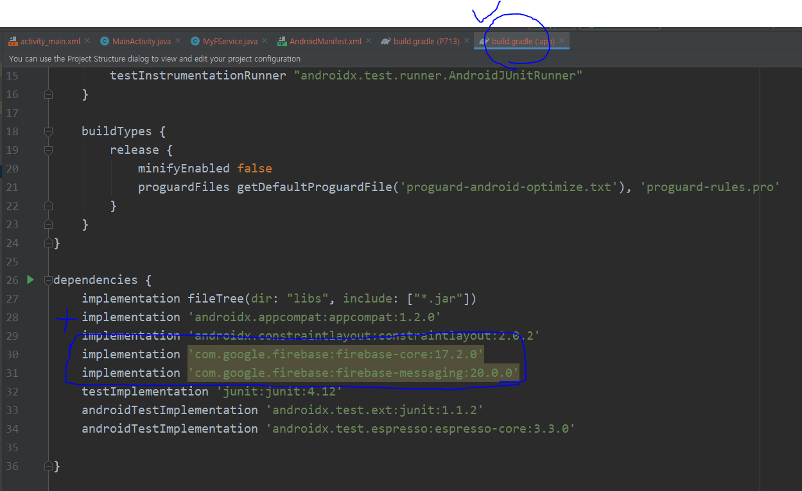
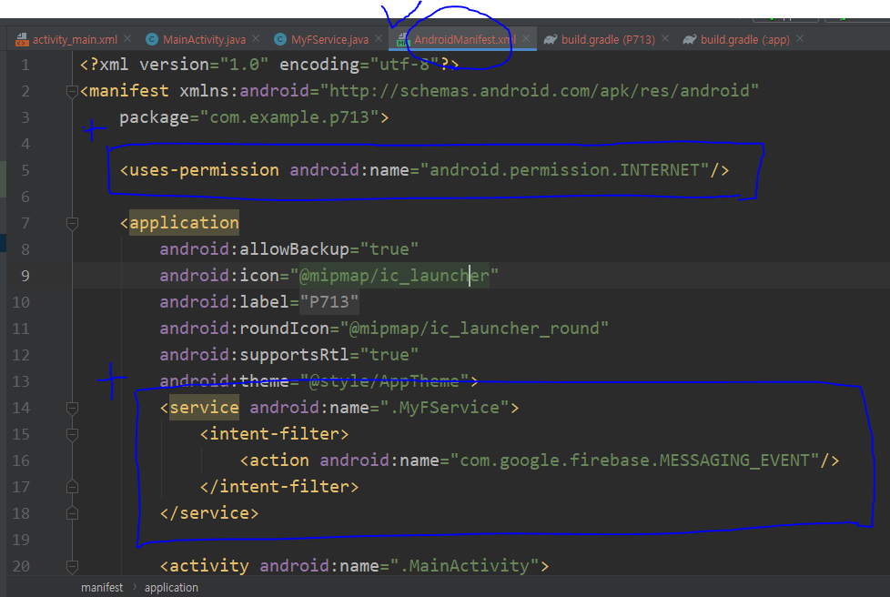

# 안드로이드

## 개발준비

개발자 옵션 활성화 - 빌드번호 계속 터치

OEM 잠금 해제

USB 디버깅 활성화

창 애니메이션 배율을 x0.5로 낮추면 빨라진다


- JDK 설치 되어있어야 한다

- 삼성 usb 드라이버 설치

- 프로그램 및 기능 - Windows 기능 - Hyper-V 체크

  

- 안드로이드 스튜디오 설치

  - Configure - SDK Manager - System Settings - Android SDK - SDK Platforms ( Android 9.0 (사용할 버전) - Show Package Detailes 체크 - 아래 내용 설치 ) (Google x86.. 안깔리면 안깔아도 됨)

    

  - SDK Tools (intel 86.. 안깔리면 안깔아도 됨)

    

  - Configure - AVD manager - Pixel 2 - Pie (적용하고 싶은 안드로이드 버전) 

  - Configure - Settings - Editor - Font

---

##  안드로이드의 특징

- 오픈 소스이다
- 리눅스 기반이다
- 자바 기반이다
- ART라는 런타임이 탑재


activity_main.xml

- 화면을 만든다

MainActivity.java

- 이벤트 처리

R.java

- 변수 처리

property 파일

- 버전 관리


---

Start a new Android Studio project

- Empty Activity

  


## 프로그램 구조

1. build.gradle (JAVA SPRING의 MAVEN 같은 파일)

   

2. **AndroidManifest.xml (전역 환경설정 파일)**

3. **MainActivity.java (실행코드가 들어가는 파일)**

   

4. **activity_main.xml (화면을 담당)**

   

5. R.java (자동으로 자원을 관리)


---

## 안드로이드 스튜디오 살펴보기

- 앱 이름 및 아이콘 설정


( res/values/strings은 문자열을 가져오거나 다국어 설정을 할 때 사용한다 )


(AndroidManifest.xml)


(사용할 이미지는 res/drawable에 아이콘은 res/mipmap에 넣는다)


(하단 Logcat에 로그가 찍힌다)(Logcat 우측에 Show only...를 클릭해 필터로 보고 싶은 로그만 설정할 수 있다)


(onCreate 앱이 실행될 때 작동한다)


```java
package com.example.myapplication;

import androidx.appcompat.app.AppCompatActivity;

import android.os.Bundle;
import android.util.Log;
import android.view.View;
import android.widget.ImageView;
import android.widget.Toast;

public class MainActivity extends AppCompatActivity {

    ImageView himg;

    @Override
    protected void onCreate(Bundle savedInstanceState) {
        super.onCreate(savedInstanceState);
        setContentView(R.layout.activity_main);
        himg = findViewById(R.id.himg);
    }

    public void clickBt(View view){
        himg.setVisibility(View.INVISIBLE);
        Log.d("[TEST]", "-----------");
        Toast.makeText(this, "Hello", Toast.LENGTH_SHORT).show();
    }

}
```


## 뷰

### 레이아웃

#### 		ConstraintLayout

#### 		LinearLayout

#### 		FrameLayout

#### 		TableLayout


- layout_width
- layout_height
- layout_weight : 비율로 설정
- layout_span


- text
- hint


- gravity : 내가 가지고 있는 것들에 대한 위치
- layout_gravity : 내 자신의 대한 위치


- dp : 160dpi 화면을 기준으로 한 픽셀 - 뷰에서 사용
- sp : 텍스트 크기를 지정할 때 사용하는 단위 - 글자 크기에 사용


- layout_margin
- padding


- imageView.setImageResource(R.drawable.~);


## 위젯과 이벤트

### 터치 및 드래그 시 이벤트 처리


```java
package com.example.p200;

import androidx.appcompat.app.AppCompatActivity;

import android.os.Bundle;
import android.view.KeyEvent;
import android.view.MotionEvent;
import android.view.View;
import android.widget.LinearLayout;
import android.widget.TextView;
import android.widget.Toast;

public class MainActivity extends AppCompatActivity {

    TextView textView;
    LinearLayout view;

    @Override
    protected void onCreate(Bundle savedInstanceState) {
        super.onCreate(savedInstanceState);
        setContentView(R.layout.activity_main);
        textView = findViewById(R.id.textView);
        view = findViewById(R.id.view);
        // 리스너로 이벤트 처리
        view.setOnTouchListener(new View.OnTouchListener() {
            @Override
            public boolean onTouch(View v, MotionEvent event) {
                //이벤트에 대한 정보를 받아온다
                int action = event.getAction();
                float x = event.getX();
                float y = event.getY();
                //터치
                if(action == MotionEvent.ACTION_DOWN){
                    print("DOWN:"+x+","+y);
                //드래그
                }else if(action == MotionEvent.ACTION_MOVE){
                    print("MOVE:"+x+","+y);
                //터치 뗌
                }else if(action == MotionEvent.ACTION_UP){
                    print("UP:"+x+","+y);
                }

                return true;
            }
        });
    } // onCreate end


    public void print(String str){
        textView.setText(str);
    }

//    //키가 눌렸을 때 실행하는 함수
//    @Override
//    public boolean onKeyDown(int keyCode, KeyEvent event) {
//        if(keyCode == KeyEvent.KEYCODE_BACK){
//            Toast.makeText(this, ""+"BACK KEY PRESSED", Toast.LENGTH_SHORT).show();
//        }
//
//        return true;
//    }

	//취소 키가 눌렸을 때
    @Override
    public void onBackPressed() {
       // super.onBackPressed();
        Toast.makeText(this, ""+"BACK KEY PRESSED", Toast.LENGTH_SHORT).show();
        finish();
    }
}
```


### 화면 전환과 앱 상태에 따른 처리

```java
package com.example.p207;

import androidx.annotation.NonNull;
import androidx.appcompat.app.AppCompatActivity;

import android.content.res.Configuration;
import android.os.Bundle;
import android.util.Log;
import android.view.View;
import android.widget.Button;
import android.widget.EditText;
import android.widget.TextView;
import android.widget.Toast;

public class MainActivity extends AppCompatActivity {

    Button button;
    EditText et;
    TextView textView;

    String str;

    //앱이 처음 실행될 때
    @Override
    protected void onCreate(Bundle savedInstanceState) {
        super.onCreate(savedInstanceState);
        setContentView(R.layout.activity_main);
        show("onCreate");
        Log.d("[TEST]", "onCreate");

        button = findViewById(R.id.button);
        et = findViewById(R.id.et);
        textView = findViewById(R.id.textView2);

        //버튼 클릭 시 텍스트에디터의 텍스트를 가져온다
        button.setOnClickListener(new View.OnClickListener() {
            @Override
            public void onClick(View v) {
                str = et.getText().toString();  //.getText()는 Editable자료형이라 형변환을 해주어야한다
                Toast.makeText(MainActivity.this, str, Toast.LENGTH_SHORT).show();
            }
        });

    }

    //화면 방향 변환 시 이벤트 처리 (AndroidManifest.xml을 수정해야한다)
    @Override
    public void onConfigurationChanged(@NonNull Configuration newConfig) {
        super.onConfigurationChanged(newConfig);

        if(newConfig.orientation == Configuration.ORIENTATION_LANDSCAPE){
            setContentView(R.layout.activity_main);
            Toast.makeText(this, "LANDSCAPE", Toast.LENGTH_SHORT).show();
        }else if(newConfig.orientation == Configuration.ORIENTATION_PORTRAIT){
            setContentView(R.layout.activity_main);
            Toast.makeText(this, "PORTRAIT", Toast.LENGTH_SHORT).show();
        }
    }

    //앱이 보여질 때
    @Override
    protected void onStart() {
        super.onStart();
        show("onStart");
        Log.d("[TEST]", "onStart");
    }

    //홈버튼 눌렀을 때 or 화면에서 사라질 때 스탑된다
    @Override
    protected void onStop() {
        super.onStop();
        show("onStop");
        Log.d("[TEST]", "onStop");
    }

    //앱이 꺼질 때 실행 된다
    @Override
    protected void onDestroy() {
        super.onDestroy();
        show("onDestroy");
        Log.d("[TEST]", "onDestroy");
    }

    public void show(String str){
        Toast.makeText(this, str, Toast.LENGTH_SHORT).show();
    }
}
```


### 토스트, 스낵바,프로그래스바,대화상자 사용하기

```java
package com.example.p217;

import androidx.appcompat.app.AppCompatActivity;

import android.app.AlertDialog;
import android.app.ProgressDialog;
import android.content.DialogInterface;
import android.os.Bundle;
import android.view.Gravity;
import android.view.LayoutInflater;
import android.view.View;
import android.view.ViewGroup;
import android.widget.ProgressBar;
import android.widget.TextView;
import android.widget.Toast;

import com.google.android.material.snackbar.Snackbar;

public class MainActivity extends AppCompatActivity {

    ProgressBar progressBar;  // 프로그레스바 만들기

    @Override
    protected void onCreate(Bundle savedInstanceState) {
        super.onCreate(savedInstanceState);
        setContentView(R.layout.activity_main);
        progressBar = findViewById(R.id.progressBar); // 프로그레스바 가져오기
    }

    //안드로이드에서 제공하는 기본 토스트의 위치변경
    public void clickb1(View v){
        Toast t = Toast.makeText(this,"Toast1...",Toast.LENGTH_SHORT);
        t.setGravity(Gravity.CENTER,0,0);
        t.show();
    }

    // 내가 토스트를 만들어서 사용한다
    public void clickb2(View v){

        LayoutInflater inflater = getLayoutInflater();
        View view = inflater.inflate(R.layout.toast,
                (ViewGroup) findViewById(R.id.toast_layout));
        TextView tv = view.findViewById(R.id.textView);
        tv.setText("INPUT TEXT");


        Toast t = new Toast(this);
        t.setGravity(Gravity.CENTER,0,0);
        t.setDuration(Toast.LENGTH_LONG);
        t.setView(view);
        t.show();
    }

    //스낵바 사용
    public void clickb3(View v){
        Snackbar.make(v, "Snack Bar", Snackbar.LENGTH_LONG).show();
    }

    // 다이얼로그 사용
    public void clickb4(View v){
        AlertDialog.Builder builder = new AlertDialog.Builder(this);
        builder.setTitle("My Dialog");
        builder.setMessage("Are You Exit Now");
        builder.setIcon(R.drawable.b1);

        //OK을 누르면 종료
        builder.setPositiveButton("OK", new DialogInterface.OnClickListener() {
            @Override
            public void onClick(DialogInterface dialog, int which) {
                finish();
            }
        });
        //NO를 누르면 그대로
        builder.setNegativeButton("NO", new DialogInterface.OnClickListener() {
            @Override
            public void onClick(DialogInterface dialog, int which) {

            }
        });

        AlertDialog dialog = builder.create();
        dialog.show();
    }

    //프로그래스 바, 스피닝 프로그래스
    public void btprogress(View v){
        ProgressDialog progressDialog = null;
        
        if(v.getId() == R.id.button5){
            int pdata = progressBar.getProgress();
            progressBar.setProgress(pdata + 1);
        }else if(v.getId() == R.id.button6){
            int pdata = progressBar.getProgress();
            progressBar.setProgress(pdata - 1);
        }else if(v.getId() == R.id.button7){
            
            progressDialog = new ProgressDialog(this);            progressDialog.setProgressStyle(ProgressDialog.STYLE_SPINNER);
            progressDialog.setTitle("Downloading ...");
            progressDialog.setCancelable(false);
            progressDialog.show();
        }else if(v.getId() == R.id.button8){
            progressDialog.dismiss();
        }
    }


    //뒤로가기를 눌렀을 때 내가 만든 레이아웃을 setview 해서 dialog를 만든다
    @Override
    public void onBackPressed() {
        //super.onBackPressed();  여기가 없어야 동작한다!

        LayoutInflater inflater = getLayoutInflater();
        View view = inflater.inflate(R.layout.dialog,
                (ViewGroup) findViewById(R.id.dialog_layout));


        AlertDialog.Builder builder = new AlertDialog.Builder(this);
        builder.setTitle("My Dialog");
        builder.setMessage("Are You Exit Now");
        builder.setView(view);
        builder.setIcon(R.drawable.b1);

        //OK을 누르면 종료
        builder.setNegativeButton("OK", new DialogInterface.OnClickListener() {
            @Override
            public void onClick(DialogInterface dialog, int which) {
                finish();
            }
        });
        //NO를 누르면 그대로
        builder.setPositiveButton("NO", new DialogInterface.OnClickListener() {
            @Override
            public void onClick(DialogInterface dialog, int which) {

            }
        });

        AlertDialog dialog = builder.create();
        dialog.show();

    }


} // end class
```


## 화면 전환

- 버튼을 눌러 아래 화면을 바꾸게 한다


```java
package com.example.p244;

import androidx.appcompat.app.AppCompatActivity;

import android.content.Context;
import android.os.Bundle;
import android.view.LayoutInflater;
import android.view.View;
import android.widget.LinearLayout;
import android.widget.TextView;

public class MainActivity extends AppCompatActivity {
	//전환시킬 화면을 container로 한다
    LinearLayout container;

    @Override
    protected void onCreate(Bundle savedInstanceState) {
        super.onCreate(savedInstanceState);
        setContentView(R.layout.activity_main);
        container = findViewById(R.id.container);
    }

    public void bt(View v){
        if(v.getId() == R.id.button){
            container.removeAllViews();
            LayoutInflater inflater =
                    (LayoutInflater) getSystemService(Context.LAYOUT_INFLATER_SERVICE);
            inflater.inflate(R.layout.sub1, container, true);
            TextView tv = container.findViewById(R.id.textView);
            tv.setText("Sub1 Page");
        }else if(v.getId() == R.id.button2){
            container.removeAllViews();
            LayoutInflater inflater =
                    (LayoutInflater) getSystemService(Context.LAYOUT_INFLATER_SERVICE);
            inflater.inflate(R.layout.sub2, container, true);
            TextView tv = container.findViewById(R.id.textView2);
            tv.setText("Sub2 Page");
        }
    }
}
```


- Activity 간 전환과 Intent의 ACTION 사용

  - MainActivity.java

  ```java
  package com.example.p251;
  
  import androidx.appcompat.app.AppCompatActivity;
  
  import android.content.Intent;
  import android.os.Bundle;
  import android.view.View;
  
  //Activity간 전환하기
  public class MainActivity extends AppCompatActivity {
  
      @Override
      protected void onCreate(Bundle savedInstanceState) {
          super.onCreate(savedInstanceState);
          setContentView(R.layout.activity_main);
      }
  
      //화면 SecondActivity을 띄운다
      public void ckbt(View v){
          Intent intent = new Intent(getApplicationContext(),SecondActivity.class);
          intent.putExtra("data", 100); //데이터를 담아서 다음 액티비티로 전달
          intent.putExtra("str", "String Data");
  
          startActivity(intent);
      }
  
  }
  ```

  - SecondActivity.java

  ```JAVA
  package com.example.p251;
  
  import androidx.appcompat.app.AppCompatActivity;
  
  import android.content.Intent;
  import android.os.Bundle;
  import android.view.View;
  import android.widget.Toast;
  
  public class SecondActivity extends AppCompatActivity {
  
      @Override
      protected void onCreate(Bundle savedInstanceState) {
          super.onCreate(savedInstanceState);
          setContentView(R.layout.activity_second);
  
          Intent intent = getIntent();
          //int result = intent.getIntExtra("data",0); //데이터를 받는다 default는 0으로 설정
          Bundle bundle = intent.getExtras(); //여러개 받을 때 번들사용
          int result = bundle.getInt("data",0);
          String str_result = bundle.getString("str","");
          Toast.makeText(this, ""+str_result, Toast.LENGTH_SHORT).show();
  
      }
  
      public void ckbt2(View v){
          Intent intent = new Intent(getApplicationContext(),ThirdActivity.class);
          startActivity(intent);
      }
  
  }
  ```

  - ThirdActivity.java

  ```java
  package com.example.p251;
  
  import androidx.appcompat.app.AppCompatActivity;
  import androidx.core.content.PermissionChecker;
  
  
  import android.Manifest;
  import android.content.Intent;
  import android.content.pm.PackageManager;
  import android.net.Uri;
  import android.os.Bundle;
  import android.view.View;
  import android.widget.Toast;
  
  public class ThirdActivity extends AppCompatActivity {
  
      @Override
      protected void onCreate(Bundle savedInstanceState) {
          super.onCreate(savedInstanceState);
          setContentView(R.layout.activity_third);
      }
      public void ckbt3(View v){
          Intent intent = null;
          //전화 거는 화면으로 이동
          if(v.getId() == R.id.button3){
              intent = new Intent(Intent.ACTION_VIEW, Uri.parse("tel:010-9879-2039"));
              startActivity(intent);
           //전화번호부 화면으로 이동
          }else if(v.getId() == R.id.button4){
              intent = new Intent(Intent.ACTION_VIEW, Uri.parse("content://contacts/people"));
              startActivity(intent);
           //전화 걸기
          }else if(v.getId() == R.id.button5){
              //전화 걸때는 CALL_PHONE을 허용해야 함!
              //AndroidManifest.xml에 추가해야 함!
              int check = PermissionChecker.checkSelfPermission(
                      this, Manifest.permission.CALL_PHONE
              );
  
              if(check == PackageManager.PERMISSION_GRANTED){
                  intent = new Intent(Intent.ACTION_CALL, Uri.parse("tel:010-9878-8989"));
                  startActivity(intent);
              }else{
                  Toast.makeText(this, "Not Allowed", Toast.LENGTH_SHORT).show();
              }
          }
      }
  }
  ```

  

## Android 4 Component

- Activity : Base, UI
- Service : Background Process
- Broadcast Receiver : (OS정보와 같은) Broadcast 내용을 받는다
- Content Provider :  App Data 공유 (ex. 갤러리의 사진, 주소록의 전화번호를 가져온다, T전화기)


## 액티비티의 수명주기와 SharedPreference


```java
package com.example.p275;

import androidx.appcompat.app.AppCompatActivity;

import android.app.Activity;
import android.content.SharedPreferences;
import android.os.Bundle;
import android.util.Log;
import android.widget.Toast;

import java.util.Date;

public class MainActivity extends AppCompatActivity {

    SharedPreferences sp;

    @Override
    protected void onCreate(Bundle savedInstanceState) {
        super.onCreate(savedInstanceState);
        setContentView(R.layout.activity_main);
        Log.d("[TEST]", "onCreate");
    }
    @Override
    protected void onStart() {
        super.onStart();
        Log.d("[TEST]", "onStart");
    }

    //onResume()가 되면 불러온다
    @Override
    protected void onResume() {
        super.onResume();
        restoreState();
        Log.d("[TEST]", "onResume");
    }

    @Override
    protected void onRestart() {
        super.onRestart();
        Log.d("[TEST]", "onRestart");
    }

    //onPause()가 되면 저장한다
    @Override
    protected void onPause() {
        super.onPause();
        saveState();
        Log.d("[TEST]", "onPause");
    }

    @Override
    protected void onStop() {
        super.onStop();
        Log.d("[TEST]", "onStop");
    }

    @Override
    protected void onDestroy() {
        super.onDestroy();
        Log.d("[TEST]", "onDestroy");
    }


    //토스트로 저장 된 날자를 불러온다
    public void restoreState(){
        sp = getSharedPreferences("st", Activity.MODE_PRIVATE);
        if(sp != null && sp.contains("date")){
            String result = sp.getString("date","");
            Toast.makeText(this, result, Toast.LENGTH_SHORT).show();
        }
    }

    //날자를 저장한다
    public void saveState(){
        sp = getSharedPreferences("st", Activity.MODE_PRIVATE); // Activity.MODE_PRIVATE는 이 앱만 볼 수 있다
        SharedPreferences.Editor editor = sp.edit();
        Date d = new Date();
        editor.putString("date", d.toString());
        editor.commit();
    }

}
```


## 프래그먼트


- 프래그먼트 화면전환과 액션바의 메뉴(...) 만들기

  - MainActivity.java

  ```java
  package com.example.p287;
  
  import androidx.annotation.NonNull;
  import androidx.appcompat.app.ActionBar;
  import androidx.appcompat.app.AppCompatActivity;
  
  import android.os.Bundle;
  import android.view.Menu;
  import android.view.MenuItem;
  import android.view.View;
  
  public class MainActivity extends AppCompatActivity {
  
      Fragment1 fragment1;
      Fragment2 fragment2;
      Fragment3 fragment3;
  
      ActionBar actionBar; // 메뉴 만들기 (androidx를 가져와야 한다)
  
      @Override
      protected void onCreate(Bundle savedInstanceState) {
          super.onCreate(savedInstanceState);
          setContentView(R.layout.activity_main);
  
          fragment1 = new Fragment1();
  //        fragment1 = (Fragment1)getSupportFragmentManager().findFragmentById(
  //                        R.id.fragment
  //                    );
          fragment2 = new Fragment2();
          fragment3 = new Fragment3();
  
          actionBar = getSupportActionBar();
          actionBar.setTitle("Fragment");
          actionBar.setLogo(R.drawable.icon);
          actionBar.setDisplayOptions(ActionBar.DISPLAY_SHOW_HOME |
                  ActionBar.DISPLAY_SHOW_TITLE | ActionBar.DISPLAY_USE_LOGO);
          //actionBar.hide(); // 액션바 숨기기
  
      }
  
      //메뉴(...)를 붙임
      @Override
      public boolean onCreateOptionsMenu(Menu menu) {
          getMenuInflater().inflate(R.menu.mymenu,menu);
          return true;
      }
  
      //메뉴(...)에 이벤트를 생성
      @Override
      public boolean onOptionsItemSelected(@NonNull MenuItem item) {
          if(item.getItemId() == R.id.m1){
              getSupportFragmentManager().beginTransaction().replace(
                      R.id.fragment, fragment1
              ).commit();
          }else if (item.getItemId() == R.id.m2){
              getSupportFragmentManager().beginTransaction().replace(
                      R.id.fragment, fragment2
              ).commit();
          }else if (item.getItemId() == R.id.m3){
              getSupportFragmentManager().beginTransaction().replace(
                      R.id.fragment, fragment3
              ).commit();
          }
          return super.onOptionsItemSelected(item);
      }
  
      public void ckbt(View v){
          if(v.getId() == R.id.button){
              getSupportFragmentManager().beginTransaction().replace(
                      R.id.fragment, fragment1
              ).commit();
          }else if(v.getId() == R.id.button2){
              getSupportFragmentManager().beginTransaction().replace(
                      R.id.fragment, fragment2
              ).commit();
          }else if(v.getId() == R.id.button3){
              getSupportFragmentManager().beginTransaction().replace(
                      R.id.fragment, fragment3
              ).commit();
          }
      }
  }
  ```

  

  - Fragment1.java

    ```java
    package com.example.p287;
    
    import android.os.Bundle;
    import android.view.LayoutInflater;
    import android.view.View;
    import android.view.ViewGroup;
    import android.widget.Button;
    import android.widget.EditText;
    import android.widget.ImageView;
    import android.widget.TextView;
    
    import androidx.annotation.NonNull;
    import androidx.annotation.Nullable;
    import androidx.fragment.app.Fragment;
    
    public class Fragment1 extends Fragment {
    
        TextView textView;
        EditText editText;
        Button button5;
        ImageView imageView;
    
        public Fragment1(){}
    
        @Nullable
        @Override
        public View onCreateView(@NonNull LayoutInflater inflater, @Nullable ViewGroup container, @Nullable Bundle savedInstanceState) {
            ViewGroup viewGroup = null;
            viewGroup = (ViewGroup) inflater.inflate(R.layout.fragment_1,container,false);
            textView = viewGroup.findViewById(R.id.textView);
            editText = viewGroup.findViewById(R.id.editText);
            button5 = viewGroup.findViewById(R.id.button5);
            imageView = viewGroup.findViewById(R.id.imageView);
    
            imageView.setOnClickListener(new View.OnClickListener(){
                @Override
                public void onClick(View v) {
                    String str = editText.getText().toString();
                    textView.setText(str);
                }
            }) ;
    
            return viewGroup;
        }
    
    }
    ```

    

  - Fragment2.java

    ```java
    package com.example.p287;
    
    import android.os.Bundle;
    import android.view.LayoutInflater;
    import android.view.View;
    import android.view.ViewGroup;
    
    import androidx.annotation.NonNull;
    import androidx.annotation.Nullable;
    import androidx.fragment.app.Fragment;
    
    public class Fragment2 extends Fragment {
        public Fragment2(){}
    
        @Nullable
        @Override
        public View onCreateView(@NonNull LayoutInflater inflater, @Nullable ViewGroup container, @Nullable Bundle savedInstanceState) {
            return inflater.inflate(R.layout.fragment_2, container, false);
        }
    }
    ```

    

## 상단탭과 하단탭

하단탭 예제


- bottom_menu.xml


- activity_main.xml


- MainActivity.java

```JAVA
package com.example.p331;

import androidx.annotation.NonNull;
import androidx.appcompat.app.ActionBar;
import androidx.appcompat.app.AppCompatActivity;
import androidx.fragment.app.FragmentManager;

import android.os.Bundle;
import android.view.MenuItem;
import android.widget.Toast;

import com.google.android.material.bottomnavigation.BottomNavigationView;

public class MainActivity extends AppCompatActivity {

    BottomNavigationView bottomNavigationView;
    ActionBar actionBar;

    Fragment1 fragment1;
    Fragment2 fragment2;
    Fragment3 fragment3;

    FragmentManager fragmentManager;

    @Override
    protected void onCreate(Bundle savedInstanceState) {
        super.onCreate(savedInstanceState);
        setContentView(R.layout.activity_main);

        fragment1 = new Fragment1();
        fragment2 = new Fragment2();
        fragment3 = new Fragment3();

        //처음 화면을 fragment1로 설정한다
        fragmentManager = getSupportFragmentManager();
        fragmentManager.beginTransaction().replace(
                R.id.framelayout, fragment1).commit();
		
        //액션바 삭제
        actionBar = getSupportActionBar();
        actionBar.hide();

        //하단탭 설정
        bottomNavigationView = findViewById(R.id.bottom_nav);
        bottomNavigationView.setOnNavigationItemSelectedListener(new BottomNavigationView.OnNavigationItemSelectedListener() {
            @Override
            public boolean onNavigationItemSelected(@NonNull MenuItem menuItem) {
                if(menuItem.getItemId() == R.id.tab1){
                    fragmentManager.beginTransaction().replace(
                            R.id.framelayout, fragment1).commit();
                    Toast.makeText(MainActivity.this, "tab1", Toast.LENGTH_SHORT).show();
                }else if(menuItem.getItemId() == R.id.tab2){
                    fragmentManager.beginTransaction().replace(
                            R.id.framelayout, fragment2).commit();
                    Toast.makeText(MainActivity.this, "tab2", Toast.LENGTH_SHORT).show();
                }else if(menuItem.getItemId() == R.id.tab3){
                    fragmentManager.beginTransaction().replace(
                            R.id.framelayout, fragment3).commit();
                    Toast.makeText(MainActivity.this, "tab3", Toast.LENGTH_SHORT).show();
                }
                return false;
            }
        });  // end function
    }
}
```


- fragment_1.xml


- Fragment1.java

```java
package com.example.p331;

import android.os.Bundle;

import androidx.fragment.app.Fragment;

import android.view.LayoutInflater;
import android.view.View;
import android.view.ViewGroup;
import android.widget.Button;
import android.widget.Toast;

public class Fragment1 extends Fragment {

    Button button;
    
    public Fragment1() {
        // Required empty public constructor
    }
    
    @Override
    public View onCreateView(LayoutInflater inflater, ViewGroup container,
                             Bundle savedInstanceState) {
        ViewGroup viewGroup = null;
        viewGroup = (ViewGroup) inflater.inflate(R.layout.fragment_1,container,false);
        button = viewGroup.findViewById(R.id.button);
        button.setOnClickListener(new View.OnClickListener() {
            @Override
            public void onClick(View v) {
                Toast.makeText(getActivity(), "tab11", Toast.LENGTH_SHORT).show();
            }            // Fragment에서 Toast를 사용하려면 getActivity()를 넣어준다!!!!
        });

        return viewGroup;
    }
    
}
```

## 브로드캐스트 수신자 사용하기



```java
package com.example.p362;

import androidx.appcompat.app.AppCompatActivity;
import androidx.core.app.ActivityCompat;
import androidx.core.content.PermissionChecker;

import android.Manifest;
import android.content.BroadcastReceiver;
import android.content.Context;
import android.content.Intent;
import android.content.IntentFilter;
import android.content.pm.PackageManager;
import android.net.ConnectivityManager;
import android.net.NetworkInfo;
import android.net.Uri;
import android.os.Bundle;
import android.telephony.SmsManager;
import android.telephony.SmsMessage;
import android.view.View;
import android.widget.ImageView;
import android.widget.TextView;
import android.widget.Toast;

import java.util.Date;

public class MainActivity extends AppCompatActivity {
    ImageView imageView;
    TextView textView;

    BroadcastReceiver broadcastReceiver;

    //어떤 브로드캐스트를 받을지 등록한다
    IntentFilter intentFilter;

    @Override
    protected void onCreate(Bundle savedInstanceState) {
        super.onCreate(savedInstanceState);
        setContentView(R.layout.activity_main);
        imageView = findViewById(R.id.imageView);
        textView = findViewById(R.id.textView);

        //어떤 퍼미션을 등록할건지 (AndroidManifest.xml에 기입되어야 함)
        String permissions [] = {
                Manifest.permission.CALL_PHONE,
                Manifest.permission.SEND_SMS,
                Manifest.permission.RECEIVE_SMS
        };
        ActivityCompat.requestPermissions(this,permissions,101);

        //브로드캐스트의 사용
        intentFilter = new IntentFilter();
        intentFilter.addAction("android.net.conn.CONNECTIVITY_CHANGE");
        intentFilter.addAction("android.provider.Telephony.SMS_RECEIVED");

        broadcastReceiver = new BroadcastReceiver() {
            @Override
            public void onReceive(Context context, Intent intent) {
                String cmd = intent.getAction();
                ConnectivityManager cm = null;
                NetworkInfo mobile = null;
                NetworkInfo wifi = null;

                //네트워크의 변경 상태에 따라 이미지뷰를 바꾼다
                //브로드캐스트를 까보니..네트워크가 변경 되었다면
                if(cmd.equals("android.net.conn.CONNECTIVITY_CHANGE")){
                    //현재 네트워크 상태를 받아온다
                    cm = (ConnectivityManager) context.getSystemService(
                            Context.CONNECTIVITY_SERVICE
                    );
                    mobile = cm.getNetworkInfo(ConnectivityManager.TYPE_MOBILE);
                    wifi = cm.getNetworkInfo(ConnectivityManager.TYPE_WIFI);

                    //네트워크가 연결 되었다면
                    if(mobile != null && mobile.isConnected()){

                    }
                    //와이파이가 연결 되었다면
                    else if(wifi != null && wifi.isConnected()){
                        imageView.setImageResource(R.drawable.wifi);
                    }
                    //다 연결 안되있다면
                    else{
                        imageView.setImageResource(R.drawable.nwifi);
                    }
                // 문자를 받으면면 텍스트뷰에 표시하기
                }else if(cmd.equals("android.provider.Telephony.SMS_RECEIVED")){
                    Toast.makeText(context, "SMS_RECEIVED", Toast.LENGTH_SHORT).show();
                    Bundle bundle = intent.getExtras();
                    Object [] obj = (Object [])bundle.get("pdus");
                    SmsMessage [] messages = new SmsMessage[obj.length];
                    for(int i=0; i<obj.length; i++){
                        String format = bundle.getString("format");
                        messages[i] = SmsMessage.createFromPdu(
                                (byte[]) obj[i], format);
                    }
                    String msg = "";
                    if(messages != null && messages.length > 0){
                        msg += messages[0].getOriginatingAddress()+"\n";
                        msg += messages[0].getMessageBody().toLowerCase()+"\n";
                        msg += new Date(messages[0].getTimestampMillis()).toString();
                        textView.setText(msg);
                    }
                }

            }
        };

        registerReceiver(broadcastReceiver, intentFilter); //가동시킨다 (오면 받는다)

    } // end onCreate


    //반드시 앱이 끝날 때 브로드캐스트리시버 연결을 끊어줘야한다!!
    @Override
    protected void onDestroy() {
        super.onDestroy();
        unregisterReceiver(broadcastReceiver);
    }


    public void ckbt(View v){
        if(v.getId() == R.id.button){
            //퍼미션 콜폰을 확인한다
            int check = PermissionChecker.checkSelfPermission(this,
                    Manifest.permission.CALL_PHONE);
            if(check == PackageManager.PERMISSION_GRANTED){
                Intent intent = new Intent(Intent.ACTION_CALL, Uri.parse("tel:010-9090-9898"));
                startActivity(intent);
            }else{
                Toast.makeText(this, "DENIED", Toast.LENGTH_SHORT).show();
            }
        }else if(v.getId() == R.id.button2){
            //문자를 보낸다  여기도 체크해줘야된다(지금 생략 됨!)
            SmsManager smsManager =
                    SmsManager.getDefault();
            smsManager.sendTextMessage(
                    "tel:010-2323-0432",
                    null,
                    "hi, Man ...",
                    null,
                    null
            );
            Toast.makeText(this, "Send ..OK", Toast.LENGTH_SHORT).show();

        }

    }

}
```

## 리스트뷰 사용하기



```java
package com.example.p426;

import androidx.appcompat.app.AppCompatActivity;

import android.app.AlertDialog;
import android.content.DialogInterface;
import android.os.Bundle;
import android.view.View;
import android.widget.AdapterView;
import android.widget.ArrayAdapter;
import android.widget.ListView;
import android.widget.Toast;

import java.util.ArrayList;

public class MainActivity extends AppCompatActivity {
    ListView listView;
    ArrayList<String> datas;

    @Override
    protected void onCreate(Bundle savedInstanceState) {
        super.onCreate(savedInstanceState);
        setContentView(R.layout.activity_main);
        listView = findViewById(R.id.listView);
    }

    public void setList(final ArrayList<String> datas){
        //아답터를 넣어 줌으로서 데이터를 뿌린다
        final ArrayAdapter<String> adapter =
                new ArrayAdapter<String>(
                        this,
                        android.R.layout.simple_list_item_1,
                        datas
                );
        listView.setAdapter(adapter);
        
        listView.setOnItemClickListener(new AdapterView.OnItemClickListener() {
            @Override
            public void onItemClick(AdapterView<?> parent,
                                    View view, final int position, long id) {

                AlertDialog.Builder builder = new AlertDialog.Builder(MainActivity.this);
                builder.setTitle("Hi");
                //여기 datas를 사용하려면 final이 되어야 한다
                builder.setMessage(datas.get(position) + " Delete?");

                //OK
                builder.setPositiveButton("OK", new DialogInterface.OnClickListener() {
                    @Override
                    public void onClick(DialogInterface dialog, int which) {
                        // 해당 데이터를 제거
                        datas.remove(position);
                        // 제거 후 다시 화면을 refresh 한다!!!!
                        adapter.notifyDataSetChanged();
                    }
                });
                //NO를 누르면 그대로
                builder.setNegativeButton("NO", new DialogInterface.OnClickListener() {
                    @Override
                    public void onClick(DialogInterface dialog, int which) {

                    }
                });

                AlertDialog dialog = builder.create();
                dialog.show();

            }
        });
    }

    // 임의의 리스트 데이터를 만든다
    public void getData(){
        datas = new ArrayList<>();
        for(int i=0; i<=20; i++){
            datas.add("Item:"+i);
        }
        setList(datas);
    }

    public void ckbt(View v){
        getData();
    }
}
```


- 예제2

​										 

```JAVA
package com.example.p428;


import androidx.appcompat.app.AppCompatActivity;
import androidx.constraintlayout.widget.ConstraintLayout;

import android.app.AlertDialog;
import android.content.Context;
import android.content.DialogInterface;
import android.os.Bundle;
import android.view.LayoutInflater;
import android.view.View;
import android.view.ViewGroup;
import android.widget.AdapterView;
import android.widget.BaseAdapter;
import android.widget.ImageView;
import android.widget.LinearLayout;
import android.widget.ListView;
import android.widget.TextView;

import java.util.ArrayList;

public class MainActivity extends AppCompatActivity {

    ListView listView;
    ArrayList<Person> persons;
    LinearLayout container;

    @Override
    protected void onCreate(Bundle savedInstanceState) {
        super.onCreate(savedInstanceState);
        setContentView(R.layout.activity_main);
        listView = findViewById(R.id.listView);

        //리스트 클릭 이벤트 처리
        listView.setOnItemClickListener(new AdapterView.OnItemClickListener() {
            @Override
            public void onItemClick(AdapterView<?> parent,
                                    View view, final int position, long id) {

                AlertDialog.Builder builder = new AlertDialog.Builder(MainActivity.this);

                LayoutInflater layoutInflater = getLayoutInflater();
                View dview = layoutInflater.inflate(R.layout.dialog,
                        (ViewGroup) findViewById(R.id.dlayout));
                ImageView dimg = dview.findViewById(R.id.imageView2);
                dimg.setImageResource(persons.get(position).getImg());
                builder.setView(dview);


                builder.setTitle("NAME:" + persons.get(position).getName());
                //여기 datas를 사용하려면 final이 되어야 한다
                builder.setMessage(persons.get(position).id + "");

                //OK
                builder.setPositiveButton("YES", new DialogInterface.OnClickListener() {
                    @Override
                    public void onClick(DialogInterface dialog, int which) {

                    }
                });
                //NO를 누르면 그대로
                builder.setNegativeButton("NO", new DialogInterface.OnClickListener() {
                    @Override
                    public void onClick(DialogInterface dialog, int which) {

                    }
                });

                builder.show();

            }
        });

    }// end onCreate


    // 나만의 어댑터를 만든다
    class PersonAdapter extends BaseAdapter {

        ArrayList<Person> datas;

        public PersonAdapter(ArrayList<Person> datas) {
            this.datas = datas;
        }

        @Override
        public int getCount() {
            return datas.size();
        }

        @Override
        public Object getItem(int position) {
            return datas.get(position);
        }

        @Override
        public long getItemId(int position) {
            return position;
        }

        @Override
        public View getView(int position, View convertView, ViewGroup parent) {
            View view = null;
            LayoutInflater inflater =
                    (LayoutInflater) getSystemService(Context.LAYOUT_INFLATER_SERVICE);
            view = inflater.inflate(
                    R.layout.person,
                    container,
                    true

            );
            ImageView im = view.findViewById(R.id.imageView);
            TextView tx_id = view.findViewById(R.id.tx_id);
            TextView tx_name = view.findViewById(R.id.tx_name);
            TextView tx_age = view.findViewById(R.id.tx_age);
            Person p = datas.get(position);
            im.setImageResource(p.getImg());
            tx_id.setText(p.getId());
            tx_name.setText(p.getName());
            tx_age.setText("" + p.getAge());

            return view;
        }
    }

    public void setList(final ArrayList<Person> persons) {
        final PersonAdapter personAdapter = new PersonAdapter(persons);
        listView.setAdapter(personAdapter);
    }


    public void getData() {
        persons = new ArrayList<>();
        persons.add(new Person(R.drawable.p1, "id01", "Lee MAlsook", 10));
        persons.add(new Person(R.drawable.p2, "id02", "Kim MAlsook", 20));
        persons.add(new Person(R.drawable.p3, "id03", "Lim MAlsook", 30));
        persons.add(new Person(R.drawable.p4, "id04", "OH MAlsook", 40));
        persons.add(new Person(R.drawable.p5, "id05", "HONG MAlsook", 50));
        persons.add(new Person(R.drawable.p6, "id06", "Ko MAlsook", 60));
        persons.add(new Person(R.drawable.p7, "id07", "Jung MAlsook", 70));
        persons.add(new Person(R.drawable.p8, "id08", "Jin MAlsook", 80));
        persons.add(new Person(R.drawable.p9, "id09", "Cha MAlsook", 90));
        setList(persons);
    }


    public void ckbt(View v) {
        getData();
    }

}
```


## WebView


- MainActivity.java

```java
package com.example.p458;

import androidx.appcompat.app.AppCompatActivity;

import android.os.Bundle;
import android.view.View;
import android.webkit.WebSettings;
import android.webkit.WebView;
import android.webkit.WebViewClient;

public class MainActivity extends AppCompatActivity {
    WebView webView;
    @Override
    protected void onCreate(Bundle savedInstanceState) {
        super.onCreate(savedInstanceState);
        setContentView(R.layout.activity_main);
        webView =  findViewById(R.id.webView);
        //안드로이드에서 제공하는 기본적인 브라우저 기능
        webView.setWebViewClient(new WebViewClient());
        //안드로이드 안에서 브라우저 기능을 불러온다
        WebSettings webSettings = webView.getSettings();
        //자바스크립트 허용
        webSettings.setJavaScriptEnabled(true);
        //인터넷 허용 퍼미션 추가
        String permissions[] = {

        };
    }

    public void ckbt(View v){
        if(v.getId() == R.id.button){
            //인터넷 퍼미션을 추가해야 함!
            webView.loadUrl("http://m.naver.com");
        }else if(v.getId() == R.id.button2){
            webView.loadUrl("http://m.daum.net");
        } //java webproject를 불러온다
        else if(v.getId() == R.id.button3){
            webView.loadUrl("http://192.168.0.28/android");
        }
    }

}
```


- AndroidManafest.xml

  ```java
      <uses-permission android:name="android.permission.INTERNET"/>
      <application
          android:usesCleartextTraffic="true"
              .
              .
              .
  ```

  

## SeekBar 및 화면밝기 조절하기


```java
package com.example.p464;

import androidx.appcompat.app.AppCompatActivity;

import android.os.Bundle;
import android.view.WindowManager;
import android.widget.SeekBar;
import android.widget.TextView;

public class MainActivity extends AppCompatActivity {

    SeekBar seekBar;
    TextView textView;

    @Override
    protected void onCreate(Bundle savedInstanceState) {
        super.onCreate(savedInstanceState);
        setContentView(R.layout.activity_main);
        seekBar = findViewById(R.id.seekBar);
        textView = findViewById(R.id.textView);

        seekBar.setOnSeekBarChangeListener(new SeekBar.OnSeekBarChangeListener() {
            //seekbar의 이벤트 함수
            @Override
            public void onProgressChanged(SeekBar seekBar, int progress, boolean fromUser) {
                //progress는 int라 text로 바꿔줘야 한다
                textView.setText(progress+"");
                //seekbar의 progress에 따라 화면의 밝기를 조절한다
                setBtight(progress);
            }

            @Override
            public void onStartTrackingTouch(SeekBar seekBar) {

            }

            @Override
            public void onStopTrackingTouch(SeekBar seekBar) {

            }
        });

    } // end event

    // 화면의 밝기를 바꾸는 함수
    public void setBtight(int value){
        WindowManager.LayoutParams params = getWindow().getAttributes();
        params.screenBrightness = (float) value / 100;
        getWindow().setAttributes(params);
    }
    
}
```

## Thread

1. Thread & Runnable
   --------------------------   ↑ 자바에서 멀티스레드 구현
2. Handler : 스레드와 연동에서 사용되는 기법
3. AsynchTask : 스레드를 제어할 수 있다
   --------------------------   ↑ 안드로이드에서 멀티스레드 구현


```java
package com.example.p474;

import androidx.annotation.NonNull;
import androidx.appcompat.app.AppCompatActivity;

import android.app.AlertDialog;
import android.app.ProgressDialog;
import android.content.DialogInterface;
import android.os.Bundle;
import android.os.Handler;
import android.os.Message;
import android.view.View;
import android.widget.Button;
import android.widget.ProgressBar;
import android.widget.TextView;

public class MainActivity extends AppCompatActivity {
    ProgressBar progressBar, progressBar2;
    TextView textView, textView2;
    Button button, button2, button3;
    MyHandler myHandler;
    MyHandler2 myHandler2;

    @Override
    protected void onCreate(Bundle savedInstanceState) {
        super.onCreate(savedInstanceState);
        setContentView(R.layout.activity_main);
        progressBar = findViewById(R.id.progressBar);
        progressBar2 = findViewById(R.id.progressBar2);
        progressBar.setMax(50);
        progressBar2.setMax(50);
        textView = findViewById(R.id.textView);
        textView2 = findViewById(R.id.textView2);
        button = findViewById(R.id.button);
        button2 = findViewById(R.id.button2);
        button3 = findViewById(R.id.button3);
        myHandler = new MyHandler();
        myHandler2 = new MyHandler2();

    }

    public void ckbt(View v)  {
        if(v.getId() == R.id.button){
            MyThread t = new MyThread(); //extends Theard을 사용할 때 스레스 선언 방법 주의!!!
            t.start();  // 시간이 걸리는 동작 되는 와중에도 아래 내용을 바로 실행
            button.setEnabled(false); // progress가 진행되는 동안 버튼을 누르지 못하게 한다
        }else if(v.getId() == R.id.button2){
            Thread t = new Thread(new MyThread2()); //implements Runnable을 사용할 때 스레스 선언 방법 주의!!!
            t.start();
            button2.setEnabled(false);
        }else if(v.getId() == R.id.button3){
            progress();
        }
    }

    public void progress(){
        final ProgressDialog progressDialog = new ProgressDialog(this);

        AlertDialog.Builder dailog = new AlertDialog.Builder(this);
        dailog.setTitle("progress");
        dailog.setMessage("5 seconds");
        final Handler handler = new Handler();
        dailog.setPositiveButton("OK", new DialogInterface.OnClickListener() {
            @Override
            public void onClick(DialogInterface dialog, int which) {
                progressDialog.setCancelable(false);
                progressDialog.setTitle("Downloading...");
                progressDialog.show();
                //스레드를 이용하여 5초 후에 progressDialog를 없엔다
                handler.postDelayed(new Runnable() {
                    @Override
                    public void run() {
                        progressDialog.dismiss();
                    }
                }, 5000);
            }
        });
        dailog.show();
    }


    // Thread t = new Thread(){}; 이렇게도 만들 수 있다
    class MyThread extends Thread{  // inner class 로 만든다
        @Override
        public void run() {
            for(int i=1; i<=50; i++){
                //스레드 안에서 조종
                progressBar.setProgress(i);
                textView.setText(i+"");
                try {
                    Thread.sleep(200);
                } catch (InterruptedException e) {
                    e.printStackTrace();
                }
            }
            //runOnUiThread는 서브스레드에서 메인스레드의 특정 위젯을 변경 하고자 할 때!!
            runOnUiThread(new Runnable() {
                @Override
                public void run() {
                    button.setEnabled(true); // 프로그레스 진행 후에 버튼을 활성화 시킨다

                }
            });
        }
    };

    //핸들러는 메인스레드에서 작동한다
    //핸들러는 서브스레드 안에서 동작되어지는 변경되어지는 상태를 메인스레드에게 알려준다
    class MyHandler extends Handler{
        @Override
        public void handleMessage(@NonNull Message msg) {
            Bundle bundle = msg.getData();
            int data = bundle.getInt("tdata",0);
            textView.setText("Handler1:"+data);
            progressBar.setProgress(data);
        }
    }

    class MyHandler2 extends Handler{
        @Override
        public void handleMessage(@NonNull Message msg) {
            Bundle bundle = msg.getData();
            int data = bundle.getInt("tdata",0);
            textView2.setText("Handler2:"+data);
            progressBar2.setProgress(data);
            //프로그레스가 50으로 max가 되면 버튼을 다시 활성화 시킨다
            if(data == 50){
                button2.setEnabled(true);
            }
        }
    }

    //Runnable이라는 인터페이스에서 상속받는다
    class MyThread2 implements Runnable{

        @Override
        public void run() {
            for(int i=1; i<=50; i++){
                try {
                    Thread.sleep(100);
                } catch (InterruptedException e) {
                    e.printStackTrace();
                }
                //스레드에서 발생하는 데이터를 여러군대로 보낸다
                Message message = myHandler.obtainMessage();
                Message message2 = myHandler2.obtainMessage();
                Bundle bundle = new Bundle();
                bundle.putInt("tdata",i);
                message.setData(bundle);
                message2.setData(bundle);
                //myHandler.sendMessage(message);
                myHandler2.sendMessage(message2);

            }
        }
    }
}
```


- AsyncTask의 활용

  

  ```java
  package com.example.p489;
  
  import androidx.appcompat.app.AppCompatActivity;
  
  import android.os.AsyncTask;
  import android.os.Bundle;
  import android.view.View;
  import android.widget.Button;
  import android.widget.ImageView;
  import android.widget.SeekBar;
  import android.widget.TextView;
  
  public class MainActivity extends AppCompatActivity {
  
      Button button, button2;
      SeekBar seekBar;
      TextView textView;
      ImageView imageView;
      MyAsynch myAsynch;
  
      @Override
      protected void onCreate(Bundle savedInstanceState) {
          super.onCreate(savedInstanceState);
          setContentView(R.layout.activity_main);
          button = findViewById(R.id.button);
          button2 = findViewById(R.id.button2);
          seekBar = findViewById(R.id.seekBar);
          seekBar.setMax(100);
          textView = findViewById(R.id.textView);
          imageView = findViewById(R.id.imageView);
          button2.setEnabled(false); // 시작,멈춤 버튼 중 시작만 활성화
      }
  
      public void ckbt1(View v){
          myAsynch = new MyAsynch();
          myAsynch.execute(100); //이 함수로 asynch를 실행한다
      }
  
      public void ckbt2(View v){
          myAsynch.cancel(true);
          myAsynch.onCancelled();
      }
  
      //                               <  시작  , 중간  ,  결과 >
      class MyAsynch extends AsyncTask<Integer,Integer,String>{
  
          //스레드 시작전 실행 되는 함수로 실행시 시작 비활성화, 멈춤 활성화
          @Override
          protected void onPreExecute() {
              button.setEnabled(false);
              button2.setEnabled(true);
          }
  
          //스레드의 run과 같다, 스레드 시작
          @Override
          protected String doInBackground(Integer... integers) {
              int a = integers[0].intValue();
              int sum = 0;
              for(int i=0;i<=a;i++){
                  if(isCancelled() == true){
                      break;
                  }
                  sum += i;
                  publishProgress(i);  //Integer i 값을 onProgressUpdate한테 던진다
                  try {
                      Thread.sleep(100);
                  } catch (InterruptedException e) {
                      e.printStackTrace();
                  }
              }
              return "result: " +sum;
          }
  
          //스레드 도중
          @Override
          protected void onProgressUpdate(Integer... values) {
              int i = values[0].intValue();
              seekBar.setProgress(i);
              if(i<=30){
                  imageView.setImageResource(R.drawable.down);
              }else if(i <= 70){
                  imageView.setImageResource(R.drawable.middle);
              }else if(i <= 100){
                  imageView.setImageResource(R.drawable.up);
              }
          }
  
          //스레드가 끝나면
          //스레스 시작전 실행 되는 함수로 실행시 시작 활성화, 멈춤 비활성화
          @Override
          protected void onPostExecute(String s) {
              textView.setText(s);
              button.setEnabled(true);
              button2.setEnabled(false);
          }
  
          // 취소시 시작 활성화, 멈춤 비활성화
          @Override
          protected void onCancelled() {
              seekBar.setProgress(0);
              textView.setText("");
              imageView.setImageResource(R.drawable.ic_launcher_background);
              button.setEnabled(true);
              button2.setEnabled(false);
          }
      }
  
  }
  ```

  

## 네트워크

앱에서 자바로 쿼리스트링을 날려서 id/pwd가 맞는지 확인한 후

맞으면 "1"을 아니면 "2"를 보낸다

id01/pwd01이 입력되어있으면 Activity2로 이동하고

아니면 대화상자를 표시한다


jsp에서 json데이터를 가져와 리스트뷰에 뿌린다




- AndroidManifest.xml

  - <uses-permission android:name="android.permission.INTERNET" />
  - android:usesCleartextTraffic="true" 반드시 추가한다!!

  ```java
  <?xml version="1.0" encoding="utf-8"?>
  <manifest xmlns:android="http://schemas.android.com/apk/res/android"
      package="com.example.p5333">
  
      <uses-permission android:name="android.permission.INTERNET" />
  
      <application
          android:allowBackup="true"
          android:icon="@mipmap/ic_launcher"
          android:label="@string/app_name"
          android:roundIcon="@mipmap/ic_launcher_round"
          android:supportsRtl="true"
          android:theme="@style/AppTheme"
          android:usesCleartextTraffic="true">
          <activity android:name=".MainActivity">
              <intent-filter>
                  <action android:name="android.intent.action.MAIN" />
  
                  <category android:name="android.intent.category.LAUNCHER" />
              </intent-filter>
          </activity>
      </application>
  
  </manifest>
  ```

  

- MainActiviti.java

```java
package com.example.p500;

import androidx.appcompat.app.AppCompatActivity;

import android.app.AlertDialog;
import android.app.ProgressDialog;
import android.content.DialogInterface;
import android.content.Intent;
import android.os.AsyncTask;
import android.os.Bundle;
import android.util.Log;
import android.view.View;
import android.widget.TextView;
import android.widget.Toast;

public class MainActivity extends AppCompatActivity {

    TextView tx_id, tx_pwd;
    HttpAsync httpAsync;

    @Override
    protected void onCreate(Bundle savedInstanceState) {
        super.onCreate(savedInstanceState);
        setContentView(R.layout.activity_main);
        tx_id = findViewById(R.id.tx_id);
        tx_pwd = findViewById(R.id.tx_pwd);
    }

    public void ck(View v){
        String id = tx_id.getText().toString();
        String pwd = tx_pwd.getText().toString();
        String url = "http://192.168.0.103/android/login.jsp";
        url += "?id="+id+"&pwd="+pwd;
        //String result = HttpConnect.getString(url); <- 서브스레드 안에서 해야한다!!
                httpAsync = new HttpAsync();
        httpAsync.execute(url);
    }

    class HttpAsync extends AsyncTask<String,String,String>{

        ProgressDialog progressDialog;

        @Override
        protected void onPreExecute() {
            progressDialog = new ProgressDialog(MainActivity.this);
            progressDialog.setTitle("Login ...");
            progressDialog.setCancelable(false);
            progressDialog.show();
        }

        @Override
        protected String doInBackground(String... strings) {
           //Manifest 수정 필요!
            String url = strings[0];
            String result = HttpConnect.getString(url);
            return result;
        }

        @Override
        protected void onProgressUpdate(String... values) {

        }

        @Override
        protected void onPostExecute(String s) {
            Toast.makeText(MainActivity.this, s, Toast.LENGTH_SHORT).show();
            progressDialog.dismiss();
            String s1 = s.trim();

            if(s1.equals("1")){
                Intent intent = new Intent(getApplicationContext(),SecondActivity.class);
                //intent.putExtra("data", 100); //데이터를 담아서 다음 액티비티로 전달
                //intent.putExtra("str", "String Data");

                startActivity(intent);
            }else{
                AlertDialog.Builder builder = new AlertDialog.Builder(MainActivity.this);
                builder.setTitle("My Dialog");
                builder.setMessage("Login fail");

                //OK을 누르면 종료
                builder.setPositiveButton("OK", new DialogInterface.OnClickListener() {
                    @Override
                    public void onClick(DialogInterface dialog, int which) {
                        return;
                    }
                });

                AlertDialog dialog = builder.create();
                dialog.show();
            }
        }

    }

}
```


- SecondActivity.java

```
package com.example.p500;

import androidx.appcompat.app.AppCompatActivity;

import android.app.ProgressDialog;
import android.content.Context;
import android.graphics.Bitmap;
import android.graphics.BitmapFactory;
import android.os.AsyncTask;
import android.os.Bundle;
import android.util.Log;
import android.view.LayoutInflater;
import android.view.View;
import android.view.ViewGroup;
import android.widget.BaseAdapter;
import android.widget.ImageView;
import android.widget.LinearLayout;
import android.widget.ListView;
import android.widget.TextView;

import org.json.JSONArray;
import org.json.JSONException;
import org.json.JSONObject;

import java.io.InputStream;
import java.net.MalformedURLException;
import java.net.URL;
import java.util.ArrayList;

public class SecondActivity extends AppCompatActivity {

    ListView listView;
    LinearLayout container;
    ArrayList<Item> list; // 서버에 있는 JSON데이터를 관리


    @Override
    protected void onCreate(Bundle savedInstanceState) {
        super.onCreate(savedInstanceState);
        setContentView(R.layout.activity_second);
        listView = findViewById(R.id.listView);
        container = findViewById(R.id.container);
        list = new ArrayList<>();
        getData();
    }

    private void getData() {
        String url = "http://192.168.0.103/android/items.jsp";
        ItemAsync itemAsync = new ItemAsync();
        itemAsync.execute(url);
    }

    class ItemAsync extends AsyncTask<String,Void,String>{

        ProgressDialog progressDialog;

        @Override
        protected void onPreExecute() {
            progressDialog = new ProgressDialog(SecondActivity.this);
            progressDialog.setTitle("Get Data ...");
            progressDialog.setCancelable(false);
            progressDialog.show();
        }

        @Override
        protected String doInBackground(String... strings) {
            //Manifest 수정 필요!
            String url = strings[0];
            String result = HttpConnect.getString(url); //result는 JSON
            return result;
        }

        @Override
        protected void onProgressUpdate(Void... values) {
            super.onProgressUpdate(values);
        }

        @Override
        protected void onPostExecute(String s) {
            progressDialog.dismiss();
            JSONArray ja = null;
            try {
                ja = new JSONArray(s);
                for(int i=0; i<ja.length(); i++){
                    JSONObject jo = ja.getJSONObject(i);
                    String name = jo.getString("name");
                    String id = jo.getString("id");
                    int age = jo.getInt("age");
                    String img = jo.getString("img");
                    String grade = jo.getString("grade");

                    Item item = new Item(id,name,age,img,grade);
                    list.add(item);
                }
            } catch (JSONException e) {
                e.printStackTrace();
            }

            ItemAdapter itemAdapter = new ItemAdapter();
            listView.setAdapter(itemAdapter);

        }
    } // end AsyncTask

    class ItemAdapter extends BaseAdapter{

        @Override
        public int getCount() {
            return list.size();
        }

        @Override
        public Object getItem(int position) {
            return list.get(position);
        }

        @Override
        public long getItemId(int position) {
            return position;
        }

        @Override
        public View getView(int position, View convertView, ViewGroup parent) {
            View itemView = null;
            LayoutInflater inflater =
                    (LayoutInflater) getSystemService(Context.LAYOUT_INFLATER_SERVICE);
            itemView = inflater.inflate(R.layout.item, container, true);
            TextView tx_id = itemView.findViewById(R.id.textView);
            TextView tx_name = itemView.findViewById(R.id.textView2);
            TextView tx_age = itemView.findViewById(R.id.textView3);
            TextView tx_grade = itemView.findViewById(R.id.textView4);
            tx_id.setText(list.get(position).getId());
            tx_name.setText(list.get(position).getName());
            tx_age.setText(list.get(position).getAge()+""); //age는 숫자다 주의!
            tx_grade.setText(list.get(position).getGrade());

            final ImageView imageView = itemView.findViewById(R.id.imageView);
            final ImageView imageView2 = itemView.findViewById(R.id.imageView2);
            String img = list.get(position).getImg();
            String grade = list.get(position).getGrade();
            Log.d("[TEST]",img+" "+grade);
            final String url = "http://192.168.0.103/android/img/"+img; //네트워크를 통해서 가져온다 ->스레드 사용
            final String gurl = "http://192.168.0.103/android/img/"+grade+".jpg";
            Thread t = new Thread(new Runnable() {
                @Override
                public void run() {
                    URL httpurl = null;
                    URL httpgurl = null;
                    InputStream is = null;
                    InputStream gis = null;
                    try {
                        httpurl = new URL(url);  //이너클래서 안에서 함수가 바깥 변수를 사용하려면 final을 사용해햐 한다
                        httpgurl = new URL(gurl);
                        is = httpurl.openStream();
                        gis = httpgurl.openStream();
                        final Bitmap bm = BitmapFactory.decodeStream(is);
                        final Bitmap gbm = BitmapFactory.decodeStream(gis);

                        //서브스레드에서 메인스레드의 이미지뷰 변경할 때 runOnUiThread사용!
                        runOnUiThread(new Runnable() {
                            @Override
                            public void run() {
                                imageView.setImageBitmap(bm);
                                imageView2.setImageBitmap(gbm);
                            }
                        });

                    } catch (Exception e) {
                        e.printStackTrace();
                    }
                }
            });
            t.start();

            /* 함수로 만들어서 할 때!
            GetImg t1 = new GetImg(img,url,imageView);
            t1.start();

            final ImageView imageView2 = itemView.findViewById(R.id.imageView2)
            int rank = list.get(position).getGrade();
            String rimg = null;
            if(rank == 1){
                rimg = "up.jpg"
            }else if(rank == 2){
                rimg = "mid.jpg"
            }else if(rank == 3){
                rimg = "down.jpg"
            }
            GetImg t2 = nwe GetImg(rimg,url,imageView3);
            t2.start()
            */


            return itemView;
        }


        /* 함수로 만들어서 할 때!
        class GetImg extends Thread{

            String img;
            String url;
            ImageView imageView;
            public GetImg(String img, String url,ImageView imageView){
                this.img = img;
                this.url = url;
                this.imageView = imageView;
            }

            @Override
            public void run() {

                URL httpurl = null;
                InputStream is = null;
                try {
                    httpurl = new URL(url+img);  //이너클래서 안에서 함수가 바깥 변수를 사용하려면 final을 사용해햐 한다
                    is = httpurl.openStream();
                    final Bitmap bm = BitmapFactory.decodeStream(is);

                    //서브스레드에서 메인스레드의 이미지뷰 변경할 때 runOnUiThread사용!
                    runOnUiThread(new Runnable() {
                        @Override
                        public void run() {
                            imageView.setImageBitmap(bm);
                        }
                    });

                } catch (Exception e) {
                    e.printStackTrace();
                }

            }
        }

    */

    } // end Adapter

}
```


- HttpConnect.java

```
package com.example.p500;

import java.io.BufferedInputStream;
import java.io.BufferedReader;
import java.io.InputStream;
import java.io.InputStreamReader;
import java.net.HttpURLConnection;
import java.net.URL;

public class HttpConnect {
        public static String getString(String urlstr){
            String result = null;
            URL url = null;
            HttpURLConnection hcon = null;
            InputStream is = null;
            try{
                url = new URL(urlstr);
                hcon = (HttpURLConnection)url.openConnection();
                hcon.setConnectTimeout(2000);
                hcon.setRequestMethod("GET");
                is = new BufferedInputStream(hcon.getInputStream());
                result = convertStr(is);
            }catch(Exception e){
                e.printStackTrace();
            }

            return result;
        }

        public static String convertStr(InputStream is){
            String result = null;
            BufferedReader bi = null;
            StringBuilder sb = new StringBuilder();
            try{
                bi = new BufferedReader(
                        new InputStreamReader(is)
                );
                String temp = "";
                while((temp =bi.readLine()) != null){
                    sb.append(temp);
                }
            }catch(Exception e){
                e.printStackTrace();
            }
            return sb.toString();
        }
}
```


- 이클립스에서 192.168.0.28/android/login.jsp

  ```java
  <%@ page language="java" contentType="text/html; charset=EUC-KR"
      pageEncoding="UTF-8"%>
  <%
  
  	String id = request.getParameter("id");
  	String pwd = request.getParameter("pwd");
  	System.out.println(id+" "+pwd);
  	Thread.sleep(3000);
  	if(id.equals("id01") && pwd.equals("pwd01")){
  		out.print("1");
  	}else{
  		out.print("2");
  	}
  
  %>
  ```

- 이클립스에서 items.jsp

  ```java
  <%@ page language="java" contentType="text/html; charset=UTF-8"
      pageEncoding="UTF-8"%>
      
  <%
  Thread.sleep(2000);
  %>    
      
  [
  {"id":"id01", "name":"James1", "age":10, "img":"img01.jpg","grade":"gold"},
  {"id":"id02", "name":"James2", "age":20, "img":"img02.jpg","grade":"silver"},
  {"id":"id03", "name":"James3", "age":30, "img":"img03.jpg","grade":"gold"},
  {"id":"id04", "name":"James4", "age":40, "img":"img04.jpg","grade":"bronze"},
  {"id":"id05", "name":"James5", "age":50, "img":"img05.jpg","grade":"gold"},
  {"id":"id06", "name":"James6", "age":60, "img":"img06.jpg","grade":"bronze"},
  {"id":"id07", "name":"James7", "age":50, "img":"img07.jpg","grade":"bronze"},
  {"id":"id08", "name":"James8", "age":40, "img":"img08.jpg","grade":"gold"},
  {"id":"id09", "name":"James9", "age":30, "img":"img09.jpg","grade":"bronze"},
  {"id":"id010", "name":"James10", "age":20, "img":"img10.jpg","grade":"silver"}
  ]
  ```

  

- 업그레이드 버전 p533 (영화정보를 웹서버에서 바로 가지고 온다!)
 


##  내용 제공자의 SharedPreferences

```java
package com.example.p552;

import androidx.appcompat.app.AppCompatActivity;

import android.content.SharedPreferences;
import android.os.Bundle;
import android.view.View;
import android.widget.Toast;

public class MainActivity extends AppCompatActivity {

    SharedPreferences sp; // 앱이 삭제가 되지 않는 한 저장되어 있다

    @Override
    protected void onCreate(Bundle savedInstanceState) {
        super.onCreate(savedInstanceState);
        setContentView(R.layout.activity_main);
        sp = getSharedPreferences("login",MODE_PRIVATE); //외부에서 접근하지 못하게 한다
        String status = sp.getString("status","");
        Toast.makeText(this, status, Toast.LENGTH_LONG).show();
    }

    //SharedPreferences에 status를 ok로 저장
    public void ck(View v){
        SharedPreferences.Editor edit = sp.edit();
        edit.putString("status","ok");
        edit.commit();
    }

    //SharedPreferences에 status 삭제
    public void ck2(View v){
        SharedPreferences.Editor edit = sp.edit();
        edit.remove("status");
        edit.commit();
    }

}
```


## 위치기반 서비스

1단계 : 위치 관리자 객체 참조하기

2단계 : 위리 리스너 구현하기

3단계 : 위치 정보 업데이트 요청하기

4단계 : 매니페스트에 권한 추가하기


- MainActivity.java

```java
package com.example.p667;

import androidx.annotation.NonNull;
import androidx.appcompat.app.AppCompatActivity;
import androidx.core.app.ActivityCompat;

import android.Manifest;
import android.app.Activity;
import android.content.Context;
import android.content.pm.PackageManager;
import android.location.Location;
import android.location.LocationListener;
import android.location.LocationManager;
import android.os.Bundle;
import android.view.View;
import android.widget.TextView;
import android.widget.Toast;

public class MainActivity extends AppCompatActivity {

    TextView textView;
    LocationManager locationManager;

    @Override
    protected void onCreate(Bundle savedInstanceState) {
        super.onCreate(savedInstanceState);
        setContentView(R.layout.activity_main);
        textView = findViewById(R.id.textView);
        //권한 설정
        String [] permission = {
                Manifest.permission.ACCESS_FINE_LOCATION
        };
        ActivityCompat.requestPermissions(this,permission,101);
        // LOCATION 권한을 허용하지 않으면 앱을 종료시킨다
        if(checkSelfPermission(Manifest.permission.ACCESS_FINE_LOCATION) == PackageManager.PERMISSION_DENIED){
            Toast.makeText(this, "Finish", Toast.LENGTH_SHORT).show();
            finish();
        }

        MyLocation myLocation = new MyLocation();
        // 권한이 허용되어 내려오면 진행
        locationManager = (LocationManager)getSystemService(Context.LOCATION_SERVICE);

        locationManager.requestLocationUpdates(
                LocationManager.GPS_PROVIDER, //GPS,NETWORK,PASSIVE 3종류가 있다
                1, // 이 시간마다 갱신
                0, // 조금만 움직(미터)여도 좌표를 받는다
                myLocation // 여기서 받는다

        );
    }
    public void ck(View v){
//        startMyLocation();
    }

//    //버튼을 눌렀을 때 좌표를 받는 함수
//    private void startMyLocation() {
//        Location location = null;
//        if(checkSelfPermission(Manifest.permission.ACCESS_FINE_LOCATION) == PackageManager.PERMISSION_DENIED){
//            Toast.makeText(this, "Finish", Toast.LENGTH_SHORT).show();
//            finish();
//        }
//        location = locationManager.getLastKnownLocation(
//                LocationManager.GPS_PROVIDER
//        );
//        if(location != null){
//            double lat = location.getLatitude();
//            double lon = location.getLongitude();
//            textView.setText(lat+" " +lon);
//        }
//    }


    class MyLocation implements LocationListener{

        //위치가 바뀌면 자동으로 좌표를 불러들인다
        @Override
        public void onLocationChanged(@NonNull Location location) {
            double lat = location.getLatitude();
            double lon = location.getLongitude();
            textView.setText(lat+" "+lon);
        }
    }

}
```


- AndroidManifest.xml

  ```java
  <?xml version="1.0" encoding="utf-8"?>
  <manifest xmlns:android="http://schemas.android.com/apk/res/android"
      package="com.example.p667">
  
      <uses-permission android:name="android.permission.ACCESS_FINE_LOCATION"/>
  							.
          					.
  ```

  


### 구글지도 사용하기([doc링크](https://developers.google.com/maps/documentation/android-sdk/overview))


0. 구글 API키 얻기 / 앱 등록하기 [ https://console.cloud.google.com/google/maps-apis/ ]


1. New Project - Google Maps Activity

2. google_maps_api.xml에 키를 추가!

---

1. New Project - Empty Activity
2. build.gradle에 googleMap 관련 API추가 - sync now
3. androidmanifest.xml에 key값 입력
4. 화면에 Fragment 추가




- activity_main.xml (fragment code로 추가!)

```java
<?xml version="1.0" encoding="utf-8"?>
<LinearLayout xmlns:android="http://schemas.android.com/apk/res/android"
    xmlns:app="http://schemas.android.com/apk/res-auto"
    xmlns:tools="http://schemas.android.com/tools"
    android:layout_width="match_parent"
    android:layout_height="match_parent"
    android:orientation="vertical"
    tools:context=".MainActivity">

    <TextView
        android:id="@+id/textView"
        android:layout_width="match_parent"
        android:layout_height="wrap_content"
        android:text="TextView" />

    <fragment
    android:id="@+id/map"
    android:layout_width="match_parent"
    android:layout_height="match_parent"
    android:name="com.google.android.gms.maps.SupportMapFragment"/>

</LinearLayout>
```


- MainActivity.java

```java
package com.example.p676;

import androidx.annotation.NonNull;
import androidx.appcompat.app.AppCompatActivity;
import androidx.core.app.ActivityCompat;

import android.Manifest;
import android.annotation.SuppressLint;
import android.content.Context;
import android.content.pm.PackageManager;
import android.location.Location;
import android.location.LocationListener;
import android.location.LocationManager;
import android.os.Bundle;
import android.widget.TextView;
import android.widget.Toast;

import com.google.android.gms.maps.CameraUpdateFactory;
import com.google.android.gms.maps.GoogleMap;
import com.google.android.gms.maps.OnMapReadyCallback;
import com.google.android.gms.maps.SupportMapFragment;
import com.google.android.gms.maps.model.LatLng;
import com.google.android.gms.maps.model.MarkerOptions;

// 메인엑티비티에서 지도를 띄운다!
public class MainActivity extends AppCompatActivity {

    SupportMapFragment supportMapFragment;
    GoogleMap gmap;

    TextView textView;
    LocationManager locationManager;

    @Override
    protected void onCreate(Bundle savedInstanceState) {
        super.onCreate(savedInstanceState);
        setContentView(R.layout.activity_main);

        getSupportActionBar().hide(); // 액션바 없에기

        //권한 설정 요청
        String [] permission = {
                Manifest.permission.ACCESS_FINE_LOCATION,
                Manifest.permission.ACCESS_COARSE_LOCATION //자기위치버튼 만들 때 있어야 함!
        };
        ActivityCompat.requestPermissions(this,permission,101);

        //supportMapFragment를 사용해 지도를 띄운다
        supportMapFragment = (SupportMapFragment) getSupportFragmentManager().findFragmentById(R.id.map);
        supportMapFragment.getMapAsync(new OnMapReadyCallback() {
            @Override
            public void onMapReady(GoogleMap googleMap) {
                gmap = googleMap;

                // LOCATION 권한을 허용하지 않으면 앱을 종료시킨다
                if(checkSelfPermission(Manifest.permission.ACCESS_FINE_LOCATION) == PackageManager.PERMISSION_DENIED
                        || checkSelfPermission(Manifest.permission.ACCESS_COARSE_LOCATION) == PackageManager.PERMISSION_DENIED){
                    return;
                }

                gmap.setMyLocationEnabled(true); //자기 위치로 가는 버튼 추가
                LatLng latlng = new LatLng(33.354124, 126.568358); //제주도 좌표
                gmap.addMarker(
                        new MarkerOptions().position(latlng).title("제주도")
                );
                gmap.animateCamera(CameraUpdateFactory.newLatLngZoom(latlng, 10)); //10은 줌 레벨

            }
        }); //지도를 뿌리겠다..


        //Location
        textView = findViewById(R.id.textView);


        // 권한이 허용되어 내려오면 아래 진행
        MyLocation myLocation = new MyLocation();
        locationManager = (LocationManager)getSystemService(Context.LOCATION_SERVICE);

        locationManager.requestLocationUpdates(
                LocationManager.GPS_PROVIDER, //GPS,NETWORK,PASSIVE 3종류가 있다
                1, // 이 시간마다 갱신
                0, // 조금만 움직(미터)여도 좌표를 받는다
                myLocation // 여기서 받는다
        );
        
    } //end onCreate

    
    class MyLocation implements LocationListener {

        //위치가 바뀌면 자동으로 좌표를 불러들인다
        @Override
        public void onLocationChanged(@NonNull Location location) {
            double lat = location.getLatitude();
            double lon = location.getLongitude();
            textView.setText(lat+" "+lon);

            LatLng latlng = new LatLng(lat, lon);
//            //마커를 찍는다다
//           gmap.addMarker(
//                    new MarkerOptions().position(latlng).title("My Point")
//            );
            //gmap.animateCamera(CameraUpdateFactory.newLatLngZoom(latlng, 12));
        }
    }

    //앱 정지 시 (자기위치를 안 추적한다)
    @SuppressLint("MissingPermission") //빨간색전등 눌러서 퍼미션은 이미 확인했으니 여기서 확인받지않는다!
    @Override
    protected void onPause() {
        super.onPause();
        if(gmap != null){
            gmap.setMyLocationEnabled(false);
        }
    }

    //앱 실행 다시실행 시
    @SuppressLint("MissingPermission")
    @Override
    protected void onResume() {
        super.onResume();
        if(gmap != null){
            gmap.setMyLocationEnabled(true);
        }
    }
}
```


---


- 메인 액티비티안에 프래그먼트에 지도를 뿌리려면 Fragment.xml에 아래 추가 + 메인엑티비티에 퍼미션 추가 (287P예제)

  ```xml
  <com.google.android.gms.maps.MapView
  android:id="@+id/map"
  android:layout_width="match_parent"
  android:layout_height="match_parent"
  android:name="com.google.android.gms.maps.SupportMapFragment"
  />
  ```


## 푸시서비스와 센서 및 단말 기능(진동,소리,상단알람)

- 버튼에 각각 진동,소리,파일소리,상단알람,상단알람클릭기능

```java
package com.example.p701;

import androidx.appcompat.app.AppCompatActivity;
import androidx.core.app.NotificationCompat;

import android.app.Notification;
import android.app.NotificationChannel;
import android.app.NotificationManager;
import android.app.PendingIntent;
import android.content.Context;
import android.content.Intent;
import android.media.MediaParser;
import android.media.MediaPlayer;
import android.media.Ringtone;
import android.media.RingtoneManager;
import android.net.Uri;
import android.os.Build;
import android.os.Bundle;
import android.os.VibrationEffect;
import android.os.Vibrator;
import android.view.View;

public class MainActivity extends AppCompatActivity {

    NotificationManager manager;

    @Override
    protected void onCreate(Bundle savedInstanceState) {
        super.onCreate(savedInstanceState);
        setContentView(R.layout.activity_main);
    }
    //진동
    public void ck1(View v){
        Vibrator vibrator =
                (Vibrator) getSystemService(Context.VIBRATOR_SERVICE); //getSystem:하드웨어의 기능을 제어한다
        if(Build.VERSION.SDK_INT >= 26){
            vibrator.vibrate(VibrationEffect.createOneShot(1000,10));
        }else{
            vibrator.vibrate(1000);
        }
    }
    //알람소리
    public void ck2(View v){
        Uri uri = RingtoneManager.getDefaultUri(RingtoneManager.TYPE_NOTIFICATION);
        Ringtone ringtone = RingtoneManager.getRingtone(getApplicationContext(), uri);
        ringtone.play();
    }
    //파일소리
    public void ck3(View v){
        MediaPlayer player = MediaPlayer.create(getApplicationContext(), R.raw.mp);
        player.start();
    }
    //상단 알람(이상하게 두번째는 오류가남)
    public void ck4(View v){
        manager = (NotificationManager) getSystemService(NOTIFICATION_SERVICE);
        NotificationCompat.Builder builder = null;
        if(Build.VERSION.SDK_INT >= 26){
            if(manager.getNotificationChannel("ch1") == null){
                manager.createNotificationChannel(
                        new NotificationChannel("ch1","chname",NotificationManager.IMPORTANCE_DEFAULT));
                builder = new NotificationCompat.Builder(this,"ch1");
            }
        }else{
            builder = new NotificationCompat.Builder(this);
        }
        builder.setContentTitle("Noti Test");
        builder.setContentText("Content Text");
        builder.setSmallIcon(R.drawable.b1);
        Notification noti = builder.build();
        manager.notify(1,noti);
    }
    //상단 알람 클릭 시 앱으로 이동
    public void ck5(View v){
        manager = (NotificationManager) getSystemService(NOTIFICATION_SERVICE);
        NotificationCompat.Builder builder = null;
        if(Build.VERSION.SDK_INT >= 26){
            if(manager.getNotificationChannel("ch2") == null){
                manager.createNotificationChannel(
                        new NotificationChannel("ch2","chname",NotificationManager.IMPORTANCE_DEFAULT));
                builder = new NotificationCompat.Builder(this,"ch2");
            }
        }else{
            builder = new NotificationCompat.Builder(this);
        }
        
        Intent intent = new Intent(this, MainActivity.class);
        PendingIntent pendingIntent = PendingIntent.getActivity(
                this, 101, intent, PendingIntent.FLAG_UPDATE_CURRENT);

        builder.setAutoCancel(true);
        builder.setContentIntent(pendingIntent);
        builder.setContentTitle("Noti Test");
        builder.setContentText("Content Text");
        builder.setSmallIcon(R.drawable.b1);
        Notification noti = builder.build();
        manager.notify(1,noti);
    }


}
```


### FCM 사용(푸시 알람)

https://console.firebase.google.com/

0. firebase에서 프로젝트 생성

1. 앱 등록

2. 구성파일추가 (google-services.json을 app 밑에 추가)
   

3. Firebase SDK 추가
   
   

   
   
   
   
   
   
   
   
4. 앱이 잘 등록되었는지 확인한 후 클라우드 메시징의 서버 키를 자바 서버(servlet)에 입력

   - android/ftest/Ftest.java (json-simple-1.1.1을 WEB-INF에 추가!)

   ```java
   package ftest;
   
   import java.io.IOException;
   import java.io.OutputStreamWriter;
   import java.net.HttpURLConnection;
   import java.net.MalformedURLException;
   import java.net.URL;
   
   import javax.servlet.ServletException;
   import javax.servlet.annotation.WebServlet;
   import javax.servlet.http.HttpServlet;
   import javax.servlet.http.HttpServletRequest;
   import javax.servlet.http.HttpServletResponse;
   
   import org.json.simple.JSONObject;
   
   
   @WebServlet({ "/Ftest", "/ftest" })
   public class Ftest extends HttpServlet {
   	private static final long serialVersionUID = 1L;
   
       public Ftest() {
           super();
       }
   
   	protected void service(HttpServletRequest request, HttpServletResponse response) throws ServletException, IOException {
   			URL url = null;
   			try {
   				url = new URL("https://fcm.googleapis.com/fcm/send");
   			} catch (MalformedURLException e) {
   				System.out.println("Error while creating Firebase URL | MalformedURLException");
   				e.printStackTrace();
   			}
   			HttpURLConnection conn = null;
   			try {
   				conn = (HttpURLConnection) url.openConnection();
   			} catch (IOException e) {
   				System.out.println("Error while createing connection with Firebase URL | IOException");
   				e.printStackTrace();
   			}
   			conn.setUseCaches(false);
   			conn.setDoInput(true);
   			conn.setDoOutput(true);
   			conn.setRequestProperty("Content-Type", "application/json");
   
   			// set my firebase server key
   			conn.setRequestProperty("Authorization", "key="
   					+ "AAAAK89FyMY:APA91bGxNwkQC6S_QQAKbn3COepWgndhyyjynT8ZvIEarTaGpEfMA1SPFo-ReN8b9uO21R1OfSOpNhfYbQaeohKP_sKzsgVTxu7K5tmzcjEfHzlgXRFrB1r0uqhfxLp4p836lbKw_iaN");
   
   			// create notification message into JSON format
   			
   			JSONObject message = new JSONObject();
   			message.put("to", "/topics/car");
   			message.put("priority", "high");
   			
   			JSONObject notification = new JSONObject();
   			notification.put("title", "title1");
   			notification.put("body", "body1");
   			message.put("notification", notification);
   			
   			JSONObject data = new JSONObject();
   			data.put("control", "control1");
   			data.put("data", 100);
   			message.put("data", data);
   
   
   			try {
   				OutputStreamWriter out = new OutputStreamWriter(conn.getOutputStream(), "UTF-8");
   				out.write(message.toString());
   				out.flush();
   				conn.getInputStream();
   				System.out.println("OK...............");
   
   			} catch (IOException e) {
   				System.out.println("Error while writing outputstream to firebase sending to ManageApp | IOException");
   				e.printStackTrace();
   			}	
   				
   	}
   
   }
   ```

   

- AndroidManifest.xml (중요!)




- MyFService.java (Service로 만들어야함!!!)

```java
package com.example.p713;

import android.app.Service;
import android.content.Intent;
import android.os.IBinder;
import android.util.Log;
import android.widget.Toast;


import androidx.annotation.NonNull;
import androidx.localbroadcastmanager.content.LocalBroadcastManager;

import com.google.firebase.messaging.FirebaseMessagingService;
import com.google.firebase.messaging.RemoteMessage;

public class MyFService extends FirebaseMessagingService {
    public MyFService() {
    }

    //생성
    @Override
    public void onMessageReceived(@NonNull RemoteMessage remoteMessage) {
        String title = remoteMessage.getNotification().getTitle();
        // title은 고정 아래는 추가가능
        String control = remoteMessage.getData().get("control");
        String data = remoteMessage.getData().get("data");
        Log.d("[TAG]",title+" "+control+" "+data);

        Intent intent = new Intent("notification");
        intent.putExtra("title",title);
        intent.putExtra("control",control);
        intent.putExtra("data",data);
        LocalBroadcastManager.getInstance(this).sendBroadcast(intent);
    }

}
```


- MainActivity.java

```java
package com.example.p713;

import androidx.annotation.NonNull;
import androidx.appcompat.app.AppCompatActivity;
import androidx.core.app.NotificationCompat;
import androidx.localbroadcastmanager.content.LocalBroadcastManager;

import android.app.Activity;
import android.app.Notification;
import android.app.NotificationChannel;
import android.app.NotificationManager;
import android.app.PendingIntent;
import android.content.BroadcastReceiver;
import android.content.Context;
import android.content.Intent;
import android.content.IntentFilter;
import android.os.Build;
import android.os.Bundle;
import android.util.Log;
import android.widget.TextView;
import android.widget.Toast;

import com.google.android.gms.tasks.OnCompleteListener;
import com.google.android.gms.tasks.Task;
import com.google.firebase.messaging.FirebaseMessaging;

public class MainActivity extends AppCompatActivity {

    TextView tx;
    NotificationManager manager;

    @Override
    protected void onCreate(Bundle savedInstanceState) {
        super.onCreate(savedInstanceState);
        setContentView(R.layout.activity_main);
        tx = findViewById(R.id.tx);

        // FCM사용 (앱이 중단되어 있을 때 기본적으로 title,body값으로 푸시!!)
        FirebaseMessaging.getInstance().subscribeToTopic("car").
                addOnCompleteListener(new OnCompleteListener<Void>() {
                    @Override
                    public void onComplete(@NonNull Task<Void> task) {
                        String msg = "FCM Complete...";
                        if (!task.isSuccessful()) {
                            msg = "FCM Fail";
                        }
                        Log.d("[TAG]", msg);

                    }
                });

        
        // 여기서 부터는 앱 실행상태에서 상태바 설정!!
        LocalBroadcastManager lbm = LocalBroadcastManager.getInstance(this); // 브로드캐스트를 받을 준비
        lbm.registerReceiver(receiver, new IntentFilter("notification")); // notification이라는 이름의 정보를 받겠다

    }// end onCreate


    // MyFService.java의 intent 정보를 BroadcastReceiver를 통해 받는다
    public BroadcastReceiver receiver = new BroadcastReceiver() {
        @Override
        public void onReceive(Context context, Intent intent) {
            if (intent != null) {
                String title = intent.getStringExtra("title");
                String control = intent.getStringExtra("control");
                String data = intent.getStringExtra("data");
                tx.setText(control + " " + data);
                Toast.makeText(MainActivity.this, title + " " + control + " " + data, Toast.LENGTH_SHORT).show();


                // 상단알람 사용
                manager = (NotificationManager) getSystemService(NOTIFICATION_SERVICE);
                NotificationCompat.Builder builder = null;
                if (Build.VERSION.SDK_INT >= 26) {
                    if (manager.getNotificationChannel("ch2") == null) {
                        manager.createNotificationChannel(
                                new NotificationChannel("ch2", "chname", NotificationManager.IMPORTANCE_DEFAULT));
                    }
                    builder = new NotificationCompat.Builder(context, "ch2");
                } else {
                    builder = new NotificationCompat.Builder(context);
                }

                Intent intent1 = new Intent(context, MainActivity.class);
                PendingIntent pendingIntent = PendingIntent.getActivity(
                        context, 101, intent1, PendingIntent.FLAG_UPDATE_CURRENT);

                builder.setAutoCancel(true);
                builder.setContentIntent(pendingIntent);
                //상단바 타이틀 설정
                builder.setContentTitle(title);
                //상단바 내용 설정
                builder.setContentText(control + " " + data);
                builder.setSmallIcon(R.drawable.b1);
                Notification noti = builder.build();
                manager.notify(1, noti);
            }

        }

    };
}
```

