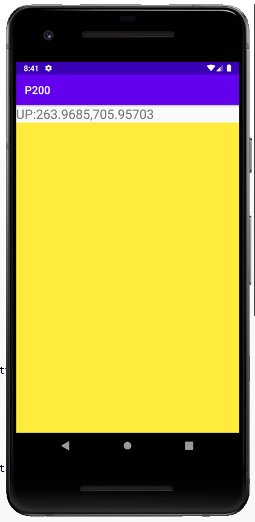
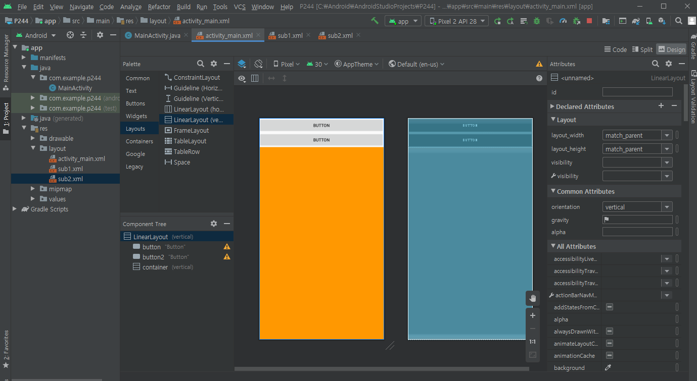

# 안드로이드

## 개발준비

개발자 옵션 활성화 - 빌드번호 계속 터치

OEM 잠금 해제

USB 디버깅 활성화

창 애니메이션 배율을 x0.5로 낮추면 빨라진다


- JDK 설치 되어있어야 한다

- 삼성 usb 드라이버 설치

- 프로그램 및 기능 - Windows 기능 - Hyper-V 체크

  

- 안드로이드 스튜디오 설치

  - Configure - SDK Manager - System Settings - Android SDK - SDK Platforms ( Android 9.0 (사용할 버전) - Show Package Detailes 체크 - 아래 내용 설치 ) (Google x86.. 안깔리면 안깔아도 됨)

    

  - SDK Tools (intel 86.. 안깔리면 안깔아도 됨)

    

  - Configure - AVD manager - Pixel 2 - Pie (적용하고 싶은 안드로이드 버전) 

  - Configure - Settings - Editor - Font

---

##  안드로이드의 특징

- 오픈 소스이다
- 리눅스 기반이다
- 자바 기반이다
- ART라는 런타임이 탑재


activity_main.xml

- 화면을 만든다

MainActivity.java

- 이벤트 처리

R.java

- 변수 처리

property 파일

- 버전 관리


---

Start a new Android Studio project

- Empty Activity

  


## 프로그램 구조

1. build.gradle (JAVA SPRING의 MAVEN 같은 파일)

   

2. **AndroidManifest.xml (전역 환경설정 파일)**

3. **MainActivity.java (실행코드가 들어가는 파일)**

   

4. **activity_main.xml (화면을 담당)**

   

5. R.java (자동으로 자원을 관리)


---

## 안드로이드 스튜디오 살펴보기

- 앱 이름 및 아이콘 설정


( res/values/strings은 문자열을 가져오거나 다국어 설정을 할 때 사용한다 )


(AndroidManifest.xml)


(사용할 이미지는 res/drawable에 아이콘은 res/mipmap에 넣는다)


(하단 Logcat에 로그가 찍힌다)(Logcat 우측에 Show only...를 클릭해 필터로 보고 싶은 로그만 설정할 수 있다)


(onCreate 앱이 실행될 때 작동한다)

```java
package com.example.myapplication;

import androidx.appcompat.app.AppCompatActivity;

import android.os.Bundle;
import android.util.Log;
import android.view.View;
import android.widget.ImageView;
import android.widget.Toast;

public class MainActivity extends AppCompatActivity {

    ImageView himg;

    @Override
    protected void onCreate(Bundle savedInstanceState) {
        super.onCreate(savedInstanceState);
        setContentView(R.layout.activity_main);
        himg = findViewById(R.id.himg);
    }

    public void clickBt(View view){
        himg.setVisibility(View.INVISIBLE);
        Log.d("[TEST]", "-----------");
        Toast.makeText(this, "Hello", Toast.LENGTH_SHORT).show();
    }

}
```


## 뷰

### 레이아웃

#### 		ConstraintLayout

#### 		LinearLayout

#### 		FrameLayout

#### 		TableLayout


- layout_width
- layout_height
- layout_weight : 비율로 설정
- layout_span


- text
- hint


- gravity : 내가 가지고 있는 것들에 대한 위치
- layout_gravity : 내 자신의 대한 위치


- dp : 160dpi 화면을 기준으로 한 픽셀 - 뷰에서 사용
- sp : 텍스트 크기를 지정할 때 사용하는 단위 - 글자 크기에 사용


- layout_margin
- padding


- imageView.setImageResource(R.drawable.~);


## 위젯과 이벤트

### 터치 및 드래그 시 이벤트 처리



```java
package com.example.p200;

import androidx.appcompat.app.AppCompatActivity;

import android.os.Bundle;
import android.view.KeyEvent;
import android.view.MotionEvent;
import android.view.View;
import android.widget.LinearLayout;
import android.widget.TextView;
import android.widget.Toast;

public class MainActivity extends AppCompatActivity {

    TextView textView;
    LinearLayout view;

    @Override
    protected void onCreate(Bundle savedInstanceState) {
        super.onCreate(savedInstanceState);
        setContentView(R.layout.activity_main);
        textView = findViewById(R.id.textView);
        view = findViewById(R.id.view);
        // 리스너로 이벤트 처리
        view.setOnTouchListener(new View.OnTouchListener() {
            @Override
            public boolean onTouch(View v, MotionEvent event) {
                //이벤트에 대한 정보를 받아온다
                int action = event.getAction();
                float x = event.getX();
                float y = event.getY();
                //터치
                if(action == MotionEvent.ACTION_DOWN){
                    print("DOWN:"+x+","+y);
                //드래그
                }else if(action == MotionEvent.ACTION_MOVE){
                    print("MOVE:"+x+","+y);
                //터치 뗌
                }else if(action == MotionEvent.ACTION_UP){
                    print("UP:"+x+","+y);
                }

                return true;
            }
        });
    } // onCreate end


    public void print(String str){
        textView.setText(str);
    }

//    //키가 눌렸을 때 실행하는 함수
//    @Override
//    public boolean onKeyDown(int keyCode, KeyEvent event) {
//        if(keyCode == KeyEvent.KEYCODE_BACK){
//            Toast.makeText(this, ""+"BACK KEY PRESSED", Toast.LENGTH_SHORT).show();
//        }
//
//        return true;
//    }

	//취소 키가 눌렸을 때
    @Override
    public void onBackPressed() {
       // super.onBackPressed();
        Toast.makeText(this, ""+"BACK KEY PRESSED", Toast.LENGTH_SHORT).show();
        finish();
    }
}
```


### 화면 전환과 앱 상태에 따른 처리

```java
package com.example.p207;

import androidx.annotation.NonNull;
import androidx.appcompat.app.AppCompatActivity;

import android.content.res.Configuration;
import android.os.Bundle;
import android.util.Log;
import android.view.View;
import android.widget.Button;
import android.widget.EditText;
import android.widget.TextView;
import android.widget.Toast;

public class MainActivity extends AppCompatActivity {

    Button button;
    EditText et;
    TextView textView;

    String str;

    //앱이 처음 실행될 때
    @Override
    protected void onCreate(Bundle savedInstanceState) {
        super.onCreate(savedInstanceState);
        setContentView(R.layout.activity_main);
        show("onCreate");
        Log.d("[TEST]", "onCreate");

        button = findViewById(R.id.button);
        et = findViewById(R.id.et);
        textView = findViewById(R.id.textView2);

        //버튼 클릭 시 텍스트에디터의 텍스트를 가져온다
        button.setOnClickListener(new View.OnClickListener() {
            @Override
            public void onClick(View v) {
                str = et.getText().toString();  //.getText()는 Editable자료형이라 형변환을 해주어야한다
                Toast.makeText(MainActivity.this, str, Toast.LENGTH_SHORT).show();
            }
        });

    }

    //화면 방향 변환 시 이벤트 처리 (AndroidManifest.xml을 수정해야한다)
    @Override
    public void onConfigurationChanged(@NonNull Configuration newConfig) {
        super.onConfigurationChanged(newConfig);

        if(newConfig.orientation == Configuration.ORIENTATION_LANDSCAPE){
            setContentView(R.layout.activity_main);
            Toast.makeText(this, "LANDSCAPE", Toast.LENGTH_SHORT).show();
        }else if(newConfig.orientation == Configuration.ORIENTATION_PORTRAIT){
            setContentView(R.layout.activity_main);
            Toast.makeText(this, "PORTRAIT", Toast.LENGTH_SHORT).show();
        }
    }

    //앱이 보여질 때
    @Override
    protected void onStart() {
        super.onStart();
        show("onStart");
        Log.d("[TEST]", "onStart");
    }

    //홈버튼 눌렀을 때 or 화면에서 사라질 때 스탑된다
    @Override
    protected void onStop() {
        super.onStop();
        show("onStop");
        Log.d("[TEST]", "onStop");
    }

    //앱이 꺼질 때 실행 된다
    @Override
    protected void onDestroy() {
        super.onDestroy();
        show("onDestroy");
        Log.d("[TEST]", "onDestroy");
    }

    public void show(String str){
        Toast.makeText(this, str, Toast.LENGTH_SHORT).show();
    }
}
```


### 토스트, 스낵바, 대화상자 사용하기

```java
package com.example.p217;

import androidx.appcompat.app.AppCompatActivity;

import android.app.AlertDialog;
import android.app.ProgressDialog;
import android.content.DialogInterface;
import android.os.Bundle;
import android.view.Gravity;
import android.view.LayoutInflater;
import android.view.View;
import android.view.ViewGroup;
import android.widget.ProgressBar;
import android.widget.TextView;
import android.widget.Toast;

import com.google.android.material.snackbar.Snackbar;

public class MainActivity extends AppCompatActivity {

    ProgressBar progressBar;  // 프로그레스바 만들기

    @Override
    protected void onCreate(Bundle savedInstanceState) {
        super.onCreate(savedInstanceState);
        setContentView(R.layout.activity_main);
        progressBar = findViewById(R.id.progressBar); // 프로그레스바 가져오기
    }

    //안드로이드에서 제공하는 기본 토스트의 위치변경
    public void clickb1(View v){
        Toast t = Toast.makeText(this,"Toast1...",Toast.LENGTH_SHORT);
        t.setGravity(Gravity.CENTER,0,0);
        t.show();
    }

    // 내가 토스트를 만들어서 사용한다
    public void clickb2(View v){

        LayoutInflater inflater = getLayoutInflater();
        View view = inflater.inflate(R.layout.toast,
                (ViewGroup) findViewById(R.id.toast_layout));
        TextView tv = view.findViewById(R.id.textView);
        tv.setText("INPUT TEXT");


        Toast t = new Toast(this);
        t.setGravity(Gravity.CENTER,0,0);
        t.setDuration(Toast.LENGTH_LONG);
        t.setView(view);
        t.show();
    }

    //스낵바 사용
    public void clickb3(View v){
        Snackbar.make(v, "Snack Bar", Snackbar.LENGTH_LONG).show();
    }

    // 다이얼로그 사용
    public void clickb4(View v){
        AlertDialog.Builder builder = new AlertDialog.Builder(this);
        builder.setTitle("My Dialog");
        builder.setMessage("Are You Exit Now");
        builder.setIcon(R.drawable.b1);

        //OK을 누르면 종료
        builder.setPositiveButton("OK", new DialogInterface.OnClickListener() {
            @Override
            public void onClick(DialogInterface dialog, int which) {
                finish();
            }
        });
        //NO를 누르면 그대로
        builder.setNegativeButton("NO", new DialogInterface.OnClickListener() {
            @Override
            public void onClick(DialogInterface dialog, int which) {

            }
        });

        AlertDialog dialog = builder.create();
        dialog.show();
    }

    //프로그래스 바, 스피닝 프로그래스
    public void btprogress(View v){
        ProgressDialog progressDialog = null;
        
        if(v.getId() == R.id.button5){
            int pdata = progressBar.getProgress();
            progressBar.setProgress(pdata + 1);
        }else if(v.getId() == R.id.button6){
            int pdata = progressBar.getProgress();
            progressBar.setProgress(pdata - 1);
        }else if(v.getId() == R.id.button7){
            progressDialog = new ProgressDialog(this);
            progressDialog.setProgressStyle(ProgressDialog.STYLE_SPINNER);
            progressDialog.setTitle("Downloading ...");
            progressDialog.setCancelable(false);
            progressDialog.show();
        }else if(v.getId() == R.id.button8){
            progressDialog.dismiss();
        }
    }


    //뒤로가기를 눌렀을 때 내가 만든 레이아웃을 setview 해서 dialog를 만든다
    @Override
    public void onBackPressed() {
        //super.onBackPressed();  여기가 없어야 동작한다!

        LayoutInflater inflater = getLayoutInflater();
        View view = inflater.inflate(R.layout.dialog,
                (ViewGroup) findViewById(R.id.dialog_layout));


        AlertDialog.Builder builder = new AlertDialog.Builder(this);
        builder.setTitle("My Dialog");
        builder.setMessage("Are You Exit Now");
        builder.setView(view);
        builder.setIcon(R.drawable.b1);

        //OK을 누르면 종료
        builder.setNegativeButton("OK", new DialogInterface.OnClickListener() {
            @Override
            public void onClick(DialogInterface dialog, int which) {
                finish();
            }
        });
        //NO를 누르면 그대로
        builder.setPositiveButton("NO", new DialogInterface.OnClickListener() {
            @Override
            public void onClick(DialogInterface dialog, int which) {

            }
        });

        AlertDialog dialog = builder.create();
        dialog.show();

    }


} // end class
```


## 화면 전환

- 버튼을 눌러 아래 화면을 바꾸게 한다



```java
package com.example.p244;

import androidx.appcompat.app.AppCompatActivity;

import android.content.Context;
import android.os.Bundle;
import android.view.LayoutInflater;
import android.view.View;
import android.widget.LinearLayout;
import android.widget.TextView;

public class MainActivity extends AppCompatActivity {
	//전환시킬 화면을 container로 한다
    LinearLayout container;

    @Override
    protected void onCreate(Bundle savedInstanceState) {
        super.onCreate(savedInstanceState);
        setContentView(R.layout.activity_main);
        container = findViewById(R.id.container);
    }

    public void bt(View v){
        if(v.getId() == R.id.button){
            container.removeAllViews();
            LayoutInflater inflater =
                    (LayoutInflater) getSystemService(Context.LAYOUT_INFLATER_SERVICE);
            inflater.inflate(R.layout.sub1, container, true);
            TextView tv = container.findViewById(R.id.textView);
            tv.setText("Sub1 Page");
        }else if(v.getId() == R.id.button2){
            container.removeAllViews();
            LayoutInflater inflater =
                    (LayoutInflater) getSystemService(Context.LAYOUT_INFLATER_SERVICE);
            inflater.inflate(R.layout.sub2, container, true);
            TextView tv = container.findViewById(R.id.textView2);
            tv.setText("Sub2 Page");
        }
    }
}
```


- Activity 간 전환과 Intent의 ACTION 사용

  - MainActivity.java

  ```java
  package com.example.p251;
  
  import androidx.appcompat.app.AppCompatActivity;
  
  import android.content.Intent;
  import android.os.Bundle;
  import android.view.View;
  
  //Activity간 전환하기
  public class MainActivity extends AppCompatActivity {
  
      @Override
      protected void onCreate(Bundle savedInstanceState) {
          super.onCreate(savedInstanceState);
          setContentView(R.layout.activity_main);
      }
  
      //화면 SecondActivity을 띄운다
      public void ckbt(View v){
          Intent intent = new Intent(getApplicationContext(),SecondActivity.class);
          intent.putExtra("data", 100); //데이터를 담아서 다음 액티비티로 전달
          intent.putExtra("str", "String Data");
  
          startActivity(intent);
      }
  
  }
  ```

  - SecondActivity.java

  ```JAVA
  package com.example.p251;
  
  import androidx.appcompat.app.AppCompatActivity;
  
  import android.content.Intent;
  import android.os.Bundle;
  import android.view.View;
  import android.widget.Toast;
  
  public class SecondActivity extends AppCompatActivity {
  
      @Override
      protected void onCreate(Bundle savedInstanceState) {
          super.onCreate(savedInstanceState);
          setContentView(R.layout.activity_second);
  
          Intent intent = getIntent();
          //int result = intent.getIntExtra("data",0); //데이터를 받는다 default는 0으로 설정
          Bundle bundle = intent.getExtras(); //여러개 받을 때 번들사용
          int result = bundle.getInt("data",0);
          String str_result = bundle.getString("str","");
          Toast.makeText(this, ""+str_result, Toast.LENGTH_SHORT).show();
  
      }
  
      public void ckbt2(View v){
          Intent intent = new Intent(getApplicationContext(),ThirdActivity.class);
          startActivity(intent);
      }
  
  }
  ```

  - ThirdActivity.java

  ```java
  package com.example.p251;
  
  import androidx.appcompat.app.AppCompatActivity;
  import androidx.core.content.PermissionChecker;
  
  
  import android.Manifest;
  import android.content.Intent;
  import android.content.pm.PackageManager;
  import android.net.Uri;
  import android.os.Bundle;
  import android.view.View;
  import android.widget.Toast;
  
  public class ThirdActivity extends AppCompatActivity {
  
      @Override
      protected void onCreate(Bundle savedInstanceState) {
          super.onCreate(savedInstanceState);
          setContentView(R.layout.activity_third);
      }
      public void ckbt3(View v){
          Intent intent = null;
          //전화 거는 화면으로 이동
          if(v.getId() == R.id.button3){
              intent = new Intent(Intent.ACTION_VIEW, Uri.parse("tel:010-9879-2039"));
              startActivity(intent);
           //전화번호부 화면으로 이동
          }else if(v.getId() == R.id.button4){
              intent = new Intent(Intent.ACTION_VIEW, Uri.parse("content://contacts/people"));
              startActivity(intent);
           //전화 걸기
          }else if(v.getId() == R.id.button5){
              //전화 걸때는 CALL_PHONE을 허용해야 함!
              //AndroidManifest.xml에 추가해야 함!
              int check = PermissionChecker.checkSelfPermission(
                      this, Manifest.permission.CALL_PHONE
              );
  
              if(check == PackageManager.PERMISSION_GRANTED){
                  intent = new Intent(Intent.ACTION_CALL, Uri.parse("tel:010-9878-8989"));
                  startActivity(intent);
              }else{
                  Toast.makeText(this, "Not Allowed", Toast.LENGTH_SHORT).show();
              }
          }
      }
  }
  ```

  

## Android 4 Component

- Activity : Base, UI
- Service : Background Process
- Broadcast Receiver : (OS정보와 같은) Broadcast 내용을 받는다
- Content Provider :  App Data 공유 (ex. 갤러리의 사진, 주소록의 전화번호를 가져온다)


## 액티비티의 수명주기와 SharedPreference


```java
package com.example.p275;

import androidx.appcompat.app.AppCompatActivity;

import android.app.Activity;
import android.content.SharedPreferences;
import android.os.Bundle;
import android.util.Log;
import android.widget.Toast;

import java.util.Date;

public class MainActivity extends AppCompatActivity {

    SharedPreferences sp;

    @Override
    protected void onCreate(Bundle savedInstanceState) {
        super.onCreate(savedInstanceState);
        setContentView(R.layout.activity_main);
        Log.d("[TEST]", "onCreate");
    }
    @Override
    protected void onStart() {
        super.onStart();
        Log.d("[TEST]", "onStart");
    }

    //onResume()가 되면 불러온다
    @Override
    protected void onResume() {
        super.onResume();
        restoreState();
        Log.d("[TEST]", "onResume");
    }

    @Override
    protected void onRestart() {
        super.onRestart();
        Log.d("[TEST]", "onRestart");
    }

    //onPause()가 되면 저장한다
    @Override
    protected void onPause() {
        super.onPause();
        saveState();
        Log.d("[TEST]", "onPause");
    }

    @Override
    protected void onStop() {
        super.onStop();
        Log.d("[TEST]", "onStop");
    }

    @Override
    protected void onDestroy() {
        super.onDestroy();
        Log.d("[TEST]", "onDestroy");
    }


    //토스트로 저장 된 날자를 불러온다
    public void restoreState(){
        sp = getSharedPreferences("st", Activity.MODE_PRIVATE);
        if(sp != null && sp.contains("date")){
            String result = sp.getString("date","");
            Toast.makeText(this, result, Toast.LENGTH_SHORT).show();
        }
    }

    //날자를 저장한다
    public void saveState(){
        sp = getSharedPreferences("st", Activity.MODE_PRIVATE); // Activity.MODE_PRIVATE는 이 앱만 볼 수 있다
        SharedPreferences.Editor editor = sp.edit();
        Date d = new Date();
        editor.putString("date", d.toString());
        editor.commit();
    }

}
```


## 프래그먼트


- 프래그먼트 화면전환과 액션바의 메뉴(...) 만들기

  - MainActivity.java

  ```java
  package com.example.p287;
  
  import androidx.annotation.NonNull;
  import androidx.appcompat.app.ActionBar;
  import androidx.appcompat.app.AppCompatActivity;
  
  import android.os.Bundle;
  import android.view.Menu;
  import android.view.MenuItem;
  import android.view.View;
  
  public class MainActivity extends AppCompatActivity {
  
      Fragment1 fragment1;
      Fragment2 fragment2;
      Fragment3 fragment3;
  
      ActionBar actionBar; // 메뉴 만들기 (androidx를 가져와야 한다)
  
      @Override
      protected void onCreate(Bundle savedInstanceState) {
          super.onCreate(savedInstanceState);
          setContentView(R.layout.activity_main);
  
          fragment1 = new Fragment1();
  //        fragment1 = (Fragment1)getSupportFragmentManager().findFragmentById(
  //                        R.id.fragment
  //                    );
          fragment2 = new Fragment2();
          fragment3 = new Fragment3();
  
          actionBar = getSupportActionBar();
          actionBar.setTitle("Fragment");
          actionBar.setLogo(R.drawable.icon);
          actionBar.setDisplayOptions(ActionBar.DISPLAY_SHOW_HOME |
                  ActionBar.DISPLAY_SHOW_TITLE | ActionBar.DISPLAY_USE_LOGO);
          //actionBar.hide(); // 액션바 숨기기
  
      }
  
      //메뉴(...)를 붙임
      @Override
      public boolean onCreateOptionsMenu(Menu menu) {
          getMenuInflater().inflate(R.menu.mymenu,menu);
          return true;
      }
  
      //메뉴(...)에 이벤트를 생성
      @Override
      public boolean onOptionsItemSelected(@NonNull MenuItem item) {
          if(item.getItemId() == R.id.m1){
              getSupportFragmentManager().beginTransaction().replace(
                      R.id.fragment, fragment1
              ).commit();
          }else if (item.getItemId() == R.id.m2){
              getSupportFragmentManager().beginTransaction().replace(
                      R.id.fragment, fragment2
              ).commit();
          }else if (item.getItemId() == R.id.m3){
              getSupportFragmentManager().beginTransaction().replace(
                      R.id.fragment, fragment3
              ).commit();
          }
          return super.onOptionsItemSelected(item);
      }
  
      public void ckbt(View v){
          if(v.getId() == R.id.button){
              getSupportFragmentManager().beginTransaction().replace(
                      R.id.fragment, fragment1
              ).commit();
          }else if(v.getId() == R.id.button2){
              getSupportFragmentManager().beginTransaction().replace(
                      R.id.fragment, fragment2
              ).commit();
          }else if(v.getId() == R.id.button3){
              getSupportFragmentManager().beginTransaction().replace(
                      R.id.fragment, fragment3
              ).commit();
          }
      }
  }
  ```

  

  - Fragment1.java

    ```java
    package com.example.p287;
    
    import android.os.Bundle;
    import android.view.LayoutInflater;
    import android.view.View;
    import android.view.ViewGroup;
    import android.widget.Button;
    import android.widget.EditText;
    import android.widget.ImageView;
    import android.widget.TextView;
    
    import androidx.annotation.NonNull;
    import androidx.annotation.Nullable;
    import androidx.fragment.app.Fragment;
    
    public class Fragment1 extends Fragment {
    
        TextView textView;
        EditText editText;
        Button button5;
        ImageView imageView;
    
        public Fragment1(){}
    
        @Nullable
        @Override
        public View onCreateView(@NonNull LayoutInflater inflater, @Nullable ViewGroup container, @Nullable Bundle savedInstanceState) {
            ViewGroup viewGroup = null;
            viewGroup = (ViewGroup) inflater.inflate(R.layout.fragment_1,container,false);
            textView = viewGroup.findViewById(R.id.textView);
            editText = viewGroup.findViewById(R.id.editText);
            button5 = viewGroup.findViewById(R.id.button5);
            imageView = viewGroup.findViewById(R.id.imageView);
    
            imageView.setOnClickListener(new View.OnClickListener(){
                @Override
                public void onClick(View v) {
                    String str = editText.getText().toString();
                    textView.setText(str);
                }
            }) ;
    
            return viewGroup;
        }
    
    }
    ```

    

  - Fragment2.java

    ```java
    package com.example.p287;
    
    import android.os.Bundle;
    import android.view.LayoutInflater;
    import android.view.View;
    import android.view.ViewGroup;
    
    import androidx.annotation.NonNull;
    import androidx.annotation.Nullable;
    import androidx.fragment.app.Fragment;
    
    public class Fragment2 extends Fragment {
        public Fragment2(){}
    
        @Nullable
        @Override
        public View onCreateView(@NonNull LayoutInflater inflater, @Nullable ViewGroup container, @Nullable Bundle savedInstanceState) {
            return inflater.inflate(R.layout.fragment_2, container, false);
        }
    }
    ```

    

## 상단탭과 하단탭

하단탭 예제


- bottom_menu.xml


- activity_main.xml


- MainActivity.java

```JAVA
package com.example.p331;

import androidx.annotation.NonNull;
import androidx.appcompat.app.ActionBar;
import androidx.appcompat.app.AppCompatActivity;
import androidx.fragment.app.FragmentManager;

import android.os.Bundle;
import android.view.MenuItem;
import android.widget.Toast;

import com.google.android.material.bottomnavigation.BottomNavigationView;

public class MainActivity extends AppCompatActivity {

    BottomNavigationView bottomNavigationView;
    ActionBar actionBar;

    Fragment1 fragment1;
    Fragment2 fragment2;
    Fragment3 fragment3;

    FragmentManager fragmentManager;

    @Override
    protected void onCreate(Bundle savedInstanceState) {
        super.onCreate(savedInstanceState);
        setContentView(R.layout.activity_main);

        fragment1 = new Fragment1();
        fragment2 = new Fragment2();
        fragment3 = new Fragment3();

        //처음 화면을 fragment1로 설정한다
        fragmentManager = getSupportFragmentManager();
        fragmentManager.beginTransaction().replace(
                R.id.framelayout, fragment1).commit();
		
        //액션바 삭제
        actionBar = getSupportActionBar();
        actionBar.hide();

        //하단탭 설정
        bottomNavigationView = findViewById(R.id.bottom_nav);
        bottomNavigationView.setOnNavigationItemSelectedListener(new BottomNavigationView.OnNavigationItemSelectedListener() {
            @Override
            public boolean onNavigationItemSelected(@NonNull MenuItem menuItem) {
                if(menuItem.getItemId() == R.id.tab1){
                    fragmentManager.beginTransaction().replace(
                            R.id.framelayout, fragment1).commit();
                    Toast.makeText(MainActivity.this, "tab1", Toast.LENGTH_SHORT).show();
                }else if(menuItem.getItemId() == R.id.tab2){
                    fragmentManager.beginTransaction().replace(
                            R.id.framelayout, fragment2).commit();
                    Toast.makeText(MainActivity.this, "tab2", Toast.LENGTH_SHORT).show();
                }else if(menuItem.getItemId() == R.id.tab3){
                    fragmentManager.beginTransaction().replace(
                            R.id.framelayout, fragment3).commit();
                    Toast.makeText(MainActivity.this, "tab3", Toast.LENGTH_SHORT).show();
                }
                return false;
            }
        });  // end function
    }
}
```


- fragment_1.xml


- Fragment1.java

```java
package com.example.p331;

import android.os.Bundle;

import androidx.fragment.app.Fragment;

import android.view.LayoutInflater;
import android.view.View;
import android.view.ViewGroup;
import android.widget.Button;
import android.widget.Toast;

public class Fragment1 extends Fragment {

    Button button;
    
    public Fragment1() {
        // Required empty public constructor
    }
    
    @Override
    public View onCreateView(LayoutInflater inflater, ViewGroup container,
                             Bundle savedInstanceState) {
        ViewGroup viewGroup = null;
        viewGroup = (ViewGroup) inflater.inflate(R.layout.fragment_1,container,false);
        button = viewGroup.findViewById(R.id.button);
        button.setOnClickListener(new View.OnClickListener() {
            @Override
            public void onClick(View v) {
                Toast.makeText(getActivity(), "tab11", Toast.LENGTH_SHORT).show();
            }            // Fragment에서 Toast를 사용하려면 getActivity()를 넣어준다!!!!
        });

        return viewGroup;
    }
    
}
```


