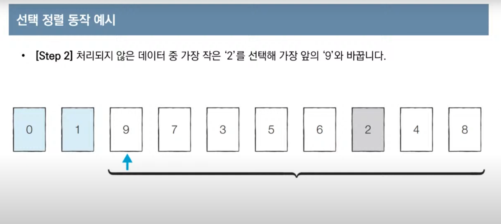
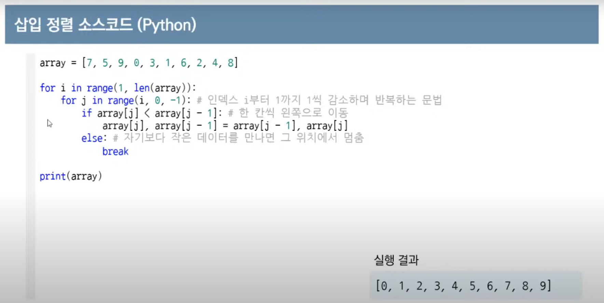

# 프로그래밍 지식
## 개발 상식
### 동기와 비동기

- 동기 - 작업을 순차대로 한다, 설계가 간단하지만 결과가 주어질 때까지 아무것도 못하고 대기해야 한다
- 비동기 - 병렬적으로 동시에 일을 처리한다, 효율적이지만 복잡하다, 자원을 효율적으로 사용할 수 있다 ex) NODE.JS

### 객체 지향 프로그래밍이란?

- 현실 세계의 사물들을 객체라고 보고 그 객체로부터 개발하고자 하는 애플리케이션에 필요한 특징들을 뽑아와 프로그래밍 하는 것

- 객체를 기본으로 기능을 제공하는 것
  
- 장점
  - 코드의 **재사용성**이 좋다 - 계속 사용되는 로직을 라이브러리로 만들어두면 계속 사용할 수 있으며 그 신뢰성을 확보 할 수 있다.

  - 라이브러리가 제공하는 기능들을 사용할 수 있어 **생산성**이 좋다.

  - 객체 단위로 코드가 나뉘어져 디버깅이 쉽고 **유지보수**에 용이하다.

  - 데이터 모델링 시 객체와 매핑하는 것이 수월하기 때문에 **요구사항**을 **명확**하게 파악하고 프로그래밍 할 수 있다

    

    

- 클래스 : 객체를 정의해놓은 설계도

- 객체 : 개별적으로 구분할 수 있는 실체

- 인스턴스 : 클래스로부터 만들어진 객체

  

  

- 자바의 데이터 타입
  - primitive type : 정수, 실수, 문자, 논리 값
  - reference type : 배열, 열거 , 클래스, 인터페이스 / 객체의 주소번지를 참조한다 


- 객체 지향의 장점

  1. **캡슐화**

  **필요한 변수와 함수를 하나의 클래스로 묶고 외부에서 접근하지 못하도록 은닉하는 것**.

  관련된 코드와 데이터가 묶여있고 오류가 없어 사용이 편리합니다. 데이터를 감추고 외부 세계와의 상호작용은 메서드를 통하는 방법인데, 라이브러리로 만들어 업그레이드하면 쉽게 바꿀 수 있습니다.

   

  2. **상속** **(extends)**

  **이미 작성된 클래스를 이어받아서 새로운 클래스를 생성하는 기법**으로 위에서 말한 기존 코드를 재활용해서 사용하는 것을 의미합니다. 객체지향 방법의 큰 장점 중 하나입니다.

   

  3. **다형성** **(Overloading, Override)**

  **하나의 이름(방법)으로 많은 상황에 대처하는 기법입니다.** 개념적으로 동일한 작업을 하는 함수들에 똑같은 이름을 부여할 수 있으므로 코드가 더 간단해지는 효과가 있습니다.

  
  
  
  
- 객체지향 단점
  
  - 객체 간의 정보 교환이 모두 메시지 교환을 통해 일어나므로 실행 **시스템에 많은 overhead**(어떤 작업을 처리할 때 들어가는 CPU타임이나 메모리 용량)가 발생하게 된다. - 하지만 하드웨어의 발전으로 보완, 함수형 프로그래밍 주목(객체가 상태를 갖는 것)


### RESTful API

> REST는 Representational State Transfer의 약자이다

- 월드 와이드 웹과 같은 분산 하이퍼미디어 시스템을 위한 소프트웨어 아키텍처의 한 형식
- 자원을 정의하고 자원에 대한 주소를 지정하는 방법 전반에 대한 패턴


어떠한 장점이 존재하는가?

1. Open API 를 제공하기 쉽다
2. 멀티플랫폼 지원 및 연동이 용이하다.
3. 원하는 타입으로 데이터를 주고 받을 수 있다.
4. 기존 웹 인프라(HTTP)를 그대로 사용할 수 있다.

단점은 뭐가 있을까?

1. 사용할 수 있는 메소드가 4 가지 밖에 없다.
2. 분산환경에는 부적합하다.
3. HTTP 통신 모델에 대해서만 지원한다.


#### REST API 설계 시 중요한 2가지

1. URI는 정보의 자원을 표현해야 한다.

2. 자원에 대한 행위는 HTTP Method(GET, POST, PUT, DELETE)로 표현한다.


### TDD란 무엇인가

- 매우 짧은 개발 사이클의 반복에 의존하는 소프트웨어 개발 프로세스이다.


### 함수형 프로그래밍

2가지의 큰 특징

1. immutable data : **객체가 가지고 있는 값을 변경할 수 없는 객체**를 의미하며 변경될 경우, 새로운 객체를 생성하고 변경된 값을 주입하여 반환해야 한다.
2.  first class citizen으로서의 function
   - **변수나 데이터 구조안에 함수를 담을 수 있어서** 함수의 파라미터로 전달할 수 있고, 함수의 변환값으로 사용할 수 있다.
   - 할당에 사용된 이름과 관계없이 고유한 구별이 가능하다.
   - 함수를 리터럴로 바로 정의할 수 있다.


### MVC 패턴

> Model + View + Controller를 합친 용어


- Model : 어플리케이션에서 사용되는 데이터와 그 데이터를 처리하는 부분
- View : 사용자에게 보여지는 UI
- Controller : 사용자의 입력(Action)을 받고 처리하는 부분


- 단순하고 보편적이지만 View와 Model의 의존성이 높아 어플리케이션이 커질수록 복잡해지고 유지보수가 어려울 수 있다


### MVP 패턴

> Model + View + Presenter를 합친 용어


- Model : 어플리케이션에서 사용되는 데이터와 그 데이터를 처리하는 부분입니다.

- View : 사용자에서 보여지는 UI 부분입니다.

- Presenter : View에서 요청한 정보로 Model을 가공하여 View에 전달해 주는 부분입니다. View와 Model을 붙여주는 역할을 합니다.


### MVVM 패턴

> Model + View + View Model을 합친 용어


- Model : 어플리케이션에서 사용되는 데이터와 그 데이터를 처리하는 부분입니다.

- View : 사용자에서 보여지는 UI 부분입니다.

- View Model : View를 표현하기 위해 만든 View를 위한 Model입니다. View를 나타내 주기 위한 Model이자 View를 나타내기 위한 데이터 처리를 하는 부분입니다.


-  동작

MVVM 패턴의 동작 순서는 아래와 같습니다.

1. 사용자의 Action들은 View를 통해 들어오게 됩니다.
2. View에 Action이 들어오면, Command 패턴으로 View Model에 Action을 전달합니다.
3. View Model은 Model에게 데이터를 요청합니다.
4. Model은 View Model에게 요청받은 데이터를 응답합니다.
5. View Model은 응답 받은 데이터를 가공하여 저장합니다.
6. View는 View Model과 Data Binding하여 화면을 나타냅니다.

-  특징

MVVM 패턴은 [Command 패턴](https://ko.wikipedia.org/wiki/커맨드_패턴)과 [Data Binding](https://en.wikipedia.org/wiki/Data_binding) 두 가지 패턴을 사용하여 구현되었습니다.

Command 패턴과 Data Binding을 이용하여 View와 View Model 사이의 의존성을 없앴습니다.

View Model과 View는 1:n 관계입니다.

- 장점

MVVM 패턴은 View와 Model 사이의 의존성이 없습니다. 또한 Command 패턴과 Data Binding을 사용하여 View와 View Model 사이의 의존성 또한 없앤 디자인패턴입니다. 각각의 부분은 독립적이기 때문에 모듈화 하여 개발할 수 있습니다.

- 단점

MVVM 패턴의 단점은 View Model의 설계가 쉽지 않다는 점입니다.

---


### 라이브러리와 프레임워크

- 라이브러리 : 특정 기능들에 대한 도구나 함수들의 집합. 내가 필요할 때 부른다 (ex. jquery)
- 프레임워크 : 프로그래밍을 할 때 필수적인 코드, 알고리즘과 같이 기반구조를 제공한다. 내가 프레임 워크의 규칙을 따른다, 프레임워크가 나를 부른다(ex. spring)
  


---

## CS

### Array와 Linked List

- Array  : 논리적 저장 순서와 물리적 저장 순서가 일치한다. 따라서 `인덱스`(index)로 해당 원소(element)에 접근할 수 있다. Array 자료구조에서 추가,삭제 기능에 대한 time complexity 의 worst case 는 O(n)이 된다.

- Linked List : 각각의 원소들은 자기 자신 다음에 어떤 원소인지만을 기억하고 있다. 따라서 이 부분만 다른 값으로 바꿔주면 삭제와 삽입을 O(1) 만에 해결할 수 있는 것이다. 하지만 어떠한 원소를 삭제 또는 추가하고자 했을 때, 그 원소를 찾기 위해서 O(n)의 시간이 추가적으로 발생하게 된다.

  

배열 : 데이터의 크기가 정해져 있고, 추가적인 삽입 삭제가 일어 나지 않으며 검색을 필요로 할 때 유리. 

리스트 : 데이터의 크기가 정해져 있지 않고, 삽입 삭제가 많이 일어나며, 검색이 적은 경우 유리.


### Stack과  Queue

- Stack : 선형 자료구조의 일종으로 `Last In First Out (LIFO)`. 즉, 나중에 들어간 원소가 먼저 나온다.
- Queue : 선형 자료구조의 일종으로 `First In First Out (FIFO)`. 즉, 먼저 들어간 놈이 먼저 나온다.


### Tree

- 비선형 자료구조이다. 트리는 계층적 관계(Hierarchical Relationship)을 표현하는 자료구조이다.
  

 ### Heap


### Hash

- 데이터를 유지관리하는 자료구조
- 인덱스,키 / 해시값,벨류 
- 특정 값을 찾는데 key로 접근하기 때문에 속도가 빠르다
- 하지만 어설픈 해쉬함수를 이용하면 동일한 키에 여러 데이터가 존재할 수 있다 이를 충돌이라한다
- 충돌을 해결하기 위해 Chaining(키의 벨류값 뒤에 붙이기)과 Linear Probing / Resizing (다음키에 붙이기 / 자리가 없으면 표 늘리기)을 사용한다

  

### HashMap과 HashTable 차이

이 둘의 차이점으로 동기화(Synchronization)를 들 수 있다. 

HashMap의 경우 동기화를 지원하지 않는다.

반면 다중 스레드 환경에서 Hashtable은 동기화를 지원하기 때문에 실행 환경에 따라 구분하여 사용하면 된다. 하지만 한 자바 관련 서적에 의하면 Vector의 상위호환(?)개념인 ArrayList의 사용을 권장하듯 새로운 버전인 HashMap을 활용하고 동기화가 필요한 시점에서는 Java 5부터 제공하는 ConcurrentHashMap을 사용하는 것이 더 좋은 방법이라 표현한다.

추가로 속도적인 측면에서도 구형이라 할 수 있는 Hashtable은 동기화 처리라는 비용때문에 HashMap에 비해 더 느리다고 한다.


**해싱은 키 값에 직접 산술적인 연산을 적용**하여 항목이 저장되어 있는 **테이블의 주소를 계산하여 항목에 접근**한다. 이렇게 키 값의 연산에 의해 직접 접근이 가능한 구조를 **해시 테이블(hash table)**이라 부르고, 해시 테이블을 이용한 탐색을 **해싱(hashing)**이라 한다.


### Graph

#### 깊이 우선 탐색 (Depth First Search: DFS)

재귀함수 활용

#### 너비 우선 탐색 (Breadth First Search: BFS)

큐 사용

https://www.youtube.com/watch?v=7C9RgOcvkvo


## 네트워크

### GET과 POST

> HTTP 프로토콜을 이용해서 서버에 요청하는 방식

- GET : 데이터가 HTTP Message의 Header 부분의 url에 담겨서 전송된다. / 서버에서 데이터를 가져온다
  데이터 크기가 제한적이고 보안에 취약하다
- POST : 데이터가 HTTP Message의 Body 부분에 담겨서 전송된다. / 서버의 값이나 상태를 변경,추가한다
  데이터 크기가 GET 보다 크고 보안에 더 낫다


### iterable과 iterator의 차이점

1. iterable은 순회할 수 있는 컬렉션을 나타낸다. Iterable 인터페이스를 implement하면 객체는 for-each loop를 사용할 수 있게 해준다. (내부적으로 iterator() 메소드를 객체에 호출해서 가능) 아래의 예제는 컬렉션 인터페이스가 iterable 인터페이스를 상속하고 있음을 보여준다

   ```java
   List <String> persons = new ArrayList<>(Arrays.asList("A", "B", "C"));
   for (String person: persons) {
   System.out.println(person);
   }
   ```

   다른 한편으로는 Iterator 인터페이스는 다른 객체, 다른 종류의 컬렉션을 순회하게 해준다. Iterator를 사용해 순회하기 위해서는 hasNext() + next() 메소드를 사용할 수가 있다.

   ```java
   Iterator <Integer> iterator = Arrays.asList(1, 2, 3, 4, 5).iterator();
   while (iterator.hasNext()) {
           System.out.println(iiterator.next());
   }
   ```

   for-each loop에서 람다를 사용해서 Iterable 안의 Iterator로 컨버팅을 할 수 있다.

   ```java
   for (Integer i: (Iterable<Interger>) () -> iterator) {
   System.out.println(i);
   }
   ```

2. Iterable interface를 implements 하는 클래스는 iterator()를 오버라이드를 해야하고 iterable interface에서 메소드를 제공한다. Iterator interface를 implements 하는 클래스는 hasNext(), next() 메소드를 오버라이드 해야한다. iterator interface에서 메소드를 제공한다.

---

### TCP와 UDP

- UDP : 비연결형 프로토콜이다. 신뢰성, 순차적 전달X

- TCP : 소캣을 생성해 종단간에 바이트 스트림을 전송 / 연결설정은 3-way-handshake를 사용

  

### HTTP 통신의 문제점

- 도청 가능
- 위장 가능
- 변조 가능

-> 해결법 : 증명서를 사용하는 SSL(Secure Socket Layer)을 조합한 HTTPS 사용


### 웹소켓

서버와 클라이언트 간에 소켓 커넥션을 유지해서 언제든 양방향 통신이 가능하도록 하는 기술

소켓과 웹소켓의 차이 : 웹소켓은 HTTP레이어에서 작동하는 소켓으로  TCP/IP 소켓의 레이어가 다르다


---

## OS

### 프로세스와 스레드

- 프로세스 : 실행중인 프로그램 / 컴퓨터의 자원을 분할해 사용한다
- 스레드 : 프로세스의 실행 단위 / 프로세스마다 주어진 자원을 함께 사용한다

### 멀티 스레드 vs 멀티 프로세스

**멀티 스레드는** 멀티 프로세스보다 **적은 메모리 공간을 차지하고 문맥 전환이 빠르다는 장점**이 있지만, **오류로 인해 하나의 스레드가 종료되면 전체 스레드가 종료될 수 있다는 점과 동기화 문제**를 안고 있다. 반면 **멀티 프로세스** 방식은 **하나의 프로세스가 죽더라도 다른 프로세스에는 영향을 끼치지 않고** 정상적으로 수행된다는 장점이 있지만, 멀티 스레드보다 **많은 메모리 공간과 CPU 시간을 차지한다는 단점**이 존재한다. 이 두 가지는 동시에 여러 작업을 수행한다는 점에서 같지만 적용해야 하는 시스템에 따라 적합/부적합이 구분된다. 따라서 대상 시스템의 특징에 따라 적합한 동작 방식을 선택하고 적용해야 한다.

### 캐시

캐시 메모리는 **속도가 빠른 장치와 느린 장치**간의 속도차에 따른 병목 현상을 줄이기 위한 범용 메모리이다.


## 데이터베이스

### 데이터베이스 사용이유

데이터의 독립성, 중복성 해결, 무결성

### 인덱스

DBMS에서 인덱스는 데이터의 저장 성능을 희생하고 그 대신 데이터의 읽기 속도를 높이는 기능.

### 정규화

관계형 데이터베이스에서 중복을 최소화하기 위해 데이터를 구조화하는 작업

- 제 1 정규형
  릴레이션에 속한 모든 속성의 **도메인**이 원자 값으로만 구성되어 있을 때
- 제 2 정규형
  릴레이션이 제 1정규형에 속하고, 기본키가 아닌 속성이 기본키에 완전 함수 종속일 때
- 제 3 정규형
  릴레이션이 제 2정규형에 속하고, 기본키가 아닌 모든 속성이 기본키에 이행적 함수 종속이 되지 않을 때

### 트랜잭션

- **작업의 완전성을 보장**해주는 것
- 작업의 **논리적 단위**로 이해를 할 수 있고 시스템의 입장에서는 데이터들을 접근 또는 변경하는 프로그램의 단위가 된다


### 제약조건

1. 도메인 무결성 : 속성이 정의되어 있는 **영역을 벗어나지 않도록 규정**하는 것
   (CHECK, DEFAULT, NOT NULL..)
2. 개체 무결성 : 하나의 테이블에 **중복된 행이 존재하지 않도록 규정**하는 것
   (UNIQUE, PRIMARY KEY..)
3. 참조 무결성 : **행을 입력, 수정, 삭제할 때 연관되는 다른 테이블과의 데이터가 정확하게 유지되도록 규정**하는 것
   (FOREIGN KEY..)


### 프로시저(Procedure)란?

넓은 의미로는 **어떤 업무를 수행하기 위한 절차**를 뜻한다.

예를 들어 쇼핑몰에서 신발을 구매하는 프로시저로 표현해본다면

> [ Procedure Start ]
>
> ① 쇼핑몰 회원 로그인
>
> ② 구매할 신발 선택
>
> ③ 개인정보 및 배송지 선택
>
> ④ 결제
>
> [ Procedure End ]

 

위 처럼 어떤 **프로세스를 절차적으로 기술해 놓은 것**을 프로시저라 한다.

**프로시저 문법**

```
CREATE OR REPLACE PROCEDURE 프로시저 이름
     ( 매개변수명1 [ IN || OUT || INOUT ] 데이터타입,
       매개변수명2 [ IN || OUT || INOUT ] 데이터타입 ... )
IS||AS
       변수, 상수 등 선언 ( 선언부 )
BEGIN
       실행 문장 ( 실행부 )
       EXCEPTION 문장   //필수아님
END ;
```

**프로시저 예제**

```
//사번을 입력받아 급여를 인상하는 update_sal 프로시저
CREATE OR REPLACE PROCEDURE update_sal
     ( v_empno IN NUMBER )
IS
BEGIN
       UPDATE emp
       SET sal = sal * 1.1
       WHERE empno = v_empno;
END update_sal;
```

 

 

### 함수(Function)란?

위의 프로시저의 **각 프로세스를 수행하기 위해 필요한 기능**들을 함수라 한다.

예를 들어 쇼핑몰의 로그인기능 중 ID와 PW를 체크하는 기능등을 함수라 보면 된다.

간혹 "함수는 리턴값을 갖는 프로시저이며 프로시저는 리턴값이 없다"라고 생각하시는 분들이 있는데 이는 명백히 틀린 정의이다.

이유는 **함수나 프로시저나 구조적으로는 동일**하며 **프로시저도 리턴값을 가질수 있기 때문**이다.


**함수 문법**

```
CREATE OR REPLACE FUNCTION 함수 이름
     ( 매개변수명1 매개변수1타입,
       매개변수명2 매개변수2타입 ... )
RETURN 데이터타입
IS||AS
       변수, 상수 등 선언 ( 선언부 )
BEGIN
       실행 문장 ( 실행부 )
       RETURN 반환값    //필수
       EXCEPTION 문장   //필수아님
END ;
```

 

**함수 예제**

```
//날짜를 입력하면 YYYY-MM-DD 형태로 바꿔주는 함수
CREATE OR REPLACE FUNCTION testDate ( date Date )
RETURN VARCHAR2
IS
       changeDate VARCHAR2 ( 20 ) ;
BEGIN 
       changeDate := NULL ;
       changeDate := TO_CHAR ( date, 'YYYY-MM-DD' ) ;
       RETURN changeDate ;
END ;
```

 

 

**프로시저(Procedure)와 함수(Function)의 차이**


---

## Design Pattern

### Singleton

`Singleton pattern(싱글턴 패턴)`이란 **애플리케이션에서 인스턴스를 하나만 만들어 사용하기 위한 패턴**이다. 커넥션 풀, 스레드 풀, 디바이스 설정 객체 등의 경우, 인스턴스를 여러 개 만들게 되면 자원을 낭비하게 되거나 버그를 발생시킬 수 있으므로 오직 하나만 생성하고 그 인스턴스를 사용하도록 하는 것이 이 패턴의 목적이다.

---

## JAVA

**자바의 장점**

1. **간결하면서도 강력한 객체지향 언어**이다.
2. 개방형 구조로 여러 기술과 융합이 가능하다.
3. **플랫폼에 독립적**이므로, **여러 운영체제나 하드웨어에서도 동일하게 실행한다.**
4. 많은 오픈소스 프레임워크로 생산성을 증가하고 유지보수 비용을 절감할 수 있다.

**자바의 단점**

1. **처리 속도가 중요한 애플리케이션에는 적합하지 않다.**
2. GUI 요소가 많은 MS 윈도 응용 프로그램 개발에는 적합하지 않다.
3. **하드웨어에 연결하여 제어할 수 없기 때문에**(가상 머신 이용) **직접 하드웨어를 정밀하게 조정해야 하는 프로그램 개발에는 적합하지 않다.**

### JVM

자바가상머신으로 **운영체제에 독립적으로 사용**할 수 있고 **자동으로 메모리 관리**를 하여 안정적인 프로그래밍 가능

JVM의 메모리영역(Runtime Data Area)

- Method Area (모든 스레드가 공유) : JVM이 시작될 때 생성되는 공간으로 바이트코드가 이 영역에 저장
  (클래스 정보, 변수 정보, static으로 선언한 변수가 저장)

  

- Heap (모든 스레드가 공유) : 동적으로 생성된 객체가 저장되는 영역, GC의 대상이 되는 공간
  new연산으로 생성 된 인스턴스 변수, 클래스의 객체, 배열 등

- Stack (스레드 마다 생성) : 지역변수나 메서드의 매게변수, 임시적으로 사용되는 변수, 메서드의 정보가 저장

- PC Register (스레드 마다 생성) : 스레드가 시작될 때 생성되며, 현재 수행중인 JVM 명령어 주소를 저장하는 공간입니다. 스레드가 어떤 부분을 어떤 명령어로 수행할지를 저장하는 공간.

- Native Method Stack (스레드 마다 생성) : JAVA가 아닌 다른 언어로 작성된 코드를 위한 공간
  JNI를 통해 호출하는 C/C++등의 코드를 수행하기 위한 공간
  

### 가비지 컬렉션

**사용하지 않는 객체를 메모리에서 삭제하는 작업**을 Gargabe Collection(GC)라고 부르며 JVM에서 GC를 수행합니다. 기본적으로 JVM의 메모리는 총 5가지 영역(ex. 클래스, 스택, 힙, 네이티브 메서드, PC)으로 나뉘는데, GC는 힙 메모리만 다룹니다. 


### static


### Collection

> **데이터의 집합을 의미하며 Java Collections Framework는 이러한 데이터, 자료구조의 컬렉션과 이를 구현하는 클래스를 정의하는 인터페이스를 제공한다.**

Java Collection 에는 `List`, `Map`, `Set` 인터페이스를 기준으로 여러 구현체가 존재한다. 이에 더해 `Stack`과 `Queue` 인터페이스도 존재한다. 왜 이러한 Collection 을 사용하는 것일까? 그 이유는 다수의 Data 를 다루는데 **표준화된 클래스들을 제공**해주기 때문에 DataStructure 를 직접 구현하지 않고 편하게 사용할 수 있기 때문이다. 또한 배열과 다르게 객체를 보관하기 위한 공간을 미리 정하지 않아도 되므로, **상황에 따라 객체의 수를 동적으로 정할 수 있다**. 이는 프로그램의 공간적인 **효율성** 또한 높여준다.


###  Annotation

주석처럼 코드에 달아 **클래스에 특별한 의미를 부여하거나 기능을 주입할 수 있는 인터페이스**이다


### Generic

제네릭은 자바에서 안정성을 맡고 있다고 할 수 있다. 다양한 타입의 객체들을 다루는 메서드나 컬렉션 클래스에서 사용하는 것으로, **컴파일 과정에서 타입체크를 해주는 기능**이다. 객체의 타입을 컴파일 시에 체크하기 때문에 객체의 타입 안전성을 높이고 형변환의 번거로움을 줄여준다. 자연스럽게 코드도 더 간결해진다. 예를 들면, Collection 에 특정 객체만 추가될 수 있도록, 또는 특정한 클래스의 특징을 갖고 있는 경우에만 추가될 수 있도록 하는 것이 제네릭이다. 이로 인한 장점은 collection 내부에서 들어온 값이 내가 원하는 값인지 별도의 로직처리를 구현할 필요가 없어진다. 또한 api 를 설계하는데 있어서 보다 명확한 의사전달이 가능해진다.


### 트랜잭션 처리

ACID(원일고지)를 유지하는것

- Atomicity : 원자성 - All or Noting
- Consistency : 일관성 - 트랙잭션 작업이 끝난 후에도 일관성 있는 DB상태를 유지해야한다
- Isolation : 고립성 - 트랜잭션 작업 중 다른 트랜잭션에 영향을 줘서도 받아서도 안된다
- Durability : 지속성 - 데이터 조작 완료 후 영구적이 되어 결과를 잃지 않는다.


### 오버라이드와 오버로드

- 오버라이딩 : 상위 클래스 혹은 인터페이스에 존재하는 메소드를 하위 클래스에서 필요에 맞게 재정의하는 것
  
- 오버로딩 : 메소드의 이름과 return 타입은 동일하지만, 매개변수만 다른 메소드를 만드는 것

  

  

###  SQLMapper

- SQL ⬅ SQLMapper ➡ Object 필드
- **SQL 문장으로 직접 데이터베이스 데이터를 다룬다.**
- SQL을 직접 작성해줘야 한다.
- **Mybatis**, **JdbcTemplates**(spring)

###  ORM

- 데이터베이스 데이터 ⬅ ORM ➡ Object 필드

- **객체를 통해 간접적으로 데이터베이스 데이터를 다룬다.**

- 객체와 관계형 데이터베이스의 데이터를 자동으로 맵핑 시켜준다.
  
  - SQL Query가 아닌 직관적인 코드(메서드)로 데이터 조작
  
- **JPA**, **Hibernate**

  

  ### 🍌 MyBatis vs Hibernate

  #### 🍓 MyBatis

  - 반복적인 JDBC 프로그래밍을 단순화하기 위해 iBatis라는 이름으로 출발
    - 이후에 아파치 소프트웨어 재단에서 구글 코드(Google Code)로 이사하면서 MyBatis라는 이름으로 바뀜
  - **개발과 유지보수가 쉽도록 소스 코드에 박혀있는** **SQL을 별도의 파일로 분리**

  #### 🍓 Hibernate

  - JPA의 실제 구현체
  - HQL(Hibernate Query Language)라는 객체 질의어를 제공
    - SQL을 몰라도 되기 때문에 개발자의 부담이 줄어든다.
    - 실행 시에 DBMS에 맞추어 SQL 문을 자동 생성하기 때문에 특정 DBMS에 종속되지 않는다.
  - 데이터베이스의 정규화(normalized)가 잘돼 있어야 한다.
    - 테이블을 객체와 연결하기 쉽고, 객체를 통해 테이블의 데이터를 다루기가 쉽다.
  - 데이터베이스의 특징에 맞추어 최적화를 할 수 없다.
    - 데이터베이스 마다 실행 성능을 높이고 데이터 처리를 쉽게 해주는 특별한 기능을 각각 가지고 있다.
    - 이런 기능을 활용할 수 있도록 전용 SQL을 제공하지만, ORM에서는 SQL을 직접 작성하지 않기 때문에 최적화가 쉽지 않다.

  #### 🍓 왜 JPA, Hibernate를 쓰는가? MyBatis와는 뭐가 다른가? (면접 질문)

  사실 최근 5년간 사용률은 **전세계적으로는 JPA > MyBatis**, **국내에서는 JPA < MyBatis** 이다. 위에서 정리했듯이, ORM(JPA), SQL Mapper(MyBatis)가 더 좋다, 나쁘다를 확언하기가 어렵다.

  각각의 장,단점이 있고, **JPA의 사용률이 높아지는 이유는 복잡한 데이터를 추출하는 업무보다는 비즈니스 로직에 집중하고, 수정하는 업무가 주이기 때문**인 것 같다.

  무작정 생산성이 빠르다, SQL을 신경쓰지 않아도 된다 등 장점이 많아서 사용한다기 보다는 ”**개발하고 있는 서비스에 어떤 것이 적합한가? 왜 써야만 할까?**“와 같은 사상적인 면에서 고민하고 결정하는 것이 맞는 것 같다.

  결론은 둘 다 알아두는 것이 좋다..!


### 접근 제어자 (Access Modifier)

**변수 또는 메소드의 접근 범위를 설정해주기 위해서 사용하는 Java 의 예약어**를 의미하며 총 네 가지 종류가 존재한다.

- public
  어떤 클래스에서라도 접근이 가능하다.

- protected
  **클래스가 정의되어 있는 해당 패키지 내** 그리고 해당 클래스를 상속받은 외부 패키지의 클래스에서 접근이 가능하다.

- (default)
  클래스가 정의되어 있는 해당 패키지 내에서만 접근이 가능하도록 접근 범위를 제한한다.

- private
  **정의된 해당 클래스에서만** 접근이 가능하도록 접근 범위를 제한한다.

  

### Wrapper class

**기본 자료형(Primitive data type)에 대한 클래스 표현**을 Wrapper class 라고 한다.


### Multi-Thread 환경에서의 개발

### Field member

**`필드(field)`란 클래스에 변수를 정의하는 공간**을 의미한다.
하지만 객체가 여러 스레드가 접근하는 싱글톤 객체라면 field 에서 상태값을 갖고 있으면 안된다. 모든 변수를 parameter 로 넘겨받고 return 하는 방식으로 코드를 구성해야 한다.

### ThreadLocal

**스레드 사이에 간섭이 없어야 하는 데이터에 사용**한다. 멀티스레드 환경에서는 클래스의 필드에 멤버를 추가할 수 없고 매개변수로 넘겨받아야 하기 때문이다. 즉, 스레드 내부의 싱글톤을 사용하기 위해 사용한다. 주로 사용자 인증, 세션 정보, 트랜잭션 컨텍스트에 사용한다.

스레드 풀 환경에서 ThreadLocal 을 사용하는 경우 ThreadLocal 변수에 보관된 데이터의 사용이 끝나면 반드시 해당 데이터를 삭제해 주어야 한다. 그렇지 않을 경우 재사용되는 쓰레드가 올바르지 않은 데이터를 참조할 수 있다.


### Array와 ArrayList의 차이

- Array는 길이에 대해 length 변수를 쓰고, ArrayList는 size() 메서드를 사용

- Array는 크기가 고정, ArrayList는 사이즈가 동적인 배열

- Array는 Primitive type과 Object 모두 담을 수 있지만, ArrayList는 Object만 담을 수 있다.

  

### ==

- **피연산자가 primitive type(int, double, boolean, ...)일 때는 값이 같은지** 비교하고, 피연산자가 그 외 객체, reference type일 때 가리키는 **주소가 같은지**를 검사한다.

### equals()

- 두 객체의 내용이 같은지 확인하는 Method입니다.

### hashCode()

- 메모리에서 가진 hash주소 값을 기본적으로 반환해준다.
- equals()와 hashCode() 두 메소드는 항상 함께 오버라이드 되어야 한다.

---

## Spring

### IoC

개발자가 프로그램의 흐름(코드)를 제어하는게 아니라 스프링 프레임워크가 주도하는 것

객체의 생성부터 생명주기 관리를 컨테이너가 도맡는다

### DI

**객체간의 의존성**을 자신이 아닌 외부에서 주입하는 개념이다

### Spring Boot

Spring Boot는 Spring를 사용하기 위한 설정의 많은 부분을 자동화하여 사용자가 편하게 Spring을 활용할 수 있도록 돕는다.

**해결하고자 하는것**
a) Auto Configuration 자동 실행
b) 쉬운 의존성 관리
c) 내장 서버


---

## 알고리즘

### 정렬

선택정렬




삽입정렬




퀵정렬

 


정렬 알고리즘 비교하기


### 탐색

이진탐색


값이 특정 번위에 속하는 데이터 개수를 파이썬 이진 탐색 라이브러리를 이용하여 구하기


파라메트릭 서치 -> 이진 탐색이용

떡볶이 문제


### 다이나믹 프로그래밍

피보나치 수열 - 재귀함수로 하면 시간이 오래걸림


### 아호 코라식 알고리즘

 **아호 코라식 알고리즘**(Aho–Corasick string matching algorithm)은 Alfred V. Aho와 Margaret J. Corasick이 고안한 [문자열 검색 알고리즘](https://ko.wikipedia.org/wiki/문자열_검색_알고리즘)(매칭 알고리즘)이다.


### Union-Find 자료구조

**Union-Find** 자료구조는 상호 배타적 집합, 서로소 집합 (Disjoint Set)을 표현하기 위한 자료구조이다.


### 외판원 순회(TSP: Traveling Salesperson Problem)

**외판원 순회(TSP: Traveling Salesperson Problem)**란 도시들이 있고 특정 도시에서 도시로 이동할 때 드는 비용이 주어졌을 때 불특정한 도시에서 출발해서 모든 도시를 돌고 다시 출발 도시로 돌아왔을 때 드는 최소 비용을 구하는 문제입니다.


---


## 안드로이드

---

- MVVM 패턴이란 무엇인가?
  **모델, 뷰 , 뷰모델**을 사용하고 **요청을 받아 처리하는 부분과 보여주는 부분을 나누어 의존성을 낮추고 모듈화가 가능한 개발패턴**입니다.

- 안드로이드 액티비티 생명주기

  onCreate - onStart - onResume - onPause - onStop - on Destroy

  ​                                                                                    ㄴonRestart - onStart

  

  ---

  프로젝트 관련 질문

  - 안드로이드 개발준비 : 스마트폰 개발자 옵션 활성화, USB디버깅 활성화, JDK설치, USB드라이버설치 등
  - 안드로이드 특징 : 오픈소스, 리눅스, 자바, ART라는 런타임이 탑재
    (ART : [안드로이드](https://namu.wiki/w/안드로이드(운영체제))에서 사용되던 기존의 [달빅](https://namu.wiki/w/달빅)VM의 한계점을 해결하기 위해서 [구글](https://namu.wiki/w/구글)에서 새로 개발한 런타임(실행환경))
  - DP를 사용해 다양한 디바이스 크기에 대응했다. 글자는 SP사용

  

- Android 4 Component

- Activity : Base, UI / **UI화면을 담당한다**
- Service : Background Process / **백그라운드에서 실행되는 프로세스**
- Broadcast Receiver : (OS정보와 같은) Broadcast 내용을 받는다 / **안드로이드에서 다양한 이벤트와 정보를 받아 반응하는 컴포넌트**
- Content Provider :  **App Data 공유** (ex. 갤러리의 사진, 주소록의 전화번호를 가져온다, T전화기)


- 안드로이드 생명주기


- intent의 역할 : **컴포넌트 간에 작업 수행을 위한 정보를 전달하는 역할** / 액티비티 간 화면전환, 서비스 시작, 브로드캐스트 전달 등에 사용
- SharedPreferences : **간단한 데이터를 파일로 저장**
- Fragment : **하나의 액티비티에서 여러개의 화면을 갖고 싶을 때 사용한다**


---

## JSP

**1. Servlet이란 무엇인가?**

\- Servlet은 자바 플랫폼에서 웹 앱을 개발할 때 사용하는 핵심기술로, 서버에서 웹페이지 등을 동적으로 생성하거나 데이터 처리를 수행하기 위해 자바로 작성된 프로그램이다. Servlet은 JAVA코드안에 HTML태그가 삽입되어 만들어지며 확장자는 .java이다.

**2.** **JSP란 무엇인가?**

\- HTML을 코딩하기 너무 어렵고 불편해서 HTML내부에 JAVA코드를 삽입하는 형식이 JSP이다. 다시말해 서블릿의 단점을 보완해서 만든 서블릿 기반의 스트립트 기술이다. 서블릿을 이용해서 웹프로그래밍을 할 수는 있지만 자바에 대한 지식이 필요하고 화면 인터페이스 구성에 너무 많은 코드들이 필요하는 등 비효율적인 측면들이 많다. 때문에 서블릿을 작성하지 않고도 웹프로그래밍을 쉽게 할 수 있게 해주는 기술이 바로 JSP(Java Server Page)이다.

**3.** **Servlet과 JSP의 차이 비교**

| Servlet                                                      | JSP                                                          |
| ------------------------------------------------------------ | ------------------------------------------------------------ |
| 자바코드로 구현하고 컴파일, 배포한다.HTML 태그로 문자열("")스크림으로 처리해야한다.자바에대한 깊은 이해도를 요구한다.코드가 수정되면 다시 컴파일하고 배포해야한다. | 키워드가 태그화 되어있어 서블릿에 비해 배우기 쉽다.자바코드를 <% %>태그 안에서 처리한다.자바에대한 깊은 이해도가 필요하지 않다. |

**4.** **결론**

\- 결과적으로 보면 Servlet이나 JSP는 만드는 방법에 차이가 있을 뿐 동일한 역할을 한다. 초기에는 Servlet을 이용해서 웹 개발을 많이 했지만, 이후 JSP기술이 발표되면서 현재는 Servlet과 JSP를 혼합해서 사용하는 형태로 개발이 이루어지고 있다. 


---

## 쿠키,세션,캐시

### 쿠키 (Cookie)

**특정 웹서버에 접속할 때 생성되는 개인 아이디, 비밀번호 등 방문한 사이트 정보를 담은 임시파일**

쿠키는 사용자 **브라우저에 저장** 되기 때문에 서버의 자원을 사용할 수 없다.

보안성이 떨어진다.

 

### 세션 (Session)

**세션은 클라이언트와 웹서버 간 네트워크 연결이 지속적으로 유지되고 있는 상태**

**서버에 데이터를 저장**해 서버의 자원을 사용할 수 있다.

클라이언트가 페이지를 이동하거나 재접속 했을 때 구분 할 수 있는 수단이다.

쿠키에 비해 보안성이 좋으며 주로 로그인 정보를 유지하는 것에 사용된다

 

### 캐시 (Cache)

**데이터나 값을 미리 복사해 임시로 저장해 두는 장소**

사이트를 불러 올 때 전에 불러 왔던 사진을 접속 때 마다 불러오면 데이터의 낭비를 일으킨다.

캐시를 통해 클라이언트에 저장해둘 수 있으며 주기적으로 비워줘야한다.