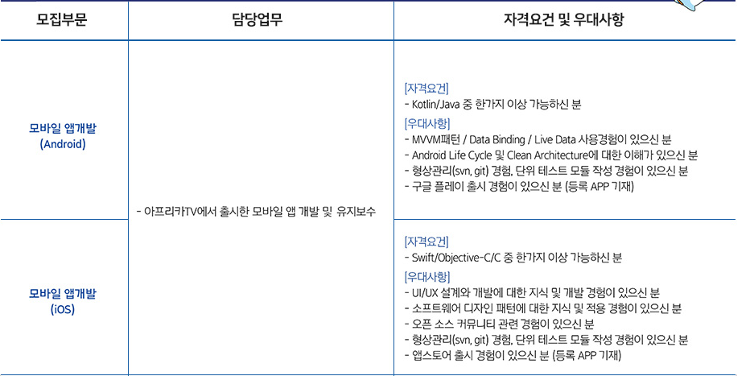
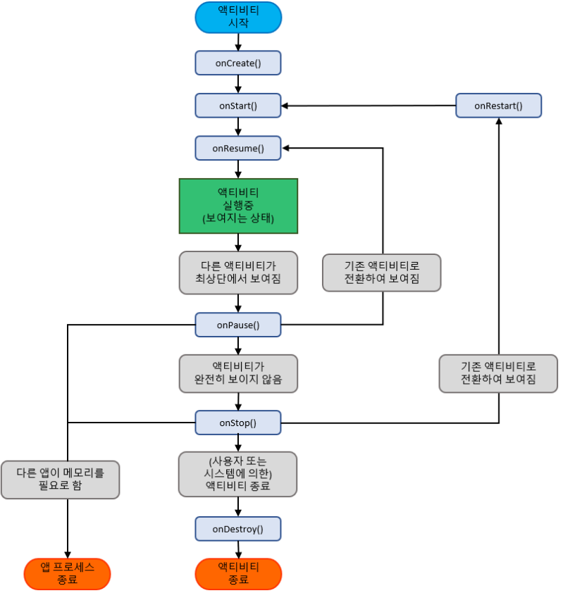

아프리카 실무면접까지 준비사항

1. 자기소개서 정독 및 분석 및 대답 준비
2. 프로젝트 분석 및 기술적 대답 준비
3. 아프리카 인재상 및 아프리카 기업정보 숙지

---

- MVVM 패턴이란 무엇인가?
  모델, 뷰 , 뷰모델을 사용하고 요청을 받아 처리하는 부분과 보여주는 부분을 나누어 의존성을 낮추고 모듈화가 가능한 개발패턴입니다.

- 안드로이드 액티비티 생명주기

  onCreate - onStart - onResume - onPause - onStop - on Destroy

  ​                                                                                    ㄴonRestart - onStart

  

  ---

  프로젝트 관련 질문

  - 안드로이드 개발준비 : 스마트폰 개발자 옵션 활성화, USB디버깅 활성화, JDK설치, USB드라이버설치 등
  - 안드로이드 특징 : 오픈소스, 리눅스, 자바, ART라는 런타임이 탑재
    (ART : [안드로이드](https://namu.wiki/w/안드로이드(운영체제))에서 사용되던 기존의 [달빅](https://namu.wiki/w/달빅)VM의 한계점을 해결하기 위해서 [구글](https://namu.wiki/w/구글)에서 새로 개발한 런타임(실행환경))
  - DP를 사용해 다양한 디바이스 크기에 대응했다 글자는 SP사용

  

## Android 4 Component

- Activity : Base, UI / **UI화면을 담당한다**
- Service : Background Process / **백그라운드에서 실행되는 프로세스**
- Broadcast Receiver : (OS정보와 같은) Broadcast 내용을 받는다 / **안드로이드에서 다양한 이벤트와 정보를 받아 반응하는 컴포넌트**
- Content Provider :  **App Data 공유** (ex. 갤러리의 사진, 주소록의 전화번호를 가져온다, T전화기)

- 안드로이드 생명주기

- intent의 역할 : 컴포넌트 간에 작업 수행을 위한 정보를 전달하는 역할 / 액티비티 간 화면전환, 서비스 시작, 브로드캐스트 전달 등에 사용
- SharedPreferences : 간단한 데이터를 파일로 저장
- Fragment : 하나의 액티비티에서 여러개의 화면을 갖고 싶을 때 사용한다